```{r setup, include=FALSE}
knitr::opts_chunk$set(eval = F, echo = T, message = F, warning = F, 
                      comment = NA, out.width = "100%")
```

---

# Introduction

This vignette contains the `R` code and analysis done for the paper: 

`r shiny::icon("newspaper")` [Derek Wright, Sandesh Neupane, Karsten Neilson, Tania Gioia & Kirstin E Bett (2020) **Disecting lentil crop growth across multi-environment trials using unoccupied aerial vehicles**](https://github.com/derekmichaelwright/AGILE_LDP_Drone_Growth) 

which is follow-up to:

`r shiny::icon("github")` https://github.com/derekmichaelwright/AGILE_LDP_GWAS_Phenology

[Sandesh Neupane, Derek Wright, Raul Martinez, Jakob Butler, Jim Weller, Kirstin Bett (2022) **Focusing the GWAS *Lens* on days to flower using latent variable phenotypes derived from global multi-environment trials**. *The Plant Genome*. e20269.](https://doi.org/10.1002/tpg2.20269) 

`r shiny::icon("newspaper")` [Derek M Wright, Sandesh Neupane, Taryn Heidecker, Teketel A Haile, Clarice J Coyne, Rebecca J McGee, Sripada Udupa, Fatima Henkrar, Eleonora Barilli, Diego Rubiales, Tania Gioia, Giuseppina Logozzo, Stefania Marzario, Reena Mehra, Ashutosh Sarker, Rajeev Dhakal, Babul Anwar, Debashish Sarker, Albert Vandenberg, and Kirstin E. Bett. (2020) **Understanding photothermal interactions can help expand production range and increase genetic diversity of lentil (*Lens culinaris* Medik.)**. *Plants, People, Planet*. 00:1-11.](https://doi.org/10.1002/ppp3.10158)

`r shiny::icon("github")` https://github.com/derekmichaelwright/AGILE_LDP_Phenology

---

This work done as part of the AGILE  and P2IRC projects at the University of Saskatchewan.


{width=100%}

---

# Load Libraries

```{r}
library(tidyverse)
library(ggbeeswarm)
library(ggpubr)
library(plotly)       # ggplotly()
library(htmlwidgets)  # saveWidget()
library(growthcurver) # SummarizeGrowth()
library(FactoMineR)   # PCA()
#library(ggrepel)      # geom_text_repel()
theme_AGL <- theme_bw() + 
  theme(strip.background   = element_rect(colour = "black", fill = NA, size = 0.5),
        panel.background   = element_rect(colour = "black", fill = NA, size = 0.5),
        panel.border       = element_rect(colour = "black", size = 0.5),
        panel.grid         = element_line(color  = alpha("black", 0.1), size = 0.5),
        panel.grid.minor.x = element_blank(), 
        panel.grid.minor.y = element_blank())
```

```{r eval = T, echo = F}
downloadthis::download_link(
  link = "myG_LDP.zip",
  button_label = "myG_LDP.zip",
  button_type = "success",
  has_icon = TRUE,
  icon = "fa fa-save",
  self_contained = F
)
downloadthis::download_link(
  link = "myY.csv",
  button_label = "myY.csv",
  button_type = "success",
  has_icon = TRUE,
  icon = "fa fa-save",
  self_contained = F
)
downloadthis::download_link(
  link = "myLDP.csv",
  button_label = "myLDP.csv",
  button_type = "success",
  has_icon = TRUE,
  icon = "fa fa-save",
  self_contained = F
)
```

---

# Data Preparation

## Load Data

Load manual phenotypes

```{r}
myLDP <- read.csv("myLDP.csv")
#
it17_f <- read.csv("Data_Manual/LDP_Italy_2017_Phenotypes.csv") 
ro17_f <- read.csv("Data_Manual/LDP_Rosthern_2017_Phenotypes.csv")
su17_f <- read.csv("Data_Manual/LDP_Sutherland_2017_Phenotypes.csv")
su18_f <- read.csv("Data_Manual/LDP_Sutherland_2018_Phenotypes.csv")
```

Load Drone phenotypes

```{r}
readDrone <- function(folder, colNum, xf) {
  fnames <- list.files(folder)
  xx <- NULL
  for(i in fnames) {
    xi <- read.csv(paste0(folder, i))
    xx <- bind_rows(xx, xi)
  }
  xx <- xx %>% 
    rename(Plot=plot_name, Date=mission_date, Sensor=sensor_type) %>%
    mutate(Plot = as.integer(Plot)) %>%
    gather(Trait, Value, colNum:ncol(.)) %>%
    left_join(xf[,1:10], by = "Plot") %>%
    filter(!is.na(Entry), !is.na(Value)) %>%
    mutate(DAP = as.numeric(as.Date(Date) - as.Date(Planting.Date)),
           Value_f = Value) %>%
    select(Expt, Row, Column, Plot, Rep, Entry, Name, 
           Planting.Date, DAP, Date, Sensor, Trait, Value, Value_f)
  xx
}
it17_d <- readDrone(folder = "Data_Drone/LDP_Italy_2017/",
                    colNum = 6, xf = it17_f)
ro17_d <- readDrone(folder = "Data_Drone/LDP_Rosthern_2017/",
                    colNum = 7, xf = ro17_f)
su17_d <- readDrone(folder = "Data_Drone/LDP_Sutherland_2017/",
                    colNum = 7, xf = su17_f)
su18_d <- readDrone(folder = "Data_Drone/LDP_Sutherland_2018/",
                    colNum = 7, xf = su18_f)
```

Gather manual phenotypes

```{r}
it17_f <- it17_f %>% gather(Trait, Value, 11:ncol(.))
ro17_f <- ro17_f %>% gather(Trait, Value, 11:ncol(.))
su17_f <- su17_f %>% gather(Trait, Value, 11:ncol(.))
su18_f <- su18_f %>% gather(Trait, Value, 11:ncol(.))
```

---

## Outliers & Missing Data

Filter outliers and add extra data points for aiding growth curves

```{r}
traitAdd <- function(xx, myTrait, myDAP, myValue) {
  for(i in unique(xx$Plot)) {
    xi <- xx %>% 
      filter(Trait == myTrait, Plot == i) %>%
      slice(1) %>%
      mutate(DAP = myDAP, Sensor = "NA", 
             Date = as.character(as.Date(Planting.Date) + myDAP), 
             Value = NA, Value_f = myValue)
    xx <- bind_rows(xi,xx)
  }
  xx
}
outliers_Maturity <- function(xx, myDAP, myThreshold,
                              predict = T, multiplyer = 0.95,
                              myTrait, myOtherTraits ) {
  yy <- NULL
  for(i in unique(xx$Plot)) {
    myMax <- max(xx %>% filter(Plot == i, Trait == myTrait) %>% pull(Value_f), na.rm = T)
    xi <- xx %>% filter(Plot == i)
    daps_r <- xi %>% 
      filter(DAP >= myDAP, Trait == myTrait, Value_f < myMax * myThreshold) %>% 
      pull(DAP)
    daps_r <- c(daps_r, unique(xi$DAP)[unique(xi$DAP)>daps_r])
    xi <- xi %>%
      mutate(Value_f = ifelse(DAP %in% daps_r, NA, Value_f))
    if(predict == T) {
      xi <- xi %>%
        mutate(Value_f = ifelse(DAP %in% daps_r & Trait == myTrait, 
                                multiplyer*myMax, Value_f))
      for(k in myOtherTraits) {
        myMax <- max(xi %>% filter(Trait == k) %>% pull(Value_f), na.rm = T)
        xi <- xi %>%
          mutate(Value_f = ifelse(DAP %in% daps_r & Trait == k, 
                                  multiplyer*myMax, Value_f))
      }
    }
    yy <- bind_rows(yy, xi)
  }
  yy
}
traitPredict <- function(xx, myDAP, myTrait) {
  for(i in unique(xx$Plot)) {
    xi <- xx %>% filter(Plot == i, Trait == myTrait)
    if(sum(!is.na(xi$Value_f)) > 0) {
      myVal <- xi %>% pull(Value_f) %>% max(na.rm = T)
      xi <- xi %>% slice(1) %>% 
        mutate(DAP = myDAP, Sensor = "NA", 
               Date = as.character(as.Date(Planting.Date) + myDAP), 
               Value = NA,
               Value_f = myVal * 0.99)
      xx <- bind_rows(xx, xi)
    }
  }
  xx
}
outliers_Fix <- function(xx, myTrait) {
  for(i in unique(xx$Plot)) {
    xi <- xx %>% filter(Plot == i, Trait == myTrait) %>%
      mutate(Change = NA, PercChange = NA)
    j<-2
    for(j in 2:nrow(xi)) {
      x1 <- max(xi$Value_f[1:(j-1)], na.rm = T)
      x2 <- xi$Value_f[j]
      xi$Change[j] <- x2 - x1
      xi$PercChange[j] <- 100 * xi$Change[j] / x1
    }
    for(j in 2:(nrow(xi)-1)) {
      xx$Value_f[xx$Plot == i & xx$Trait == myTrait & xx$DAP == xi$DAP[j]] <- 
        ifelse(xi$PercChange[j] > 30 & xi$PercChange[j+1] < -30, NA, xi$Value_f[j])
    }
  }
  xx
}
```

### Italy 2017

```{r}
#
it17_d <- traitAdd(xx = it17_d, myDAP = 10, myValue = 0.01,
                   myTrait = "crop_volume_m3_excess.green.based")
it17_d <- traitAdd(xx = it17_d, myDAP = 10, myValue = 0.01,
                   myTrait = "crop_area_m2_excess.green.based")
it17_d <- traitAdd(xx = it17_d, myDAP = 10, myValue = 0.01, 
                   myTrait = "mean_crop_height_m_excess.green.based")
it17_d <- traitAdd(xx = it17_d, myDAP = 70, myValue = 0.02,
                   myTrait = "crop_volume_m3_excess.green.based")
it17_d <- traitAdd(xx = it17_d, myDAP = 70, myValue = 0.05,
                   myTrait = "crop_area_m2_excess.green.based")
it17_d <- traitAdd(xx = it17_d, myDAP = 70, myValue = 0.02, 
                   myTrait = "mean_crop_height_m_excess.green.based")
#
myPs <- c(619, 782, 713, 746, 10, 722, 796, 717, 829, 
          874, 767, 903, 866, 8, 707, 876, 24, 958, 614, 618,
          397, 2, 687, 12)
#
it17_d <- it17_d %>%
  mutate(Value_f = ifelse(Plot %in% myPs, NA, Value_f),
         Value_f = ifelse(Plot == 3 & grepl("height|Volume",Trait) & DAP %in% c(101,119), 
                          NA, Value_f),
         Value_f = ifelse(Plot == 11 & grepl("height|Volume",Trait) & DAP == 119, 
                          NA, Value_f),
         Value_f = ifelse(Plot == 4 & grepl("height|Volume",Trait) & DAP == 101, 
                          NA, Value_f),
         Value_f = ifelse(Plot == 5 & grepl("height|Volume",Trait) & DAP == 164, 
                          NA, Value_f),
         Value_f = ifelse(Plot == 17 & grepl("height|Volume",Trait) & DAP == 164, 
                          NA, Value_f)
         )
#
it17_d <- outliers_Maturity(xx = it17_d, myDAP = 163, myThreshold = 0.7, 
                            myTrait = "crop_volume_m3_excess.green.based",
                            myOtherTraits = c("crop_area_m2_excess.green.based",
                                             "mean_crop_height_m_excess.green.based",
                                             "median_crop_height_m_excess.green.based",
                                             "max_crop_height_m_excess.green.based") )
#
it17_d <- traitPredict(xx = it17_d, myDAP = 190,
                       myTrait = "crop_volume_m3_excess.green.based")
it17_d <- traitPredict(xx = it17_d, myDAP = 190,
                       myTrait = "crop_area_m2_excess.green.based")
it17_d <- traitPredict(xx = it17_d, myDAP = 190,
                       myTrait = "mean_crop_height_m_excess.green.based")
it17_d <- traitPredict(xx = it17_d, myDAP = 210,
                       myTrait = "crop_volume_m3_excess.green.based")
it17_d <- traitPredict(xx = it17_d, myDAP = 210,
                       myTrait = "crop_area_m2_excess.green.based")
it17_d <- traitPredict(xx = it17_d, myDAP = 210,
                       myTrait = "mean_crop_height_m_excess.green.based")
#
write.csv(it17_d, "Data_Drone/final_it17_d.csv", row.names = F)
```

### Rosthern 2017

```{r}
#
ro17_d <- traitAdd(xx = ro17_d, myDAP = 10, myValue = 0.01,
                   myTrait = "crop_volume_m3_blue.ndvi.based")
ro17_d <- traitAdd(xx = ro17_d, myDAP = 10, myValue = 0.01,
                   myTrait = "crop_area_m2_blue.ndvi.based")
ro17_d <- traitAdd(xx = ro17_d, myDAP = 10, myValue = 0.01,
                   myTrait = "mean_crop_height_m_blue.ndvi.based")
#
ro17_d <- ro17_d %>% 
  mutate(Value_f = ifelse(Trait == "crop_volume_m3_blue.ndvi.based" &
                            Date %in% c("2017-06-12", "2017-06-20"),
                          NA, Value_f),
         #
         Value_f = ifelse(Trait == "crop_area_m2_blue.ndvi.based" &
                            Date %in% c("2017-06-12","2017-06-20","2017-06-27"),
                          NA, Value_f),
         #
         Value_f = ifelse(Trait == "mean_crop_height_m_blue.ndvi.based" &
                            Date %in% c("2017-06-12","2017-06-20") & 
                            Value > 0.2, 
                          NA, Value_f),
         Value_f = ifelse(Trait == "mean_crop_height_m_blue.ndvi.based" &
                            Date == "2017-06-28" & Value > 0.3, 
                          NA, Value_f) )
#
ro17_d <- outliers_Maturity(xx = ro17_d, myDAP = 75, myThreshold = 0.7,
                            myTrait = "crop_volume_m3_blue.ndvi.based",
                            myOtherTraits = c("crop_area_m2_blue.ndvi.based",
                                             "mean_crop_height_m_blue.ndvi.based",
                                             "median_crop_height_m_blue.ndvi.based",
                                             "max_crop_height_m_blue.ndvi.based"))
#
ro17_d <- traitPredict(xx = ro17_d, myDAP = 105,
                       myTrait = "crop_volume_m3_blue.ndvi.based")
ro17_d <- traitPredict(xx = ro17_d, myDAP = 105,
                       myTrait = "crop_area_m2_blue.ndvi.based")
ro17_d <- traitPredict(xx = ro17_d, myDAP = 105,
                       myTrait = "mean_crop_height_m_blue.ndvi.based")
ro17_d <- traitPredict(xx = ro17_d, myDAP = 110,
                       myTrait = "crop_volume_m3_blue.ndvi.based")
ro17_d <- traitPredict(xx = ro17_d, myDAP = 110,
                       myTrait = "crop_area_m2_blue.ndvi.based")
ro17_d <- traitPredict(xx = ro17_d, myDAP = 110,
                       myTrait = "mean_crop_height_m_blue.ndvi.based")
#
write.csv(ro17_d, "Data_Drone/final_ro17_d.csv", row.names = F)
```

```{r echo = F, eval = F}
         #Value_f = ifelse(Trait == "crop_area_m2_blue.ndvi.based" &
          #                  Plot == 6475, 
           #               NA, Value_f),
```

### Sutherland 2017

```{r}
#
su17_d <- traitAdd(xx = su17_d, myDAP = 10, myValue = 0.01,
                   myTrait = "crop_volume_m3_blue.ndvi.based")
su17_d <- traitAdd(xx = su17_d, myDAP = 10, myValue = 0.01,
                   myTrait = "crop_area_m2_blue.ndvi.based")
su17_d <- traitAdd(xx = su17_d, myDAP = 10, myValue = 0.01,
                   myTrait = "mean_crop_height_m_blue.ndvi.based")
#
su17_d <- su17_d %>% 
  mutate(Value_f = ifelse(Value_f == 0, NA, Value_f),
         #
         Value_f = ifelse(Sensor == "ILCE-QX1" & Date == "2017-07-04", 
                          NA, Value_f),
         #
         Value_f = ifelse(Trait == "crop_volume_m3_blue.ndvi.based" &
                            Date == "2017-06-05",
                          NA, Value_f),
         #
         Value_f = ifelse(Trait == "crop_area_m2_blue.ndvi.based" &
                            Date %in% c("2017-06-05", "2017-06-12"),
                          NA, Value_f),
         #
         Value_f = ifelse(Trait == "mean_crop_height_m_blue.ndvi.based" &
                            Date %in% c("2017-06-05","2017-06-13",
                                        "2017-06-19","2017-06-24") &
                            Value_f > 0.2, 
                          NA, Value_f) )
#
su17_d <- su17_d %>% 
  mutate(Value_f = ifelse(Trait %in% c("crop_volume_m3_blue.ndvi.based",
                                       "mean_crop_height_m_blue.ndvi.based") &
                            Plot == 5573 & DAP == 51,
                          NA, Value_f),
         Value_f = ifelse(Trait %in% c("crop_volume_m3_blue.ndvi.based",
                                       "mean_crop_height_m_blue.ndvi.based") &
                            Plot == 5588,
                          NA, Value_f),
         Value_f = ifelse(Plot == 6030, NA, Value_f))
#
su17_d <- outliers_Maturity(xx = su17_d, myDAP = 76, myThreshold = 0.6,
                            myTrait = "crop_volume_m3_blue.ndvi.based",
                            myOtherTraits = c("crop_area_m2_blue.ndvi.based",
                                             "mean_crop_height_m_blue.ndvi.based",
                                             "median_crop_height_m_blue.ndvi.based",
                                             "max_crop_height_m_blue.ndvi.based"))

#
su17_d <- traitPredict(xx = su17_d, myDAP = 95,
                       myTrait = "crop_volume_m3_blue.ndvi.based")
su17_d <- traitPredict(xx = su17_d, myDAP = 95,
                       myTrait = "crop_area_m2_blue.ndvi.based")
su17_d <- traitPredict(xx = su17_d, myDAP = 95,
                       myTrait = "mean_crop_height_m_blue.ndvi.based")
su17_d <- traitPredict(xx = su17_d, myDAP = 105,
                       myTrait = "crop_volume_m3_blue.ndvi.based")
su17_d <- traitPredict(xx = su17_d, myDAP = 105,
                       myTrait = "crop_area_m2_blue.ndvi.based")
su17_d <- traitPredict(xx = su17_d, myDAP = 105,
                       myTrait = "mean_crop_height_m_blue.ndvi.based")
#
write.csv(su17_d, "Data_Drone/final_su17_d.csv", row.names = F)
```

### Sutherland 2018

```{r}
#
su18_d <- traitAdd(xx = su18_d, myDAP = 10, myValue = 0.01,
                   myTrait = "crop_volume_m3_excess.green.based")
su18_d <- traitAdd(xx = su18_d, myDAP = 10, myValue = 0.01,
                   myTrait = "crop_area_m2_excess.green.based")
su18_d <- traitAdd(xx = su18_d, myDAP = 10, myValue = 0.01,
                   myTrait = "mean_crop_height_m_excess.green.based")
#
su18_d <- su18_d %>% 
  mutate(Value_f = ifelse(Trait == "mean_crop_height_m_excess.green.based" &
                            DAP < 65 & Value_f > 0.2, 
                          NA, Value_f),
         Value_f = ifelse(Trait == "mean_crop_height_m_excess.green.based" & 
                            (Value_f == 0 | Date == "2018-07-06"), 
                          NA, Value_f),
         Value_f = ifelse(Trait == "crop_volume_m3_excess.green.based" & 
                            (Value_f == 0 | Date == "2018-07-06"), 
                          NA, Value_f),
         Value_f = ifelse(Plot == 5689, NA, Value_f))
# 
xx <- su18_d %>% filter(Trait == "mean_crop_height_m_excess.green.based" & 
                           DAP < 65 & Value > 0.2)
su18_d <- su18_d %>%
  mutate(Value_f = ifelse(paste(Plot, DAP, Trait) %in% 
                            paste(xx$Plot, xx$DAP, "crop_volume_m3_excess.green.based"), 
                          NA, Value_f))
#
su18_d <- outliers_Fix(xx = su18_d, myTrait = "crop_volume_m3_excess.green.based")
su18_d <- outliers_Fix(xx = su18_d, myTrait = "mean_crop_height_m_excess.green.based")
#
su18_d <- traitPredict(xx = su18_d, myDAP = 95,
                       myTrait = "crop_volume_m3_excess.green.based")
su18_d <- traitPredict(xx = su18_d, myDAP = 95,
                       myTrait = "crop_area_m2_excess.green.based")
su18_d <- traitPredict(xx = su18_d, myDAP = 95,
                       myTrait = "mean_crop_height_m_excess.green.based")
su18_d <- traitPredict(xx = su18_d, myDAP = 105,
                       myTrait = "crop_volume_m3_excess.green.based")
su18_d <- traitPredict(xx = su18_d, myDAP = 105,
                       myTrait = "crop_area_m2_excess.green.based")
su18_d <- traitPredict(xx = su18_d, myDAP = 105,
                       myTrait = "mean_crop_height_m_excess.green.based")
#
write.csv(su18_d, "Data_Drone/final_su18_d.csv", row.names = F)
```

---

## Summarise Drone Data

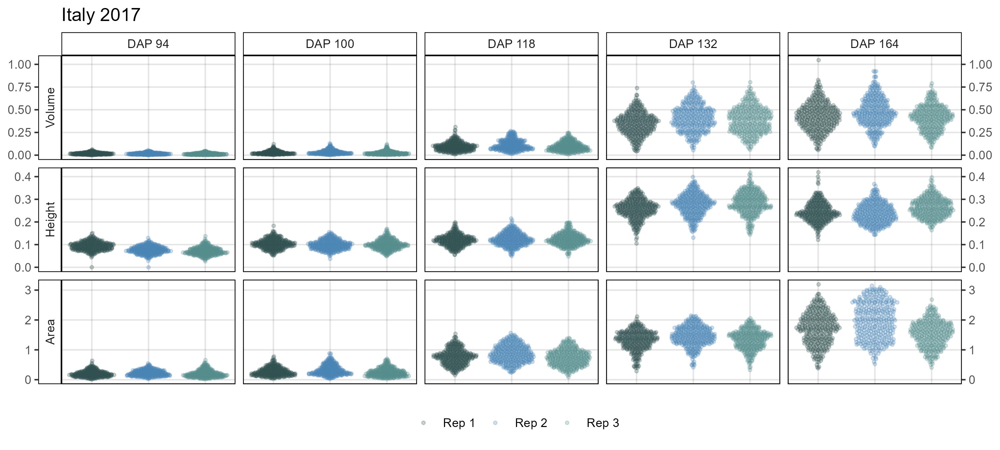

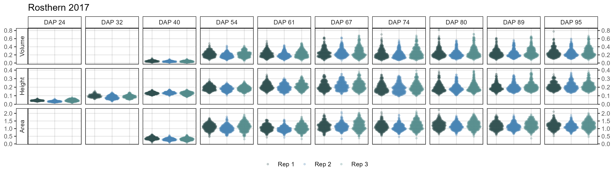

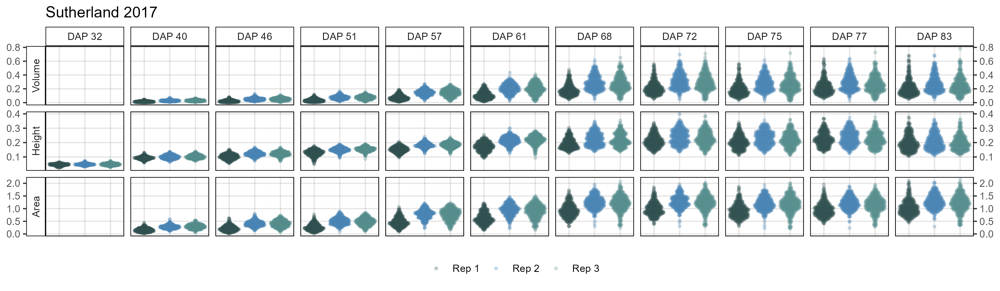

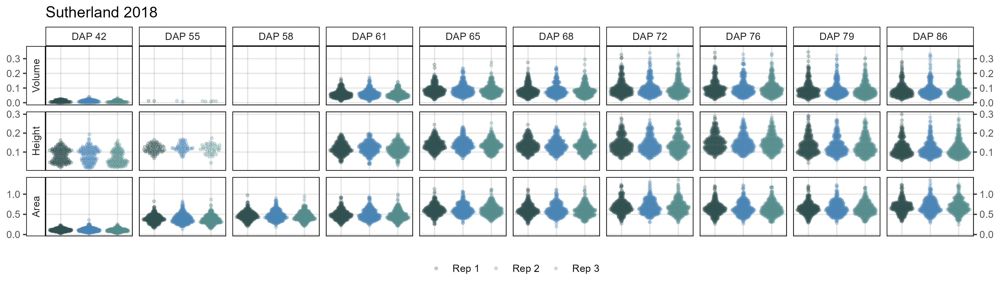

```{r}
ggDroneSummary <- function(xx, myTitle, myDAPs = NULL, myTraits, myTraitNames) {
  # Prep data
  if(is.null(myDAPs)) { myDAPs <- unique(xx$DAP)[order(unique(xx$DAP))] }
  xx <- xx %>% filter(Trait %in% myTraits, DAP %in% myDAPs) %>%
    mutate(Trait = plyr::mapvalues(Trait, myTraits, myTraitNames),
           Trait = factor(Trait, levels = myTraitNames),
           Group = factor(paste("Rep", Rep), 
                        levels = c("Rep 1", "Rep 2", "Rep 3", "Outliers")),
           DAP = paste("DAP", DAP),
           DAP = factor(DAP, levels = paste("DAP", myDAPs)))
  #yy <- xx %>% filter(is.na(Value_f)) %>% 
  #  mutate(Value_f = Value,
  #         Group = "Outliers",
  #         Group = factor(Group, levels = c("Rep 1", "Rep 2", "Rep 3", "Outliers")))
  #xx <- bind_rows(xx, yy) %>%
  #  mutate(Trait = factor(Trait, levels = myTraits))
  xx <- xx %>% filter(!is.na(Value_f))
  # Plot
  ggplot(xx, aes(x = Rep, color = Group, pch = Group)) +
    geom_quasirandom(aes(y = Value_f), alpha = 0.25) +
    facet_grid(Trait ~ DAP, scales = "free_y", switch = "y") +
    scale_color_manual(name = NULL, 
                       values = c("darkslategray","steelblue","darkslategray4","black")) +
    scale_shape_manual(name = NULL, values = c(20,20,20,10)) +
    scale_y_continuous(sec.axis = sec_axis(~ .)) +
    theme_AGL +
    theme(legend.position = "bottom",
          axis.text.x = element_blank(),
          axis.ticks.x = element_blank()) +
    labs(title = myTitle, y = NULL, x = NULL)
}
# Italy 2017
xx <- it17_d %>%
  mutate(DAP = plyr::mapvalues(DAP, c(93, 101, 119, 133, 163), 
                               c(94, 100, 118, 132, 164)))
mp <- ggDroneSummary(xx = xx, myTitle = "Italy 2017", 
                   myDAPs = c(94,100,118,132,164),
                   myTraits = c("crop_volume_m3_excess.green.based",
                                "mean_crop_height_m_excess.green.based",
                                "crop_area_m2_excess.green.based"),
                   myTraitNames = c("Volume", "Height", "Area"))
ggsave("Additional/GrowthCurves/01_ggDroneTrait_It17.png", mp, width = 10, height = 4.5)
# Rosthern 2017
mp <- ggDroneSummary(xx = ro17_d, myTitle = "Rosthern 2017", 
                   myDAPs = c(24,32,40,54,61,67,74,80,89,95),
                   myTraits = c("crop_volume_m3_blue.ndvi.based",
                                "mean_crop_height_m_blue.ndvi.based",
                                "crop_area_m2_blue.ndvi.based"),
                   myTraitNames = c("Volume", "Height", "Area"))
ggsave("Additional/GrowthCurves/01_ggDroneTrait_Ro17.png", mp, width = 12, height = 3.5)
# Sutherland 2017
mp <- ggDroneSummary(xx = su17_d, myTitle = "Sutherland 2017", 
                   myDAPs = c(32,40,46,51,57,61,68,72,75,77,83),
                   myTraits = c("crop_volume_m3_blue.ndvi.based",
                                "mean_crop_height_m_blue.ndvi.based",
                                "crop_area_m2_blue.ndvi.based"),
                   myTraitNames = c("Volume", "Height", "Area"))
ggsave("Additional/GrowthCurves/01_ggDroneTrait_Su17.png", mp, width = 12, height = 3.5)
# Sutherland 2018
mp <- ggDroneSummary(xx = su18_d, myTitle = "Sutherland 2018", 
                   myDAPs = c(42,55,58,61,65,68,72,76,79,86),
                   myTraits = c("crop_volume_m3_excess.green.based",
                                "mean_crop_height_m_excess.green.based",
                                "crop_area_m2_excess.green.based"),
                   myTraitNames = c("Volume", "Height", "Area"))
ggsave("Additional/GrowthCurves/01_ggDroneTrait_Su18.png", mp, width = 12, height = 3.5)
```

---

## Check Data

```{r}
ggDroneCheck <- function(xd = it17_d, xf = it17_f,
                         myTitle = NULL,
                         myFilename = "DataCheck/RawDrone_Italy_2017.pdf",
                         xt = c("crop_volume_m3_excess.green.based",
                                "crop_area_m2_excess.green.based",
                                "mean_ndyi", 
                                "mean_crop_height_m_excess.green.based",
                                "median_crop_height_m_excess.green.based", 
                                "max_crop_height_m_excess.green.based") ) {
  myColors <- c("darkgreen", "darkorange", "darkred")
  xd <- xd %>% arrange(Entry)
  pdf(myFilename, width = 16, height = 10)
  #i<-1
  for(i in unique(xd$Entry)) {
    xdi <- xd %>% filter(Entry == i)
    xfi <- xf %>% filter(Entry == i)
    j <- unique(xdi$Name)
    #
    ggPlotDrone <- function(xti=xt[1]) {
      yMax <- max(xd %>% filter(Trait==xti) %>% pull(Value_f), na.rm = T)
      xMax <- max(c(xd$DAP, xf %>% filter(Trait=="DTM") %>% pull(Value)), na.rm = T)
      xdtf <- xfi %>% filter(Trait == "DTF") 
      xdtm <- xfi %>% filter(Trait == "DTM") 
      xd <- xdi %>% filter(Trait == xti)
      xd2 <- xd %>% filter(!is.na(Value_f))
      ggplot(xd, aes(x = DAP, y = Value)) +
        geom_line(alpha = 0.2, color = "black", size = 1) +
        geom_line(data = xd2, aes(y = Value_f, color = as.factor(Rep)), 
                  size = 1.5, alpha = 0.7) +
        geom_point(aes(y = Value_f), color = "red", size = 0.5) + 
        geom_point(aes(shape = Sensor)) + 
        geom_vline(data = xdtf, aes(xintercept = Value), 
                   alpha = 0.5, color = "darkgreen") +
        geom_vline(data = xdtm, aes(xintercept = Value), 
                   alpha = 0.5, color = "darkorange", lty = 2) +
        facet_grid(. ~ paste(Rep, "-", Plot), scales = "free_y") +
        scale_color_manual(values = myColors) +
        theme_AGL +
        theme(legend.position = "none") +
        coord_cartesian(ylim = c(0,yMax), xlim = c(0,xMax)) + 
        labs(y = xti)
    }
    #
    mp1 <- ggPlotDrone(xti = xt[1])
    mp2 <- ggPlotDrone(xti = xt[2])
    mp3 <- ggPlotDrone(xti = xt[3])
    #
    mp <- ggarrange(mp1, mp2, mp3, ncol = 1, nrow = 3) %>%
      annotate_figure(top = text_grob(paste(myTitle, "Entry", i, j)))
    print(mp)
  }
  dev.off()
}
```

### Italy 2017

https://github.com/derekmichaelwright/AGILE_LDP_UAV/Additional/GrowthCurves/02_ggDroneCheck_It17.pdf 

```{r}
ggDroneCheck(xd = it17_d, xf = it17_f, myTitle = "Italy 2017",
             myFilename = "Additional/GrowthCurves/02_ggDroneCheck_It17.pdf",
             xt = c("crop_volume_m3_excess.green.based", 
                    "mean_crop_height_m_excess.green.based",
                    "crop_area_m2_excess.green.based") )
```

### Rosthern 2017

https://github.com/derekmichaelwright/AGILE_LDP_UAV/Additional/GrowthCurves/02_ggDroneCheck_Ro17.pdf

```{r}
ggDroneCheck(xd = ro17_d, xf = ro17_f, myTitle = "Rosthern 2017",
             myFilename = "Additional/GrowthCurves/02_ggDroneCheck_Ro17.pdf",
             xt = c("crop_volume_m3_blue.ndvi.based", 
                    "mean_crop_height_m_blue.ndvi.based",
                    "crop_area_m2_blue.ndvi.based") )
```

### Sutherland 2017

https://github.com/derekmichaelwright/AGILE_LDP_UAV/Additional/GrowthCurves/02_ggDroneCheck_Su17.pdf

```{r}
ggDroneCheck(xd = su17_d, xf = su17_f, myTitle = "Sutherland 2017",
            myFilename = "Additional/GrowthCurves/02_ggDroneCheck_Su17.pdf",
            xt = c("crop_volume_m3_blue.ndvi.based", 
                   "mean_crop_height_m_blue.ndvi.based",
                   "crop_area_m2_blue.ndvi.based") )
```

### Sutherland 2018

https://github.com/derekmichaelwright/AGILE_LDP_UAV/Additional/GrowthCurves/02_ggDroneCheck_Su18.pdf

```{r}
ggDroneCheck(xd = su18_d, xf = su18_f, myTitle = "Sutherland 2018",
             myFilename = "Additional/GrowthCurves/02_ggDroneCheck_Su18.pdf",
             xt = c("crop_volume_m3_excess.green.based", 
                    "mean_crop_height_m_excess.green.based",
                    "crop_area_m2_excess.green.based") )
```

---

# Model Growth Curves

```{r}
myGrowthCurve <- function(xd, xf, myTrait, myFilename,
                          myFolder = "Additional/GrowthCurves/",  
                          myOrder = "Entries") {
  #
  xd <- xd %>% filter(Trait == myTrait)
  xm <- xf %>% select(Plot, Rep, Entry, Name, Expt, Planting.Date) %>% 
    filter(!duplicated(Plot))
  # i<- unique(xd$Plot)[1]
  xg <- NULL # Growth curve coefficients
  xp <- NULL # Predicted Values
  for(i in unique(xd$Plot)) {
    xgi <- NULL
    xdi <- xd %>% arrange(DAP) %>%
      filter(Plot == i, !is.na(Value_f))
    #
    if(nrow(xdi) > 2) {
      fit <- SummarizeGrowth(data_t = xdi$DAP, 
                             data_n = xdi$Value_f)
      #
      suppressMessages( xgi <- bind_rows(xgi, data.frame(t(c(i, unlist(fit$vals))))) )
      #
      xgi <- xgi %>% rename(y0=n0, y0_se=n0_se, y0_p=n0_p, x_mid=t_mid)
      #if(xgi$k=="0") { xgi <-  }
      for(k in 1:(ncol(xgi)-1)) { xgi[,k] <- as.numeric(xgi[,k]) }
      xgi <- xgi %>% mutate(y_mid = k/(1 + ((k - y0)/y0) * exp(-r * x_mid)),
                          b = -((r * x_mid) - y_mid)#, 
                          #t.min = -b / r,
                          #t.max = (k - b) / r
                          )
      #
      myDays <- min(xd$DAP):max(xd$DAP)
      xpi <- data.frame(Plot = i, DAP = myDays,
                       Predicted.Values = xgi$k / 
                         (1 + ((xgi$k - xgi$y0)/xgi$y0) * exp(-xgi$r * myDays)))
      xp <- bind_rows(xp, xpi)
      #
      gdays <- xpi %>% filter(DAP > (xgi$x_mid - 3), DAP < (xgi$x_mid + 3))
      if(nrow(gdays)>0) {
        myLM <- lm(Predicted.Values ~ DAP, gdays)
        xgi <- xgi %>% mutate(g.b = myLM[[1]][1],
                            g.r = myLM[[1]][2],
                            #x.min = -g.b / g.r,
                            #x.max = (k - g.b) / g.r,
                            #x.d = x.max - x_mid
                            )
      }
      #
      xpi_max <- xpi %>% filter(Predicted.Values >= xgi$k*0.95) %>% 
        arrange(Predicted.Values) %>% slice(1)
      if(nrow(xpi_max)==0) { 
        xpi_max <- xpi %>% 
          filter(Predicted.Values >= xgi$k*0.94) %>% 
          arrange(Predicted.Values) %>% slice(1) 
      }
      if(nrow(xpi_max)==0) { 
        xpi_max <- xpi %>% 
          filter(Predicted.Values >= xgi$k*0.90) %>% 
          arrange(Predicted.Values) %>% slice(1) 
      }
      xpi_min <- xpi %>% 
        filter(Predicted.Values >= xgi$k*0.05) %>% 
        arrange(Predicted.Values) %>% slice(1)
      xgi$x.max <- ifelse(is.null(nrow(xpi_max)), max(xpi$DAP), xpi_max$DAP)
      xgi$x.min <- xpi_min$DAP
      xgi$x.d <- xgi$x.max - xgi$x_mid 
      xg <- bind_rows(xg, xgi)
    }
  }
  #
  xg[xg=="0"] <- NA
  xg <- xg %>% rename(Plot=1) %>%
    mutate(Plot = as.integer(Plot)) %>%
    left_join(xm, by = "Plot") %>%
    select(Plot, Rep, Entry, Name, Expt, Planting.Date,
           r, b, g.r, g.b, k, x.min, x.mid=x_mid, x.max, 
           x.d, x.gen=t_gen, auc.l=auc_l, auc.e=auc_e, y0, sigma, 
           r.se=r_se, r.p=r_p, k.se=k_se, k.p=k_p, y0.se=y0_se, y0.p=y0_p, df, note)
  #
  xp <- xp %>% 
    left_join(xm, by = "Plot") %>%
    select(Plot, Rep, Entry, Name, Expt, Planting.Date, DAP, Predicted.Values)
  #
  yMax <- max(xd$Value_f, na.rm = T)
  xMax <- max(xd$DAP, na.rm = T)
  xpm <- NULL
  #
  if(myOrder == "Entries") { myOrders <- 1:324 }
  if(myOrder == "DTF") { myOrders <- xg %>% arrange(k) %>% pull(Entries) %>% unique() }
  # i<-315
  pdf(paste0(myFolder, myFilename, ".pdf"), width = 8, height = 4)
  for(i in myOrders) {
    xdi <- xd %>% filter(Entry == i, !is.na(Value_f))
    xfi <- xf %>% filter(Entry == i)
    xgi <- xg %>% filter(Entry == i)
    xpi <- xp %>% filter(Entry == i)
    #
    xpmi <- xpi %>% group_by(Entry, Name, DAP) %>%
      summarise(Predicted.Values = mean(Predicted.Values, na.rm = T))
    xpm <- bind_rows(xpm, xpmi)
    #
    xdtf <- xfi %>% filter(Trait == "DTF") 
    xdtm <- xfi %>% filter(Trait == "DTM") 
    xdtf2 <- xdtf %>% group_by(Entry) %>% summarise(Value = mean(Value, na.rm =T))
    xdtm2 <- xdtm %>% group_by(Entry) %>% summarise(Value = mean(Value, na.rm =T))
    myDays <- min(xdi$DAP):max(xdi$DAP)  
    #
    myTitle <- unique(paste(stringr::str_pad(xdi$Entry, 3, pad = "0"), "|", xdi$Name))
    #
    mp1 <- ggplot(xdi, aes(x = DAP)) +
      geom_vline(data = xdtf, aes(xintercept = Value), color = "darkgreen", alpha = 0.5) +
      geom_vline(data = xdtm, aes(xintercept = Value), color = "darkorange", alpha = 0.5) +
      geom_point(aes(y = Value_f), color = "red", alpha = 0.7) +
      geom_point(aes(y = Value), alpha = 0.5) +
      geom_line(data = xpi, aes(y = Predicted.Values), alpha = 0.8) +
      facet_grid(. ~ paste(Rep, Plot, sep = "-")) +
      coord_cartesian(ylim = c(0,yMax), xlim = c(0,xMax)) +
      theme_AGL +
      labs(title = myTitle, y = myTrait)
    mp2 <- ggplot(xpi, aes(x = DAP, y = Predicted.Values)) +
      geom_vline(data = xdtf2, aes(xintercept = Value), color = "darkgreen", alpha = 0.5) +
      geom_vline(data = xdtm2, aes(xintercept = Value), color = "darkorange", alpha = 0.5) +
      geom_line(alpha = 0.3, aes(group = Plot)) +
      geom_line(data = xpmi, color = "red") +
      facet_grid(. ~ paste("Entry",Entry)) +
      coord_cartesian(ylim = c(0,yMax), xlim = c(0,xMax)) +
      theme_AGL +
      labs(title = "")
    mp <- ggarrange(mp1, mp2, widths = c(1,0.5))
    print(mp)
  }
  dev.off()
  #
  list(xd, # input data 
       xg, # Growth curve coefficients
       xp, # Predicted Values
       xpm) #
}
ggGrowthCurve <- function(xpm, myTitle = NULL, 
                          myEntries = c(9, 35, 73, 94, 113),
                          myColors = c("darkgreen", "darkgoldenrod3", "darkred",
                                       "steelblue4", "darkslategray") ) {
  #
  
  if(sum(colnames(xpm)=="Expt")==0) { xpm <- xpm %>% mutate(Expt = myTitle) }
  xpe <- xpm %>% filter(Entry %in% myEntries) %>%
    mutate(Entry = factor(Entry, levels = myEntries))
  mp <- ggplot(xpm, aes(x = DAP, y = Predicted.Values, group = Entry, key1 = Name)) +
    geom_line(alpha = 0.05) +
    geom_line(data = xpe, size = 2, aes(color = paste0(Name," (",Entry,")"))) +
    facet_grid(. ~ Expt, scales = "free_x", space = "free_x") +
    scale_color_manual(name = NULL, values = myColors) +
    theme_AGL + 
    labs(x = "Days After Planting")
  mp
}
```

---

## Italy 2017

https://github.com/derekmichaelwright/AGILE_LDP_UAV/Additional/GrowthCurves/05_ggGrowthCurve_It17_volume.html

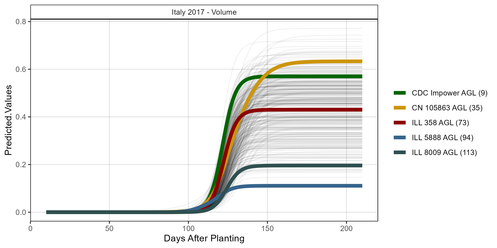

https://github.com/derekmichaelwright/AGILE_LDP_UAV/Additional/GrowthCurves/05_ggGrowthCurve_It17_height.html

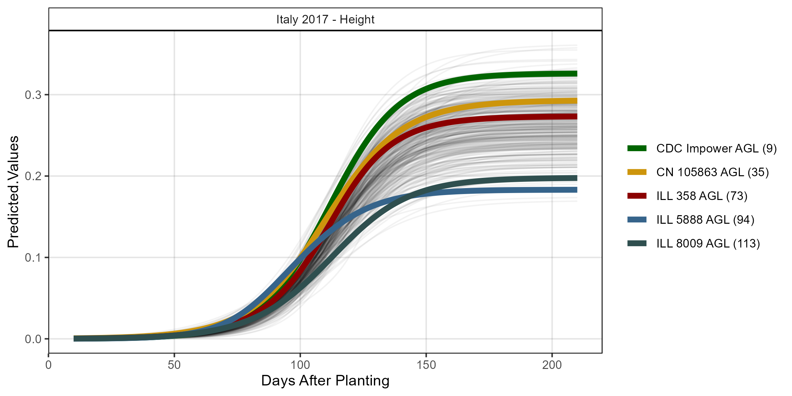

https://github.com/derekmichaelwright/AGILE_LDP_UAV/Additional/GrowthCurves/05_ggGrowthCurve_It17_area.html

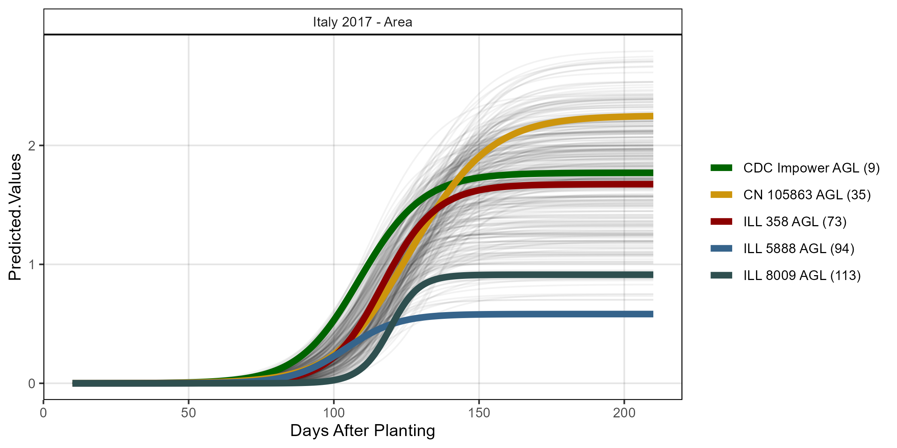

```{r}
it17_gc.v <- myGrowthCurve(xd = it17_d, xf = it17_f,
                           myFilename = "03_myGrowthCurve_It17_volume",
                           myTrait = "crop_volume_m3_excess.green.based")
mp <- ggGrowthCurve(xpm = it17_gc.v[[4]], myTitle = "Italy 2017 - Volume")
ggsave("Additional/GrowthCurves/04_ggGrowthCurve_It17_volume.png", mp, width = 8, height = 4)
mp <- ggplotly(mp)
saveWidget(mp, file="Additional/GrowthCurves/05_ggGrowthCurve_It17_volume.html")
#
it17_gc.h <- myGrowthCurve(xd = it17_d, xf = it17_f,
                           myFilename = "03_myGrowthCurve_It17_height",
                           myTrait = "mean_crop_height_m_excess.green.based")
mp <- ggGrowthCurve(xpm = it17_gc.h[[4]], myTitle = "Italy 2017 - Height")
ggsave("Additional/GrowthCurves/04_ggGrowthCurve_It17_height.png", mp, width = 8, height = 4)
mp <- ggplotly(mp)
htmlwidgets::saveWidget(mp, file="Additional/GrowthCurves/05_ggGrowthCurve_It17_height.html")
#
it17_gc.a <- myGrowthCurve(xd = it17_d, xf = it17_f,
                           myFilename = "03_myGrowthCurve_It17_area",
                           myTrait = "crop_area_m2_excess.green.based")
mp <- ggGrowthCurve(xpm = it17_gc.a[[4]], myTitle = "Italy 2017 - Area")
ggsave("Additional/GrowthCurves/04_ggGrowthCurve_It17_area.png", mp, width = 8, height = 4)
mp <- ggplotly(mp)
saveWidget(mp, file="Additional/GrowthCurves/05_ggGrowthCurve_It17_area.html")
```

---

## Rosthern 2017

https://github.com/derekmichaelwright/AGILE_LDP_UAV/Additional/GrowthCurves/05_ggGrowthCurve_Ro17_volume.html

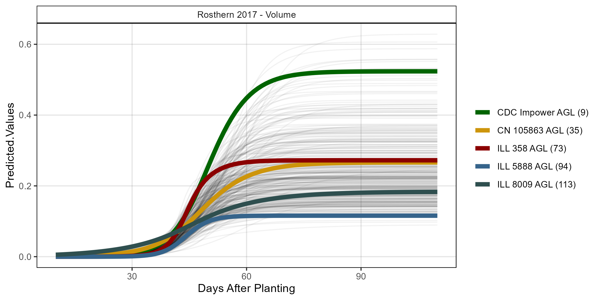

https://github.com/derekmichaelwright/AGILE_LDP_UAV/Additional/GrowthCurves/05_ggGrowthCurve_Ro17_height.html

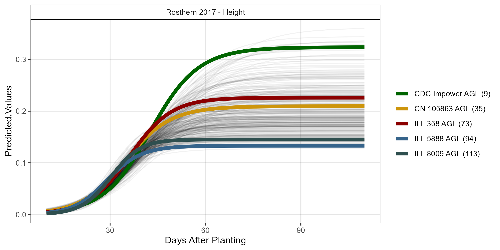

https://github.com/derekmichaelwright/AGILE_LDP_UAV/Additional/GrowthCurves/05_ggGrowthCurve_Ro17_area.html

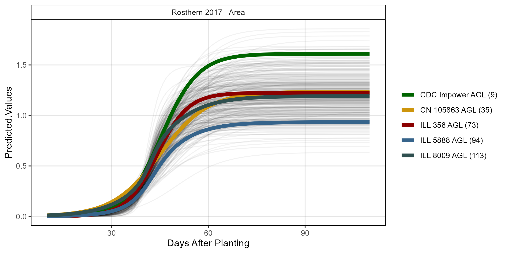

```{r}
ro17_gc.v <- myGrowthCurve(xd = ro17_d, xf = ro17_f,
                           myFilename = "03_myGrowthCurve_Ro17_volume",
                           myTrait = "crop_volume_m3_blue.ndvi.based")
mp <- ggGrowthCurve(xpm = ro17_gc.v[[4]], myTitle = "Rosthern 2017 - Volume")
ggsave("Additional/GrowthCurves/04_ggGrowthCurve_Ro17_volume.png", mp, width = 8, height = 4) 
mp <- ggplotly(mp)
htmlwidgets::saveWidget(mp, file="Additional/GrowthCurves/05_ggGrowthCurve_Ro17_volume.html")
#
ro17_gc.h <- myGrowthCurve(xd = ro17_d, xf = ro17_f,
                           myFilename = "03_myGrowthCurve_Ro17_height",
                           myTrait = "mean_crop_height_m_blue.ndvi.based")
mp <- ggGrowthCurve(xpm = ro17_gc.h[[4]], myTitle = "Rosthern 2017 - Height")
ggsave("Additional/GrowthCurves/04_ggGrowthCurve_Ro17_height.png", mp, width = 8, height = 4) 
mp <- ggplotly(mp)
htmlwidgets::saveWidget(mp, file="Additional/GrowthCurves/05_ggGrowthCurve_Ro17_height.html")
#
ro17_gc.a <- myGrowthCurve(xd = ro17_d, xf = ro17_f,
                           myFilename = "03_myGrowthCurve_Ro17_area",
                           myTrait = "crop_area_m2_blue.ndvi.based")
mp <- ggGrowthCurve(xpm = ro17_gc.a[[4]], myTitle = "Rosthern 2017 - Area")
ggsave("Additional/GrowthCurves/04_ggGrowthCurve_Ro17_area.png", mp, width = 8, height = 4) 
mp <- ggplotly(mp)
htmlwidgets::saveWidget(mp, file="Additional/GrowthCurves/05_ggGrowthCurve_Ro17_area.html")
```

---

## Sutherland 2017

https://github.com/derekmichaelwright/AGILE_LDP_UAV/Additional/GrowthCurves/05_ggGrowthCurve_Su17_volume.html

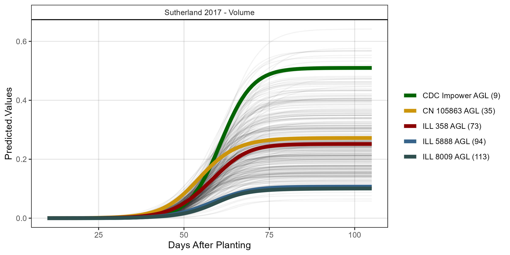

https://github.com/derekmichaelwright/AGILE_LDP_UAV/Additional/GrowthCurves/05_ggGrowthCurve_Su17_height.html

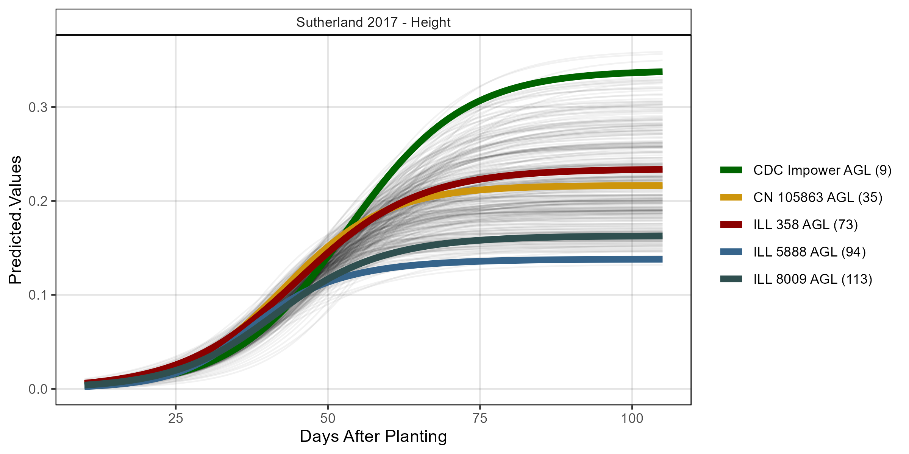

https://github.com/derekmichaelwright/AGILE_LDP_UAV/Additional/GrowthCurves/05_ggGrowthCurve_Su17_area.html

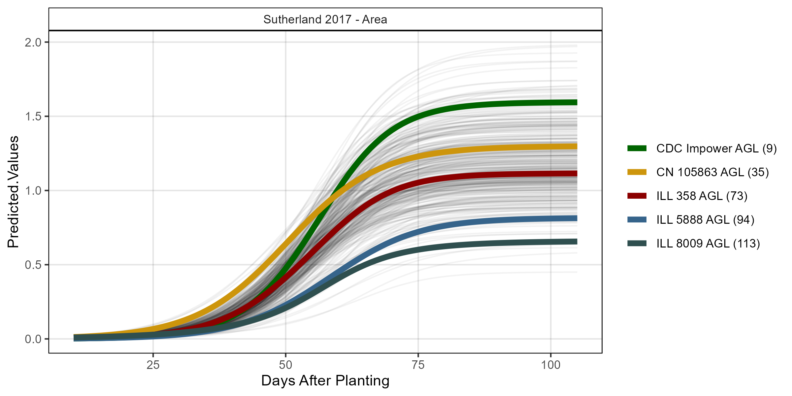

```{r}
su17_gc.v <- myGrowthCurve(xd = su17_d %>% filter(Plot!=5604), 
                           xf = su17_f, 
                           myFilename = "03_myGrowthCurve_Su17_volume",
                           myTrait = "crop_volume_m3_blue.ndvi.based")
mp <- ggGrowthCurve(xpm = su17_gc.v[[4]], myTitle = "Sutherland 2017 - Volume")
ggsave("Additional/GrowthCurves/04_ggGrowthCurve_Su17_volume.png", mp, width = 8, height = 4)
mp <- ggplotly(mp)
htmlwidgets::saveWidget(mp, file="Additional/GrowthCurves/05_ggGrowthCurve_Su17_volume.html")
#
su17_gc.h <- myGrowthCurve(xd = su17_d, xf = su17_f,
                           myFilename = "03_myGrowthCurve_Su17_height",
                           myTrait = "mean_crop_height_m_blue.ndvi.based")
mp <- ggGrowthCurve(xpm = su17_gc.h[[4]], myTitle = "Sutherland 2017 - Height")
ggsave("Additional/GrowthCurves/04_ggGrowthCurve_Su17_height.png", mp, width = 8, height = 4)
mp <- ggplotly(mp)
htmlwidgets::saveWidget(mp, file="Additional/GrowthCurves/05_ggGrowthCurve_Su17_height.html")
#
su17_gc.a <- myGrowthCurve(xd = su17_d, xf = su17_f,
                           myFilename = "03_myGrowthCurve_Su17_area",
                           myTrait = "crop_area_m2_blue.ndvi.based")
mp <- ggGrowthCurve(xpm = su17_gc.a[[4]], myTitle = "Sutherland 2017 - Area")
ggsave("Additional/GrowthCurves/04_ggGrowthCurve_Su17_area.png", mp, width = 8, height = 4)
mp <- ggplotly(mp)
htmlwidgets::saveWidget(mp, file="Additional/GrowthCurves/05_ggGrowthCurve_Su17_area.html")
```

---

## Sutherland 2018

https://github.com/derekmichaelwright/AGILE_LDP_UAV/Additional/GrowthCurves/05_ggGrowthCurve_Su18_volume.html

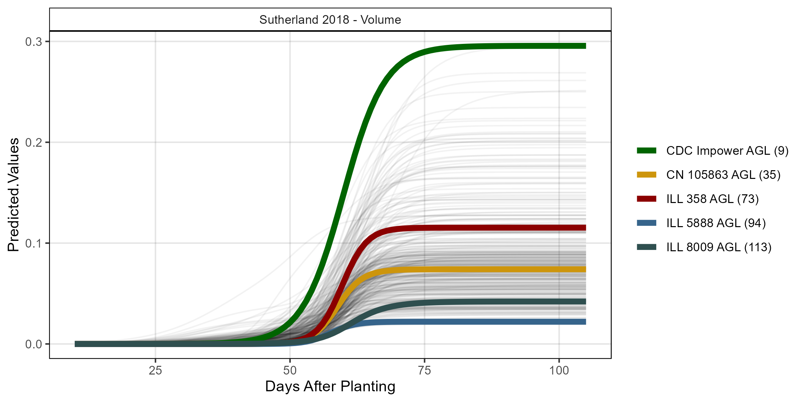

https://github.com/derekmichaelwright/AGILE_LDP_UAV/Additional/GrowthCurves/05_ggGrowthCurve_Su18_height.html

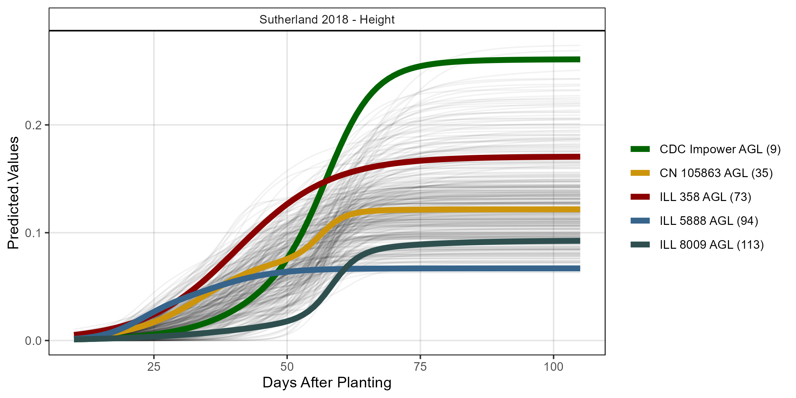

https://github.com/derekmichaelwright/AGILE_LDP_UAV/Additional/GrowthCurves/05_ggGrowthCurve_Su18_area.html

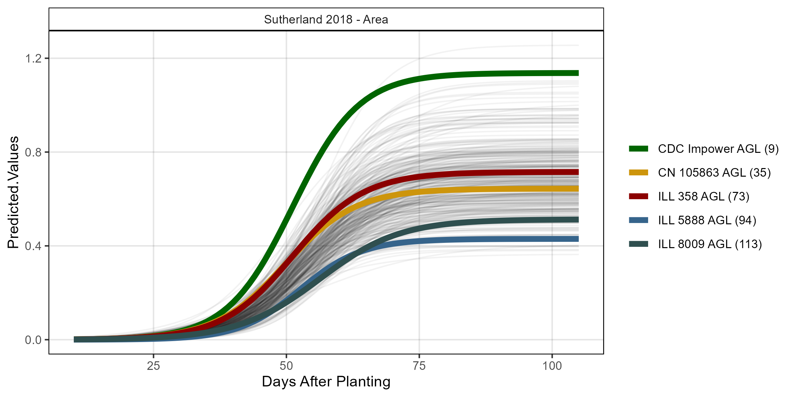

```{r}
su18_gc.v <- myGrowthCurve(xd = su18_d, xf = su18_f, 
                           myFilename = "03_myGrowthCurve_Su18_volume",
                           myTrait = "crop_volume_m3_excess.green.based")
mp <- ggGrowthCurve(xpm = su18_gc.v[[4]], myTitle = "Sutherland 2018 - Volume")
ggsave("Additional/GrowthCurves/04_ggGrowthCurve_Su18_volume.png", mp, width = 8, height = 4)
mp <- ggplotly(mp)
htmlwidgets::saveWidget(mp, file="Additional/GrowthCurves/05_ggGrowthCurve_Su18_volume.html")
#
su18_gc.h <- myGrowthCurve(xd = su18_d, xf = su18_f,
                           myFilename = "03_myGrowthCurve_Su18_height",
                           myTrait = "mean_crop_height_m_excess.green.based")
mp <- ggGrowthCurve(xpm = su18_gc.h[[4]], myTitle = "Sutherland 2018 - Height")
ggsave("Additional/GrowthCurves/04_ggGrowthCurve_Su18_height.png", mp, width = 8, height = 4)
mp <- ggplotly(mp)
htmlwidgets::saveWidget(mp, file="Additional/GrowthCurves/05_ggGrowthCurve_Su18_height.html")
#
su18_gc.a <- myGrowthCurve(xd = su18_d, xf = su18_f,
                           myFilename = "03_myGrowthCurve_Su18_area",
                           myTrait = "crop_area_m2_excess.green.based")
mp <- ggGrowthCurve(xpm = su18_gc.a[[4]], myTitle = "Sutherland 2018 - Area")
ggsave("Additional/GrowthCurves/04_ggGrowthCurve_Su18_area.png", mp, width = 8, height = 4)
mp <- ggplotly(mp)
htmlwidgets::saveWidget(mp, file="Additional/GrowthCurves/05_ggGrowthCurve_Su18_area.html")
```

---

```{r echo = F, eval = F}
#save.image("growthRenv.RData")
```

```{r eval = F, echo = F}
load("growthRenv.RData")
```

# Prepare Figures

```{r}
# Prep work
myExpts1 <- c("Metaponto, Italy 2017", "Rosthern, Canada 2017", 
              "Sutherland, Canada 2017", "Sutherland, Canada 2018")
myExpts2 <- c("It17", "Ro17", "Su17", "Su18")
myColors_Expt <- c("darkred", "darkgreen", "darkblue", "steelblue")
myColors_Cluster <- c("red4", "darkorange3", "blue2", "deeppink3", 
                      "steelblue", "darkorchid4", "darkslategray", "chartreuse4")
```

```{r evho = F}
myColors_all <- c("darkgreen", "darkgoldenrod3", "darkred", "steelblue4",
  "darkslategray", "maroon4", "purple4", "darkblue", "cyan4",
  "burlywood4", "green4", "darkgoldenrod2",
  "red3", "steelblue3", "darkslategray4", "maroon3",
  "purple3", "blue2", "cyan3", "burlywood3", "chartreuse4",
  "darkgoldenrod4", "firebrick", "cornflowerblue",
  "deepskyblue4", "maroon", "purple2", "dodgerblue", 
  "palevioletred3", "wheat3", "darkseagreen4", "darkorange4", "tomato4",
  "slategray4", "aquamarine4", "deeppink4", "magenta4", "dodgerblue4",
  "violetred4", "tan4", "darkseagreen3", "darkorange3", 
  "tomato3", "slategray3", "aquamarine3", "deeppink3", "magenta3",
  "dodgerblue3", "violetred3", "tan3")
```

---

# Figure 01 - EnvData

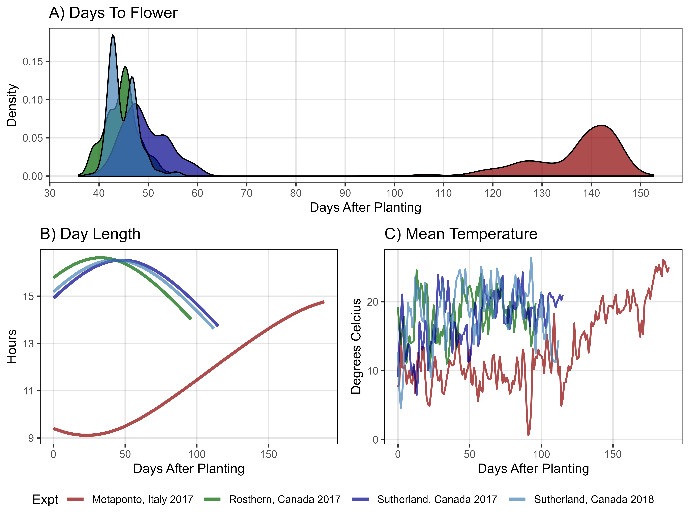

```{r}
# Prep data
xE <- read.csv("https://raw.githubusercontent.com/derekmichaelwright/AGILE_LDP_Phenology/master/data/data_env.csv") %>%
  rename(`Days After Planting`=DaysAfterPlanting) %>%
  filter(Expt %in% myExpts1) %>%
  select(Expt, `Days After Planting`, DayLength, Temp_mean) %>%
  gather(Trait, Value, DayLength, Temp_mean) %>%
  mutate(Unit = ifelse(Trait == "DayLength", "Hours", "Degrees Celcius"),
         Trait = plyr::mapvalues(Trait, c("DayLength", "Temp_mean"), 
                                 c("DayLength", "Mean Temperature")) )
yy <- bind_rows(it17_f %>% filter(Trait == "DTF"),
                ro17_f %>% filter(Trait == "DTF"),
                su17_f %>% filter(Trait == "DTF"),
                su18_f %>% filter(Trait == "DTF") ) %>%
  mutate(Expt = plyr::mapvalues(Expt, myExpts2, myExpts1)) %>%
  group_by(Expt, Name) %>% 
  summarise(Value = mean(Value, na.rm = T))
# Plot
mp1 <- ggplot(yy, aes(x = Value, fill = Expt)) +
  geom_density(alpha = 0.7) +
  scale_fill_manual(name = NULL, values = myColors_Expt) +
  scale_x_continuous(breaks = seq(30, 160, by = 10)) +
  theme_AGL +
  theme(legend.position = "none") +
  labs(title = "A) Days to Flower", 
       x = "Days After Planting", y = "Density")
mp2 <- ggplot(xE %>% filter(Trait == "DayLength"), 
              aes(x = `Days After Planting`, y = Value, color = Expt)) +
  geom_line(size = 1.25, alpha = 0.7) +
  scale_color_manual(name = NULL, values = myColors_Expt) +
  theme_AGL +
  theme(legend.position = "bottom") +
  labs(title = "B) Day Length", 
       y = "Hours", x = "Days After Planting")
mp3 <- ggplot(xE %>% filter(Trait == "Mean Temperature"), 
              aes(x = `Days After Planting`, y = Value, color = Expt)) +
  geom_line(size = 0.75, alpha = 0.7) +
  scale_color_manual(name = NULL, values = myColors_Expt) +
  theme_AGL +
  theme(legend.position = "bottom") +
  labs(title = "C) Mean Temperature", 
       y = "Degrees Celcius", x = "Days After Planting")
mp <- ggarrange(mp1, ggarrange(mp2, mp3, ncol = 2, nrow = 1, 
                               common.legend = T, legend = "bottom"), 
                ncol = 1, nrow = 2, heights = c(0.75,1) )
ggsave("Figure_01.png", mp, width = 8, height = 6, dpi = 600, bg = "white")
```

---

# Figure 02 - Orthomasaic

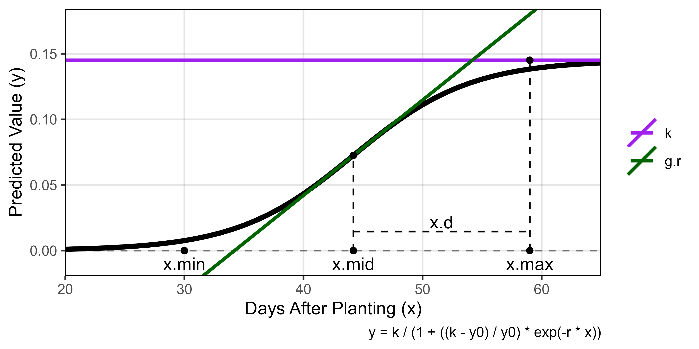

---

# Figure 03 - Growth Coefs

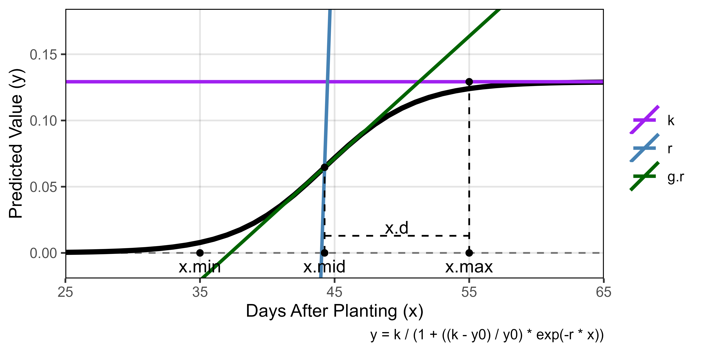

```{r}
# Create plotting function
ggGrowthCoefs <- function(xd, xf, myPlot, myYmax = NULL, 
                          minDAP = NULL, maxDAP = NULL, 
                          myTitle = NULL, mySubtitle = F) {
  #
  if(is.null(minDAP)) { minDAP <- min(xd[[3]]$DAP) }
  if(is.null(maxDAP)) { maxDAP <- max(xd[[3]]$DAP) }
  if(is.null(myYmax)) { myYmax <- max(xd[[2]]$k) }
  #
  x1 <- xd[[2]] %>% filter(Plot == myPlot)
  x2 <- xd[[3]] %>% filter(Plot == myPlot)
  xdtf <- xf %>% filter(Trait == "DTF", Plot == myPlot) 
  xdtm <- xf %>% filter(Trait == "DTM", Plot == myPlot)
  #
  if(mySubtitle == T) { 
    mySubtitle <- paste("Plot", x1$Plot, "| Entry", x1$Entry, "|",  x1$Name) 
  } else { mySubtitle <- NULL }
  #
  mp <- ggplot(x1) +
    #
    geom_hline(yintercept = 0, lty = 2, alpha = 0.5) +
    geom_line(data = x2, aes(x = DAP, y = Predicted.Values), size = 1.5) +
    #
    geom_hline(aes(yintercept = k, color = "k"), size = 1) +
    geom_abline(aes(slope = r, intercept = b, color = "r"), size = 1) +
    geom_abline(aes(slope = g.r, intercept = g.b, color = "g.r"), size = 1) +
    geom_point(aes(x = x.mid, y = k/2)) +
    #
    geom_point(aes(x = x.min), y = 0) +
    geom_text(aes(x = x.min), y = -0.01, label = "x.min") +
    #
    geom_segment(y = 0, aes(x = x.mid, xend = x.mid, yend = k/2), lty = 2) +
    geom_point(y = 0, aes(x = x.mid)) +
    geom_text(y = -0.01, aes(x = x.mid, label = "x.mid")) +
    #
    geom_segment(y = 0, aes(x = x.max, xend = x.max, yend = k), lty = 2) +
    geom_point(aes(x = x.max, y = k)) +
    geom_point(aes(x = x.max, y = 0)) +
    geom_text(aes(x = x.max, y = -0.01), label = "x.max") +
    #
    geom_segment(aes(x = x.mid, xend = x.max, y = k/10, yend = k/10), lty = 2) +
    geom_text(aes(x = x.max-((x.max-x.mid)/2), y = 1.5*k/10), label = "x.d") +
    #
    #geom_vline(data = xdtf, aes(xintercept = Value, color = "DTF")) +
    #geom_vline(data = xdtm, aes(xintercept = Value, color = "DTM")) +
    #geom_segment(x = minDAP, aes(y = k/2, xend = x.mid, yend = k/2), lty = 2, alpha = 0.5) +
    #geom_point(x = minDAP, aes(y = k/2)) +
    #geom_text_repel(x = minDAP, aes(y = k/2), label = "y.mid") +
    #
    theme_AGL +
    scale_color_manual(name = NULL, breaks = c("k","r","g.r"),
                       values = c("purple","steelblue","darkgreen")) +
    scale_x_continuous(limits = c(minDAP, maxDAP), expand = c(0,0)) +
    ylim(c(-0.01,myYmax)) +
    labs(title = myTitle, subtitle = mySubtitle,
         y = "Predicted Value (y)", x = "Days After Planting (x)",
         caption = "y = k / (1 + ((k - y0) / y0) * exp(-r * x))")
  mp
}
#
mp <- ggGrowthCoefs(xd = ro17_gc.v, xf = ro17_f, myPlot = 6322, 
                     myYmax = 0.175, minDAP = 25, maxDAP = 65)
ggsave("Figure_03.png", mp, width = 6, height = 3, dpi = 600)
```

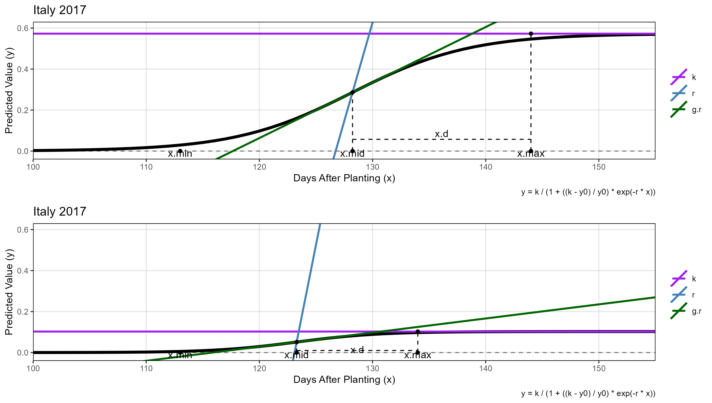

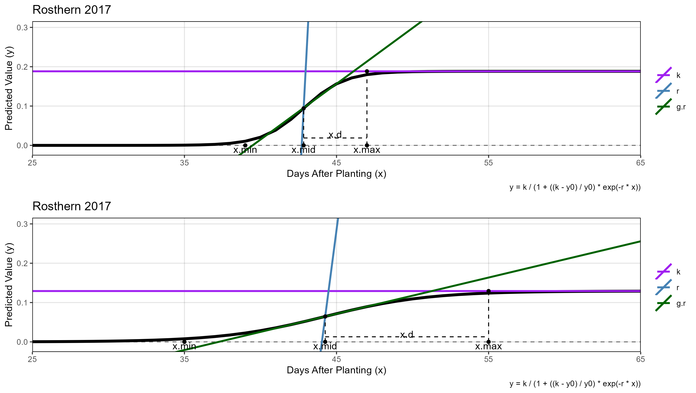

```{r}
#
mp1 <- ggGrowthCoefs(xd = it17_gc.v, xf = it17_f, myPlot = 229, myTitle = "Italy 2017",
                     myYmax = 0.6, minDAP = 100, maxDAP = 155)
mp2 <- ggGrowthCoefs(xd = it17_gc.v, xf = it17_f, myPlot = 225, myTitle = "Italy 2017", 
                     myYmax = 0.6, minDAP = 100, maxDAP = 155)
mp <- ggarrange(mp1, mp2, ncol = 1)
ggsave("Additional/GrowthCurves/06_It17_E155.png", mp, width = 6, height = 6)
#
mp1 <- ggGrowthCoefs(xd = ro17_gc.v, xf = ro17_f, myPlot = 6986, myTitle = "Rosthern 2017", 
                     myYmax = 0.3, minDAP = 25, maxDAP = 65)
mp2 <- ggGrowthCoefs(xd = ro17_gc.v, xf = ro17_f, myPlot = 6322, myTitle = "Rosthern 2017",
                     myYmax = 0.3, minDAP = 25, maxDAP = 65)
mp <- ggarrange(mp1, mp2, ncol = 1)
ggsave("Additional/GrowthCurves/06_Ro17_E065.png", mp, width = 6, height = 6)
```

---

# Supplemental Figure 01 - Drone Data


```{r}
ggDroneTrait <- function(xx, myTitle, myDAPs = NULL, myTraits, 
                         myTraitNames = myTraits ) {
  # Prep data
  if(is.null(myDAPs)) { myDAPs <- unique(xx$DAP)[order(unique(xx$DAP))] }
  xx <- xx %>% filter(Trait %in% myTraits, DAP %in% myDAPs) %>%
    mutate(Trait = plyr::mapvalues(Trait, myTraits, myTraitNames),
           Trait = factor(Trait, levels = myTraitNames),
           Rep = factor(paste("Rep", Rep)),
           DAP = paste("DAP", DAP),
           DAP = factor(DAP, levels = paste("DAP", myDAPs)) ) %>%
    filter(!is.na(Value_f), !is.na(Value))
  # Plot
  ggplot(xx, aes(x = Rep, color = Rep, pch = Rep)) +
    geom_quasirandom(aes(y = Value_f), size = 0.3, alpha = 0.7) +
    facet_grid(Trait ~ DAP, scales = "free_y", switch = "y") +
    scale_color_manual(name = NULL, 
                       values = c("darkslategray","slategray4","darkslategray4")) +
    scale_shape_manual(name = NULL, values = c(16,15,18)) +
    scale_y_continuous(sec.axis = sec_axis(~ .)) +
    theme_AGL +
    theme(strip.placement = "outside",
          axis.text.x = element_blank(),
          axis.ticks.x = element_blank()) +
    guides(colour = guide_legend(override.aes = list(size = 3, alpha = 1))) +
    labs(title = myTitle, y = NULL, x = NULL, 
         caption = paste("Number of data points =", nrow(xx)))
}
# Italy 2017
xx <- it17_d %>%
  mutate(DAP = plyr::mapvalues(DAP, c(93, 101, 119, 133, 163), 
                               c(94, 100, 118, 132, 164)))
mp1 <- ggDroneTrait(xx = xx, myTitle = "A) Metaponto, Italy 2017", 
                   myDAPs = c(94,100,118,132,164),
                   myTraits = c("crop_volume_m3_excess.green.based",
                                "mean_crop_height_m_excess.green.based",
                                "crop_area_m2_excess.green.based"),
                   myTraitNames = c("Volume", "Height", "Area"))
# Rosthern 2017
mp2 <- ggDroneTrait(xx = ro17_d, myTitle = "B) Rosthern, Canada", 
                   myDAPs = c(24,32,40,54,61,67,74,80,89,95),
                   myTraits = c("crop_volume_m3_blue.ndvi.based",
                                "mean_crop_height_m_blue.ndvi.based",
                                "crop_area_m2_blue.ndvi.based"),
                   myTraitNames = c("Volume", "Height", "Area"))
# Sutherland 2017
mp3 <- ggDroneTrait(xx = su17_d, myTitle = "C) Sutherland, Canada", 
                   myDAPs = c(32,40,46,51,57,61,68,72,75,77,83),
                   myTraits = c("crop_volume_m3_blue.ndvi.based",
                                "mean_crop_height_m_blue.ndvi.based",
                                "crop_area_m2_blue.ndvi.based"),
                   myTraitNames = c("Volume", "Height", "Area"))
# Sutherland 2018
mp4 <- ggDroneTrait(xx = su18_d, myTitle = "D) Sutherland, Canada 2018", 
                   myDAPs = c(42,55,58,61,65,68,72,76,79,86),
                   myTraits = c("crop_volume_m3_excess.green.based",
                                "mean_crop_height_m_excess.green.based",
                                "crop_area_m2_excess.green.based"),
                   myTraitNames = c("Volume", "Height", "Area"))
#
mp <- ggarrange(mp1, mp2, mp3, mp4, ncol = 1, nrow = 4, 
                common.legend = T, legend = "bottom")
ggsave("Supplemental_Figure_01.png", mp, width = 8, height = 11, 
       bg = "white", dpi = 600)
```

---

# Supplemental Figure 03 - PCA Inputs 

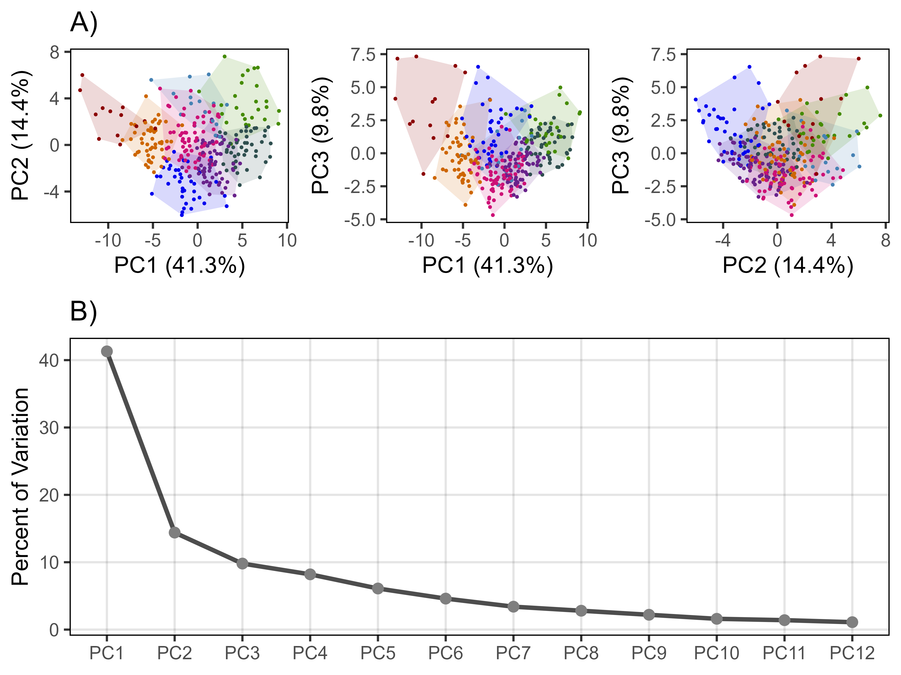

```{r}
phenolGrowth <- function(xd, xf) {
  xf1 <- xf %>% filter(Trait == "DTF") %>% select(Plot, DTF=Value)
  xf2 <- xf %>% filter(Trait == "DTM") %>% select(Plot, DTM=Value)
  xd %>% 
    left_join(xf1, by = "Plot") %>%
    left_join(xf2, by = "Plot") %>%
    mutate(xmid.DTF = x.mid - DTF,
           xmax.DTF = x.max - DTF,
           perc.DTF = 100 * (k / (1 + ((k - y0) / y0) * exp(-r * DTF))) / k,
           at.DTF = k / (1 + ((k - y0) / y0) * exp(-r * DTF)),
           at.DTM = k / (1 + ((k - y0) / y0) * exp(-r * DTM)),
           xmid.DTM = x.mid - DTM,
           xmax.DTM = x.max - DTM) %>%
    select(Plot, xmid.DTF, xmax.DTF, perc.DTF, 
           xmid.DTM, xmax.DTM, at.DTF, at.DTM)
}
pca_gc <- function(xx, clustNum = 8) {
  mypca <- PCA(xx, ncp = 10, graph = F)
  mypcaH <- HCPC(mypca, nb.clust = clustNum, graph = F)
  perc <- round(mypca[[1]][,2], 1)
  x1 <- mypcaH[[1]] %>% rownames_to_column("Name")
  x2 <- mypca[[3]]$coord %>% as.data.frame() %>% rownames_to_column("Name")
  pca <- left_join(x1, x2, by = "Name") %>%
    select(Name, Cluster=clust,
           PC1=Dim.1, PC2=Dim.2, PC3=Dim.3, PC4=Dim.4, PC5=Dim.5, PC6=Dim.6)
  pca
}
```

```{r}
# Prep data
myClustnum <- 8
#
x1 <- it17_gc.v[[2]] %>% 
  select(Plot, Entry, Name, k, x.mid, x.d, g.r) %>%
  left_join(phenolGrowth(xd = it17_gc.v[[2]], xf = it17_f), by = "Plot") %>% 
  select(-xmid.DTF, -xmid.DTM, -xmax.DTM, -at.DTM)
colnames(x1)[4:ncol(x1)] <- paste0("It17_v.", colnames(x1)[4:ncol(x1)])
x2 <- it17_gc.a[[2]] %>% 
  select(Plot, Entry, Name, k, x.mid, x.d, g.r) %>%
  left_join(phenolGrowth(xd = it17_gc.a[[2]], xf = it17_f), by = "Plot") %>% 
  select(-xmid.DTF, -xmid.DTM, -xmax.DTM, -at.DTM)
colnames(x2)[4:ncol(x2)] <- paste0("It17_a.", colnames(x2)[4:ncol(x2)])
x3 <- it17_gc.h[[2]] %>% 
  select(Plot, Entry, Name, k, x.mid, x.d, g.r) %>%
  left_join(phenolGrowth(xd = it17_gc.h[[2]], xf = it17_f), by = "Plot") %>% 
  select(-xmid.DTF, -xmid.DTM, -xmax.DTM, -at.DTM)
colnames(x3)[4:ncol(x3)] <- paste0("It17_h.", colnames(x3)[4:ncol(x3)])
myX1 <- left_join(x2, x3, by = c("Plot","Entry","Name")) %>% 
  left_join(x1, by = c("Plot","Entry","Name")) %>%
  select(-Plot) %>%
  gather(Trait, Value, 3:ncol(.)) %>%
  group_by(Entry, Name, Trait) %>% 
  summarise(Value = mean(Value, na.rm = T)) %>%
  ungroup() %>%
  spread(Trait, Value) %>% select(-Entry)
#
x1 <- su17_gc.v[[2]] %>% 
  select(Plot, Entry, Name, k, x.mid, x.d, g.r) %>% 
  left_join(phenolGrowth(xd = su17_gc.v[[2]], xf = su17_f), by = "Plot") %>% 
  select(-xmid.DTF, -xmid.DTM, -xmax.DTM, -at.DTM)
colnames(x1)[4:ncol(x1)] <- paste0("Su17_v.", colnames(x1)[4:ncol(x1)])
x2 <- su17_gc.a[[2]] %>% 
  select(Plot, Entry, Name, k, x.mid, x.d, g.r) %>%
  left_join(phenolGrowth(xd = su17_gc.a[[2]], xf = su17_f), by = "Plot") %>% 
  select(-xmid.DTF, -xmid.DTM, -xmax.DTM, -at.DTM)
colnames(x2)[4:ncol(x2)] <- paste0("Su17_a.", colnames(x2)[4:ncol(x2)])
x3 <- su17_gc.h[[2]] %>% 
  select(Plot, Entry, Name, k, x.mid, x.d, g.r) %>%
  left_join(phenolGrowth(xd = su17_gc.h[[2]], xf = su17_f), by = "Plot") %>% 
  select(-xmid.DTF, -xmid.DTM, -xmax.DTM, -at.DTM)
colnames(x3)[4:ncol(x3)] <- paste0("Su17_h.", colnames(x3)[4:ncol(x3)])
myX2 <- left_join(x2, x3, by = c("Plot","Entry","Name")) %>% 
  left_join(x1, by = c("Plot","Entry","Name")) %>%
  select(-Plot) %>%
  gather(Trait, Value, 3:ncol(.)) %>%
  group_by(Entry, Name, Trait) %>% 
  summarise(Value = mean(Value, na.rm = T)) %>%
  ungroup() %>%
  spread(Trait, Value) %>% select(-Entry)
#
myPCAinput <- left_join(myX1, myX2, by = "Name") %>%
  column_to_rownames("Name")
sum(is.na(myPCAinput))
#
mypca <- PCA(myPCAinput, ncp = 10, graph = F)
mypcaH <- HCPC(mypca, nb.clust = myClustnum, graph = F)
perc <- round(mypca[[1]][,2], 1)
x1 <- mypcaH[[1]] %>% rownames_to_column("Name")
x2 <- mypca[[3]]$coord %>% as.data.frame() %>% rownames_to_column("Name")
myPCA <- left_join(x1, x2, by = "Name") %>%
  select(Name, Cluster=clust,
         PC1=Dim.1, PC2=Dim.2, PC3=Dim.3, PC4=Dim.4, PC5=Dim.5, PC6=Dim.6,
         PC7=Dim.7, PC8=Dim.8, PC9=Dim.9) %>%
  left_join(myLDP, by = "Name") %>% 
  select(Entry, Name, Origin, Region, everything())
write.csv(myPCA, "myPCA.csv", row.names = F)
write.csv(myPCAinput, "myPCAinput.csv", row.names = F)
#
myTs <- c("It17_v.k", "It17_h.k", "It17_a.k", "It17_v.x.mid", "It17_h.x.mid", "It17_a.x.mid",
          "Su17_v.k", "Su17_h.k", "Su17_a.k", "Su17_v.x.mid", "Su17_h.x.mid", "Su17_a.x.mid",
          #
          "It17_v.perc.DTF", "It17_h.perc.DTF", "It17_a.perc.DTF",
          "It17_v.at.DTF", "It17_h.at.DTF", "It17_a.at.DTF",
          #
          "Su17_v.perc.DTF", "Su17_h.perc.DTF", "Su17_a.perc.DTF",
          "Su17_v.at.DTF", "Su17_h.at.DTF", "Su17_a.at.DTF",
          "It17_v.xmax.DTF", "It17_h.xmax.DTF", "It17_a.xmax.DTF", 
          "Su17_v.xmax.DTF", "Su17_h.xmax.DTF", "Su17_a.xmax.DTF",
          #
          "It17_v.x.d", "It17_h.x.d", "It17_a.x.d", "It17_v.g.r", "It17_h.g.r", "It17_a.g.r",
          "Su17_v.x.d", "Su17_h.x.d", "Su17_a.x.d", "Su17_v.g.r", "Su17_h.g.r", "Su17_a.g.r"
          )
#
xx <- myPCAinput %>% rownames_to_column("Name") %>%
  left_join(select(myPCA, Entry, Name, Origin, Cluster), by = "Name") %>%
  select(Entry, Name, Origin, Cluster, everything()) %>%
  gather(Trait, Value, 5:ncol(.)) %>%
  mutate(Trait = factor(Trait, levels = myTs))
mp <- ggplot(xx, aes(x = Cluster, y = Value, color = Cluster)) +
  geom_quasirandom(alpha = 0.7) +
  facet_wrap(Trait ~ ., scales = "free_y", ncol = 6) +
  scale_color_manual(values = myColors_Cluster) +
  theme_AGL +
  theme(axis.text.x = element_blank(),
        axis.ticks.x = element_blank()) +
  labs(x = NULL, y = NULL)
ggsave("Supplemental_Figure_03.png", mp, width = 15, height = 14, dpi = 600)
#
xx <- myPCAinput %>% rownames_to_column("Name") %>% 
  as.data.frame() %>%
  select(Name, It17_h.k, It17_a.k, It17_v.k, Su17_h.k, Su17_a.k, Su17_v.k)
x1 <- xx %>%
  mutate(It17 = It17_h.k / It17_a.k,
         Su17 = Su17_h.k / Su17_a.k) %>%
  select(Name, It17, Su17) %>%
  gather(Expt, HA_Ratio, It17, Su17)
x2 <- xx %>% select(Name, It17=It17_v.k, Su17=Su17_v.k) %>%
  gather(Expt, Volume, It17, Su17)
xx <- left_join(x1, x2, by = c("Name", "Expt")) %>%
  left_join(select(myPCA, Name, Cluster), by = "Name")
mp <- ggplot(xx, aes(x = Cluster, y = HA_Ratio, size = Volume, fill = Cluster)) +
  geom_quasirandom(pch = 21, alpha = 0.7) +
  facet_wrap(Expt ~ .) +
  scale_fill_manual(values = myColors_Cluster) +
  scale_size_continuous(range = c(0.25, 3.5)) +
  theme_AGL +
  theme(axis.text.x = element_blank(),
        axis.ticks.x = element_blank())
ggsave("Additional/PCA/Additional_Figure_01.png", mp, width = 8, height = 4, dpi = 600)
#
xx <- myPCAinput %>% rownames_to_column("Name") %>% 
  as.data.frame() %>%
  select(Name, It17_h.k, It17_a.k, It17_v.k, Su17_h.k, Su17_a.k, Su17_v.k) %>%
  mutate(It17_VHAratio = It17_v.k * It17_h.k / It17_a.k,
         Su17_VHAratio = Su17_v.k * Su17_h.k / Su17_a.k) %>%
  left_join(select(myPCA, Name, Cluster), by = "Name") %>%
  select(Name, Cluster, It17_VHAratio, Su17_VHAratio) %>%
  gather(Trait, Value, It17_VHAratio, Su17_VHAratio)
mp <- ggplot(xx, aes(x = Cluster, y = Value, fill = Cluster)) +
  geom_quasirandom(pch = 21, alpha = 0.7, size = 2) +
  facet_wrap(Trait ~ .) +
  scale_fill_manual(values = myColors_Cluster) +
  theme_AGL +
  theme(axis.text.x = element_blank(),
        axis.ticks.x = element_blank())
ggsave("Additional/PCA/Additional_Figure_02.png", mp, width = 8, height = 4, dpi = 600)
```

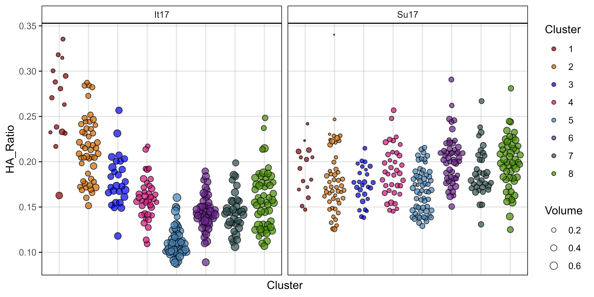

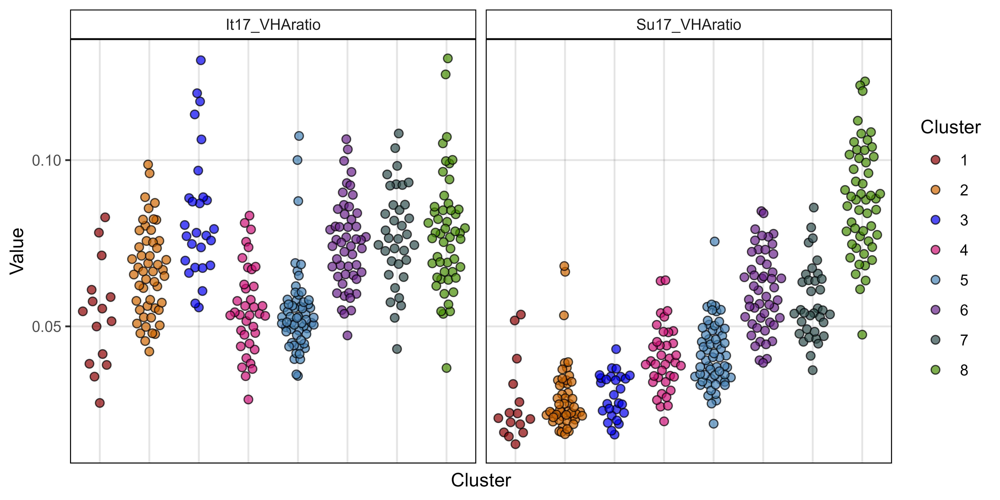

---

# Figure 06 - PCA Summary 

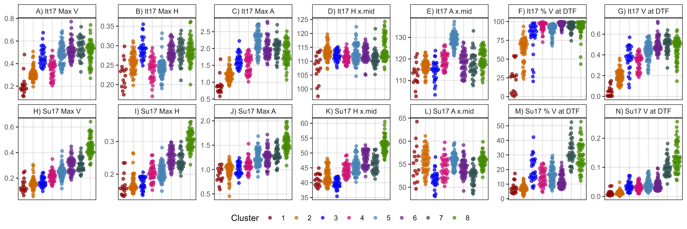

```{r}
# Prep data
myTs1 <- c("It17_v.k", "It17_h.k", "It17_a.k", 
           "It17_h.x.mid", "It17_a.x.mid", 
           "It17_v.perc.DTF", "It17_v.at.DTF", 
           #
           "Su17_v.k", "Su17_h.k", "Su17_a.k",
           "Su17_h.x.mid", "Su17_a.x.mid",
           "Su17_v.perc.DTF", "Su17_v.at.DTF") 
myTs2 <- c("A) It17 Max V", "B) It17 Max H", "C) It17 Max A", 
           "D) It17 H x.mid", "E) It17 A x.mid", 
           "F) It17 % V at DTF", "G) It17 V at DTF",
           #
           "H) Su17 Max V", "I) Su17 Max H", "J) Su17 Max A",
           "K) Su17 H x.mid", "L) Su17 A x.mid",
           "M) Su17 % V at DTF", "N) Su17 V at DTF")
xx <- myPCAinput %>% rownames_to_column("Name") %>%
  left_join(select(myPCA, Entry, Name, Origin, Cluster), by = "Name") %>%
  select(Entry, Name, Origin, Cluster, everything()) %>%
  gather(Trait, Value, 5:ncol(.)) %>%
  filter(Trait %in% myTs1) %>%
  mutate(Trait = plyr::mapvalues(Trait, myTs1, myTs2),
         Trait = factor(Trait, levels = myTs2))
# Plot
mp <- ggplot(xx, aes(x = Cluster, y = Value, color = Cluster)) +
  geom_quasirandom(alpha = 0.7) +
  facet_wrap(Trait ~ ., scales = "free_y", ncol = 7) +
  scale_color_manual(values = myColors_Cluster) +
  theme_AGL +
  theme(legend.position = "bottom",
        legend.margin = margin(c(0,0,0,0)),
        axis.text.x = element_blank(),
        axis.ticks.x = element_blank()) +
  guides(color = guide_legend(nrow = 1)) +
  labs(x = NULL, y = NULL)
ggsave("Figure_06.png", mp, width = 12, height = 4, dpi = 600)
```

---

# Additional Figures - Clusters

```{r}
# cnum<-3
ggHC_test <- function(cnum) {
  #
  mypcaH <- HCPC(mypca, nb.clust = cnum, graph = F)
  x1 <- mypcaH[[1]] %>% rownames_to_column("Name") %>% select(Name, Cluster=clust)
  #
  myTs1 <- c("It17_v.k", "It17_h.k", "It17_a.k", 
             "It17_h.x.mid", "It17_a.x.mid", 
             "It17_v.perc.DTF", "It17_v.at.DTF", 
             #
             "Su17_v.k", "Su17_h.k", "Su17_a.k",
             "Su17_h.x.mid", "Su17_a.x.mid",
             "Su17_v.perc.DTF", "Su17_v.at.DTF") 
  myTs2 <- c("A) It17 Max V", "B) It17 Max H", "C) It17 Max A", 
             "D) It17 H x.mid", "E) It17 A x.mid", 
             "F) It17 % V at DTF", "G) It17 V at DTF",
             #
             "H) Su17 Max V", "I) Su17 Max H", "J) Su17 Max A",
             "K) Su17 H x.mid", "L) Su17 A x.mid",
             "M) Su17 % V at DTF", "N) Su17 V at DTF") 
  xx <- myPCAinput %>% rownames_to_column("Name") %>%
    left_join(x1, by = "Name") %>%
    select(Name, Cluster, everything()) %>%
    gather(Trait, Value, 3:ncol(.)) %>%
    filter(Trait %in% myTs1) %>%
    mutate(Trait = plyr::mapvalues(Trait, myTs1, myTs2),
           Trait = factor(Trait, levels = myTs2))
  # Plot
  mp <- ggplot(xx, aes(x = Cluster, y = Value, color = Cluster)) +
    geom_quasirandom(alpha = 0.7) +
    facet_wrap(Trait ~ ., scales = "free_y", ncol = 7) +
    scale_color_manual(values = c(myColors_Cluster,
       "violetred3", "tan3", "aquamarine4", "deeppink4") ) +
    theme_AGL +
    theme(legend.position = "bottom") +
    guides(color = guide_legend(nrow = 1)) +
    labs(x = NULL, y = NULL)
  mp
}
ggsave("Additional/PCA/Test_Clusters02.png", ggHC_test(2), width = 10, height = 4, dpi = 600)
ggsave("Additional/PCA/Test_Clusters03.png", ggHC_test(3), width = 10, height = 4, dpi = 600)
ggsave("Additional/PCA/Test_Clusters04.png", ggHC_test(4), width = 10, height = 4, dpi = 600)
ggsave("Additional/PCA/Test_Clusters05.png", ggHC_test(5), width = 10, height = 4, dpi = 600)
ggsave("Additional/PCA/Test_Clusters06.png", ggHC_test(6), width = 10, height = 4, dpi = 600)
ggsave("Additional/PCA/Test_Clusters07.png", ggHC_test(7), width = 10, height = 4, dpi = 600)
ggsave("Additional/PCA/Test_Clusters08.png", ggHC_test(8), width = 10, height = 4, dpi = 600)
ggsave("Additional/PCA/Test_Clusters09.png", ggHC_test(9), width = 10, height = 4, dpi = 600)
ggsave("Additional/PCA/Test_Clusters10.png", ggHC_test(10), width = 10, height = 4, dpi = 600)
ggsave("Additional/PCA/Test_Clusters11.png", ggHC_test(11), width = 10, height = 4, dpi = 600)
ggsave("Additional/PCA/Test_Clusters12.png", ggHC_test(12), width = 10, height = 4, dpi = 600)
```

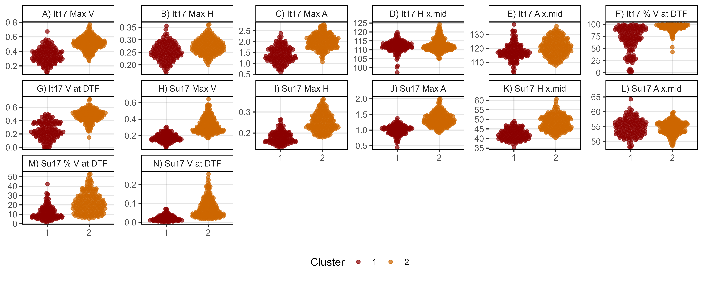

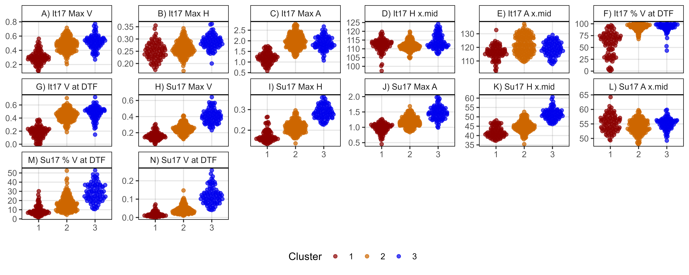

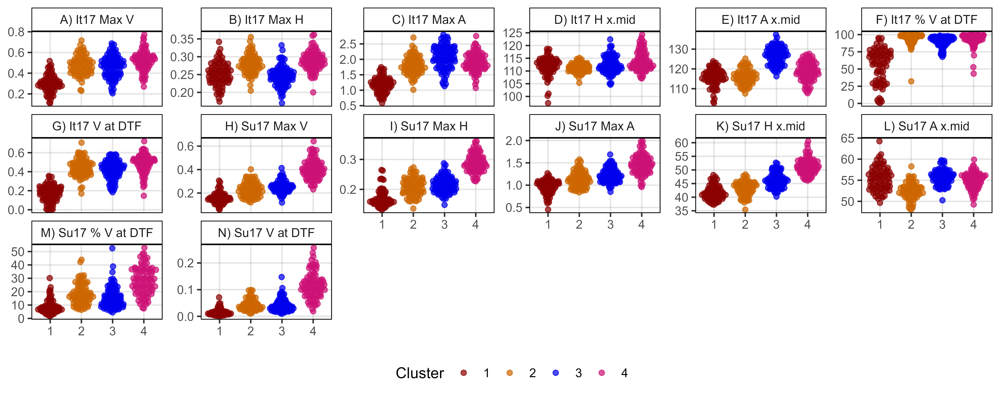

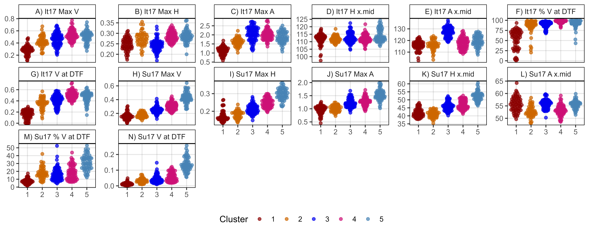

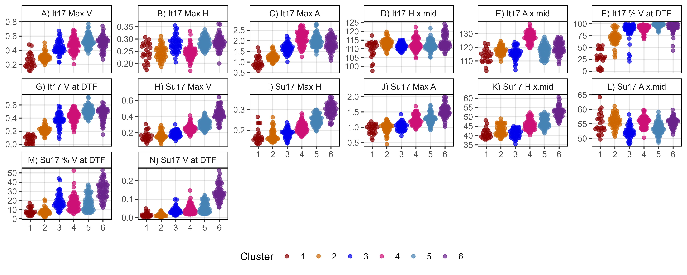

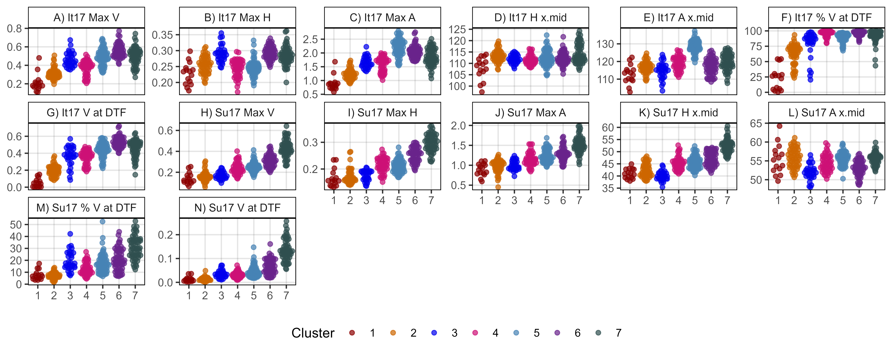

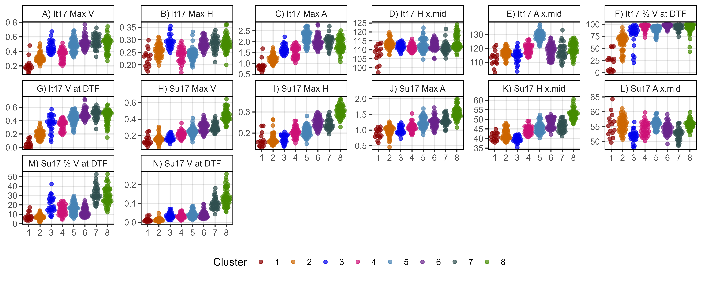

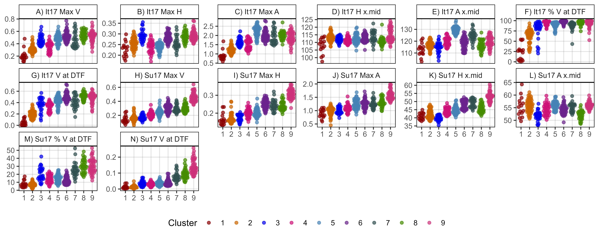

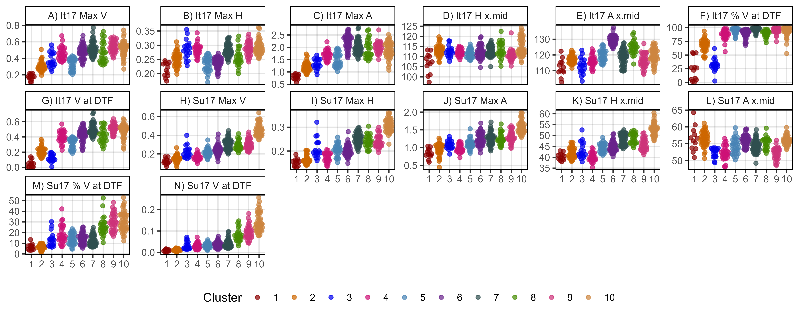

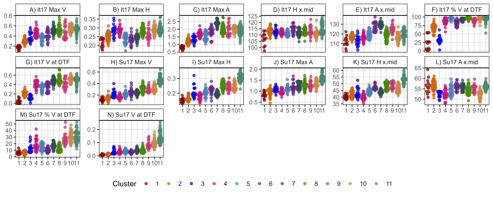

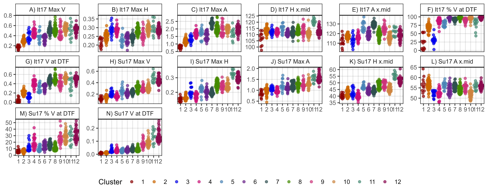

---

# Supllemental Figure 03 - PCA

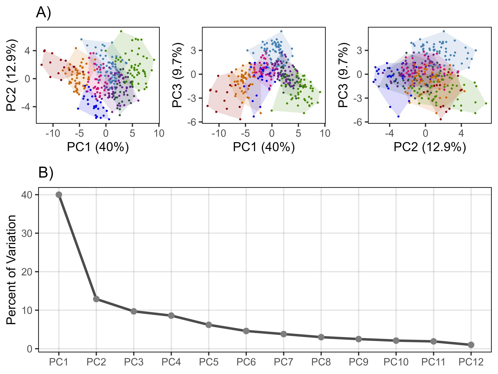

```{r}
# Prep data
perc <- round(mypca[[1]][,2], 1)
# Plot (a) PCA 1v2
find_hull <- function(df) df[chull(df[,"PC1"], df[,"PC2"]), ]
polys <- plyr::ddply(myPCA, "Cluster", find_hull) %>% mutate(Cluster = factor(Cluster))
mp1.1 <- ggplot(myPCA) +
  geom_polygon(data = polys, alpha = 0.15, aes(x = PC1, y = PC2, fill = Cluster)) +
  geom_point(aes(x = PC1, y = PC2, colour = Cluster), size = 0.2) +
  scale_fill_manual(values = myColors_Cluster) +
  scale_color_manual(values = myColors_Cluster) +
  theme_AGL + 
  theme(legend.position = "none", panel.grid = element_blank()) +
  labs(title = "A)",
       x = paste0("PC1 (", perc[1], "%)"),
       y = paste0("PC2 (", perc[2], "%)"))
# Plot (a) PCA 1v3
find_hull <- function(df) df[chull(df[,"PC1"], df[,"PC3"]), ]
polys <- plyr::ddply(myPCA, "Cluster", find_hull) %>% mutate(Cluster = factor(Cluster))
mp1.2 <- ggplot(myPCA) +
  geom_polygon(data = polys, alpha = 0.15, aes(x = PC1, y = PC3, fill = Cluster)) +
  geom_point(aes(x = PC1, y = PC3, colour = Cluster), size = 0.2) +
  scale_fill_manual(values = myColors_Cluster) +
  scale_color_manual(values = myColors_Cluster) +
  theme_AGL + 
  theme(legend.position = "none", panel.grid = element_blank()) +
  labs(title = "",
       x = paste0("PC1 (", perc[1], "%)"),
       y = paste0("PC3 (", perc[3], "%)"))
# Plot (a) PCA 2v3
find_hull <- function(df) df[chull(df[,"PC2"], df[,"PC3"]), ]
polys <- plyr::ddply(myPCA, "Cluster", find_hull) %>% mutate(Cluster = factor(Cluster))
mp1.3 <- ggplot(myPCA) +
  geom_polygon(data = polys, alpha = 0.15, aes(x = PC2, y = PC3, fill = Cluster)) +
  geom_point(aes(x = PC2, y = PC3, colour = Cluster), size = 0.2) +
  scale_fill_manual(values = myColors_Cluster) +
  scale_color_manual(values = myColors_Cluster) +
  theme_AGL + 
  theme(legend.position = "none", panel.grid = element_blank()) +
  labs(title = "",
       x = paste0("PC2 (", perc[2], "%)"),
       y = paste0("PC3 (", perc[3], "%)"))
# Append 
mp1 <- ggarrange(mp1.1, mp1.2, mp1.3, nrow = 1, ncol = 3, hjust = 0)
#
xx <- data.frame(x = 1:12, y = perc[1:12])
# Plot
mp2 <- ggplot(xx, aes(x = x, y = y)) +
  geom_line(size = 1, alpha = 0.7) +
  geom_point(size = 2, color = "grey50") + 
  scale_x_continuous(breaks = 1:12, labels = paste0("PC",1:12)) +
  theme_AGL +
  labs(title = "B)", y = "Percent of Variation", x = NULL)
mp <- ggarrange(mp1, mp2, ncol = 1, nrow = 2, heights = c(0.75,1))
ggsave("Supplemental_Figure_04.png", mp, width = 6, height = 4.5, dpi = 600)
```

---

# Supplemental Figure 02 - Correlation Plots


```{r}
# Create plotting function
ggDroneCorr <- function(xd, xf, myTitle, myTrait, xLab, yLab, myColor = "darkgreen") {
  # Prep data
  xd <- xd[[2]] %>% select(Plot, k)
  xf <- xf %>% filter(Trait == myTrait) %>% select(Plot, Entry, Name, Value)
  xx <- left_join(xf, xd, by = "Plot") %>%
    group_by(Entry, Name) %>%
    summarise(Value = mean(Value, na.rm = T),
              k = mean(k, na.rm = T)) %>%
    ungroup()
  myCorr <- cor(xx$Value, xx$k, use = "complete.obs")^2
  myLabel1 <- paste("italic(R)^2 ==", round(myCorr,2))
  # Plot
  ggplot(xx, aes(x = Value, y = k)) +
    stat_smooth(geom = "line", method = "lm", se = F, 
                size = 1, color = "black") +
    geom_point(alpha = 0.6, pch = 21, fill = myColor) +
    geom_label(label = myLabel1, hjust = 0, parse = T,
              x = -Inf, y = Inf, vjust = 1 ) +
    facet_grid(. ~ as.character(myTitle)) +
    theme_AGL + 
    labs(x = xLab, y = yLab)
}
```

```{r}
mp1 <- ggDroneCorr(xd = it17_gc.h, xf = it17_f, myColor = myColors_Expt[1],
                   myTitle = "Metaponto, Italy 2017", yLab = "Plot Height (UAV)",
                   myTrait = "Canopy.Height", xLab = "Canopy Height (Manual)")
mp2 <- ggDroneCorr(xd = ro17_gc.h, xf = ro17_f, myColor = myColors_Expt[2],
                   myTitle = "Rosthern, Canada 2017", yLab = "Plot Height (UAV)", 
                   myTrait = "Canopy.Height", xLab = "Canopy Height (Manual)")
mp3 <- ggDroneCorr(xd = su17_gc.h, xf = su17_f, myColor = myColors_Expt[3], 
                   myTitle = "Sutherland, Canada 2017", yLab = "Plot Height (UAV)", 
                   myTrait = "Canopy.Height", xLab = "Canopy Height (Manual)")
mp4 <- ggDroneCorr(xd = su18_gc.h, xf = su18_f, myColor = myColors_Expt[4],
                   myTitle = "Sutherland, Canada 2018", yLab = "Plot Height (UAV)", 
                   myTrait = "CanopyHeight", xLab = "Canopy Height (Manual)")
mp_a <- ggarrange(mp1, mp2, mp3, mp4, ncol = 4, nrow = 1) %>%
  annotate_figure(top = "Plot Height (UAV) x Canopy Height (Manual)") + 
  bgcolor("white") + border("white")
#
mp1 <- ggDroneCorr(xd = it17_gc.v, xf = it17_f, myColor = myColors_Expt[1],
                   myTitle = "Metaponto, Italy 2017", yLab = "Plot Volume (UAV)", 
                   myTrait = "Straw.Biomass", xLab = "Straw Biomass (Manual)")
mp2 <- ggDroneCorr(xd = ro17_gc.v, xf = ro17_f, myColor = myColors_Expt[2],
                   myTitle = "Rosthern, Canada 2017", yLab = "Plot Volume (UAV)", 
                   myTrait = "Plot.Biomass", xLab = "Plot Biomass (Manual)")
mp3 <- ggDroneCorr(xd = su17_gc.v, xf = su17_f, myColor = myColors_Expt[3],
                   myTitle = "Sutherland, Canada 2017", yLab = "Plot Volume (UAV)", 
                   myTrait = "Plot.Biomass", xLab = "Plot Biomass (Manual)")
mp4 <- ggDroneCorr(xd = su18_gc.v, xf = su18_f, myColor = myColors_Expt[4],
                   myTitle = "Sutherland, Canada 2018", yLab = "Plot Volume (UAV)", 
                   myTrait = "Plot.Biomass", xLab = "Plot Biomass (Manual)")
mp_b <- ggarrange(mp1, mp2, mp3, mp4, ncol = 4, nrow = 1) %>%
  annotate_figure(top = "Plot Volume (UAV) x Biomass (Manual)") + 
  bgcolor("white") + border("white")
mp <- ggarrange(mp_a, mp_b, nrow = 2, labels = c("A)","B)"))
ggsave("Supplemental_Figure_02.png", mp, width = 10, height = 6, dpi = 600)
ggsave("Additional/DroneData/Supplemental_Figure_02_A.png", mp_a, width = 10, height = 3, dpi = 600)
ggsave("Additional/DroneData/Supplemental_Figure_02_B.png", mp_b, width = 10, height = 3, dpi = 600)
```

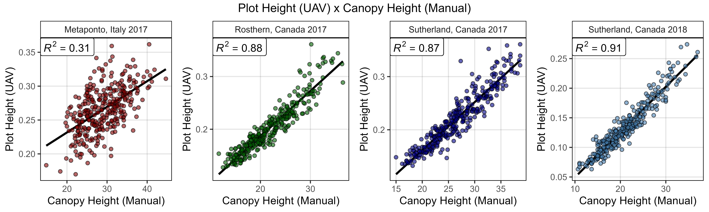

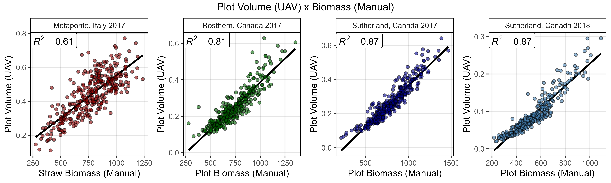


```{r}
mp1 <- ggDroneCorr(xd = it17_gc.v, xf = it17_f, myColor = myColors_Expt[1],
                   myTitle = "Italy 2017", yLab = "Plot Volume (Drone)", 
                   myTrait = "Seed.Mass",  xLab = "Seed Yield (Manual)")
mp2 <- ggDroneCorr(xd = ro17_gc.v, xf = ro17_f, myColor = myColors_Expt[2],
                  myTitle = "Rosthern 2017", yLab = "Plot Volume (Drone)", 
                  myTrait = "Seed.Mass",     xLab = "Seed Yeild (Manual)")
mp3 <- ggDroneCorr(xd = su17_gc.v, xf = su17_f, myColor = myColors_Expt[3], 
                  myTitle = "Sutherland 2017", yLab = "Plot Volume (Drone)", 
                  myTrait = "Seed.Mass",        xLab = "Seed Yield (Manual)")
mp4 <- ggDroneCorr(xd = su18_gc.v, xf = su18_f, myColor = myColors_Expt[4],
                  myTitle = "Sutherland 2018", yLab = "Plot Volume (Drone)", 
                  myTrait = "Seed.Mass",        xLab = "Seed Yield (Manual)")
mp_a <- ggarrange(mp1, mp2, mp3, mp4, ncol = 4, nrow = 1) %>%
  annotate_figure(top = "Volume x Seed Yield") + 
  bgcolor("white") + border("white")
ggsave("Additional/DroneData/Supplemental_Figure_02_C.png", mp, width = 10, height = 6, dpi = 600)
```

---

# Figure 04 - Canada vs Iran vs India

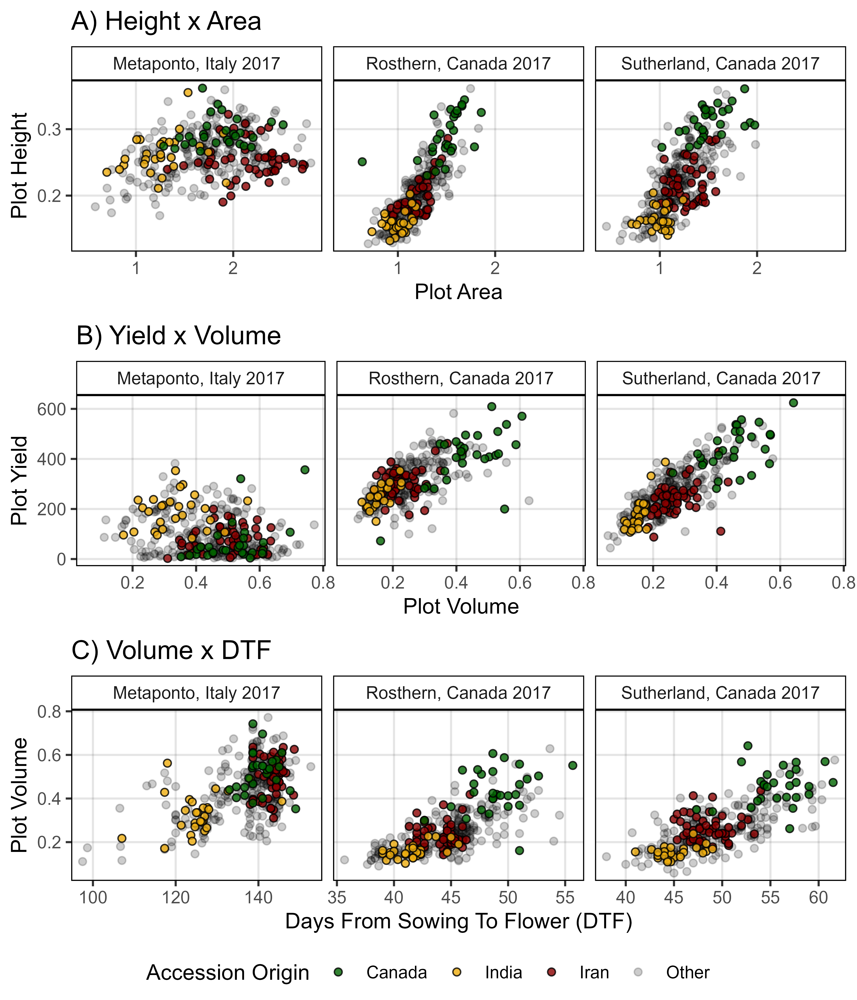

```{r}
# Prep data
myColors_Origins <- c("darkgreen","darkgoldenrod2", "darkred", "black")
myOrigins <- c("India", "Iran", "Canada", "Other")
myExpts3 <- c("Italy 2017", "Rosthern 2017", "Sutherland 2017", "Sutherland 2018")
#
xH <- rbind(it17_gc.h[[2]], ro17_gc.h[[2]], su17_gc.h[[2]]) %>% #, su18_gc.h[[2]]
  select(Plot, Entry, Name, Expt, Height=k)
xA <- rbind(it17_gc.a[[2]], ro17_gc.a[[2]], su17_gc.a[[2]]) %>% #, su18_gc.a[[2]]
  select(Plot, Entry, Name, Expt, Area=k)
xV <- rbind(it17_gc.v[[2]], ro17_gc.v[[2]], su17_gc.v[[2]]) %>% #, su18_gc.v[[2]]
  select(Plot, Entry, Name, Expt, Volume=k)
xS <- rbind(it17_f %>% filter(Trait == "Seed.Mass"),
            ro17_f %>% filter(Trait == "Seed.Mass"),
            su17_f %>% filter(Trait == "Seed.Mass"),
            su18_f %>% filter(Trait == "Seed.Mass")) %>%
  select(Plot, Entry, Name, Expt, Seed.Mass=Value)
xD <- rbind(it17_f %>% filter(Trait == "DTF"),
            ro17_f %>% filter(Trait == "DTF"),
            su17_f %>% filter(Trait == "DTF"),
            su18_f %>% filter(Trait == "DTF")) %>%
  select(Plot, Entry, Name, Expt, DTF=Value) 
xP <- read.csv("myPCA.csv") %>%
  mutate(Cluster = factor(Cluster)) %>%
  select(Entry, Name, Cluster, Origin)
#
xx <- left_join(xH, xA, by = c("Plot","Entry","Name","Expt")) %>%
  left_join(xV, by = c("Plot","Entry","Name","Expt")) %>%
  left_join(xS, by = c("Plot","Entry","Name","Expt")) %>%
  left_join(xD, by = c("Plot","Entry","Name","Expt")) %>%
  group_by(Entry, Name, Expt) %>%
  summarise(Height = mean(Height, na.rm = T),
            Area = mean(Area, na.rm = T),
            Volume = mean(Volume, na.rm = T),
            Seed.Mass = mean(Seed.Mass, na.rm = T),
            DTF = mean(DTF, na.rm = T)) %>%
  ungroup() %>%
  left_join(xP, by = c("Entry", "Name")) %>%
  mutate(Group = ifelse(Origin %in% myOrigins[1:3], Origin, myOrigins[4]),
         Expt = plyr::mapvalues(Expt, myExpts3, myExpts1)) %>%
  arrange(desc(Group))
# Plot
mp1 <- ggplot(xx, aes(x = Area, y = Height, fill = Group)) +
  geom_point(aes(alpha = Group, key1 = Origin), pch = 21, color = "black") +
  facet_grid(. ~ Expt) +
  scale_fill_manual(name = "Accession Origin", values = myColors_Origins) +
  scale_alpha_manual(name = "Accession Origin", values = c(0.8,0.8,0.8,0.2)) +
  theme_AGL +
  labs(title = "A) Height x Area", y = "Plot Height", x = "Plot Area")
#
mp2 <- ggplot(xx, aes(x = Volume, y = Seed.Mass, key1 = Origin, fill = Group)) +
  geom_point(aes(alpha = Group, key1 = Origin), pch = 21, color = "black") +
  facet_grid(. ~ Expt) +
  scale_fill_manual(name = "Accession Origin", values = myColors_Origins) +
  scale_alpha_manual(name = "Accession Origin", values = c(0.8,0.8,0.8,0.2)) +
  theme_AGL +
  labs(title = "B) Yield x Volume", x = "Plot Volume", y = "Plot Yield")
#
mp3 <- ggplot(xx, aes(x = DTF, y = Volume, key1 = Origin, fill = Group)) +
  geom_point(aes(alpha = Group, key1 = Origin), pch = 21, color = "black") +
  facet_grid(. ~ Expt, scales = "free") +
  scale_fill_manual(name = "Accession Origin", values = myColors_Origins) +
  scale_alpha_manual(name = "Accession Origin", values = c(0.8,0.8,0.8,0.2)) +
  theme_AGL +
  labs(title = "C) Volume x DTF", x = "Days From Sowing To Flower (DTF)", y = "Plot Volume")
#
mp <- ggarrange(mp1, mp2, mp3, nrow = 3, ncol = 1, common.legend = T, legend = "bottom")
ggsave("Figure_04.png", mp, width = 6, height = 7, dpi = 600, bg = "white")
ggsave("Additional/DroneData/Figure_04_A.png", mp1, width = 6, height = 2.5, dpi = 600)
ggsave("Additional/DroneData/Figure_04_B.png", mp2, width = 6, height = 2.5, dpi = 600)
ggsave("Additional/DroneData/Figure_04_C.png", mp3, width = 6, height = 2.5, dpi = 600)
#
saveWidget(ggplotly(mp1), file="Additional/DroneData/Figure_04_A.html")
saveWidget(ggplotly(mp2), file="Additional/DroneData/Figure_04_B.html")
saveWidget(ggplotly(mp3), file="Additional/DroneData/Figure_04_C.html")
```

https://github.com/derekmichaelwright/AGILE_LDP_UAV/Additional/DroneData/Figure_04_A.html

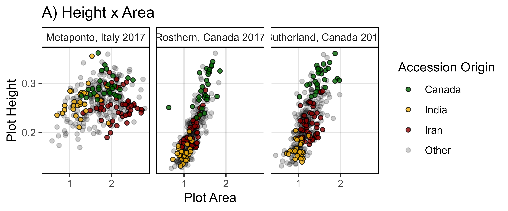

https://github.com/derekmichaelwright/AGILE_LDP_UAV/Additional/DroneData/Figure_04_B.html

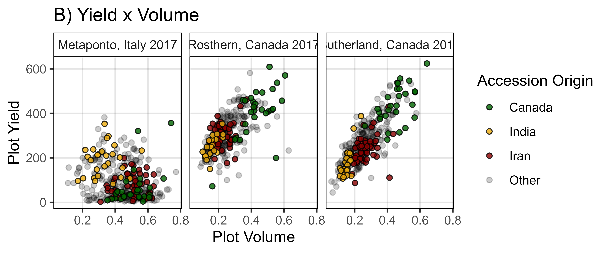

https://github.com/derekmichaelwright/AGILE_LDP_UAV/Additional/DroneData/Figure_04_C.html

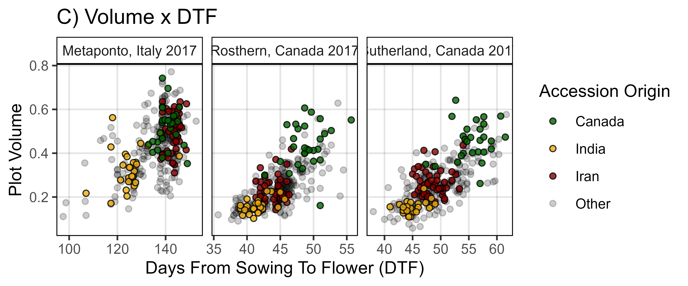

---

# Figure 05 - Growth Curves

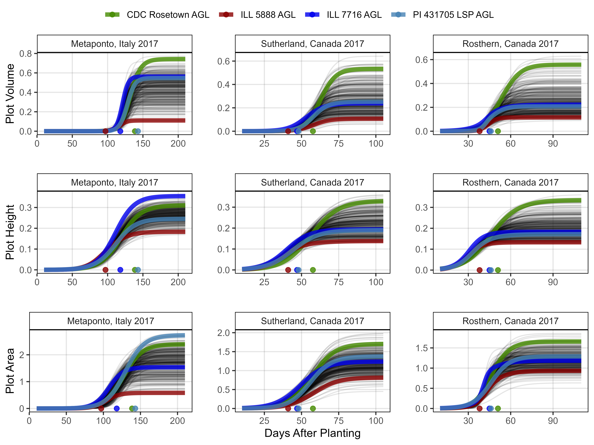

```{r}
ggGrowthCurve <- function(xpm, xF, myTitle = NULL,
                          ylab = "Predicted Values", xlab = "Days After Planting",
                          myEntries = c(9, 35, 73, 94, 113),
                          myColors = c("darkgreen", "darkgoldenrod3", "darkred",
                                       "steelblue4", "darkslategray"), 
                          linesize = 2,
                          plotAll = T) {
  #
  xF <- xF %>% filter(Trait == "DTF", Entry %in% myEntries) %>%
    group_by(Name, Entry) %>% summarise(Value = mean(Value, na.rm = T))
  if(sum(colnames(xpm)=="Expt")==0) { xpm <- xpm %>% mutate(Expt = myTitle) }
  xpe <- xpm %>% filter(Entry %in% myEntries) %>%
    mutate(Entry = factor(Entry, levels = myEntries))
  mp <- ggplot(xpm, aes(x = DAP, y = Predicted.Values, group = Entry, key1 = Name))
  myymax <- max(xpm$Predicted.Values, na.rm = T)
  if(plotAll == T) { mp <- mp + geom_line(alpha = 0.1) }
  mp <- mp +
    geom_line(data = xpe, size = linesize, alpha = 0.8,
              aes(color = Name)) +
    geom_point(data = xF, y = 0, size = 2, alpha = 0.8,
               aes(x = Value, color = Name)) +
    facet_grid(. ~ Expt, scales = "free_x", space = "free_x") +
    scale_color_manual(name = NULL, values = myColors) +
    theme_AGL + ylim(c(0,myymax)) +
    labs(x = xlab, y = ylab)
  mp
}
```

```{r}
myEntries = c(19, 94, 107, 252)
myColors = myColors_Cluster[myPCA$Cluster[myPCA$Entry%in%myEntries]] 
#
mp1 <- ggGrowthCurve(xpm = it17_gc.v[[4]], xF = it17_f, 
                     ylab = "Plot Volume", xlab = "",
                     myEntries = myEntries, myColors = myColors,
                     myTitle = "Metaponto, Italy 2017")
mp2 <- ggGrowthCurve(xpm = it17_gc.h[[4]], xF = it17_f, 
                     ylab = "Plot Height", xlab = "",
                     myEntries = myEntries, myColors = myColors,
                     myTitle = "Metaponto, Italy 2017")
mp3 <- ggGrowthCurve(xpm = it17_gc.a[[4]], xF = it17_f, 
                     ylab = "Plot Area",  xlab = "",
                     myEntries = myEntries, myColors = myColors,
                     myTitle = "Metaponto, Italy 2017")
#
mp4 <- ggGrowthCurve(xpm = su17_gc.v[[4]], xF = su17_f, 
                     ylab = "", xlab = "",
                     myEntries = myEntries, myColors = myColors,
                     myTitle = "Sutherland, Canada 2017")
mp5 <- ggGrowthCurve(xpm = su17_gc.h[[4]], xF = su17_f, 
                     ylab = "",  xlab = "",
                     myEntries = myEntries, myColors = myColors,
                     myTitle = "Sutherland, Canada 2017")
mp6 <- ggGrowthCurve(xpm = su17_gc.a[[4]], xF = su17_f, 
                     ylab = "",  xlab = "Days After Planting",
                     myEntries = myEntries, myColors = myColors,
                     myTitle = "Sutherland, Canada 2017")
#
mp7 <- ggGrowthCurve(xpm = ro17_gc.v[[4]], xF = ro17_f, 
                     ylab = "", xlab = "",
                     myEntries = myEntries, myColors = myColors,
                     myTitle = "Rosthern, Canada 2017")
mp8 <- ggGrowthCurve(xpm = ro17_gc.h[[4]], xF = ro17_f,
                     ylab = "", xlab = "",
                     myEntries = myEntries, myColors = myColors,
                     myTitle = "Rosthern, Canada 2017")
mp9 <- ggGrowthCurve(xpm = ro17_gc.a[[4]], xF = ro17_f, 
                     ylab = "", xlab = "", 
                     myEntries = myEntries, myColors = myColors,
                     myTitle = "Rosthern, Canada 2017")
mp <- ggarrange(mp1, mp4, mp7, mp2, mp5, mp8, mp3, mp6, mp9, ncol = 3, nrow = 3, common.legend = T)
ggsave("Figure_05.png", mp, width = 8, height = 6, dpi = 600, bg = "white")
mp <- ggarrange(mp2, mp5, mp3, mp6, ncol = 2, nrow = 2, common.legend = T)
ggsave("Additional/GrowthCurves/07_GrowthCurves_1.png", mp, width = 8, height = 6, dpi = 600, bg = "white")
```

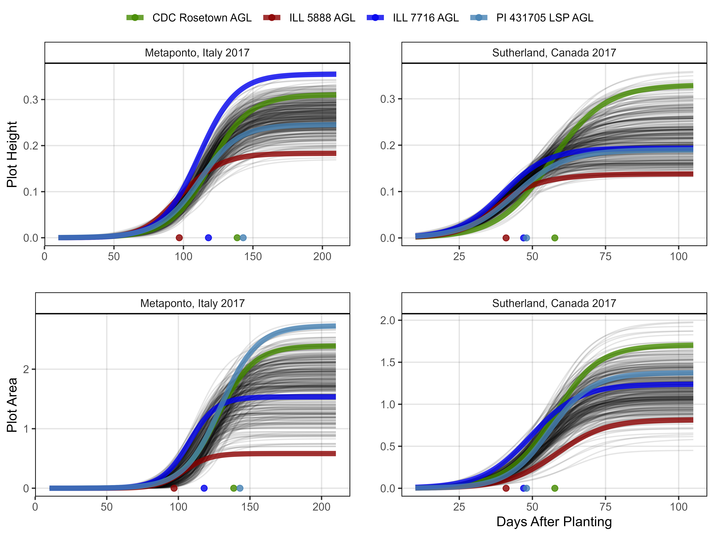

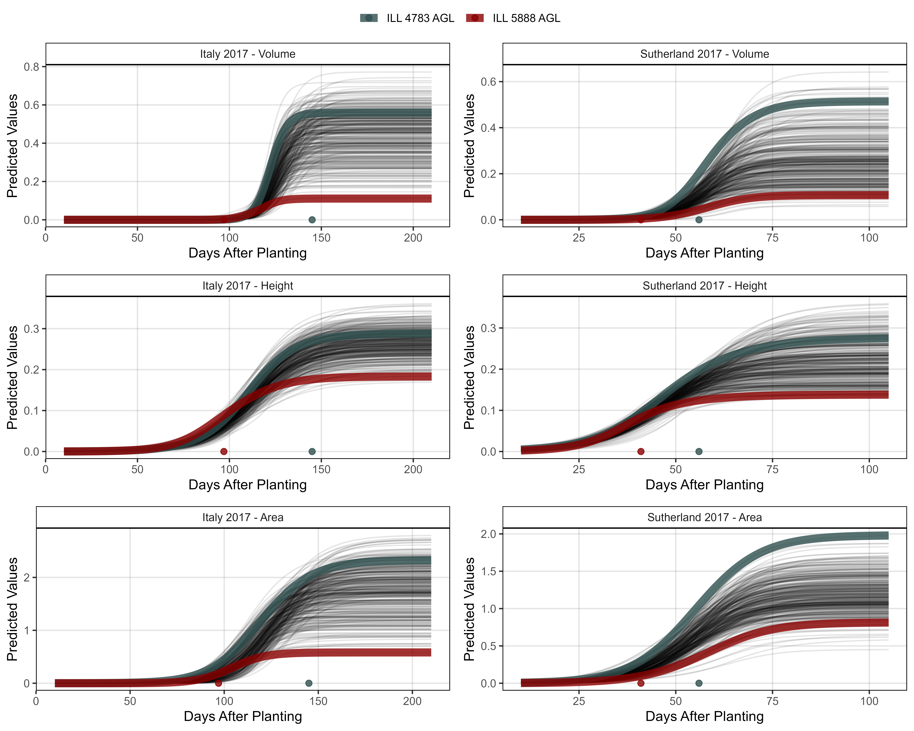

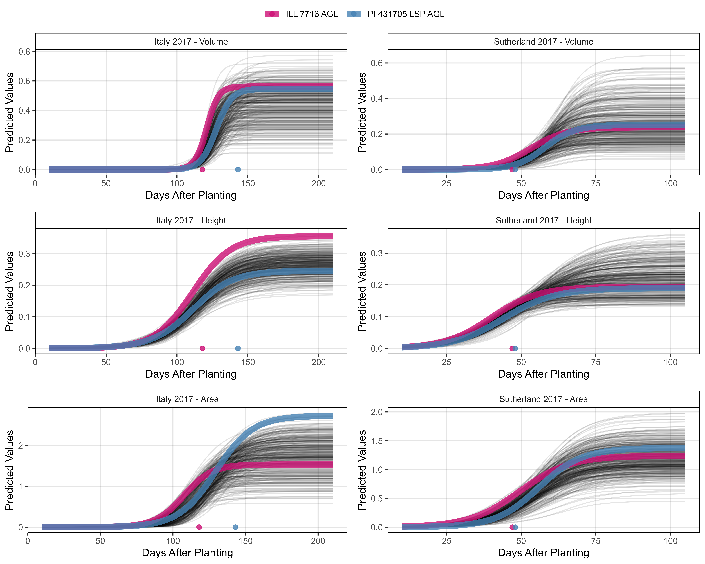

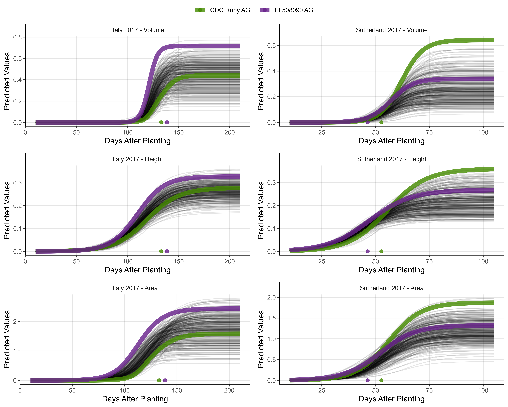

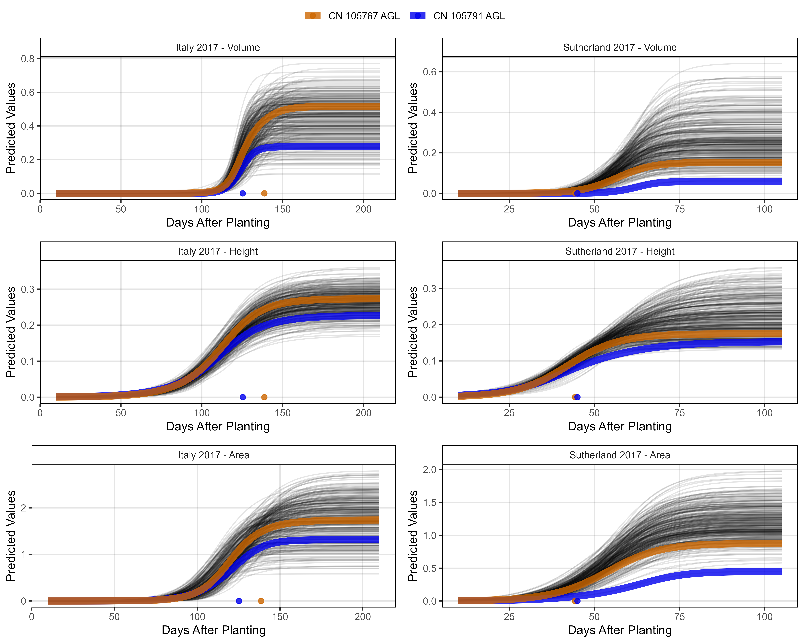

```{r}
myEntries = c(83, 94)
myColors = myColors_Cluster[c(7,1)] 
#
mp1 <- ggGrowthCurve(xpm = it17_gc.v[[4]], xF = it17_f, 
                     myEntries = myEntries, myColors = myColors,
                     myTitle = "Italy 2017 - Volume", linesize = 3)
mp2 <- ggGrowthCurve(xpm = it17_gc.h[[4]], xF = it17_f, 
                     myEntries = myEntries, myColors = myColors,
                     myTitle = "Italy 2017 - Height", linesize = 3)
mp3 <- ggGrowthCurve(xpm = it17_gc.a[[4]], xF = it17_f, 
                     myEntries = myEntries, myColors = myColors,
                     myTitle = "Italy 2017 - Area", linesize = 3)
#
mp4 <- ggGrowthCurve(xpm = su17_gc.v[[4]], xF = su17_f, 
                     myEntries = myEntries, myColors = myColors,
                     myTitle = "Sutherland 2017 - Volume", linesize = 3)
mp5 <- ggGrowthCurve(xpm = su17_gc.h[[4]], xF = su17_f, 
                     myEntries = myEntries, myColors = myColors,
                     myTitle = "Sutherland 2017 - Height", linesize = 3)
mp6 <- ggGrowthCurve(xpm = su17_gc.a[[4]], xF = su17_f, 
                     myEntries = myEntries, myColors = myColors,
                     myTitle = "Sutherland 2017 - Area", linesize = 3)
mpA <- ggarrange(mp1, mp4, mp2, mp5, mp3, mp6, ncol = 2, nrow = 3, common.legend = T)
ggsave("Additional/GrowthCurves/07_GrowthCurves_A.png", 
       mpA, width = 10, height = 8, dpi = 600, bg = "white")
#
myEntries = c(107, 252 )
myColors = myColors_Cluster[c(4,5)]
#
mp1 <- ggGrowthCurve(xpm = it17_gc.v[[4]], xF = it17_f, 
                     myEntries = myEntries, myColors = myColors,
                     myTitle = "Italy 2017 - Volume", linesize = 3)
mp2 <- ggGrowthCurve(xpm = it17_gc.h[[4]], xF = it17_f, 
                     myEntries = myEntries, myColors = myColors,
                     myTitle = "Italy 2017 - Height", linesize = 3)
mp3 <- ggGrowthCurve(xpm = it17_gc.a[[4]], xF = it17_f, 
                     myEntries = myEntries, myColors = myColors,
                     myTitle = "Italy 2017 - Area", linesize = 3)
#
mp4 <- ggGrowthCurve(xpm = su17_gc.v[[4]], xF = su17_f, 
                     myEntries = myEntries, myColors = myColors,
                     myTitle = "Sutherland 2017 - Volume", linesize = 3)
mp5 <- ggGrowthCurve(xpm = su17_gc.h[[4]], xF = su17_f, 
                     myEntries = myEntries, myColors = myColors,
                     myTitle = "Sutherland 2017 - Height", linesize = 3)
mp6 <- ggGrowthCurve(xpm = su17_gc.a[[4]], xF = su17_f, 
                     myEntries = myEntries, myColors = myColors,
                     myTitle = "Sutherland 2017 - Area", linesize = 3)
mpB <- ggarrange(mp1, mp4, mp2, mp5, mp3, mp6, ncol = 2, nrow = 3, common.legend = T)
ggsave("Additional/GrowthCurves/07_GrowthCurves_B.png", 
       mpB, width = 10, height = 8, dpi = 600, bg = "white")
#
myEntries = c(22, 311)
myColors = myColors_Cluster[c(8,6)]
#
mp1 <- ggGrowthCurve(xpm = it17_gc.v[[4]], xF = it17_f, 
                     myEntries = myEntries, myColors = myColors,
                     myTitle = "Italy 2017 - Volume", linesize = 3)
mp2 <- ggGrowthCurve(xpm = it17_gc.h[[4]], xF = it17_f, 
                     myEntries = myEntries, myColors = myColors,
                     myTitle = "Italy 2017 - Height", linesize = 3)
mp3 <- ggGrowthCurve(xpm = it17_gc.a[[4]], xF = it17_f, 
                     myEntries = myEntries, myColors = myColors,
                     myTitle = "Italy 2017 - Area", linesize = 3)
#
mp4 <- ggGrowthCurve(xpm = su17_gc.v[[4]], xF = su17_f, 
                     myEntries = myEntries, myColors = myColors,
                     myTitle = "Sutherland 2017 - Volume", linesize = 3)
mp5 <- ggGrowthCurve(xpm = su17_gc.h[[4]], xF = su17_f, 
                     myEntries = myEntries, myColors = myColors,
                     myTitle = "Sutherland 2017 - Height", linesize = 3)
mp6 <- ggGrowthCurve(xpm = su17_gc.a[[4]], xF = su17_f, 
                     myEntries = myEntries, myColors = myColors,
                     myTitle = "Sutherland 2017 - Area", linesize = 3)
mpC <- ggarrange(mp1, mp4, mp2, mp5, mp3, mp6, ncol = 2, nrow = 3, common.legend = T)
ggsave("Additional/GrowthCurves/07_GrowthCurves_C.png", mpC, width = 10, height = 8, dpi = 600, bg = "white")
#
myEntries = c(33, 30)
myColors = myColors_Cluster[c(2,3)] 
#
mp1 <- ggGrowthCurve(xpm = it17_gc.v[[4]], xF = it17_f, 
                     myEntries = myEntries, myColors = myColors,
                     myTitle = "Italy 2017 - Volume", linesize = 3)
mp2 <- ggGrowthCurve(xpm = it17_gc.h[[4]], xF = it17_f, 
                     myEntries = myEntries, myColors = myColors,
                     myTitle = "Italy 2017 - Height", linesize = 3)
mp3 <- ggGrowthCurve(xpm = it17_gc.a[[4]], xF = it17_f, 
                     myEntries = myEntries, myColors = myColors,
                     myTitle = "Italy 2017 - Area", linesize = 3)
#
mp4 <- ggGrowthCurve(xpm = su17_gc.v[[4]], xF = su17_f, 
                     myEntries = myEntries, myColors = myColors,
                     myTitle = "Sutherland 2017 - Volume", linesize = 3)
mp5 <- ggGrowthCurve(xpm = su17_gc.h[[4]], xF = su17_f, 
                     myEntries = myEntries, myColors = myColors,
                     myTitle = "Sutherland 2017 - Height", linesize = 3)
mp6 <- ggGrowthCurve(xpm = su17_gc.a[[4]], xF = su17_f, 
                     myEntries = myEntries, myColors = myColors,
                     myTitle = "Sutherland 2017 - Area", linesize = 3)
mpD <- ggarrange(mp1, mp4, mp2, mp5, mp3, mp6, ncol = 2, nrow = 3, common.legend = T)
ggsave("Additional/GrowthCurves/07_GrowthCurves_D.png", 
       mpD, width = 10, height = 8, dpi = 600, bg = "white")
```

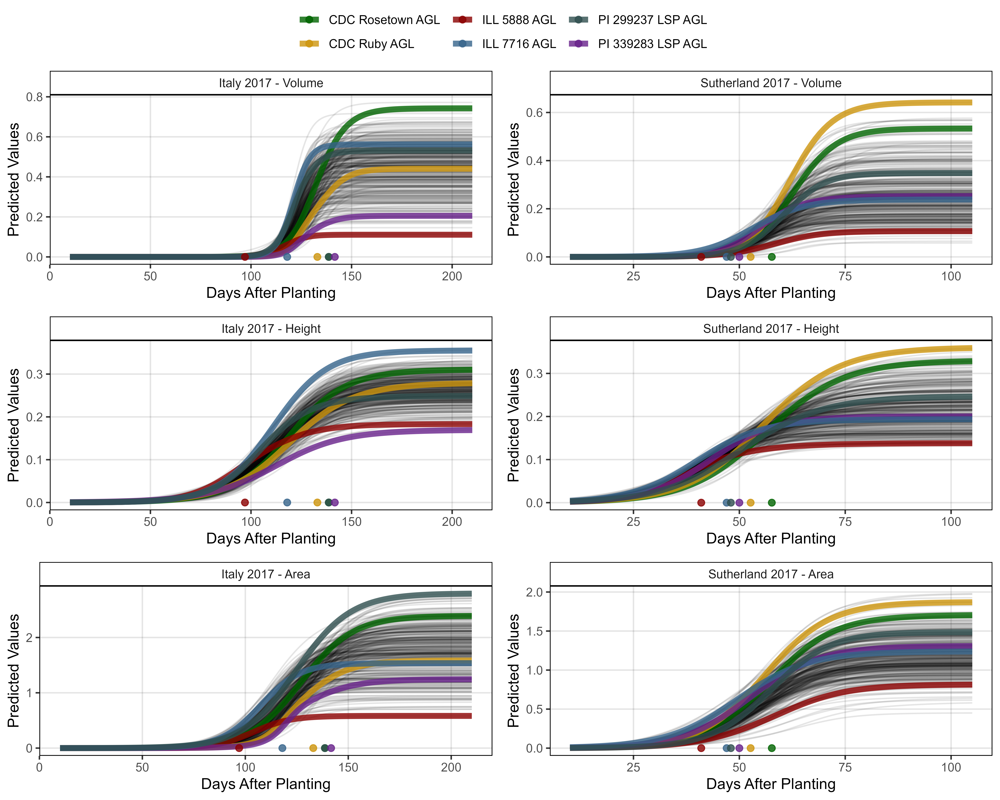

```{r}
#
myEntries = c(19, 22, 94, 215, 107, 190)
myColors = c("darkgreen", "darkgoldenrod3", "darkred", 
             "steelblue4", "darkslategray", "darkorchid4")
#
mp1 <- ggGrowthCurve(xpm = it17_gc.v[[4]], xF = it17_f, 
                     myEntries = myEntries, myColors = myColors,
                     myTitle = "Italy 2017 - Volume")
mp2 <- ggGrowthCurve(xpm = it17_gc.h[[4]], xF = it17_f, 
                     myEntries = myEntries, myColors = myColors,
                     myTitle = "Italy 2017 - Height")
mp3 <- ggGrowthCurve(xpm = it17_gc.a[[4]], xF = it17_f, 
                     myEntries = myEntries, myColors = myColors,
                     myTitle = "Italy 2017 - Area")
#
mp4 <- ggGrowthCurve(xpm = su17_gc.v[[4]], xF = su17_f, 
                     myEntries = myEntries, myColors = myColors,
                     myTitle = "Sutherland 2017 - Volume")
mp5 <- ggGrowthCurve(xpm = su17_gc.h[[4]], xF = su17_f, 
                     myEntries = myEntries, myColors = myColors,
                     myTitle = "Sutherland 2017 - Height")
mp6 <- ggGrowthCurve(xpm = su17_gc.a[[4]], xF = su17_f, 
                     myEntries = myEntries, myColors = myColors,
                     myTitle = "Sutherland 2017 - Area")
mp <- ggarrange(mp1, mp4, mp2, mp5, mp3, mp6, ncol = 2, nrow = 3, common.legend = T)
ggsave("Additional/GrowthCurves/08_GrowthCurves.png", 
       mp, width = 10, height = 8, dpi = 600, bg = "white")
```

https://github.com/derekmichaelwright/AGILE_LDP_UAV/Additional/GrowthCurves/09_GrowthCurves.pdf

```{r}
#
pdf("Additional/GrowthCurves/09_GrowthCurves.pdf", width = 8, height = 8)
# i<-1
for (i in myPCA %>% arrange(Cluster) %>% pull(Entry) ) {
  #
  myColors = myColors_Cluster[myPCA$Cluster[myPCA$Entry==i]]#"darkred"
  #
  mp1 <- ggGrowthCurve(xpm = it17_gc.v[[4]], xF = it17_f, 
                       myEntries = i, myTitle = "It17 - Plot Volume",
                       myColors = myColors, linesize = 3, plotAll = F)
  mp2 <- ggGrowthCurve(xpm = it17_gc.h[[4]], xF = it17_f, 
                       myEntries = i, myTitle = "It17 - Canopy Height",
                       myColors = myColors, linesize = 3, plotAll = F)
  mp3 <- ggGrowthCurve(xpm = it17_gc.a[[4]], xF = it17_f, 
                       myEntries = i, myTitle = "It17 - Plot Area",
                       myColors = myColors, linesize = 3, plotAll = F)
  #
  mp4 <- ggGrowthCurve(xpm = su17_gc.v[[4]], xF = su17_f, 
                       myEntries = i, myTitle = "Su17 - Plot Volume",
                       myColors = myColors, linesize = 3, plotAll = F)
  mp5 <- ggGrowthCurve(xpm = su17_gc.h[[4]], xF = su17_f, 
                       myEntries = i, myTitle = "Su17 - Canopy Height",
                       myColors = myColors, linesize = 3, plotAll = F)
  mp6 <- ggGrowthCurve(xpm = su17_gc.a[[4]], xF = su17_f, 
                       myEntries = i, myTitle = "Su17 - Plot Area",
                       myColors = myColors, linesize = 3, plotAll = F)
  #
  mp7 <- ggGrowthCurve(xpm = ro17_gc.v[[4]], xF = ro17_f, 
                       myEntries = i, myTitle = "Ro17 - Plot Volume",
                       myColors = myColors, linesize = 3, plotAll = F)
  mp8 <- ggGrowthCurve(xpm = ro17_gc.h[[4]], xF = ro17_f, 
                       myEntries = i, myTitle = "Ro17 - Canopy Height",
                       myColors = myColors, linesize = 3, plotAll = F)
  mp9 <- ggGrowthCurve(xpm = ro17_gc.a[[4]], xF = ro17_f, 
                       myEntries = i, myTitle = "Ro17 - Plot Area",
                       myColors = myColors, linesize = 3, plotAll = F)
  mp <- ggarrange(mp1, mp4, mp7, mp2, mp5, mp8, mp3, mp6, mp9, 
                  ncol = 3, nrow = 3, common.legend = T)
  print(mp)
}
dev.off()
#dev.set(dev.next())
```

---

# Figure 07 - EnvChange

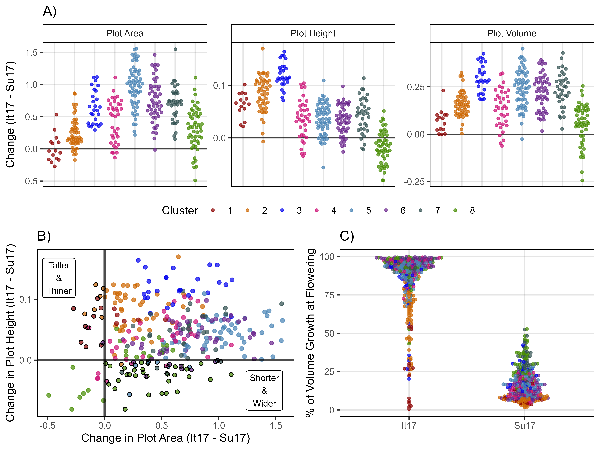

```{r}
y1 <- read.csv("https://raw.githubusercontent.com/derekmichaelwright/AGILE_LDP_Phenology/master/data/data_tb_pc_raw.csv") %>%
    mutate(Expt = gsub("Metaponto, |Canada |,", "", Expt)) %>%
  filter(ExptShort %in% c("It17","Su16","Su17","Su18","Ro16","Ro17")) %>%
  select(Plot, Tb, Pc)
y2 <- read.csv("https://raw.githubusercontent.com/derekmichaelwright/AGILE_LDP_Phenology/master/data/data_pca_results.csv") %>%
  select(Entry, Name, Origin, Cluster, PC1, PC2, PC3, PC4, PC5, PC6)
#
y3 <- read.csv("https://raw.githubusercontent.com/derekmichaelwright/AGILE_LDP_Phenology/master/data/model_t%2Bp_coefs.csv") %>%
  select(Entry, Name, a,b,c)
#
x1 <- left_join(it17_gc.a[[2]] %>% select(Plot, Name, Expt, Area=k),
                it17_gc.h[[2]] %>% select(Plot, Height=k), by = "Plot") %>%
  left_join(it17_gc.v[[2]] %>% select(Plot, Volume=k))
x2 <- left_join(ro17_gc.a[[2]] %>% select(Plot, Name, Expt, Area=k),
                ro17_gc.h[[2]] %>% select(Plot, Height=k), by = "Plot") %>%
  left_join(ro17_gc.v[[2]] %>% select(Plot, Volume=k))
x3 <- left_join(su17_gc.a[[2]] %>% select(Plot, Name, Expt, Area=k),
                su17_gc.h[[2]] %>% select(Plot, Height=k), by = "Plot") %>%
  left_join(su17_gc.v[[2]] %>% select(Plot, Volume=k))
xx <- bind_rows(x1, x2, x3) %>%
  left_join(y1, by = "Plot") %>%
  left_join(y3, by = "Name") %>%
  left_join(select(myPCA, Name, Cluster), by = "Name") %>%
  select(Plot, Entry, Name, Expt, everything()) %>%
  group_by(Entry, Name, Expt, Cluster) %>%
  summarise_at(vars(Area, Height, Volume, Tb, Pc, a, b, c), funs(mean), na.rm = T)
#
yy <- xx %>% select(-Tb, -Pc) %>%
  gather(Trait, Value, Area, Height, Volume) %>% 
  mutate(Trait = paste("Plot", Trait)) %>%
  spread(Expt, Value) %>%
  mutate(EnvChange = `Italy 2017` - `Sutherland 2017`)
mp1 <- ggplot(yy, aes(x = Cluster, y = EnvChange, color = Cluster)) +
  geom_hline(yintercept = 0, alpha = 0.7) +
  geom_quasirandom(cex = 1, alpha = 0.7) + 
  theme_AGL +
  theme(legend.position = "bottom",
        legend.margin=margin(c(0,0,0,0)),
        axis.text.x = element_blank(),
        axis.ticks.x = element_blank()) +
  facet_wrap(. ~ Trait, scales = "free_y") +
  scale_color_manual(values = myColors_Cluster) +
  guides(color = guide_legend(nrow = 1)) +
  labs(title = "A)", y = "Change (It17 - Su17)", x = NULL)
#
yy <- yy %>% select(Name, Cluster, Trait, b,c, EnvChange) %>%
  spread(Trait, EnvChange)
#
yy <- yy %>% left_join(
  myPCAinput %>% rownames_to_column("Name") %>% 
    select(Name, It17_v.perc.DTF, Su17_v.perc.DTF), by = "Name" ) %>%
  mutate(v.perc.DTF = It17_v.perc.DTF - Su17_v.perc.DTF,
         Group = ifelse(`Plot Area` > 0 | `Plot Height` > 0, "abnormal", "normal"),
         Group = ifelse(`Plot Area` > 0 & `Plot Height` > 0, "normal", Group))
#
mp2 <- ggplot(yy) +
  geom_label(x = -0.4, y = 0.135, size = 3, label = "Taller\n&\nThiner") +
  geom_label(x = 1.4, y = -0.05, size = 3, label = "Shorter\n&\nWider") +
  geom_point(aes(x = `Plot Area`, y = `Plot Height`, color = Cluster), 
             alpha = 0.7) + 
  geom_point(data = yy %>% filter(Group == "abnormal"),
             aes(x = `Plot Area`, y = `Plot Height`), pch = 21) +
  geom_vline(xintercept = 0, size = 1, alpha = 0.7) +
  geom_hline(yintercept = 0, size = 1, alpha = 0.7) +
  scale_color_manual(values = myColors_Cluster) +
  scale_size_continuous(range = c(0.5, 3)) +
  theme_AGL +
  theme(legend.position = "none",
        panel.grid.major = element_blank(),
        panel.grid.minor = element_blank()) +
  labs(title = "B)",
       x = "Change in Plot Area (It17 - Su17)",
       y = "Change in Plot Height (It17 - Su17)")
#
y2 <- yy %>% ungroup() %>%
  select(Name, Cluster, It17=It17_v.perc.DTF, Su17=Su17_v.perc.DTF) %>%
  gather(Expt, Value, 3:4)
# 
mp3 <- ggplot(y2, aes(x = Expt, y = Value, color = Cluster)) +
  geom_beeswarm(cex = 1, alpha = 0.7, size = 1) +
  scale_color_manual(values = myColors_Cluster) +
  theme_AGL +
  theme(legend.position = "none") +
  labs(title = "C)", y = "% of Volume Growth at Flowering", x = "")
mp <- ggarrange(mp1, ggarrange(mp2, mp3, ncol = 2, nrow = 1), ncol = 1, nrow = 2, align = "h")
ggsave("Figure_07.png", mp, width = 8, height = 6, dpi = 600, bg = "white")
saveWidget(ggplotly(mp1), file="Additional/DroneData/Figure_07_A.html")
saveWidget(ggplotly(mp2), file="Additional/DroneData/Figure_07_B.html")
saveWidget(ggplotly(mp3), file="Additional/DroneData/Figure_07_C.html")
#override.aes = list(size = 3, alpha = 1)
```

---

# Additional Figure 01 - Harvest Index

```{r}
# Prep data
x1 <- bind_rows(it17_f %>% filter(Trait == "Seed.Mass") %>%
                  select(Plot, Expt, Entry, Name, Seed.Mass=Value),
                su17_f %>% filter(Trait == "Seed.Mass") %>%
                  select(Plot, Expt, Entry, Name, Seed.Mass=Value) )
x2 <- bind_rows(it17_gc.v[[2]] %>% select(Plot, Expt, Entry, Name, Volume=k),
                su17_gc.v[[2]] %>% select(Plot, Expt, Entry, Name, Volume=k) )
xx <- full_join(x1, x2, by = c("Plot", "Expt", "Entry", "Name")) %>%
  left_join(select(myPCA, Entry, Cluster), by = "Entry") %>%
  mutate(Harvest.Index = Seed.Mass / Volume) %>%
  group_by(Expt, Entry, Name, Cluster) %>%
  summarise(Harvest.Index = mean(Harvest.Index, na.rm = T),
            Seed.Mass = mean(Seed.Mass, na.rm = T))
#
mp1 <- ggplot(xx, aes(x = Cluster, y = Harvest.Index, color = Cluster, size = Seed.Mass)) +
  geom_quasirandom(alpha = 0.7) +
  facet_grid(. ~ Expt) +
  scale_color_manual(values = myColors_Cluster) +
  scale_size_continuous(range = c(0.2,4)) +
  theme_AGL
#
mp2 <- ggplot(xx, aes(x = Expt, y = Harvest.Index, color = Cluster, group = Entry)) +
  geom_line(alpha = 0.2) +
  geom_point(aes(size = Seed.Mass), alpha = 0.7) +
  facet_grid(. ~ Cluster) +
  scale_color_manual(values = myColors_Cluster) +
  scale_size_continuous(range = c(0.2,4)) +
  theme_AGL +
  theme(axis.text.x = element_text(angle = 45, hjust = 1))
#
xx <- xx %>% select(-Seed.Mass) %>%
  spread(Expt, Harvest.Index) %>%
  mutate(Diff = `Sutherland 2017` - `Italy 2017`)
mp3 <- ggplot(xx, aes(x = Cluster, y = Diff, color = Cluster)) +
  geom_quasirandom() +
  scale_color_manual(values = myColors_Cluster) +
  theme_AGL
mp <- ggarrange(mp1, mp2, mp3, ncol = 1, common.legend = T, legend = "right")
ggsave("Additional/DroneData/Additional_Figure_01.png", 
       mp, width = 8, height = 8, dpi = 600, bg = "white")
```

---

# Prepare Data for GWAS

## Raw Drone Data

```{r}
# Italy 2017
myT1 <- c("crop_volume_m3_excess.green.based",
          "crop_area_m2_excess.green.based",
          "mean_crop_height_m_excess.green.based")
myT2 <- c("Plot.Volume", "Plot.Area", "Plot.Height")
xx <- it17_d %>% 
  mutate(DAP = plyr::mapvalues(DAP, c(93, 101, 119, 133, 163), 
                               c(94, 100, 118, 132, 164)),
         DAP = plyr::mapvalues(DAP, c(94, 100, 118, 132, 164),
                               c("094","100","118","132","164"))) %>%
  filter(Trait %in% myT1, DAP %in% c("094","100","118","132","164")) %>%
  group_by(Name, DAP, Trait) %>%
  summarise(Value_f = mean(Value_f, na.rm = T)) %>%
  ungroup() %>%
  mutate(Trait = plyr::mapvalues(Trait, myT1, myT2),
         Trait = paste0("It17_",Trait, ".d", DAP)) %>%
  select(-DAP) %>%
  spread(Trait, Value_f) %>%
  mutate(Name = gsub(" ", "_", Name),
         Name = gsub("-", "\\.", Name),
         Name = plyr::mapvalues(Name, "3156.11_AGL", "X3156.11_AGL"))
yy <- xx %>% gather(Trait, Value, 2:ncol(.)) %>% filter(!is.na(Value)) %>% 
  group_by(Trait) %>% summarise(n = n())
write.csv(xx, "Data_GWAS/myY_it17_d.csv", row.names = F)
# Rosthern 2017
myT1 <- c("crop_volume_m3_blue.ndvi.based",
          "crop_area_m2_blue.ndvi.based",
          "mean_crop_height_m_blue.ndvi.based")
xx <- ro17_d %>% 
  filter(Trait %in% myT1, DAP %in% c(24,32,39,40,54,61,67,74,80,89,95)) %>%
  mutate(DAP = paste0("0", DAP)) %>%
  group_by(Name, DAP, Trait) %>%
  summarise(Value_f = mean(Value_f, na.rm = T)) %>%
  ungroup() %>%
  mutate(Trait = plyr::mapvalues(Trait, myT1, myT2),
         Trait = paste0("Ro17_", Trait, ".d", DAP)) %>%
  select(-DAP) %>%
  spread(Trait, Value_f) %>%
  mutate(Name = gsub(" ", "_", Name),
         Name = gsub("-", "\\.", Name),
         Name = plyr::mapvalues(Name, "3156.11_AGL", "X3156.11_AGL"))
xx[is.na(xx)] <- NA
yy <- xx %>% gather(Trait, Value, 2:ncol(.)) %>% filter(!is.na(Value)) %>% 
  group_by(Trait) %>% summarise(n = n())
xx <- xx %>% 
  select(-Ro17_Plot.Area.d024,-Ro17_Plot.Area.d032, -Ro17_Plot.Area.d039, 
         -Ro17_Plot.Volume.d024, -Ro17_Plot.Volume.d032) 
write.csv(xx, "Data_GWAS/myY_Ro17_d.csv", row.names = F)
#
myT1 <- c("crop_volume_m3_blue.ndvi.based",
          "crop_area_m2_blue.ndvi.based",
          "mean_crop_height_m_blue.ndvi.based")
#unique(su17_d$DAP)
#unique(su17_d$Trait)
xx <- su17_d %>%
  filter(Trait %in% myT1, DAP %in% c(32,40,46,51,57,61,68,72,75,77,83)) %>% #39,
  mutate(DAP = paste0("0", DAP)) %>%
  group_by(Name, DAP, Trait) %>%
  summarise(Value_f = mean(Value_f, na.rm = T)) %>%
  ungroup() %>%
  mutate(Trait = plyr::mapvalues(Trait, myT1, myT2),
         Trait = paste0("Su17_", Trait, ".d", DAP)) %>%
  select(-DAP) %>%
  spread(Trait, Value_f) %>%
  mutate(Name = gsub(" ", "_", Name),
         Name = gsub("-", "\\.", Name),
         Name = plyr::mapvalues(Name, "3156.11_AGL", "X3156.11_AGL"))
xx[is.na(xx)] <- NA
yy <- xx %>% gather(Trait, Value, 2:ncol(.)) %>% filter(!is.na(Value)) %>% 
  group_by(Trait) %>% summarise(n = n())
xx <- xx %>% select(-Su17_Plot.Area.d032, -Su17_Plot.Volume.d032) 
write.csv(xx, "Data_GWAS/myY_Su17_d.csv", row.names = F)
#
myT1 <- c("crop_volume_m3_excess.green.based",
          "crop_area_m2_excess.green.based",
          "mean_crop_height_m_excess.green.based")
xx <- su18_d %>%
  filter(Trait %in% myT1, DAP %in% c(42,55,58,61,65,68,72,76,79,86)) %>%
  mutate(DAP = paste0("0", DAP)) %>%
  group_by(Name, DAP, Trait) %>%
  summarise(Value_f = mean(Value_f, na.rm = T)) %>%
  ungroup() %>%
  mutate(Trait = plyr::mapvalues(Trait, myT1, myT2),
         Trait = paste0("Su18_",Trait, ".d", DAP)) %>%
  select(-DAP) %>%
  spread(Trait, Value_f) %>%
  mutate(Name = gsub(" ", "_", Name),
         Name = gsub("-", "\\.", Name),
         Name = plyr::mapvalues(Name, "3156.11_AGL", "X3156.11_AGL"))
xx[is.na(xx)] <- NA
sum(is.na(xx))
yy <- xx %>% gather(Trait, Value, 2:ncol(.)) %>% filter(!is.na(Value)) %>% 
  group_by(Trait) %>% summarise(n = n())
xx <- xx %>% select(-Su18_Plot.Volume.d055, -Su18_Plot.Volume.d058, -Su18_Plot.Height.d058)
write.csv(xx, "Data_GWAS/myY_Su18_d.csv", row.names = F)
```

## Growth Curve Data

```{r}
# Drone data Growth Curves
x1 <- it17_gc.v[[2]] %>% mutate(Expt = "It17_gc.v")
x2 <- it17_gc.h[[2]] %>% mutate(Expt = "It17_gc.h")
x3 <- it17_gc.a[[2]] %>% mutate(Expt = "It17_gc.a")
xx <- bind_rows(x1,x2,x3) %>%
  select(Name, Expt, r, b, g.r, g.b, k,
         x.min, x.mid, x.max, x.d, x.gen, auc.l, auc.e) %>%
  gather(Trait, Value, 3:ncol(.)) %>%
  group_by(Name, Expt, Trait) %>%
  summarise(Value = mean(Value, na.rm = T)) %>%
  ungroup() %>% mutate(Trait = paste(Expt, Trait, sep = ".")) %>%
  select(-Expt) %>% spread(Trait, Value) %>%
  mutate(Name = gsub(" ", "_", Name),
         Name = gsub("-", "\\.", Name),
         Name = plyr::mapvalues(Name, "3156.11_AGL", "X3156.11_AGL"))
write.csv(xx, "Data_GWAS/myY_It17_gc.csv", row.names = F)
#
x1 <- ro17_gc.v[[2]] %>% mutate(Expt = "Ro17_gc.v")
x2 <- ro17_gc.h[[2]] %>% mutate(Expt = "Ro17_gc.h")
x3 <- ro17_gc.a[[2]] %>% mutate(Expt = "Ro17_gc.a")
xx <- bind_rows(x1,x2,x3) %>%
  select(Name, Expt, r, b, g.r, g.b, k,  
         x.min, x.mid, x.max, x.d, x.gen, auc.l, auc.e ) %>%
  gather(Trait, Value, 3:ncol(.)) %>%
  group_by(Name, Expt, Trait) %>%
  summarise(Value = mean(Value, na.rm = T)) %>%
  ungroup() %>% mutate(Trait = paste(Expt, Trait, sep = ".")) %>%
  select(-Expt) %>% spread(Trait, Value) %>%
  mutate(Name = gsub(" ", "_", Name),
         Name = gsub("-", "\\.", Name),
         Name = plyr::mapvalues(Name, "3156.11_AGL", "X3156.11_AGL"))
write.csv(xx, "Data_GWAS/myY_Ro17_gc.csv", row.names = F)
#
x1 <- su17_gc.v[[2]] %>% mutate(Expt = "Su17_gc.v")
x2 <- su17_gc.h[[2]] %>% mutate(Expt = "Su17_gc.h")
x3 <- su17_gc.a[[2]] %>% mutate(Expt = "Su17_gc.a")
xx <- bind_rows(x1,x2,x3) %>%
  select(Name, Expt, r, b, g.r, g.b, k, 
         x.min, x.mid, x.max, x.d, x.gen, auc.l, auc.e) %>%
  gather(Trait, Value, 3:ncol(.)) %>%
  group_by(Name, Expt, Trait) %>%
  summarise(Value = mean(Value, na.rm = T)) %>%
  ungroup() %>% mutate(Trait = paste(Expt, Trait, sep = ".")) %>%
  select(-Expt) %>% spread(Trait, Value) %>%
  mutate(Name = gsub(" ", "_", Name),
         Name = gsub("-", "\\.", Name),
         Name = plyr::mapvalues(Name, "3156.11_AGL", "X3156.11_AGL"))
write.csv(xx, "Data_GWAS/myY_Su17_gc.csv", row.names = F)
```

```{r}
# Italy 2017
x1 <- it17_gc.a[[2]] %>% 
  select(Plot, Entry, Name) %>%
  left_join(phenolGrowth(xd = it17_gc.a[[2]], xf = it17_f), by = "Plot") %>%
  mutate(Expt = "It17_", Prefix = "gc.a.")
x2 <- it17_gc.h[[2]] %>% 
  select(Plot, Entry, Name) %>%
  left_join(phenolGrowth(xd = it17_gc.h[[2]], xf = it17_f), by = "Plot")  %>%
  mutate(Expt = "It17_", Prefix = "gc.h.")
x3 <- it17_gc.v[[2]] %>% 
  select(Plot, Entry, Name) %>%
  left_join(phenolGrowth(xd = it17_gc.v[[2]], xf = it17_f), by = "Plot")  %>%
  mutate(Expt = "It17_", Prefix = "gc.v.")
xx <- bind_rows(x1, x2, x3) %>%
  select(Expt, Prefix, everything()) %>%
  gather(Trait, Value, 6:ncol(.)) %>%
  group_by(Name, Expt, Prefix, Trait) %>%
  summarise(Value = mean(Value, na.rm = T)) %>%
  ungroup() %>%
  mutate(Trait = paste0(Expt, Prefix, Trait)) %>%
  select(-Expt, -Prefix) %>%
  spread(Trait, Value) %>%
  mutate(Name = gsub(" ", "_", Name),
         Name = gsub("-", "\\.", Name),
         Name = plyr::mapvalues(Name, "3156.11_AGL", "X3156.11_AGL"))
write.csv(xx, "Data_GWAS/myY_It17_pg.csv", row.names = F)
# Rosthern 2017
x1 <- ro17_gc.a[[2]] %>% 
  select(Plot, Entry, Name) %>%
  left_join(phenolGrowth(xd = ro17_gc.a[[2]], xf = ro17_f), by = "Plot") %>%
  mutate(Expt = "Ro17_", Prefix = "gc.a.")
x2 <- ro17_gc.h[[2]] %>% 
  select(Plot, Entry, Name) %>%
  left_join(phenolGrowth(xd = ro17_gc.h[[2]], xf = ro17_f), by = "Plot")  %>%
  mutate(Expt = "Ro17_", Prefix = "gc.h.")
x3 <- ro17_gc.v[[2]] %>% 
  select(Plot, Entry, Name) %>%
  left_join(phenolGrowth(xd = ro17_gc.v[[2]], xf = ro17_f), by = "Plot")  %>%
  mutate(Expt = "Ro17_", Prefix = "gc.v.")
xx <- bind_rows(x1, x2, x3) %>%
  select(Expt, Prefix, everything()) %>%
  gather(Trait, Value, 6:ncol(.)) %>%
  group_by(Name, Expt, Prefix, Trait) %>%
  summarise(Value = mean(Value, na.rm = T)) %>%
  ungroup() %>%
  mutate(Trait = paste0(Expt, Prefix, Trait)) %>%
  select(-Expt, -Prefix) %>%
  spread(Trait, Value) %>%
  mutate(Name = gsub(" ", "_", Name),
         Name = gsub("-", "\\.", Name),
         Name = plyr::mapvalues(Name, "3156.11_AGL", "X3156.11_AGL"))
write.csv(xx, "Data_GWAS/myY_Ro17_pg.csv", row.names = F)
# Sutherland 2017
x1 <- su17_gc.a[[2]] %>% 
  select(Plot, Entry, Name) %>%
  left_join(phenolGrowth(xd = su17_gc.a[[2]], xf = su17_f), by = "Plot") %>%
  mutate(Expt = "Su17_", Prefix = "gc.a.")
x2 <- su17_gc.h[[2]] %>% 
  select(Plot, Entry, Name) %>%
  left_join(phenolGrowth(xd = su17_gc.h[[2]], xf = su17_f), by = "Plot")  %>%
  mutate(Expt = "Su17_", Prefix = "gc.h.")
x3 <- su17_gc.v[[2]] %>% 
  select(Plot, Entry, Name) %>%
  left_join(phenolGrowth(xd = su17_gc.v[[2]], xf = su17_f), by = "Plot")  %>%
  mutate(Expt = "Su17_", Prefix = "gc.v.")
xx <- bind_rows(x1, x2, x3) %>%
  select(Expt, Prefix, everything()) %>%
  gather(Trait, Value, 6:ncol(.)) %>%
  group_by(Name, Expt, Prefix, Trait) %>%
  summarise(Value = mean(Value, na.rm = T)) %>%
  ungroup() %>%
  mutate(Trait = paste0(Expt, Prefix, Trait)) %>%
  select(-Expt, -Prefix) %>%
  spread(Trait, Value) %>%
  mutate(Name = gsub(" ", "_", Name),
         Name = gsub("-", "\\.", Name),
         Name = plyr::mapvalues(Name, "3156.11_AGL", "X3156.11_AGL"))
write.csv(xx, "Data_GWAS/myY_Su17_pg.csv", row.names = F)
```

## Manual Phenotypes

Data_GWAS/myY_myF.csv

```{r eval = F, echo = F}
library(agiler)
xx <- AGILE_RawData %>% agiler_fixOutliers() %>% fixColnames()
xx <- xx %>% 
  mutate(StrawBiomass = ifelse(StrawBiomass == 514999.75, NA, StrawBiomass),
         StrawBiomass = ifelse(StrawBiomass < 0, NA, StrawBiomass))
sum(is.na(xx))
colnames(xx)
x1 <- xx %>% 
  select(Name, Expt, 
         CanopyHeight_1, CanopyHeight_2,
         PlantLength_1, PlantLength_2,
         LowestPodH_1, LowestPodH_2,
         CanopyWidth_1, CanopyWidth_2,
         GrowthHabit_1, GrowthHabit_2, #Growth.Habit..1st..nominal., Growth.Habit..2nd..nominal.,
         NodeOfFlower_1, NodeOfFlower_2, 
         FlowerBranch_1, FlowerBranch_2,
         NodesAtFlower_1, NodesAtFlower_2,
         SP_PlantMass_1, SP_PlantMass_2, SP_PlantMass_3,
         SP_SeedMass_1, SP_SeedMass_2, SP_SeedMass_3,
         #
         Canopy.Height.d037=CanopyHeight_d37, 
         Canopy.Height.d050=CanopyHeight_d50, 
         Canopy.Height.d062=CanopyHeight_d62,
         #habitus..prostrate.semi.prostrate.,
         Plot.Biomass=PlotBiomass, Straw.Biomass=StrawBiomass, Yield,
         Cold.Stress=ColdStress, 
         Lodging.Score.1=LodgingScore_1, Lodging.Score.2=LodgingScore_2, Lodging.Score=LodgingScore
         ) %>%
  mutate(Canopy.Height = rowMeans(.[,c("CanopyHeight_1", "CanopyHeight_2")]),
         Plant.Length = rowMeans(.[,c("PlantLength_1", "PlantLength_2")]),
         Lowest.Pod.H = rowMeans(.[,c("LowestPodH_1", "LowestPodH_2")]),
         Canopy.Width = rowMeans(.[,c("CanopyWidth_1", "CanopyWidth_2")]),
         Growth.Habit = rowMeans(.[,c("GrowthHabit_1", "GrowthHabit_2")]),
         Node.Of.Flower = rowMeans(.[,c("NodeOfFlower_1", "NodeOfFlower_2")]),
         Flower.Branch = rowMeans(.[,c("FlowerBranch_1", "FlowerBranch_2")]),
         Nodes.At.Flower = rowMeans(.[,c("NodesAtFlower_1", "NodesAtFlower_2")]),
         SP.Plant.Mass = rowMeans(.[,c("SP_PlantMass_1", "SP_PlantMass_2", "SP_PlantMass_3")]),
         SP.Seed.Mass = rowMeans(.[,c("SP_SeedMass_1", "SP_SeedMass_2", "SP_SeedMass_3")]),
         #
         #Habitus1 = plyr::mapvalues(habitus..prostrate.semi.prostrate.,
         #               c("prostrate","semi-prostrate"), c(1,2)),
         Expt = plyr::mapvalues(Expt, AGILE_Expts$Expt, AGILE_Expts$ExptShort)
         ) %>%
  select(#-habitus..prostrate.semi.prostrate.
         -CanopyHeight_1, -CanopyHeight_2, -PlantLength_1, -PlantLength_2,
         -LowestPodH_1, -LowestPodH_2, -CanopyWidth_1, -CanopyWidth_2,
         -GrowthHabit_1, -GrowthHabit_2, -FlowerBranch_1, -FlowerBranch_2,
         -NodeOfFlower_1, -NodeOfFlower_2, -NodesAtFlower_1, -NodesAtFlower_2,
         -SP_PlantMass_1, -SP_PlantMass_2, -SP_PlantMass_3,
         -SP_SeedMass_1, -SP_SeedMass_2, -SP_SeedMass_3,) %>%
  gather(Trait, Value, 3:ncol(.)) %>%
  filter(!is.na(Value)) %>%
  mutate(Trait = paste(Expt, Trait, sep="_"),
         Value = as.numeric(Value)) %>%
  group_by(Name, Trait) %>%
  summarise(Value = mean(Value, na.rm =T)) %>%
  spread(Trait, Value) %>%
  select(-In16_Lodging.Score, -In17_Lodging.Score) %>%
  mutate(Name = gsub(" ", "_", Name),
         Name = gsub("-", "\\.", Name),
         Name = plyr::mapvalues(Name, "3156.11_AGL", "X3156.11_AGL"))
  #mutate(It17_Habitus2 = plyr::mapvalues(It17_Habitus1, NA, 3))
#colnames(x1)
write.csv(x1, "Data_GWAS/myY_myF.csv", row.names = F)
```

---

# Run GWAS

```{r}
#
myY_myF <- read.csv("Data_GWAS/myY_myF.csv")
#
myY_It17_d <- read.csv("Data_GWAS/myY_It17_d.csv")
myY_Ro17_d <- read.csv("Data_GWAS/myY_Ro17_d.csv")
myY_Su17_d <- read.csv("Data_GWAS/myY_Su17_d.csv")
myY_Su18_d <- read.csv("Data_GWAS/myY_Su17_d.csv")
#
myY_It17_gc <- read.csv("Data_GWAS/myY_It17_gc.csv")
myY_Ro17_gc <- read.csv("Data_GWAS/myY_Ro17_gc.csv")
myY_Su17_gc <- read.csv("Data_GWAS/myY_Su17_gc.csv")
#myY_su18_gc <- read.csv("Data_GWAS/myY_su18_gc.csv")
#
myY_It17_pg <- read.csv("Data_GWAS/myY_It17_pg.csv.csv")
myY_Ro17_pg <- read.csv("Data_GWAS/myY_Ro17_pg.csv.csv")
myY_Su17_pg <- read.csv("Data_GWAS/myY_Su17_pg.csv.csv")
#
myG <- read.csv("myG_LDP.csv", header = F)
```

```{r}
#
# Drone Data
#
myGAPIT <- GAPIT(
  Y = myY_It17_d, G = myG, PCA.total = 4,
  model = c("MLM","FarmCPU","BLINK"),
  Phenotype.View = F
)
#
myGAPIT <- GAPIT(
  Y = myY_Ro17_d, G = myG, PCA.total = 4,
  model = c("MLM","FarmCPU","BLINK"),
  Phenotype.View = F
)
#
myGAPIT <- GAPIT(
  Y = myY_Su17_d, G = myG, PCA.total = 4,
  model = c("MLM","FarmCPU","BLINK"),
  Phenotype.View = F
)
#
myGAPIT <- GAPIT(
  Y = myY_Su18_d, G = myG, PCA.total = 4,
  model = c("MLM","FarmCPU","BLINK"),
  Phenotype.View = F
)
#
# Growth Curves
#
myGAPIT <- GAPIT(
  Y = myY_It17_gc, G = myG, PCA.total = 4,
  model = c("MLM","FarmCPU","BLINK"),
  Phenotype.View = F
)
#
myGAPIT <- GAPIT(
  Y = myY_Ro17_gc, G = myG, PCA.total = 4,
  model = c("MLM","FarmCPU","BLINK"),
  Phenotype.View = F
)
#
myGAPIT <- GAPIT(
  Y = myY_Su17_gc, G = myG, PCA.total = 4,
  model = c("MLM","FarmCPU","BLINK"),
  Phenotype.View = F
)
#
# Phenology
#
myGAPIT <- GAPIT(
  Y = myY_It17_pg, G = myG, PCA.total = 4,
  model = c("MLM","FarmCPU","BLINK"),
  Phenotype.View = F
)
#
myGAPIT <- GAPIT(
  Y = myY_Ro17_pg, G = myG, PCA.total = 4,
  model = c("MLM","FarmCPU","BLINK"),
  Phenotype.View = F
)
#
myGAPIT <- GAPIT(
  Y = myY_Su17_pg, G = myG, PCA.total = 4,
  model = c("MLM","FarmCPU","BLINK"),
  Phenotype.View = F
)
#
# Manual Data
#
myGAPIT <- GAPIT(
  Y = myY_myF, G = myG, PCA.total = 4,
  model = c("MLM","FarmCPU","BLINK"),
  Phenotype.View = F
)
```

---

# Post GWAS

```{r}
# devtools::install_github("derekmichaelwright/gwaspr")
library(gwaspr)
```

```{r eval = F}
myResults <- list_Result_Files("GWAS_Results/")
order_GWAS_Results(folder = "GWAS_Results/", files = myResults)
xx <- table_GWAS_Results("GWAS_Results/", myResults, threshold = 6.7, sug.threshold = 5.3)
write.csv(xx, "GWAS_Results_Table.csv", row.names = F)
```

# Figure 08 - GWAS Summary

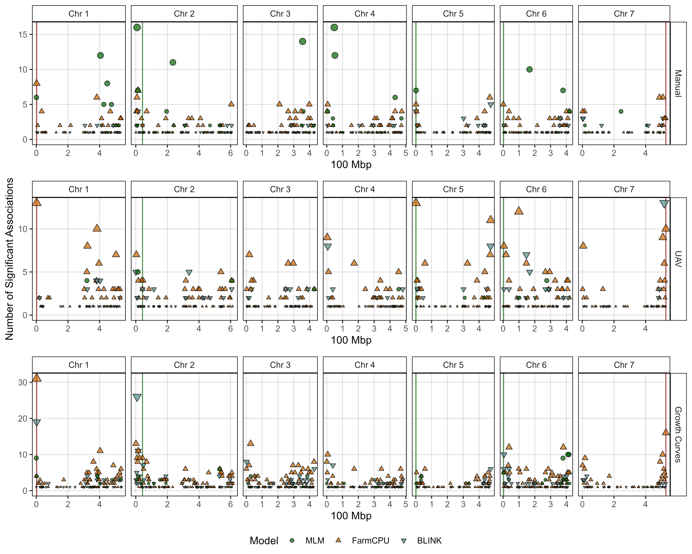

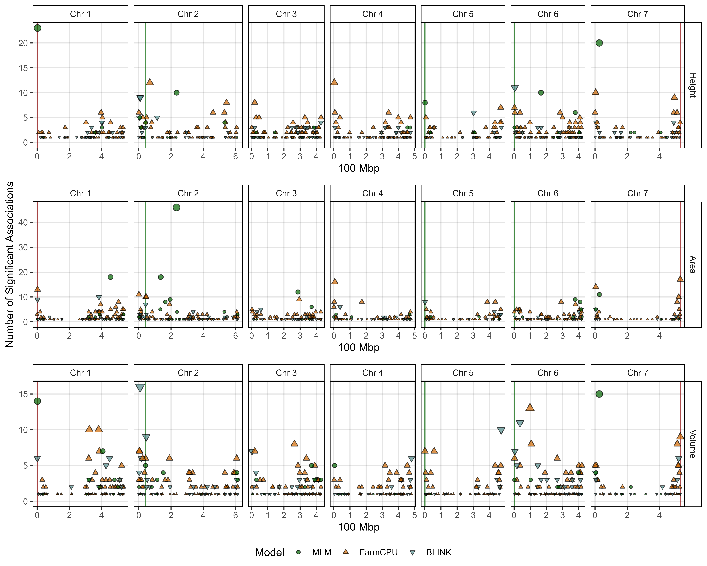

"Lcu.2RBY.Chr1p2011396" -
"Lcu.2RBY.Chr7p528136791" - 

```{r}
myTraits <- list_Traits("GWAS_Results/")
myMarkersd <- c("Lcu.2RBY.Chr2p42556949", "Lcu.2RBY.Chr5p1069654",
               "Lcu.2RBY.Chr6p2528817")
myMarkers <- c(myMarkersd, "Lcu.2RBY.Chr1p2011396","Lcu.2RBY.Chr7p528136791")
myMColors <- c(rep("darkgreen",3),  rep("darkred",2), rep("darkblue",1), rep("purple4",1))
```

```{r}
#
xx <- read.csv("GWAS_Results_Table.csv")
myG <- read.csv("myG_LDP.csv", header = T) %>%
  select(SNP=1, Chr=3, Pos=4)
#
myTs <- myTraits[grepl("Height|gc.h|Plant.Length", myTraits)]
myR <- 2000000
vlines <- myMarkers
vline.colors <- myMColors
gg_GWAS_Hits <- function(xx, myTs, myR = 2000000, myTitle = "", 
                         myYlab = "Significant Associations", 
                         sigThresh = round(length(myTs)/10), sigMin = 0,  
                         vlines = NULL, vline.colors = rep("red", length(vlines)) ) {
  #
  myCs <- c("darkgreen", "darkorange3", "darkslategray4","darkblue")
  xx <- xx %>% filter(Trait %in% myTs) %>% mutate(Hits = NA)
  # i<-1
  for(i in 1:nrow(xx)) {
    myChr <- xx$Chr[i]
    myPos <- xx$Pos[i]
    myMod <- xx$Model[i]
    xi <- xx %>% 
      filter(Chr == myChr, Model == myMod,
             Pos > myPos-myR, Pos < myPos+myR)
    xx$Hits[i] <- nrow(xi)
    xi <- xi %>% filter(!(SNP == xx$SNP[i] & Trait == xx$Trait[i]))
    xx$Pos[xx$SNP %in% xi$SNP & xx$Trait %in% xi$Trait] <- NA
  }
  xx <- xx %>% filter(!is.na(Pos), Hits > sigMin) %>%
    mutate(Model = factor(Model, levels = c("MLM", "FarmCPU", "BLINK")))
  #
  ymax <- max(xx$Hits)
  #
  mp <- ggplot(xx, aes(x = Pos / 100000000) ) +
    geom_blank(data = myG) #+
    #geom_hline(yintercept = sigThresh, alpha = 0.5, color = "darkred") 
  if(!is.null(vlines)) {
    myGM <- myG %>% 
      filter(SNP %in% vlines) %>% 
      mutate(SNP = factor(SNP, levels = vlines)) %>% 
      arrange(SNP)
    mp <- mp + 
      geom_vline(data = myGM, alpha = 0.7, 
                 aes(xintercept = Pos/1e+08, color = SNP)) + 
      scale_color_manual(name = NULL, values = vline.colors)
  }
  mp <- mp +
    geom_point(aes(y = Hits, size = Hits, key1 = SNP, 
                   fill = Model, shape = Model), alpha = 0.7) +
    facet_grid(paste(myTitle) ~ paste("Chr", Chr), 
               space = "free_x", scales = "free_x") +
    scale_shape_manual(values = c(21,24:25), breaks = c("MLM","FarmCPU","BLINK")) +
    scale_fill_manual(values = myCs, breaks = c("MLM","FarmCPU","BLINK")) +
    scale_size_continuous(range = c(0.5,3)) +
    scale_y_continuous(labels = scales::label_number(accuracy = 1),
                       limits = c(0,ymax)) +
    theme_AGL +
    theme(legend.position = "bottom") +
    guides(color = F, size = F) +
    labs(x = "100 Mbp", y = myYlab)
  mp
}
```

```{r}
#
mp1 <- gg_GWAS_Hits(xx, myTitle = "Height", myYlab = "", 
                    myTs = myTraits[grepl("Height|gc.h|Plant.Length", myTraits)], 
                    vlines = myMarkers, vline.colors = myMColors)
mp2 <- gg_GWAS_Hits(xx, myTitle = "Area", myYlab = "Number of Significant Associations",
                    myTs = myTraits[grepl("Area|gc.a|Width|Node|Lowest.Pod", myTraits)], 
                    vlines = myMarkers, vline.colors = myMColors)
mp3 <- gg_GWAS_Hits(xx, myTitle = "Volume", myYlab = "", 
                    myTs = myTraits[grepl("Volume|gc.v|Biomass|Plant.Mass", myTraits)], 
                    vlines = myMarkers, vline.colors = myMColors)
mp4 <- gg_GWAS_Hits(xx, myTitle = "Yield", 
                    myTs = myTraits[grepl("Yield|Seed.Mass", myTraits)], 
                    vlines = myMarkers, vline.colors = myMColors)
mp5 <- gg_GWAS_Hits(xx, myTitle = "Volume + Height + Area", 
                    myTs = c(myTraits[grepl("Height|gc.h|Plant.Length|", myTraits)], 
                             myTraits[grepl("Area|gc.a|Width|Node|Lowest.Pod", myTraits)],
                             myTraits[grepl("Volume|gc.v|Biomass|Plant.Mass", myTraits)]),
                    vlines = myMarkers, vline.colors = myMColors, sigThresh = 20)
mp6 <- gg_GWAS_Hits(xx, myTitle = "PCA", sigMin = 0, sigThresh = 3,
                    myTs = myTraits[grepl("PC", myTraits)],
                    vlines = myMarkers, vline.colors = myMColors)
#
mp7 <- gg_GWAS_Hits(xx, myTitle = "Growth Rates", sigMin = 0, sigThresh = 3,
                    myTs = myTraits[grepl("gc.v.r|gc.h.r|gc.a.r|gc.v.g.r|gc.h.g.r|gc.a.g.r", myTraits)],
                    vlines = myMarkers, vline.colors = myMColors)
#
ggsave("Additional/GWAS/Supplemental_Figure_05_1.png", mp1, width = 10, height = 6, dpi = 600)
ggsave("Additional/GWAS/Supplemental_Figure_05_2.png", mp2, width = 10, height = 6, dpi = 600)
ggsave("Additional/GWAS/Supplemental_Figure_05_3.png", mp3, width = 10, height = 6, dpi = 600)
ggsave("Additional/GWAS/Supplemental_Figure_05_4.png", mp4, width = 10, height = 6, dpi = 600)
ggsave("Additional/GWAS/Supplemental_Figure_05_5.png", mp5, width = 10, height = 6, dpi = 600)
ggsave("Additional/GWAS/Supplemental_Figure_05_6.png", mp6, width = 10, height = 6, dpi = 600)
ggsave("Additional/GWAS/Supplemental_Figure_05_7.png", mp7, width = 10, height = 6, dpi = 600)
mp <- ggarrange(mp1, mp2, mp3, ncol = 1, nrow = 3,
                common.legend = T, legend = "bottom")
ggsave("Supplemental_Figure_05.png", mp, width = 10, height = 8, dpi = 600, bg = "white")
#
saveWidget(ggplotly(mp1), file="Additional/GWAS/Supplemental_Figure_05_1.html")
saveWidget(ggplotly(mp2), file="Additional/GWAS/Supplemental_Figure_05_2.html")
saveWidget(ggplotly(mp3), file="Additional/GWAS/Supplemental_Figure_05_3.html")
saveWidget(ggplotly(mp4), file="Additional/GWAS/Supplemental_Figure_05_4.html")
saveWidget(ggplotly(mp5), file="Additional/GWAS/Supplemental_Figure_05_5.html")
saveWidget(ggplotly(mp6), file="Additional/GWAS/Supplemental_Figure_05_6.html")
saveWidget(ggplotly(mp7), file="Additional/GWAS/Supplemental_Figure_05_7.html")
```

```{r}
mp1 <- gg_GWAS_Hits(xx, myTitle = "Manual", myYlab = "", 
          myTs = myTraits[grepl("Canopy.Height|Plant.Length|Biomass|Plant.Mass|Yield|Seed.Mass", myTraits)], 
          vlines = myMarkers, vline.colors = myMColors)
mp2 <- gg_GWAS_Hits(xx, myTitle = "UAV", myYlab = "Number of Significant Associations",
          myTs = myTraits[grepl("Plot.Height|Plot.Area|Plot.Volume", myTraits)], 
          vlines = myMarkers, vline.colors = myMColors)
mp3 <- gg_GWAS_Hits(xx, myTitle = "Growth Curves", myYlab = "",
          myTs = myTraits[grepl("gc.h|gc.a|gc.v", myTraits)], 
          vlines = myMarkers, vline.colors = myMColors)
mp <- ggarrange(mp1, mp2, mp3, ncol = 1, nrow = 3,
                common.legend = T, legend = "bottom")
ggsave("Figure_08.png", mp, width = 10, height = 8, dpi = 600, bg = "white")
ggsave("Additional/GWAS/Figure_08_1.png", mp1, width = 10, height = 6, dpi = 600)
ggsave("Additional/GWAS/Figure_08_2.png", mp2, width = 10, height = 6, dpi = 600)
ggsave("Additional/GWAS/Figure_08_3.png", mp3, width = 10, height = 6, dpi = 600)
saveWidget(ggplotly(mp1), file="Additional/GWAS/Figure_08_1.html")
saveWidget(ggplotly(mp2), file="Additional/GWAS/Figure_08_2.html")
saveWidget(ggplotly(mp3), file="Additional/GWAS/Figure_08_3.html")
```

---

# Additional Figures - GWAS Summaries

```{r}
xx <- read.csv("GWAS_Results_Table.csv")
#myExpts <- substr(myTraits, 1, regexpr("_", myTraits)-1)
#myPhenos <- unique(substr(myTraits, regexpr("_", myTraits)+1, nchar(myTraits)))
#
# Drone Data
#
myTi <- myTraits[grepl("Plot.Height", myTraits)]
mp <- gg_GWAS_Summary(folder = "GWAS_Results/", traits = myTi, threshold = 6.7, sug.threshold = 5.3,
                      hlines = c(9.5, 20.5, 30.5),
                      vlines = myMarkers, vline.colors = myMColors, vline.legend = F)
ggsave("Additional/GWAS/1.1.1_GWAS_Plot.Height.png", mp, 
       width = 15, height = 8, dpi = 600)
gg_GWAS_plotly(mp, filename = "Additional/GWAS/2.1.1_GWAS_Plot.Hieght.html")
#
myTi <- myTraits[grepl("Plot.Area", myTraits)]
mp <- gg_GWAS_Summary(folder = "GWAS_Results/", traits = myTi, threshold = 6.7, sug.threshold = 5.3,
                      hlines = c(10.5, 20.5, 28.5),
                      vlines = myMarkers, vline.colors = myMColors, vline.legend = F)
ggsave("Additional/GWAS/1.2.1_GWAS_Plot.Area.png", mp, 
       width = 15, height = 8, dpi = 600)
gg_GWAS_plotly(mp, filename = "Additional/GWAS/2.2.1_GWAS_Plot.Area.html")
#
myTi <- myTraits[grepl("Plot.Volume", myTraits)]
mp <- gg_GWAS_Summary(folder = "GWAS_Results/", traits = myTi, threshold = 6.7, sug.threshold = 5.3,
                      hlines = c(13.5, 26.5),
                      vlines = myMarkers, vline.colors = myMColors, vline.legend = F)
ggsave("Additional/GWAS/1.3.1_GWAS_Plot.Volume.png", mp, 
       width = 15, height = 8, dpi = 600)
gg_GWAS_plotly(mp, filename = "Additional/GWAS/2.3.1_GWAS_Plot.Volume.html")
#
# Growth Curves
#
myTi <- myTraits[grepl("gc.h", myTraits)]
mp <- gg_GWAS_Summary(folder = "GWAS_Results/", traits = myTi, threshold = 6.7, sug.threshold = 5.3,
                      hlines = c(13.5, 26.5),
                      vlines = myMarkers, vline.colors = myMColors, vline.legend = F)
ggsave("Additional/GWAS/1.1.2_GWAS_gc.h.png", mp, 
       width = 15, height = 8, dpi = 600)
gg_GWAS_plotly(mp, filename = "Additional/GWAS/2.1.2_GWAS_gc.h.html")
#
myTi <- myTraits[grepl("gc.a", myTraits)]
mp <- gg_GWAS_Summary(folder = "GWAS_Results/", traits = myTi, threshold = 6.7, sug.threshold = 5.3,
                      hlines = c(13.5, 26.5),
                      vlines = myMarkers, vline.colors = myMColors, vline.legend = F)
ggsave("Additional/GWAS/1.2.2_GWAS_gc.a.png", mp, 
       width = 15, height = 8, dpi = 600)
gg_GWAS_plotly(mp, filename = "Additional/GWAS/2.2.2_GWAS_gc.a.html")
#
myTi <- myTraits[grepl("gc.v", myTraits)]
mp <- gg_GWAS_Summary(folder = "GWAS_Results/", traits = myTi, threshold = 6.7, sug.threshold = 5.3,
                      hlines = c(13.5, 26.5),
                      vlines = myMarkers, vline.colors = myMColors, vline.legend = F)
ggsave("Additional/GWAS/1.3.2_GWAS_gc.v.png", mp, 
       width = 15, height = 8, dpi = 600)
gg_GWAS_plotly(mp, filename = "Additional/GWAS/2.3.2_GWAS_gc.v.html")
#
# Manual Measurements
#
myTi <- c(myTraits[grepl("Canopy.Height", myTraits)], myTraits[grepl("Plant.Length", myTraits)])
mp <- gg_GWAS_Summary(folder = "GWAS_Results/", traits = myTi, threshold = 6.7, sug.threshold = 5.3,
                      hlines = c(9.5),
                      vlines = myMarkers, vline.colors = myMColors, vline.legend = F)
ggsave("Additional/GWAS/1.1.3_GWAS_Canopy.Height.png", mp, 
       width = 15, height = 8, dpi = 600)
gg_GWAS_plotly(mp, filename = "Additional/GWAS/2.1.3_GWAS_Canopy.Height.html")
#
myTi <- c(myTraits[grepl("Canopy.Width", myTraits)], 
          myTraits[grepl("Lowest.Pod.H", myTraits)], myTraits[grepl("Flower.Branch", myTraits)],
          myTraits[grepl("Nodes.At.Flower", myTraits)], myTraits[grepl("Node.Of.Flower", myTraits)] )
mp <- gg_GWAS_Summary(folder = "GWAS_Results/", traits = myTi, threshold = 6.7, sug.threshold = 5.3,
                      hlines = c(9.5),
                      vlines = myMarkers, vline.colors = myMColors, vline.legend = F)
ggsave("Additional/GWAS/1.2.3_GWAS_Canopy.Area.png", mp, 
       width = 15, height = 8, dpi = 600)
gg_GWAS_plotly(mp, filename = "Additional/GWAS/2.2.3_GWAS_Canopy.Area.html")
#
myTi <- c(myTraits[grepl("Plot.Biomass", myTraits)], myTraits[grepl("Straw.Biomass", myTraits)],
          myTraits[grepl("Plant.Mass", myTraits)] )
mp <- gg_GWAS_Summary(folder = "GWAS_Results/", traits = myTi, threshold = 6.7, sug.threshold = 5.3,
                      hlines = c(4.5, 19.5),
                      vlines = myMarkers, vline.colors = myMColors, vline.legend = F)
ggsave("Additional/GWAS/1.3.3_GWAS_Biomass.png", mp, 
       width = 15, height = 8, dpi = 600)
gg_GWAS_plotly(mp, filename = "Additional/GWAS/2.3.3_GWAS_Biomass.html")
#
# PCA
#
myTi <- myTraits[grepl("PC", myTraits)]
mp <- gg_GWAS_Summary(folder = "GWAS_Results/", traits = myTi, threshold = 6.7, sug.threshold = 5.3,
                      hlines = c(2.5),
                      vlines = myMarkers, vline.colors = myMColors, vline.legend = F)
ggsave("Additional/GWAS/1.4.1_GWAS_PCA.png", mp, 
       width = 15, height = 8, dpi = 600)
gg_GWAS_plotly(mp, filename = "Additional/GWAS/2.4.1_GWAS_PCA.html")
#
# Additional Traits
#
myTi <- c(myTraits[grepl("Yield", myTraits)], myTraits[grepl("Seed.Mass", myTraits)])
mp <- gg_GWAS_Summary(folder = "GWAS_Results/", traits = myTi, threshold = 6.7, sug.threshold = 5.3,
                      hlines = c(13.5),
                      vlines = myMarkers, vline.colors = myMColors, vline.legend = F)
ggsave("Additional/GWAS/1.4.2_GWAS_Yield.png", mp, 
       width = 15, height = 8, dpi = 600)
gg_GWAS_plotly(mp, filename = "Additional/GWAS/2.4.2_GWAS_Yield.html")
#
myTi <- c(myTraits[grepl("Cold.Stress", myTraits)], myTraits[grepl("Lodging.Score", myTraits)])
mp <- gg_GWAS_Summary(folder = "GWAS_Results/", traits = myTi, threshold = 6.7, sug.threshold = 5.3,
                      hlines = c(13.5),
                      vlines = myMarkers, vline.colors = myMColors, vline.legend = F)
ggsave("Additional/GWAS/1.4.3_GWAS_Other.png", mp, 
       width = 15, height = 8, dpi = 600)
gg_GWAS_plotly(mp, filename = "Additional/GWAS/2.4.3_GWAS_Other.html")
#
# Growth rates
#
myTi <- c(myTraits[grepl("v.r|v.g.r", myTraits)],
          myTraits[grepl("h.r|h.g.r", myTraits)],
          myTraits[grepl("a.r|a.g.r", myTraits)])
mp <- gg_GWAS_Summary(folder = "GWAS_Results/", traits = myTi, threshold = 6.7, sug.threshold = 5.3,
                      hlines = c(6.5,12.5),
                      vlines = myMarkers, vline.colors = myMColors, vline.legend = F)
ggsave("Additional/GWAS/1.4.4_GWAS_gr.png", mp, 
       width = 15, height = 5, dpi = 600)
gg_GWAS_plotly(mp, filename = "Additional/GWAS/2.4.4_GWAS_gr.html")
```

---

# Additional Figures - Manhattan Plots

```{r}
myTs <- myTraits
#i <- myTs[1]
for(i in myTs) {
  mp <- gg_Manhattan(folder = "GWAS_Results/", trait = i, facet = F,
                     models = c("MLM", "FarmCPU", "BLINK"),
                     threshold = 7.3, sug.threshold = 6.7, pmax = 12,
                     vlines = myMarkers, vline.colors = myMColors)
  ggsave(paste0("Additional/ManH/Multi_",i,".png"), 
         mp, width = 12, height = 4, bg = "white")
}
```

---

# Figure 09 - Markers 1

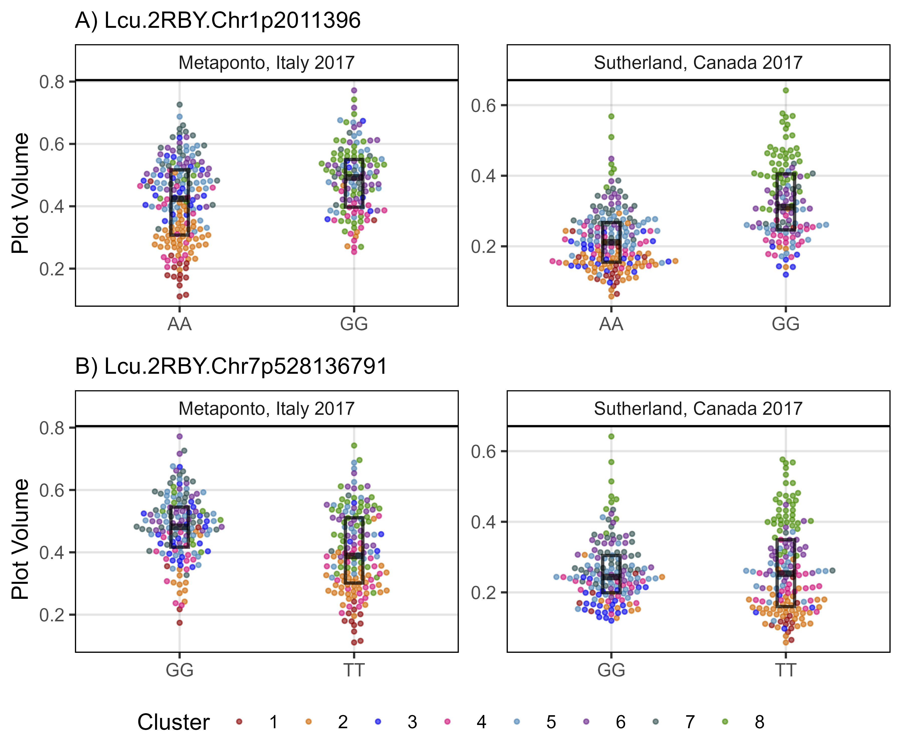

```{r}
# Prep data
xx <- read.csv("GWAS_Results_Table.csv")
myG <- read.csv("myG_LDP.csv", header = T)
myY <- left_join(
  select(read.csv("Data_GWAS/myY_it17_gc.csv"), Name, It17_gc.v.k),
  select(read.csv("Data_GWAS/myY_su17_gc.csv"), Name, Su17_gc.v.k),
  by = "Name") %>% as.data.frame() %>%
  mutate(Name = gsub(" ","_",Name),
         Name = gsub("-","\\.",Name),
         Name = plyr::mapvalues(Name, "3156.11_AGL", "X3156.11_AGL"))
  #
gwaspr_dna <- data.frame(stringsAsFactors = F, 
    Symbol = c("A", "C", "G", "T", "U", "R", "Y", "S", "W", "K", "M", "N"), 
    Value = c("AA","CC","GG","TT","UU","AG","CT","GC","AT","GT","AC","NN"))
x1 <- myG %>% filter(rs %in% myMarkers[4:5])
myPCA <- read.csv("myPCA.csv") %>%
  mutate(Name = gsub(" ","_",Name),
         Name = gsub("-","\\.",Name),
         Name = plyr::mapvalues(Name, "3156.11_AGL", "X3156.11_AGL")) %>%
  mutate(Cluster = factor(Cluster))
#
xx <- x1 %>% gather(Name, Allele, 12:ncol(.)) %>%
  select(Name, rs, Allele) %>% 
  mutate(Allele = plyr::mapvalues(Allele, gwaspr_dna$Symbol, gwaspr_dna$Value), 
         Allele = factor(Allele, levels = gwaspr_dna$Value)) %>% 
  filter(Allele %in% c("AA","CC","TT","GG")) %>%
  spread(rs, Allele) %>%
  left_join(select(myPCA, Name, Cluster)) %>%
  left_join(myY, by = "Name") %>%
  gather(Expt, Volume, It17_gc.v.k, Su17_gc.v.k) %>%
  mutate(Expt = plyr::mapvalues(Expt, c("It17_gc.v.k", "Su17_gc.v.k"), 
                                c("Metaponto, Italy 2017", "Sutherland, Canada 2017")))
#
mp1 <- ggplot(xx %>% filter(!is.na(Lcu.2RBY.Chr1p2011396)), 
              aes(x = Lcu.2RBY.Chr1p2011396, y = Volume)) + 
  geom_beeswarm(aes(color = Cluster), cex = 2, alpha = 0.6, size = 0.75) + 
  geom_boxplot(fill = alpha("white",0), color = alpha("black",0.7),
               lwd = 0.75, width = 0.1, outlier.shape = NA, coef = 0) + 
  facet_wrap(Expt ~ ., scales = "free_y", ncol = 2) +
  scale_color_manual(values = myColors_Cluster) + 
  theme_AGL +
  guides(colour = guide_legend(nrow = 1)) +
  labs(subtitle = "A) Lcu.2RBY.Chr1p2011396", y = "Plot Volume", x = NULL)
mp2 <- ggplot(xx %>% filter(!is.na(Lcu.2RBY.Chr7p528136791)),
              aes(x = Lcu.2RBY.Chr7p528136791, y = Volume)) + 
  geom_beeswarm(aes(color = Cluster), cex = 2, alpha = 0.6, size = 0.75) + 
  geom_boxplot(fill = alpha("white",0), color = alpha("black",0.7),
               lwd = 0.75, width = 0.1, outlier.shape = NA, coef = 0) + 
  facet_wrap(Expt ~ ., scales = "free_y", ncol = 2) +
  scale_color_manual(values = myColors_Cluster) + 
  theme_AGL +
  guides(colour = guide_legend(nrow = 1)) +
  labs(subtitle = "B) Lcu.2RBY.Chr7p528136791", y = "Plot Volume", x = NULL)
mp <- ggarrange(mp1, mp2, ncol = 1, nrow = 2, common.legend = T, legend = "bottom")
ggsave("Figure_09.png", mp, width = 6, height = 5, dpi = 600, bg = "white")
```

---

# Supplemental Figure 06 - Canada Origins

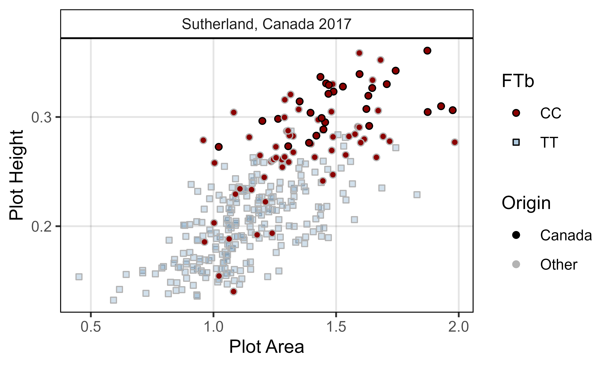

```{r}
myY <- read.csv("Data_GWAS/myY_su17_gc.csv") %>%
  mutate(Name = gsub(" ","_",Name),
         Name = gsub("-","\\.",Name),
         Name = plyr::mapvalues(Name, "3156.11_AGL", "X3156.11_AGL")) %>%
  as.data.frame() %>%
  select(Name, Su17_gc.h.k, Su17_gc.a.k, Su17_gc.v.k)
myPCA <- read.csv("myPCA.csv") %>% select(Name, Origin) %>%
  mutate(Name = gsub(" ","_",Name),
         Name = gsub("-","\\.",Name),
         Name = plyr::mapvalues(Name, "3156.11_AGL", "X3156.11_AGL"))
xx <- myG %>% filter(rs %in% myMarkersd[3]) %>% 
  gather(Name, Allele, 12:ncol(.)) %>%
  select(Name, rs, Allele) %>% 
  mutate(Allele = plyr::mapvalues(Allele, gwaspr_dna$Symbol, gwaspr_dna$Value), 
         Allele = factor(Allele, levels = gwaspr_dna$Value)) %>% 
  filter(Allele %in% c("AA","CC","TT","GG")) %>%
  spread(rs, Allele) %>%
  #rename(FTb=Lcu.2RBY.Chr6p2528817) +
  left_join(select(myPCA, Name, Origin)) %>%
  left_join(myY, by = "Name") %>%
  mutate(Origin = ifelse(Origin == "Canada", Origin, "Other")) %>%
  arrange(Lcu.2RBY.Chr6p2528817, rev(Origin))
#
mp <- ggplot(xx, aes(x = Su17_gc.a.k, y = Su17_gc.h.k, 
               fill = Lcu.2RBY.Chr6p2528817, 
               pch = Lcu.2RBY.Chr6p2528817,
               color = Origin, 
               #alpha = Lcu.2RBY.Chr6p2528817, 
               ), size = 2.5
       ) +
  geom_point() +
  geom_point(data = xx %>% filter(Lcu.2RBY.Chr6p2528817 == "CC")) +
  scale_fill_manual(name = "FTb", values = c("darkred", alpha("steelblue",0.25))) +
  scale_color_manual(values = c("black","grey70")) +
  scale_shape_manual(name = "FTb", values = c(21,22)) +
  #scale_alpha_manual(name = "FTb", values = c(1,0.25), guide = F) +
  facet_grid(. ~ "Sutherland, Canada 2017") +
  theme_AGL +
  labs(x = "Plot Area", y = "Plot Height")
ggsave("Supplemental_Figure_06.png", mp, width = 5, height = 3, dpi = 600)
```


```{r}
myColors_all <- c("darkred", "darkgreen", "darkblue", "darkgoldenrod3", 
                  "steelblue4", "purple4",
  "darkslategray", "maroon4",   "cyan4",
  "burlywood4", "green4", "darkgoldenrod2",
  "red3", "steelblue3", "darkslategray4", "maroon3",
  "purple3", "blue2", "cyan3", "burlywood3", "chartreuse4",
  "darkgoldenrod4", "firebrick", "cornflowerblue",
  "deepskyblue4", "maroon", "purple2", "dodgerblue", 
  "palevioletred3", "wheat3", "darkseagreen4", "darkorange4", "tomato4",
  "slategray4", "aquamarine4", "deeppink4", "magenta4", "dodgerblue4",
  "violetred4", "tan4", "darkseagreen3", "darkorange3", 
  "tomato3", "slategray3", "aquamarine3", "deeppink3", "magenta3",
  "dodgerblue3", "violetred3", "tan3")
```

---

# Figure 10 - Markers

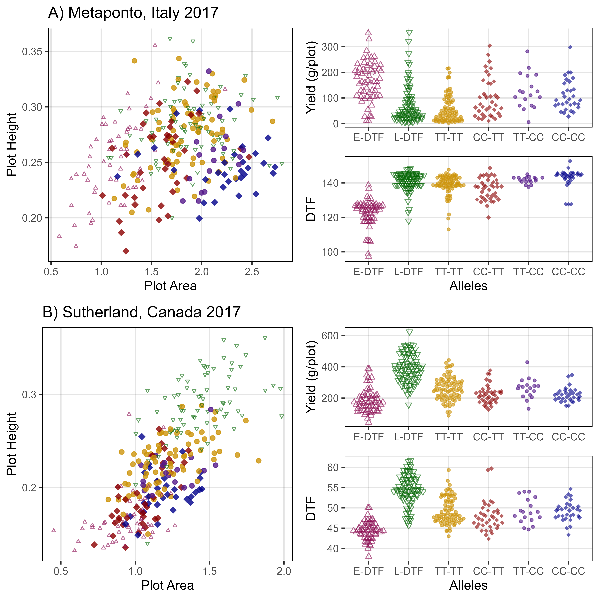

```{r}
xx <- read.csv("GWAS_Results_Table.csv")
myY <- left_join(
  read.csv("Data_GWAS/myY_it17_gc.csv") %>%
    mutate(Name = gsub(" ","_",Name),
           Name = gsub("-","\\.",Name),
           Name = plyr::mapvalues(Name, "3156.11_AGL", "X3156.11_AGL")) %>%
    as.data.frame() %>%
    select(Name, It17_gc.h.k, It17_gc.a.k, It17_gc.v.k),
  read.csv("Data_GWAS/myY_ro17_gc.csv") %>%
    mutate(Name = gsub(" ","_",Name),
           Name = gsub("-","\\.",Name),
           Name = plyr::mapvalues(Name, "3156.11_AGL", "X3156.11_AGL")) %>%
    as.data.frame() %>%
    select(Name, Ro17_gc.h.k, Ro17_gc.a.k, Ro17_gc.v.k), by = "Name") %>%
  left_join(
    read.csv("Data_GWAS/myY_su17_gc.csv") %>%
      mutate(Name = gsub(" ","_",Name),
             Name = gsub("-","\\.",Name),
             Name = plyr::mapvalues(Name, "3156.11_AGL", "X3156.11_AGL")) %>%
      as.data.frame() %>%
      select(Name, Su17_gc.h.k, Su17_gc.a.k, Su17_gc.v.k), by = "Name") %>%
  left_join(
    read.csv("Data_GWAS/myY_myF.csv") %>%
      mutate(Name = gsub(" ","_",Name),
             Name = gsub("-","\\.",Name),
             Name = plyr::mapvalues(Name, "3156.11_AGL", "X3156.11_AGL")) %>%
      as.data.frame() %>%
      select(Name, contains("Yield")), by = "Name")
#
#xh <- su17_gc.h
#xa <- su17_gc.a
#xf <- su17_f
#markers1 <- myMarkersh[1]
#markers2 <- myMarkersd
gg_HAMarker <- function(xh, xa, xf, markers1, markers2 = myMarkersd, 
                        mypchs = c(2,6,16,15), myTitle = "",
                        colors = c("deeppink4", "darkgreen", 
                                  "darkgoldenrod3", "darkred", "purple4", "darkblue",
                                  "steelblue4",
                             "palevioletred3", "wheat3", "darkseagreen4", "darkorange4", 
                             "tomato4", "slategray4", "aquamarine4",  
                             "magenta4", "dodgerblue4")
                        ) {
  # Prep data
  #xv <- it17_gc.v[[2]] %>% group_by(Entry) %>%
  #  summarise(Volume = mean(k, na.rm = T))
  xh <- xh[[2]] %>% group_by(Entry) %>%
    summarise(Height = mean(k, na.rm = T))
  xa <- xa[[2]] %>% group_by(Entry) %>%
    summarise(Area = mean(k, na.rm = T))
  xs <- xf %>% filter(Trait == "Seed.Mass") %>%
    group_by(Entry) %>% summarise(Yield = mean(Value, na.rm = T))
  xd <- xf %>% filter(Trait == "DTF") %>%
    group_by(Entry) %>% summarise(DTF = mean(Value, na.rm = T))
  myPCA <- read.csv("myPCA.csv") %>%
    mutate(Name = gsub(" ", "_", Name),
           Name = gsub("-", "\\.", Name),
           Name = plyr::mapvalues(Name, "3156.11_AGL", "X3156.11_AGL")) %>%
    mutate(Cluster = factor(Cluster))
  #
  x1 <- myG %>% filter(rs %in% markers1) %>%
    gather(Name, Allele, 12:ncol(.)) %>%
    select(Name, rs, Allele) %>% 
    spread(rs, Allele)
  x1$Alleles1 <- ""
  j <- ncol(x1)
  for(i in 2:(j-1)) { x1$Alleles1 <- paste0(x1[,j], x1[,i]) }
  #
  x2 <- myG %>% filter(rs %in% markers2) %>% 
    gather(Name, Allele, 12:ncol(.)) %>% 
    select(Name, rs, Allele) %>%
    spread(rs, Allele)
  x2$Alleles2 <- ""
  j <- ncol(x2)
  #i <- 2
  for(i in 2:(j-1)) { x2$Alleles2 <- paste0(x2[,j], x2[,i]) }
  #
  fname <- paste(paste(markers1, collapse = "."), "png", sep = ".")
  title <- paste0(paste(markers1, collapse = " & "), " = Sig Markers\n",
                  "\n", paste(markers2[1:2], collapse = " & "), " = Early DTF", 
                  "\n", markers2[3], " = Late DTF ")
  xx <- left_join(x1, x2, by = "Name") %>% 
    mutate(Alleles = paste0(Alleles1, Alleles2),
           #Alleles2 = ifelse(Alleles2 == "TCT", "Early DTF", Alleles2),
           #Alleles2 = ifelse(Alleles2 == "CAC", "Late DTF", Alleles2),
           Alleles2 = ifelse(Lcu.2RBY.Chr6p2528817 == "C", "L-DTF", Alleles2),
           Alleles2 = ifelse(Lcu.2RBY.Chr2p42556949 == "C",
                             "E-DTF", Alleles2),
           Alleles2 = ifelse(Lcu.2RBY.Chr5p1069654 == "A", 
                             "E-DTF", Alleles2),
           #Alleles2 = ifelse(Lcu.2RBY.Chr6p2528817 == "C" & 
          #                     Lcu.2RBY.Chr2p42556949 != "T" &
            #                   Lcu.2RBY.Chr5p1069654 != "C", "Late DTF", Alleles2),
           #Alleles2 = factor(Alleles2, levels = c("TCT")),
           #Alleles2 = ifelse(is.na(Alleles2), "Early DTF", ""),
           #Alleles2 = ifelse(Lcu.2RBY.Chr6p2528817 == "C", "Late DTF", Alleles2),
           Alleles1 = ifelse(Alleles2 %in% c("E-DTF", "L-DTF"), Alleles2, Alleles1))
    #x1 %>% gather(Name, Allele, 12:ncol(.)) %>%
    #select(Name, rs, Allele) %>% 
    #filter(Allele %in% c("A", "G","C", "T")) %>%
    #spread(rs, Allele)
  
  for(k in c(markers1)) { 
    xx <- xx %>% #filter(get(k) %in% c("A", "G","C", "T")) } #,markers2
      mutate(Alleles1 = ifelse(!get(k) %in% c("A","G","C","T") & 
                                 !Alleles1 %in% c("E-DTF", "L-DTF"), 
                               "NN", as.character(Alleles1)))
  }
  
  #
  #unique(xx$Alleles2)
  #
  myAs <- unique(xx$Alleles1)[!unique(xx$Alleles1)%in%c("L-DTF","E-DTF","NN")]
  myAs <- c("TT", "CT", "TC", "CC")
  myAs2 <- c("TT-TT", "CC-TT", "TT-CC", "CC-CC")
  xx <- xx %>%
    left_join(select(myPCA, Name, Entry, Cluster, Origin), by = "Name") %>%
    #left_join(xv, by = "Entry") %>% 
    left_join(xh, by = "Entry") %>% 
    left_join(xa, by = "Entry") %>% 
    left_join(xs, by = "Entry") %>% 
    left_join(xd, by = "Entry") %>% 
    arrange(Yield) %>%
    mutate(Alleles = factor(Alleles, levels = unique(.$Alleles)),
           Alleles1 = plyr::mapvalues(Alleles1, myAs, myAs2),
           Alleles1 = factor(Alleles1, levels = unique(c("E-DTF", "L-DTF", myAs2, "NN"))),
           Alleles2 = factor(Alleles2, levels = c("E-DTF", "L-DTF"))
           )
  #
  xx <- xx %>% filter(Alleles1 != "NN")
  #
  mp1 <- ggplot(xx, aes(x = Area, y = Height, 
                        color = Alleles1, alpha = Alleles1,
                        pch = Alleles1, size = Alleles1)) + 
    #ggdensity::geom_hdr_lines(aes(color = Alleles1), probs = 0.99) +
    #scale_fill_manual(values = myColors_all) +
    geom_point() + 
    scale_color_manual(name = NULL, values = colors) + 
    scale_shape_manual(name = "DTF", values = mypchs) +
    scale_alpha_manual(values = c(0.6,0.6, rep(0.8,length(myAs)), 0.6)) +
    scale_size_manual(values =  c(0.8,0.8, rep(2.5,  length(myAs)), 0.8)) +
    theme_AGL +
    labs(title = myTitle, y = "Plot Height", x = "Plot Area")
  mp2 <- ggplot(xx, aes(x = Alleles1, y = Yield, 
                        color = Alleles1, pch = Alleles1)) + 
    geom_quasirandom(alpha = 0.6) + 
    scale_color_manual(name = NULL, values = colors) + 
    scale_shape_manual(name = "DTF", values = mypchs) +
    theme_AGL +
    labs(title = "", x = NULL, y = "Yield (g/plot)") #caption = title,
  mp3 <- ggplot(xx, aes(x = Alleles1, y = DTF, 
                        color = Alleles1, pch = Alleles1)) + 
    geom_quasirandom(alpha = 0.6) + 
    scale_color_manual(name = NULL, values = colors) + 
    scale_shape_manual(name = "DTF", values = mypchs) +
    theme_AGL +
    labs(x = "Alleles", y = "DTF")
  mp <- ggarrange(mp1, ggarrange(mp2, mp3, ncol = 1, nrow = 2, legend = "none", align = "v"), 
                  ncol = 2, nrow = 1, legend = "none")# %>%
    #annotate_figure(fig.lab = title, fig.lab.pos = "bottom.right")
  mp
}
#
myM1 <- c("Lcu.2RBY.Chr1p382800064", "Lcu.2RBY.Chr5p458058460")
myM1 <- c("Lcu.2RBY.Chr4p46489391",  "Lcu.2RBY.Chr1p2610459")#,"Lcu.2RBY.Chr2p8331384") # ,
myM1 <- c("Lcu.2RBY.Chr4p46489391", "Lcu.2RBY.Chr7p491811681")
myM1 <- c("Lcu.2RBY.Chr1p382800064", "Lcu.2RBY.Chr4p46489391")#, "Lcu.2RBY.Chr1p2011396")
myM1 <- c("Lcu.2RBY.Chr7p528136791", "Lcu.2RBY.Chr1p2011396"   )
myM1 <- c("Lcu.2RBY.Chr1p382800064", "Lcu.2RBY.Chr2p12871875")
#myM1 <- myMarkers[4:5]
#myM1 <- c( "Lcu.2RBY.Chr1p2610459", "Lcu.2RBY.Chr3p269524365")
mp1 <- gg_HAMarker(xh=it17_gc.h, xa=it17_gc.a, xf = it17_f, 
                    markers1 = myM1, 
                  markers2 = myMarkersd,
                    mypchs = c(2,6,20,18,20,18,1),
                  myTitle = "A) Metaponto, Italy 2017")
mp1
mp2 <- gg_HAMarker(xh=su17_gc.h, xa=su17_gc.a, xf = su17_f, 
                    markers1 = myM1, 
                  markers2 = myMarkersd,
                    mypchs = c(2,6,20,18,20,18,1),
                  myTitle = "B) Sutherland, Canada 2017")
mp <- ggarrange(mp1, mp2, ncol = 1, nrow = 2)
ggsave(paste0("Figure_10.png"), mp, width = 7, height = 7, dpi = 600, bg = "white")
#
read.csv("GWAS_Results_Table.csv") %>% filter(SNP == "Lcu.2RBY.Chr4p46489391")
myG %>% filter(rs %in% c("Lcu.2RBY.Chr1p382800064", "Lcu.2RBY.Chr2p12871875"))
```


```{r eval = F, echo = F}
xx <- read.csv("GWAS_Results_Table.csv")
myY <- left_join(
  read.csv("Data_GWAS/myY_it17_gc.csv") %>%
    mutate(Name = gsub(" ","_",Name),
           Name = gsub("-","\\.",Name),
           Name = plyr::mapvalues(Name, "3156.11_AGL", "X3156.11_AGL")) %>%
    as.data.frame() %>%
    select(Name, It17_gc.h.k, It17_gc.a.k, It17_gc.v.k),
  read.csv("Data_GWAS/myY_ro17_gc.csv") %>%
    mutate(Name = gsub(" ","_",Name),
           Name = gsub("-","\\.",Name),
           Name = plyr::mapvalues(Name, "3156.11_AGL", "X3156.11_AGL")) %>%
    as.data.frame() %>%
    select(Name, Ro17_gc.h.k, Ro17_gc.a.k, Ro17_gc.v.k), by = "Name") %>%
  left_join(
    read.csv("Data_GWAS/myY_su17_gc.csv") %>%
      mutate(Name = gsub(" ","_",Name),
             Name = gsub("-","\\.",Name),
             Name = plyr::mapvalues(Name, "3156.11_AGL", "X3156.11_AGL")) %>%
      as.data.frame() %>%
      select(Name, Su17_gc.h.k, Su17_gc.a.k, Su17_gc.v.k), by = "Name") %>%
  left_join(
    read.csv("Data_GWAS/myY_myF.csv") %>%
      mutate(Name = gsub(" ","_",Name),
             Name = gsub("-","\\.",Name),
             Name = plyr::mapvalues(Name, "3156.11_AGL", "X3156.11_AGL")) %>%
      as.data.frame() %>%
      select(Name, contains("Yield")), by = "Name")
#
xh <- su17_gc.h
xa <- su17_gc.a
xf <- su17_f
markers1 <- myMarkersh[1]
markers2 <- myMarkersd
gg_HAMarker2 <- function(xh, xa, xf, markers1, markers2 = myMarkersd, 
                        mypchs = c(2,6,16,15), myTitle = "",
                        colors = c("deeppink4", "darkgreen", 
                                  "darkgoldenrod3", "darkred", "purple4", "darkblue",
                                  "steelblue4",
                             "palevioletred3", "wheat3", "darkseagreen4", "darkorange4", 
                             "tomato4", "slategray4", "aquamarine4",  
                             "magenta4", "dodgerblue4")
                        ) {
  # Prep data
  #xv <- it17_gc.v[[2]] %>% group_by(Entry) %>%
  #  summarise(Volume = mean(k, na.rm = T))
  xh <- xh[[2]] %>% group_by(Entry) %>%
    summarise(Height = mean(k, na.rm = T))
  xa <- xa[[2]] %>% group_by(Entry) %>%
    summarise(Area = mean(k, na.rm = T))
  xs <- xf %>% filter(Trait == "Seed.Mass") %>%
    group_by(Entry) %>% summarise(Yield = mean(Value, na.rm = T))
  xd <- xf %>% filter(Trait == "DTF") %>%
    group_by(Entry) %>% summarise(DTF = mean(Value, na.rm = T))
  myPCA <- read.csv("myPCA.csv") %>%
    mutate(Name = gsub(" ", "_", Name),
           Name = gsub("-", "\\.", Name),
           Name = plyr::mapvalues(Name, "3156.11_AGL", "X3156.11_AGL")) %>%
    mutate(Cluster = factor(Cluster))
  #
  x1 <- myG %>% filter(rs %in% markers1) %>%
    gather(Name, Allele, 12:ncol(.)) %>%
    select(Name, rs, Allele) %>% 
    spread(rs, Allele)
  x1$Alleles1 <- ""
  j <- ncol(x1)
  for(i in 2:(j-1)) { x1$Alleles1 <- paste0(x1[,j], x1[,i]) }
  #
  x2 <- myG %>% filter(rs %in% markers2) %>% 
    gather(Name, Allele, 12:ncol(.)) %>% 
    select(Name, rs, Allele) %>%
    spread(rs, Allele)
  x2$Alleles2 <- ""
  j <- ncol(x2)
  #i <- 2
  for(i in 2:(j-1)) { x2$Alleles2 <- paste0(x2[,j], x2[,i]) }
  #
  fname <- paste(paste(markers1, collapse = "."), "png", sep = ".")
  title <- paste0(paste(markers1, collapse = " & "), " = Sig Markers\n",
                  "\n", paste(markers2[1:2], collapse = " & "), " = Early DTF", 
                  "\n", markers2[3], " = Late DTF ")
  xx <- left_join(x1, x2, by = "Name") %>% 
    mutate(Alleles = paste0(Alleles1, Alleles2),
           #Alleles2 = ifelse(Alleles2 == "TCT", "Early DTF", Alleles2),
           #Alleles2 = ifelse(Alleles2 == "CAC", "Late DTF", Alleles2),
           Alleles2 = ifelse(Lcu.2RBY.Chr6p2528817 == "C", "L-DTF", Alleles2),
           Alleles2 = ifelse(Lcu.2RBY.Chr2p42556949 == "C",
                             "E-DTF", Alleles2),
           Alleles2 = ifelse(Lcu.2RBY.Chr5p1069654 == "A", 
                             "E-DTF", Alleles2),
           #Alleles2 = ifelse(Lcu.2RBY.Chr6p2528817 == "C" & 
          #                     Lcu.2RBY.Chr2p42556949 != "T" &
            #                   Lcu.2RBY.Chr5p1069654 != "C", "Late DTF", Alleles2),
           #Alleles2 = factor(Alleles2, levels = c("TCT")),
           #Alleles2 = ifelse(is.na(Alleles2), "Early DTF", ""),
           #Alleles2 = ifelse(Lcu.2RBY.Chr6p2528817 == "C", "Late DTF", Alleles2),
           Alleles1 = ifelse(Alleles2 %in% c("E-DTF", "L-DTF"), Alleles2, Alleles1))
    #x1 %>% gather(Name, Allele, 12:ncol(.)) %>%
    #select(Name, rs, Allele) %>% 
    #filter(Allele %in% c("A", "G","C", "T")) %>%
    #spread(rs, Allele)
  
  for(k in c(markers1)) { 
    xx <- xx %>% #filter(get(k) %in% c("A", "G","C", "T")) } #,markers2
      mutate(Alleles1 = ifelse(!get(k) %in% c("A","G","C","T") & 
                                 !Alleles1 %in% c("E-DTF", "L-DTF"), 
                               "NN", as.character(Alleles1)))
  }
  
  #
  #unique(xx$Alleles2)
  #
  myAs <- unique(xx$Alleles1)[!unique(xx$Alleles1)%in%c("L-DTF","E-DTF","NN")]
  myAs <- c("TT", "CT", "TC", "CC")
  myAs2 <- c("TT-TT", "CC-TT", "TT-CC", "CC-CC")
  xx <- xx %>%
    left_join(select(myPCA, Name, Entry, Cluster, Origin), by = "Name") %>%
    #left_join(xv, by = "Entry") %>% 
    left_join(xh, by = "Entry") %>% 
    left_join(xa, by = "Entry") %>% 
    left_join(xs, by = "Entry") %>% 
    left_join(xd, by = "Entry") %>% 
    arrange(Yield) %>%
    mutate(Alleles = factor(Alleles, levels = unique(.$Alleles)),
           Alleles1 = plyr::mapvalues(Alleles1, myAs, myAs2),
           Alleles1 = factor(Alleles1, levels = unique(c("E-DTF", "L-DTF", myAs2, "NN"))),
           Alleles2 = factor(Alleles2, levels = c("E-DTF", "L-DTF"))
           )
  #
  xx <- xx %>% filter(Alleles1 != "NN")
  #
  mp1 <- ggplot(xx, aes(x = Area, y = Height, 
                        color = Alleles1, alpha = Alleles1,
                        pch = Alleles1, size = Alleles1)) + 
    #ggdensity::geom_hdr_lines(aes(color = Alleles1), probs = 0.99) +
    #scale_fill_manual(values = myColors_all) +
    geom_point() + 
    scale_color_manual(name = NULL, values = colors) + 
    scale_shape_manual(name = "DTF", values = mypchs) +
    scale_alpha_manual(values = c(0.6,0.6, rep(0.8,length(myAs)), 0.6)) +
    scale_size_manual(values =  c(0.8,0.8, rep(2.5,  length(myAs)), 0.8)) +
    theme_AGL +
    labs(title = myTitle, y = "Plot Height", x = "Plot Area")
  mp2 <- ggplot(xx, aes(x = Alleles1, y = Yield, 
                        color = Alleles1, pch = Alleles1)) + 
    geom_quasirandom(alpha = 0.6) + 
    scale_color_manual(name = NULL, values = colors) + 
    scale_shape_manual(name = "DTF", values = mypchs) +
    theme_AGL +
    labs(title = "", x = NULL, y = "Yield (g/plot)") #caption = title,
  mp3 <- ggplot(xx, aes(x = Alleles1, y = DTF, 
                        color = Alleles1, pch = Alleles1)) + 
    geom_quasirandom(alpha = 0.6) + 
    scale_color_manual(name = NULL, values = colors) + 
    scale_shape_manual(name = "DTF", values = mypchs) +
    theme_AGL +
    labs(x = "Alleles", y = "DTF")
  mp <- ggarrange(mp1, ggarrange(mp2, mp3, ncol = 1, nrow = 2, legend = "none", align = "v"), 
                  ncol = 2, nrow = 1, legend = "none")# %>%
    #annotate_figure(fig.lab = title, fig.lab.pos = "bottom.right")
  mp
}
#
myM1 <- c("Lcu.2RBY.Chr1p382800064", "Lcu.2RBY.Chr5p458058460")
myM1 <- c("Lcu.2RBY.Chr4p46489391",  "Lcu.2RBY.Chr1p2610459")#,"Lcu.2RBY.Chr2p8331384") # ,
myM1 <- c("Lcu.2RBY.Chr4p46489391", "Lcu.2RBY.Chr7p491811681")
myM1 <- c("Lcu.2RBY.Chr1p382800064", "Lcu.2RBY.Chr4p46489391")#, "Lcu.2RBY.Chr1p2011396")
myM1 <- c("Lcu.2RBY.Chr7p528136791", "Lcu.2RBY.Chr1p2011396"   )
myM1 <- c("Lcu.2RBY.Chr1p382800064", "Lcu.2RBY.Chr2p12871875")
#myM1 <- myMarkers[4:5]
#myM1 <- c( "Lcu.2RBY.Chr1p2610459", "Lcu.2RBY.Chr3p269524365")
mp1 <- gg_HAMarker(xh=it17_gc.h, xa=it17_gc.a, xf = it17_f, 
                    markers1 = myM1, 
                  markers2 = myMarkersd,
                    mypchs = c(2,6,20,18,20,18,1),
                  myTitle = "A) Metaponto, Italy 2017")
mp1
mp2 <- gg_HAMarker(xh=su17_gc.h, xa=su17_gc.a, xf = su17_f, 
                    markers1 = myM1, 
                  markers2 = myMarkersd,
                    mypchs = c(2,6,20,18,20,18,1),
                  myTitle = "B) Sutherland, Canada 2017")
mp <- ggarrange(mp1, mp2, ncol = 1, nrow = 2)
ggsave(paste0("Figure_10.png"), mp, width = 7, height = 7, dpi = 600, bg = "white")
```

---

&copy; Derek Michael Wright