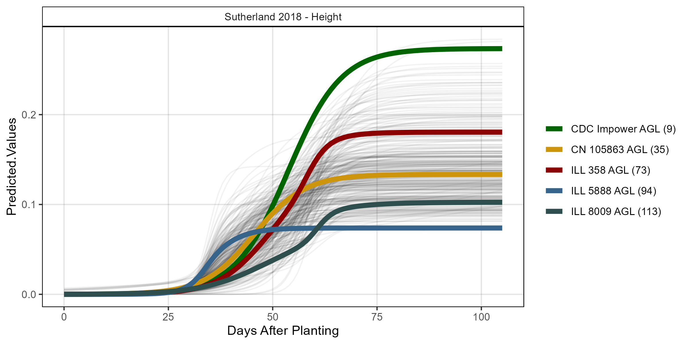
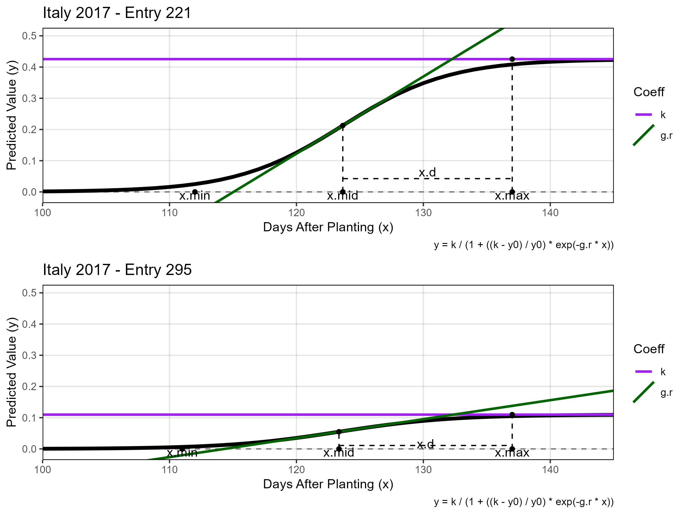
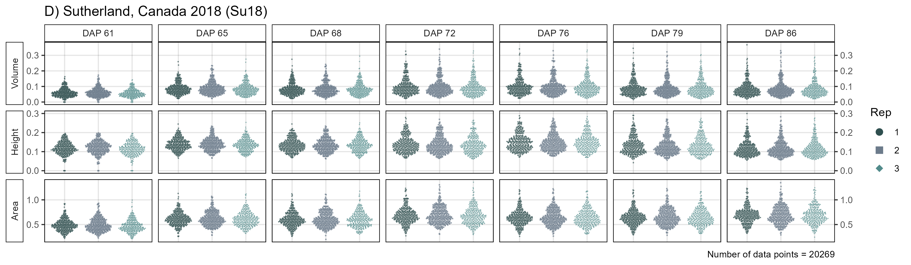
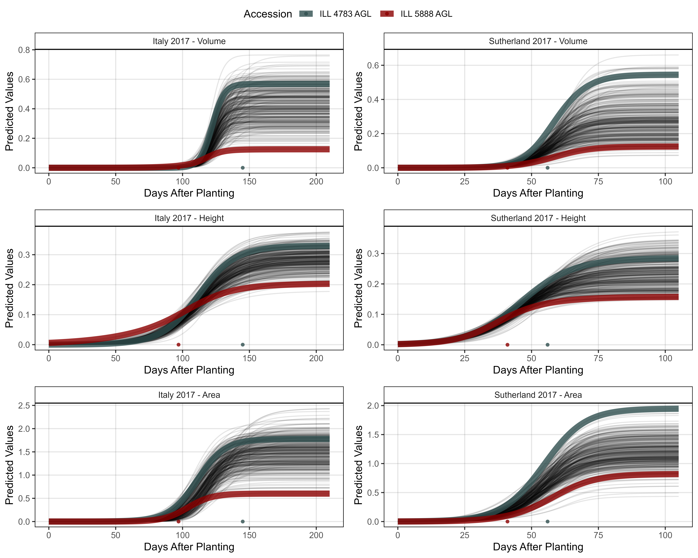
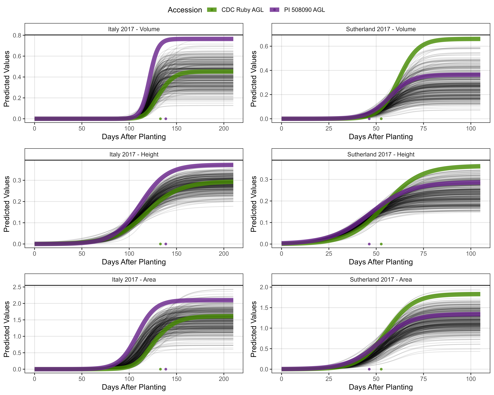
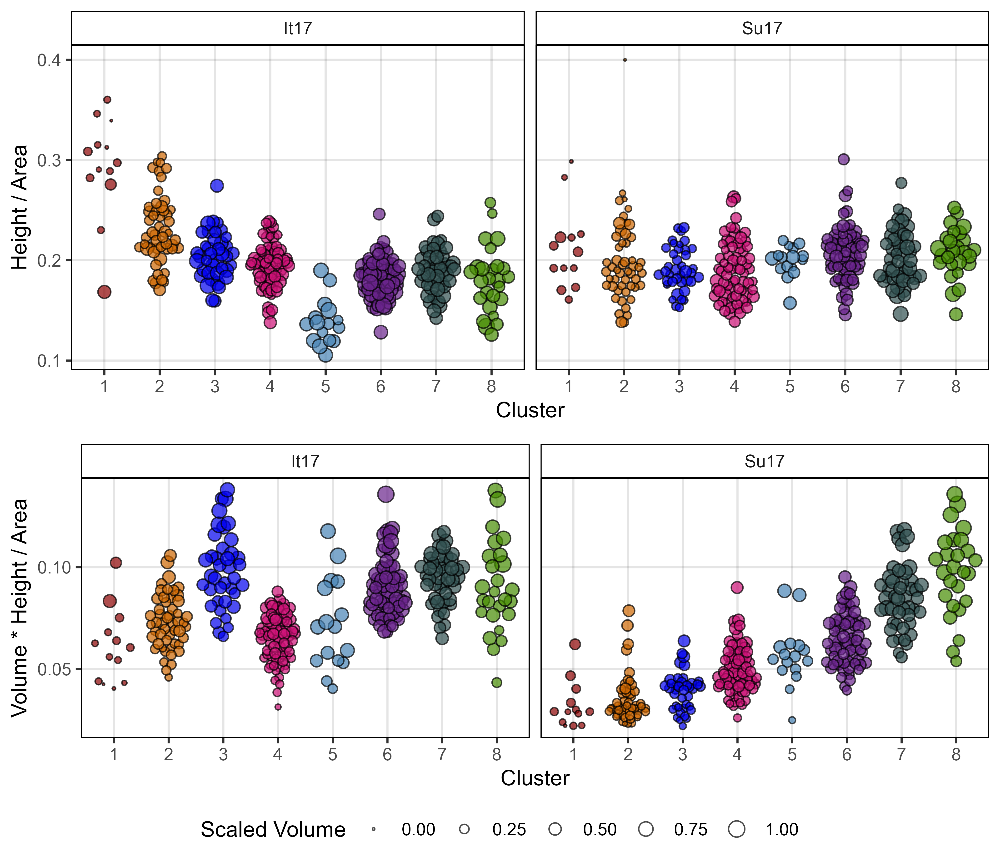
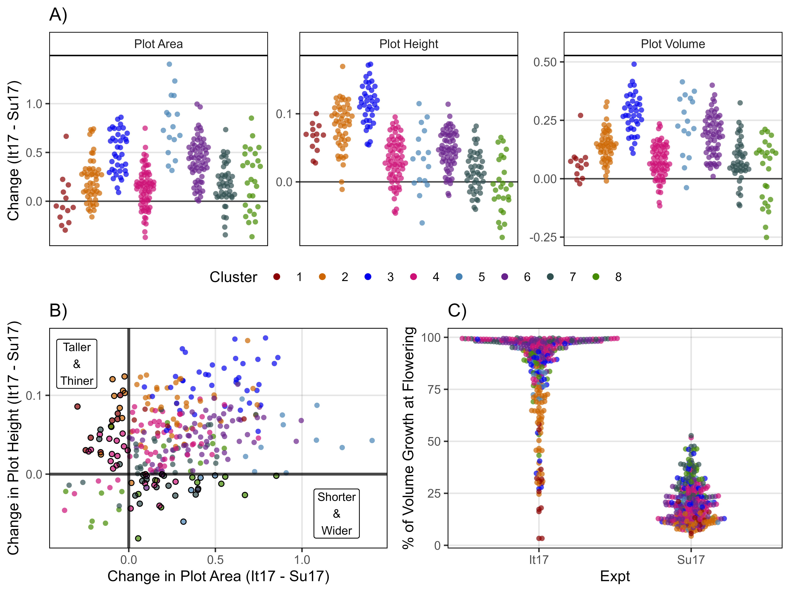
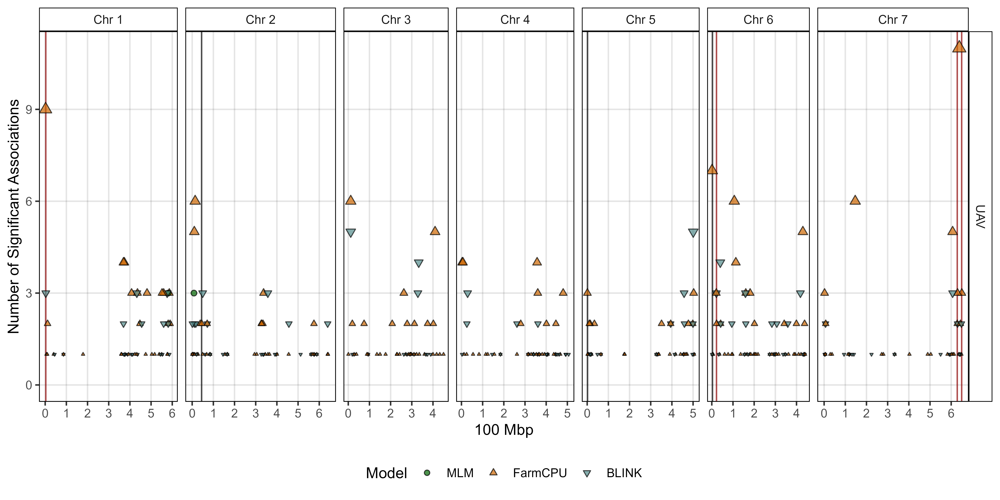

```{r setup, include=FALSE}
knitr::opts_chunk$set(eval = F, echo = T, message = F, warning = F, 
                      comment = NA, out.width = "100%")
```

---

# Introduction

This vignette contains the `R` code and analysis done for the paper:

> - `r shiny::icon("newspaper")` [Derek M. Wright, Sandesh Neupane, Steve Shirtliffe, Tania Gioia, Giuseppina Logozzo, Stefania Marzario, Karsten M.E. Neilson & Kirstin E. Bett. **Dissecting lentil crop growth in contrasting environments using digital imaging and genome-wide association studies**. *The Plant Phenome Journal*. (**2025**) 8(1): e70040. doi.org/10.1002/ppj2.70040](https://doi.org/10.1002/ppj2.70040){target="_blank"} 
> - `r shiny::icon("github")` [https://github.com/derekmichaelwright/AGILE_LDP_UAV](https://github.com/derekmichaelwright/AGILE_LDP_UAV){target="_blank"}

which is follow-up to:

> - `r shiny::icon("newspaper")` [Sandesh Neupane, Derek Wright, Raul Martinez, Jakob Butler, Jim Weller, Kirstin Bett. **Focusing the GWAS *Lens* on days to flower using latent variable phenotypes derived from global multi-environment trials**. *The Plant Genome*. (**2022**) 16(1): e20269. doi.org/10.1002/tpg2.20269](https://doi.org/10.1002/tpg2.20269){target="_blank"} 
> - `r shiny::icon("github")` [https://github.com/derekmichaelwright/AGILE_LDP_GWAS_Phenology](https://github.com/derekmichaelwright/AGILE_LDP_GWAS_Phenology){target="_blank"}

> - `r shiny::icon("newspaper")` [Derek M. Wright, Sandesh Neupane, Taryn Heidecker, Teketel A. Haile, Crystal Chan, Clarice J. Coyne, Rebecca J. McGee, Sripada Udupa, Fatima Henkrar, Eleonora Barilli, Diego Rubiales, Tania Gioia, Giuseppina Logozzo, Stefania Marzario, Reena Mehra, Ashutosh Sarker, Rajeev Dhakal, Babul Anwar, Debashish Sarker, Albert Vandenberg & Kirstin E. Bett. **Understanding photothermal interactions can help expand production range and increase genetic diversity of lentil (*Lens culinaris* Medik.)**. *Plants, People, Planet*. (**2021**) 3(2): 171-181. doi.org/10.1002/ppp3.10158](https://doi.org/10.1002/ppp3.10158){target="_blank"}
> - `r shiny::icon("github")` [https://github.com/derekmichaelwright/AGILE_LDP_Phenology](https://github.com/derekmichaelwright/AGILE_LDP_Phenology){target="_blank"}

---

This work done as part of the AGILE and P^2^IRC projects at the University of Saskatchewan:

{width=50%}

> https://knowpulse.usask.ca/study/AGILE-Application-of-Genomic-Innovation-in-the-Lentil-Economy

{width=50%}

> https://p2irc.usask.ca/

---

# Data

```{r}
# Load Libraries
library(tidyverse)
library(ggbeeswarm)
library(ggpubr)
library(plotly)
library(htmlwidgets)
library(growthcurver)
library(FactoMineR)
library(ggrepel)
library(lme4)
#
theme_AGL <- theme_bw() + 
  theme(strip.background   = element_rect(colour = "black", fill = NA, size = 0.5),
        panel.background   = element_rect(colour = "black", fill = NA, size = 0.5),
        panel.border       = element_rect(colour = "black", size = 0.5),
        panel.grid         = element_line(color  = alpha("black", 0.1), size = 0.5),
        panel.grid.minor.x = element_blank(), 
        panel.grid.minor.y = element_blank())
#
myExpts1 <- c("Metaponto, Italy 2017", "Rosthern, Canada 2017", 
              "Sutherland, Canada 2017", "Sutherland, Canada 2018")
myExpts2 <- c("It17", "Ro17", "Su17", "Su18")
myColors_Expt <- c("darkred", "darkgreen", "darkblue", "steelblue")
myColors_Cluster <- c("red4", "darkorange3", "blue2", "deeppink3", 
                      "steelblue", "darkorchid4", "darkslategray", "chartreuse4")
```

---

## Manual Phenotypes

> - `r shiny::icon("save")` [Data_Manual/myLDP.csv](Data_Manual/myLDP.csv)
> - `r shiny::icon("save")` [Data_Manual/LDP_Italy_2017_Phenotypes.csv](Data_Manual/LDP_Italy_2017_Phenotypes.csv)
> - `r shiny::icon("save")` [Data_Manual/LDP_Rosthern_2017_Phenotypes.csv](Data_Manual/LDP_Rosthern_2017_Phenotypes.csv)
> - `r shiny::icon("save")` [Data_Manual/LDP_Sutherland_2017_Phenotypes.csv](Data_Manual/LDP_Sutherland_2017_Phenotypes.csv)
> - `r shiny::icon("save")` [Data_Manual/LDP_Sutherland_2018_Phenotypes.csv](Data_Manual/LDP_Sutherland_2018_Phenotypes.csv)

```{r}
# LDP Metadata
myLDP <- read.csv("Data_Manual/myLDP.csv")
# Manual Phenotypes
it17_f <- read.csv("Data_Manual/LDP_Italy_2017_Phenotypes.csv") 
ro17_f <- read.csv("Data_Manual/LDP_Rosthern_2017_Phenotypes.csv")
su17_f <- read.csv("Data_Manual/LDP_Sutherland_2017_Phenotypes.csv")
su18_f <- read.csv("Data_Manual/LDP_Sutherland_2018_Phenotypes.csv")
```

---

## Drone phenotypes

Raw Data

> - `r shiny::icon("globe")` [Data_Drone/LDP_Italy_2017/](https://github.com/derekmichaelwright/AGILE_LDP_UAV/tree/main/Data_Drone/LDP_Italy_2017/){target="_blank"}
> - `r shiny::icon("globe")` [Data_Drone/LDP_Rosthern_2017/](https://github.com/derekmichaelwright/AGILE_LDP_UAV/tree/main/Data_Drone/LDP_Rosthern_2017/){target="_blank"}
> - `r shiny::icon("globe")` [Data_Drone/LDP_Sutherland_2017/](https://github.com/derekmichaelwright/AGILE_LDP_UAV/tree/main/Data_Drone/LDP_Sutherland_2017/){target="_blank"}
> - `r shiny::icon("globe")` [Data_Drone/LDP_Sutherland_2018/](https://github.com/derekmichaelwright/AGILE_LDP_UAV/tree/main/Data_Drone/LDP_Sutherland_2018/){target="_blank"}

Compiled Data

> - `r shiny::icon("save")` [Data_Drone/UAV_LDP_It17_data.csv](Data_Drone/UAV_LDP_It17_data.csv)
> - `r shiny::icon("save")` [Data_Drone/UAV_LDP_Ro17_data.csv](Data_Drone/UAV_LDP_Rot17_data.csv)
> - `r shiny::icon("save")` [Data_Drone/UAV_LDP_Su17_data.csv](Data_Drone/UAV_LDP_Su17_data.csv)
> - `r shiny::icon("save")` [Data_Drone/UAV_LDP_Su18_data.csv](Data_Drone/UAV_LDP_Su18_data.csv)

```{r}
# Function to read in the drone data
readDrone <- function(folder, colNum, xf) {
  fnames <- list.files(folder)
  xx <- NULL
  for(i in fnames) {
    xi <- read.csv(paste0(folder, i))
    xx <- bind_rows(xx, xi)
  }
  xx <- xx %>% 
    rename(Plot=plot_name, Date=mission_date, Sensor=sensor_type) %>%
    mutate(Plot = as.integer(Plot)) %>%
    gather(Trait, Value, colNum:ncol(.)) %>%
    left_join(xf[,1:10], by = "Plot") %>%
    filter(!is.na(Entry), !is.na(Value)) %>%
    mutate(DAP = as.numeric(as.Date(Date) - as.Date(Planting.Date)),
           Value_f = Value) %>%
    select(Expt, Row, Column, Plot, Rep, Entry, Name, 
           Planting.Date, DAP, Date, Sensor, Trait, Value, Value_f)
  xx
}
# Load drone data
it17_d <- readDrone(folder = "Data_Drone/LDP_Italy_2017/",
                    colNum = 6, xf = it17_f)
ro17_d <- readDrone(folder = "Data_Drone/LDP_Rosthern_2017/",
                    colNum = 7, xf = ro17_f)
su17_d <- readDrone(folder = "Data_Drone/LDP_Sutherland_2017/",
                    colNum = 7, xf = su17_f)
su18_d <- readDrone(folder = "Data_Drone/LDP_Sutherland_2018/",
                    colNum = 7, xf = su18_f)
```

Gather manual phenotypes

```{r}
it17_f <- it17_f %>% gather(Trait, Value, 11:ncol(.))
ro17_f <- ro17_f %>% gather(Trait, Value, 11:ncol(.))
su17_f <- su17_f %>% gather(Trait, Value, 11:ncol(.))
su18_f <- su18_f %>% gather(Trait, Value, 11:ncol(.))
```

---

# Prepare the Data

Filter Outliers and add extra data points for aiding growth curves

```{r}
# Function to add pseudo-data points to aid growthcurve creation
traitAdd <- function(xx, myTrait, myDAP, myValue) {
  for(i in unique(xx$Plot)) {
    xi <- xx %>% 
      filter(Trait == myTrait, Plot == i) %>%
      slice(1) %>%
      mutate(DAP = myDAP, Sensor = "NA", 
             Date = as.character(as.Date(Planting.Date) + myDAP), 
             Value = NA, Value_f = myValue)
    xx <- bind_rows(xi,xx)
  }
  xx
}
# Function to add pseudo-data points during the "stationary phase"
traitPredict <- function(xx, myDAP, myTrait) {
  for(i in unique(xx$Plot)) {
    xi <- xx %>% filter(Plot == i, Trait == myTrait)
    if(sum(!is.na(xi$Value_f)) > 0) {
      myVal <- xi %>% pull(Value_f) %>% max(na.rm = T)
      xi <- xi %>% slice(1) %>% 
        mutate(DAP = myDAP, Sensor = "NA", 
               Date = as.character(as.Date(Planting.Date) + myDAP), 
               Value = NA,
               Value_f = myVal)
      xx <- bind_rows(xx, xi)
    }
  }
  xx
}
# Function to find outliers after a certain DAP based on decreases from max
outliers_Maturity <- function(xx, myDAP, myThreshold = 1, predict = T,
                              myTrait, myOtherTraits ) {
  yy <- NULL
  for(i in unique(xx$Plot)) {
    myMax <- max(xx %>% filter(Plot == i, Trait == myTrait) %>% pull(Value_f), na.rm = T)
    xi <- xx %>% filter(Plot == i)
    daps_r <- xi %>% 
      filter(DAP >= myDAP, Trait == myTrait, Value_f < myMax * myThreshold ) %>% 
      pull(DAP)
    daps_r <- c(daps_r, unique(xi$DAP)[unique(xi$DAP)>daps_r])
    xi <- xi %>%
      mutate(Value_f = ifelse(DAP %in% daps_r, NA, Value_f))
    if(predict == T) {
      xi <- xi %>%
        mutate(Value_f = ifelse(DAP %in% daps_r & Trait == myTrait, 
                                myMax*0.99, Value_f))
      for(k in myOtherTraits) {
        myMax <- max(xi %>% filter(Trait == k) %>% pull(Value_f), na.rm = T)
        xi <- xi %>%
          mutate(Value_f = ifelse(DAP %in% daps_r & Trait == k, 
                                  myMax*0.99, Value_f))
      }
    }
    yy <- bind_rows(yy, xi)
  }
  yy
}
```

## Italy 2017

```{r}
# Add pseudo-data for day 0
it17_d <- traitAdd(xx = it17_d, myDAP = 0, myValue = 0, 
                   myTrait = "crop_volume_m3_excess.green.based")
it17_d <- traitAdd(xx = it17_d, myDAP = 0, myValue = 0,
                   myTrait = "crop_area_m2_excess.green.based")
it17_d <- traitAdd(xx = it17_d, myDAP = 0, myValue = 0,
                   myTrait = "mean_crop_height_m_excess.green.based")
# Plots with bad data
myPs <- c(619, 782, 713, 746, 10, 722, 796, 717, 829, 
          874, 767, 903, 866, 8, 707, 876, 24, 958, 614, 618,
          397, 2, 687, 12, 456, 665)
# Manually remove outlier data
it17_d <- it17_d %>%
  mutate(Value_f = ifelse(Plot %in% myPs, NA, Value_f),
         Value_f = ifelse(Plot == 3 & grepl("height|Volume",Trait) & DAP %in% c(101,119), 
                          NA, Value_f),
         Value_f = ifelse(Plot == 11 & grepl("height|Volume",Trait) & DAP == 119, 
                          NA, Value_f),
         Value_f = ifelse(Plot == 4 & grepl("height|Volume",Trait) & DAP == 101, 
                          NA, Value_f),
         Value_f = ifelse(Plot == 5 & grepl("height|Volume",Trait) & DAP == 164, 
                          NA, Value_f),
         Value_f = ifelse(Plot == 17 & grepl("height|Volume",Trait) & DAP == 164, 
                          NA, Value_f) )
#
it17_d <- outliers_Maturity(xx = it17_d, myDAP = 163,
            myTrait = "mean_crop_height_m_excess.green.based",
            myOtherTraits = c("crop_area_m2_excess.green.based",
                              "crop_volume_m3_excess.green.based",
                              "median_crop_height_m_excess.green.based",
                              "max_crop_height_m_excess.green.based") )
it17_d <- outliers_Maturity(xx = it17_d, myDAP = 163, 
            myTrait = "crop_volume_m3_excess.green.based",
            myOtherTraits = c("crop_area_m2_excess.green.based",
                              "mean_crop_height_m_excess.green.based",
                              "median_crop_height_m_excess.green.based",
                              "max_crop_height_m_excess.green.based") )
#
it17_d <- traitPredict(xx = it17_d, myDAP = 180,
                       myTrait = "crop_volume_m3_excess.green.based")
it17_d <- traitPredict(xx = it17_d, myDAP = 180,
                       myTrait = "crop_area_m2_excess.green.based")
it17_d <- traitPredict(xx = it17_d, myDAP = 180,
                       myTrait = "mean_crop_height_m_excess.green.based")
it17_d <- traitPredict(xx = it17_d, myDAP = 210,
                       myTrait = "crop_volume_m3_excess.green.based")
it17_d <- traitPredict(xx = it17_d, myDAP = 210,
                       myTrait = "crop_area_m2_excess.green.based")
it17_d <- traitPredict(xx = it17_d, myDAP = 210,
                       myTrait = "mean_crop_height_m_excess.green.based")
#
it17_d <- traitPredict(xx = it17_d, myDAP = 200,
                       myTrait = "crop_volume_m3_excess.green.based")
#
xx <- it17_d %>% 
  filter(Plot %in% c(456,665) & DAP %in% c(93,94),
         Trait == "crop_volume_m3_excess.green.based") %>% 
  mutate(Sensor = "NA", DAP = 10, 
         Date = as.character(as.Date(Planting.Date) + DAP),
         Value = NA, Value_f = 0.001)
it17_d <- it17_d %>% bind_rows(xx)
#
write.csv(it17_d, "Data_Drone/UAV_LDP_It17_data.csv", row.names = F)
```

## Rosthern 2017

```{r}
# Add pseudo-data for day 0
ro17_d <- traitAdd(xx = ro17_d, myDAP = 0, myValue = 0,
                   myTrait = "crop_volume_m3_blue.ndvi.based")
ro17_d <- traitAdd(xx = ro17_d, myDAP = 0, myValue = 0,
                   myTrait = "crop_area_m2_blue.ndvi.based")
ro17_d <- traitAdd(xx = ro17_d, myDAP = 0, myValue = 0,
                   myTrait = "mean_crop_height_m_blue.ndvi.based")
# Manually remove outlier data
ro17_d <- ro17_d %>% 
  mutate(Value_f = ifelse(Trait == "crop_volume_m3_blue.ndvi.based" &
                          Date %in% c("2017-06-12", "2017-06-20"), 
                          NA, Value_f),
         Value_f = ifelse(Trait == "crop_area_m2_blue.ndvi.based" &
                          Date %in% c("2017-06-12","2017-06-20","2017-06-27"), 
                          NA, Value_f),
         Value_f = ifelse(Trait == "mean_crop_height_m_blue.ndvi.based" &
                          Date %in% c("2017-06-12","2017-06-20") & Value > 0.2, 
                          NA, Value_f),
         Value_f = ifelse(Trait == "mean_crop_height_m_blue.ndvi.based" &
                          Date == "2017-06-28" & Value > 0.3, 
                          NA, Value_f) )
#
ro17_d <- outliers_Maturity(xx = ro17_d, myDAP = 75,
            myTrait = "crop_volume_m3_blue.ndvi.based",
            myOtherTraits = c("crop_area_m2_blue.ndvi.based",
                              "mean_crop_height_m_blue.ndvi.based",
                              "median_crop_height_m_blue.ndvi.based",
                              "max_crop_height_m_blue.ndvi.based"))
#
ro17_d <- traitPredict(xx = ro17_d, myDAP = 105,
                       myTrait = "crop_volume_m3_blue.ndvi.based")
ro17_d <- traitPredict(xx = ro17_d, myDAP = 105,
                       myTrait = "crop_area_m2_blue.ndvi.based")
ro17_d <- traitPredict(xx = ro17_d, myDAP = 105,
                       myTrait = "mean_crop_height_m_blue.ndvi.based")
ro17_d <- traitPredict(xx = ro17_d, myDAP = 110,
                       myTrait = "crop_volume_m3_blue.ndvi.based")
ro17_d <- traitPredict(xx = ro17_d, myDAP = 110,
                       myTrait = "crop_area_m2_blue.ndvi.based")
ro17_d <- traitPredict(xx = ro17_d, myDAP = 110,
                       myTrait = "mean_crop_height_m_blue.ndvi.based")
#
write.csv(ro17_d, "Data_Drone/UAV_LDP_Ro17_data.csv", row.names = F)
```

## Sutherland 2017

```{r}
# Prep data
su17_d <- su17_d %>% 
  mutate(Value_f = ifelse(Value_f == 0, NA, Value_f))
# Add pseudo-data for day 0
su17_d <- traitAdd(xx = su17_d, myDAP = 0, myValue = 0,
                   myTrait = "crop_volume_m3_blue.ndvi.based")
su17_d <- traitAdd(xx = su17_d, myDAP = 0, myValue = 0,
                   myTrait = "crop_area_m2_blue.ndvi.based")
su17_d <- traitAdd(xx = su17_d, myDAP = 0, myValue = 0,
                   myTrait = "mean_crop_height_m_blue.ndvi.based")
# Manually remove outlier data
su17_d <- su17_d %>% 
  mutate(Value_f = ifelse(Sensor == "ILCE-QX1" & Date == "2017-07-04",
                          NA, Value_f),
         Value_f = ifelse(Trait == "crop_volume_m3_blue.ndvi.based" & 
                          Date == "2017-06-05", NA, Value_f),
         Value_f = ifelse(Trait == "crop_area_m2_blue.ndvi.based" &
                          Date %in% c("2017-06-05", "2017-06-12"), 
                          NA, Value_f),
         Value_f = ifelse(Trait == "mean_crop_height_m_blue.ndvi.based" &
                          Date %in% c("2017-06-05", "2017-06-13", "2017-06-19", "2017-06-24") &
                          Value_f > 0.2, NA, Value_f),
         Value_f = ifelse(Trait %in% c("crop_volume_m3_blue.ndvi.based",
                                       "mean_crop_height_m_blue.ndvi.based") & 
                          Plot == 5573 & DAP == 51, 
                          NA, Value_f),
         Value_f = ifelse(Trait %in% c("crop_volume_m3_blue.ndvi.based",
                                       "mean_crop_height_m_blue.ndvi.based") & 
                          Plot == 5588, NA, Value_f),
         Value_f = ifelse(Plot == 6030, NA, Value_f))
#
su17_d <- outliers_Maturity(xx = su17_d, myDAP = 76,
                            myTrait = "crop_volume_m3_blue.ndvi.based",
                            myOtherTraits = c("crop_area_m2_blue.ndvi.based",
                                             "mean_crop_height_m_blue.ndvi.based",
                                             "median_crop_height_m_blue.ndvi.based",
                                             "max_crop_height_m_blue.ndvi.based"))
#
su17_d <- traitPredict(xx = su17_d, myDAP = 95,
                       myTrait = "crop_volume_m3_blue.ndvi.based")
su17_d <- traitPredict(xx = su17_d, myDAP = 95,
                       myTrait = "crop_area_m2_blue.ndvi.based")
su17_d <- traitPredict(xx = su17_d, myDAP = 95,
                       myTrait = "mean_crop_height_m_blue.ndvi.based")
su17_d <- traitPredict(xx = su17_d, myDAP = 105,
                       myTrait = "crop_volume_m3_blue.ndvi.based")
su17_d <- traitPredict(xx = su17_d, myDAP = 105,
                       myTrait = "crop_area_m2_blue.ndvi.based")
su17_d <- traitPredict(xx = su17_d, myDAP = 105,
                       myTrait = "mean_crop_height_m_blue.ndvi.based")
#
write.csv(su17_d, "Data_Drone/UAV_LDP_Su17_data.csv", row.names = F)
```

## Sutherland 2018

```{r}
# Add pseudo-data for day 0 and day 30
su18_d <- traitAdd(xx = su18_d, myDAP = 0, myValue = 0,
                   myTrait = "crop_volume_m3_excess.green.based")
su18_d <- traitAdd(xx = su18_d, myDAP = 0, myValue = 0,
                   myTrait = "crop_area_m2_excess.green.based")
su18_d <- traitAdd(xx = su18_d, myDAP = 0, myValue = 0,
                   myTrait = "mean_crop_height_m_excess.green.based")
#
su18_d <- traitAdd(xx = su18_d, myDAP = 30, myValue = 0.01,
                   myTrait = "crop_volume_m3_excess.green.based")
su18_d <- traitAdd(xx = su18_d, myDAP = 30, myValue = 0.05,
                   myTrait = "crop_area_m2_excess.green.based")
su18_d <- traitAdd(xx = su18_d, myDAP = 30, myValue = 0.01,
                   myTrait = "mean_crop_height_m_excess.green.based")
# Manually remove outlier data
su18_d <- su18_d %>% 
  mutate(Value_f = ifelse(DAP %in% c(42,55,58), NA, Value_f),
         Value_f = ifelse(Trait == "mean_crop_height_m_excess.green.based" &
                          DAP < 65 & Value_f > 0.2, 
                          NA, Value_f),
         Value_f = ifelse(Plot == 5689, NA, Value_f),
         Value_f = ifelse(Plot %in% c(5301,5648) & DAP == 61, NA, Value_f))
# 
xx <- su18_d %>% filter(Trait == "mean_crop_height_m_excess.green.based" & 
                        DAP < 65 & Value > 0.2)
#
su18_d <- su18_d %>%
  mutate(Value_f = ifelse(paste(Plot, DAP, Trait) %in% 
                            paste(xx$Plot, xx$DAP, "crop_volume_m3_excess.green.based"), 
                          NA, Value_f))
#
su18_d <- traitPredict(xx = su18_d, myDAP = 95,
                       myTrait = "crop_volume_m3_excess.green.based")
su18_d <- traitPredict(xx = su18_d, myDAP = 95,
                       myTrait = "crop_area_m2_excess.green.based")
su18_d <- traitPredict(xx = su18_d, myDAP = 95,
                       myTrait = "mean_crop_height_m_excess.green.based")
su18_d <- traitPredict(xx = su18_d, myDAP = 105,
                       myTrait = "crop_volume_m3_excess.green.based")
su18_d <- traitPredict(xx = su18_d, myDAP = 105,
                       myTrait = "crop_area_m2_excess.green.based")
su18_d <- traitPredict(xx = su18_d, myDAP = 105,
                       myTrait = "mean_crop_height_m_excess.green.based")
#
write.csv(su18_d, "Data_Drone/UAV_LDP_Su18_data.csv", row.names = F)
```

---

# Check Data

```{r}
# Create plotting function
ggDroneCheck <- function(xd = it17_d, xf = it17_f,
                         myTitle = NULL,
                         myFilename = "DataCheck/RawDrone_Italy_2017.pdf",
                         xt = c("crop_volume_m3_excess.green.based",
                                "crop_area_m2_excess.green.based",
                                "mean_ndyi", 
                                "mean_crop_height_m_excess.green.based",
                                "median_crop_height_m_excess.green.based", 
                                "max_crop_height_m_excess.green.based") ) {
  myColors <- c("darkgreen", "darkorange", "darkred")
  xd <- xd %>% arrange(Entry)
  #
  pdf(myFilename, width = 16, height = 10)
  for(i in unique(xd$Entry)) {
    xdi <- xd %>% filter(Entry == i)
    xfi <- xf %>% filter(Entry == i)
    j <- unique(xdi$Name)
    #
    ggPlotDrone <- function(xti=xt[1]) {
      yMax <- max(xd%>%filter(Trait==xti)%>%pull(Value_f), na.rm = T)
      xMax <- max(c(xd$DAP, xf%>%filter(Trait=="DTM")%>%pull(Value)), na.rm = T)
      xdtf <- xfi %>% filter(Trait == "DTF") 
      xdtm <- xfi %>% filter(Trait == "DTM") 
      xd <- xdi %>% filter(Trait == xti)
      xd2 <- xd %>% filter(!is.na(Value_f))
      ggplot(xd, aes(x = DAP, y = Value)) +
        geom_line(alpha = 0.2, color = "black", size = 1) +
        geom_line(data = xd2, aes(y = Value_f, color = as.factor(Rep)), 
                  size = 1.5, alpha = 0.7) +
        geom_point(aes(y = Value_f), color = "red", size = 0.5) + 
        geom_point(aes(shape = Sensor)) + 
        geom_vline(data = xdtf, aes(xintercept = Value), 
                   alpha = 0.5, color = "darkgreen") +
        geom_vline(data = xdtm, aes(xintercept = Value), 
                   alpha = 0.5, color = "darkorange", lty = 2) +
        facet_grid(. ~ paste(Rep, "-", Plot), scales = "free_y") +
        scale_color_manual(values = myColors) +
        theme_AGL +
        theme(legend.position = "none") +
        coord_cartesian(ylim = c(0,yMax), xlim = c(0,xMax)) + 
        labs(y = xti)
    }
    #
    mp1 <- ggPlotDrone(xti = xt[1])
    mp2 <- ggPlotDrone(xti = xt[2])
    mp3 <- ggPlotDrone(xti = xt[3])
    # Append
    mp <- ggarrange(mp1, mp2, mp3, ncol = 1, nrow = 3) %>%
      annotate_figure(top = text_grob(paste(myTitle, "Entry", i, j)))
    print(mp)
  }
  dev.off()
}
```

## Italy 2017

> - `r shiny::icon("file-pdf")` [Additional/ggDroneCheck_It17.pdf](Additional/ggDroneCheck_It17.pdf){target="_blank"}

```{r}
ggDroneCheck(xd = it17_d, xf = it17_f, myTitle = "Italy 2017",
             myFilename = "Additional/ggDroneCheck_It17.pdf",
             xt = c("crop_volume_m3_excess.green.based", 
                    "mean_crop_height_m_excess.green.based",
                    "crop_area_m2_excess.green.based") ) 
```

## Rosthern 2017

> - `r shiny::icon("file-pdf")` [Additional/ggDroneCheck_Ro17.pdf](Additional/ggDroneCheck_Ro17.pdf){target="_blank"}

```{r}
ggDroneCheck(xd = ro17_d, xf = ro17_f, myTitle = "Rosthern 2017",
             myFilename = "Additional/ggDroneCheck_Ro17.pdf",
             xt = c("crop_volume_m3_blue.ndvi.based", 
                    "mean_crop_height_m_blue.ndvi.based",
                    "crop_area_m2_blue.ndvi.based") )
```

## Sutherland 2017

> - `r shiny::icon("file-pdf")` [Additional/ggDroneCheck_Su17.pdf](Additional/ggDroneCheck_Su17.pdf){target="_blank"}

```{r}
ggDroneCheck(xd = su17_d, xf = su17_f, myTitle = "Sutherland 2017",
             myFilename = "Additional/ggDroneCheck_Su17.pdf",
             xt = c("crop_volume_m3_blue.ndvi.based", 
                    "mean_crop_height_m_blue.ndvi.based",
                    "crop_area_m2_blue.ndvi.based") )
```

## Sutherland 2018

> - `r shiny::icon("file-pdf")` [Additional/ggDroneCheck_Su18.pdf](Additional/ggDroneCheck_Su18.pdf){target="_blank"}

```{r}
ggDroneCheck(xd = su18_d, xf = su18_f, myTitle = "Sutherland 2018",
             myFilename = "Additional/ggDroneCheck_Su18.pdf",
             xt = c("crop_volume_m3_excess.green.based", 
                    "mean_crop_height_m_excess.green.based",
                    "crop_area_m2_excess.green.based") )
```

---

# Summarise Drone Data


```{r}
# Create plotting function
ggDroneTrait <- function(xx, myTitle, myDAPs = NULL, myTraits, myTraitNames) {
  # Prep data
  if(is.null(myDAPs)) { myDAPs <- unique(xx$DAP)[order(unique(xx$DAP))] }
  xx <- xx %>% filter(Trait %in% myTraits, DAP %in% myDAPs) %>%
    mutate(Trait = plyr::mapvalues(Trait, myTraits, myTraitNames),
           Trait = factor(Trait, levels = myTraitNames),
           Group = factor(paste("Rep", Rep), 
                        levels = c("Rep 1", "Rep 2", "Rep 3", "Outliers")),
           DAP = paste("DAP", DAP),
           DAP = factor(DAP, levels = paste("DAP", myDAPs)))
  xx <- xx %>% filter(!is.na(Value_f))
  # Plot
  ggplot(xx, aes(x = Rep, color = Group, pch = Group)) +
    geom_quasirandom(aes(y = Value_f), alpha = 0.25) +
    facet_grid(Trait ~ DAP, scales = "free_y", switch = "y") +
    scale_color_manual(name = NULL, 
                       values = c("darkslategray","steelblue","darkslategray4","black")) +
    scale_shape_manual(name = NULL, values = c(20,20,20,10)) +
    scale_y_continuous(sec.axis = sec_axis(~ .)) +
    theme_AGL +
    theme(legend.position = "bottom",
          axis.text.x = element_blank(),
          axis.ticks.x = element_blank()) +
    labs(title = myTitle, y = NULL, x = NULL)
}
# Italy 2017
xx <- it17_d %>%
  mutate(DAP = plyr::mapvalues(DAP, c(93, 101, 119, 133, 163), 
                               c(94, 100, 118, 132, 164)))
mp <- ggDroneTrait(xx = xx, myTitle = "Italy 2017", 
                   myDAPs = c(94,100,118,132,164),
                   myTraits = c("crop_volume_m3_excess.green.based",
                                "mean_crop_height_m_excess.green.based",
                                "crop_area_m2_excess.green.based"),
                   myTraitNames = c("Volume", "Height", "Area"))
ggsave("Additional/ggDroneTrait_It17.png", mp, width = 10, height = 4.5)
# Rosthern 2017
mp <- ggDroneTrait(xx = ro17_d, myTitle = "Rosthern 2017", 
                   myDAPs = c(24,32,40,54,61,67,74,80,89,95),
                   myTraits = c("crop_volume_m3_blue.ndvi.based",
                                "mean_crop_height_m_blue.ndvi.based",
                                "crop_area_m2_blue.ndvi.based"),
                   myTraitNames = c("Volume", "Height", "Area"))
ggsave("Additional/ggDroneTrait_Ro17.png", mp, width = 12, height = 3.5)
# Sutherland 2017
mp <- ggDroneTrait(xx = su17_d, myTitle = "Sutherland 2017", 
                   myDAPs = c(32,40,46,51,57,61,68,72,75,77,83),
                   myTraits = c("crop_volume_m3_blue.ndvi.based",
                                "mean_crop_height_m_blue.ndvi.based", 
                                "crop_area_m2_blue.ndvi.based"),
                   myTraitNames = c("Volume", "Height", "Area"))
ggsave("Additional/ggDroneTrait_Su17.png", mp, width = 12, height = 3.5)
# Sutherland 2018
mp <- ggDroneTrait(xx = su18_d, myTitle = "Sutherland 2018", 
                   myDAPs = c(42,55,58,61,65,68,72,76,79,86),
                   myTraits = c("crop_volume_m3_excess.green.based",
                                "mean_crop_height_m_excess.green.based",
                                "crop_area_m2_excess.green.based"),
                   myTraitNames = c("Volume", "Height", "Area"))
ggsave("Additional/ggDroneTrait_Su18.png", mp, width = 12, height = 3.5)
```

---

# Model Growth Curves

```{r}
# Create function for modeling growth curves
myGrowthCurve <- function(xd, xf, myFolder, myFilename, 
                          myTrait, myOrder = "Entries") {
  # Prep data
  xd <- xd %>% filter(Trait == myTrait)
  xm <- xf %>% select(Plot, Rep, Entry, Name, Expt, Planting.Date) %>% 
    filter(!duplicated(Plot))
  #
  xg <- NULL # Growth curve coefficients
  xp <- NULL # Predicted Values
  for(i in unique(xd$Plot)) {
    xgi <- NULL
    xdi <- xd %>% arrange(DAP) %>%
      filter(Plot == i, !is.na(Value_f))
    #
    if(nrow(xdi) > 2) {
      fit <- SummarizeGrowth(data_t = xdi$DAP, 
                             data_n = xdi$Value_f,
                             bg_correct = "none")
      #
      suppressMessages( xgi <- bind_rows(xgi, data.frame(t(c(i, unlist(fit$vals))))) )
      #
      xgi <- xgi %>% rename(y0=n0, y0_se=n0_se, y0_p=n0_p, x_mid=t_mid)
      for(k in 1:(ncol(xgi)-1)) { xgi[,k] <- as.numeric(xgi[,k]) }
      xgi <- xgi %>% mutate(y_mid = k/(1 + ((k - y0)/y0) * exp(-r * x_mid)),
                          b = -((r * x_mid) - y_mid) )
      #
      myDays <- min(xd$DAP):max(xd$DAP)
      xpi <- data.frame(Plot = i, DAP = myDays,
                       Predicted.Values = xgi$k/(1 + ((xgi$k - xgi$y0)/xgi$y0) * exp(-xgi$r * myDays)))
      xp <- bind_rows(xp, xpi)
      #
      gdays <- xpi %>% filter(DAP > (xgi$x_mid - 3), DAP < (xgi$x_mid + 3))
      if(nrow(gdays)>0) {
        myLM <- lm(Predicted.Values ~ DAP, gdays)
        xgi <- xgi %>% mutate(g.b = myLM[[1]][1],
                              g.r = myLM[[1]][2] )
      }
      #
      xpi_max <- xpi %>% filter(Predicted.Values >= xgi$k*0.95) %>% arrange(Predicted.Values) %>% slice(1)
      if(nrow(xpi_max)==0) { 
        xpi_max <- xpi %>% 
          filter(Predicted.Values >= xgi$k*0.94) %>% 
          arrange(Predicted.Values) %>% slice(1) 
      }
      if(nrow(xpi_max)==0) { 
        xpi_max <- xpi %>% 
          filter(Predicted.Values >= xgi$k*0.90) %>% 
          arrange(Predicted.Values) %>% slice(1) 
      }
      xpi_min <- xpi %>% filter(Predicted.Values >= xgi$k*0.05) %>% arrange(Predicted.Values) %>% slice(1)
      xgi$x.max <- ifelse(is.null(nrow(xpi_max)), max(xpi$DAP), xpi_max$DAP)
      xgi$x.min <- xpi_min$DAP
      xgi$x.d <- xgi$x.max - xgi$x_mid 
      xg <- bind_rows(xg, xgi)
    }
  }
  #
  xg[xg=="0"] <- NA
  xg <- xg %>% rename(Plot=1) %>%
    mutate(Plot = as.integer(Plot)) %>%
    left_join(xm, by = "Plot") %>%
    select(Plot, Rep, Entry, Name, Expt, Planting.Date,
           r, b, g.r, g.b, k, x.min, x.mid=x_mid, x.max, 
           x.d, x.gen=t_gen, auc.l=auc_l, auc.e=auc_e, y0, sigma, 
           r.se=r_se, r.p=r_p, k.se=k_se, k.p=k_p, y0.se=y0_se, y0.p=y0_p, df, note)
  xp <- xp %>% 
    left_join(xm, by = "Plot") %>%
    select(Plot, Rep, Entry, Name, Expt, Planting.Date, DAP, Predicted.Values)
  #
  yMax <- max(xd$Value_f, na.rm = T)
  xMax <- max(xd$DAP, na.rm = T)
  xpm <- NULL
  #
  if(myOrder == "Entries") { myOrders <- 1:324 }
  if(myOrder == "DTF") { myOrders <- xg %>% arrange(k) %>% pull(Entries) %>% unique() }
  #
  pdf(paste0(myFolder, "PDF_", myFilename, ".pdf"), width = 8, height = 4)
  for(i in myOrders) {
    xdi <- xd %>% filter(Entry == i, !is.na(Value_f))
    xfi <- xf %>% filter(Entry == i)
    xgi <- xg %>% filter(Entry == i)
    xpi <- xp %>% filter(Entry == i)
    #
    xpmi <- xpi %>% group_by(Entry, Name, DAP) %>%
      summarise(Predicted.Values = mean(Predicted.Values, na.rm = T))
    xpm <- bind_rows(xpm, xpmi)
    #
    xdtf <- xfi %>% filter(Trait == "DTF") 
    xdtm <- xfi %>% filter(Trait == "DTM") 
    xdtf2 <- xdtf %>% group_by(Entry) %>% summarise(Value = mean(Value, na.rm =T))
    xdtm2 <- xdtm %>% group_by(Entry) %>% summarise(Value = mean(Value, na.rm =T))
    myDays <- min(xdi$DAP):max(xdi$DAP)  
    #
    myTitle <- unique(paste(stringr::str_pad(xdi$Entry, 3, pad = "0"), "|", xdi$Name))
    # Plot
    mp1 <- ggplot(xdi, aes(x = DAP)) +
      geom_vline(data = xdtf, aes(xintercept = Value), color = "darkgreen", alpha = 0.5) +
      geom_vline(data = xdtm, aes(xintercept = Value), color = "darkorange", alpha = 0.5) +
      geom_point(aes(y = Value_f), color = "red", alpha = 0.7) +
      geom_point(aes(y = Value), alpha = 0.5) +
      geom_line(data = xpi, aes(y = Predicted.Values), alpha = 0.8) +
      facet_grid(. ~ paste(Rep, Plot, sep = "-")) +
      coord_cartesian(ylim = c(0,yMax), xlim = c(0,xMax)) +
      theme_AGL +
      labs(title = myTitle, y = myTrait)
    mp2 <- ggplot(xpi, aes(x = DAP, y = Predicted.Values)) +
      geom_vline(data = xdtf2, aes(xintercept = Value), color = "darkgreen", alpha = 0.5) +
      geom_vline(data = xdtm2, aes(xintercept = Value), color = "darkorange", alpha = 0.5) +
      geom_line(alpha = 0.3, aes(group = Plot)) +
      geom_line(data = xpmi, color = "red") +
      facet_grid(. ~ paste("Entry",Entry)) +
      coord_cartesian(ylim = c(0,yMax), xlim = c(0,xMax)) +
      theme_AGL +
      labs(title = "")
    # Append
    mp <- ggarrange(mp1, mp2, widths = c(1,0.5))
    print(mp)
  }
  dev.off()
  #
  list(xd, # Input data 
       xg, # Growth curve coefficients
       xp, # Predicted Values
       xpm) # Predicted Values (means)
}
# Create function for plotting the growth curves
ggGrowthCurve <- function(xpm, myTitle = NULL, 
                          myEntries = c(9, 35, 73, 94, 113),
                          myColors = c("darkgreen", "darkgoldenrod3", "darkred",
                                       "steelblue4", "darkslategray") ) {
  # Prep data
  if(sum(colnames(xpm)=="Expt")==0) { xpm <- xpm %>% mutate(Expt = myTitle) }
  xpe <- xpm %>% filter(Entry %in% myEntries) %>%
    mutate(Entry = factor(Entry, levels = myEntries))
  # Plot
  mp <- ggplot(xpm, aes(x = DAP, y = Predicted.Values, group = Entry, key1 = Name)) +
    geom_line(alpha = 0.05) +
    geom_line(data = xpe, size = 2, aes(color = paste0(Name," (",Entry,")"))) +
    facet_grid(. ~ Expt, scales = "free_x", space = "free_x") +
    scale_color_manual(name = NULL, values = myColors) +
    theme_AGL + 
    labs(x = "Days After Planting")
  mp
}
```

## Italy 2017

> - `r shiny::icon("file-pdf")` [Additional/PDF_It17_volume.pdf](Additional/PDF_It17_volume.pdf){target="_blank"}
> - `r shiny::icon("chart-line")` [Additional/ggpGrowthCurves_It17_volume.html](Additional/ggpGrowthCurves_It17_volume.html){target="_blank"}


> - `r shiny::icon("file-pdf")` [Additional/PDF_It17_area.pdf](Additional/PDF_It17_area.pdf){target="_blank"}
> - `r shiny::icon("chart-line")` [Additional/ggpGrowthCurves_It17_area.html](Additional/ggpGrowthCurves_It17_area.html){target="_blank"}


> - `r shiny::icon("file-pdf")` [Additional/PDF_It17_height.pdf](Additional/PDF_It17_height.pdf){target="_blank"}
> - `r shiny::icon("chart-line")` [Additional/ggpGrowthCurves_It17_height.html](Additional/ggpGrowthCurves_It17_height.html){target="_blank"}


```{r}
# Volume
it17_gc.v <- myGrowthCurve(xd = it17_d, xf = it17_f,
                           myFolder = "Additional/", myFilename = "It17_volume",
                           myTrait = "crop_volume_m3_excess.green.based")
mp <- ggGrowthCurve(xpm = it17_gc.v[[4]], myTitle = "Italy 2017 - Volume")
ggsave("Additional/ggGrowthCurves_It17_volume.png", mp, width = 8, height = 4)
mp <- ggplotly(mp)
saveWidget(mp, file="Additional/ggpGrowthCurves_It17_volume.html")
# Area
it17_gc.a <- myGrowthCurve(xd = it17_d, xf = it17_f,
                           myFolder = "Additional/", myFilename = "It17_area",
                           myTrait = "crop_area_m2_excess.green.based")
mp <- ggGrowthCurve(xpm = it17_gc.a[[4]], myTitle = "Italy 2017 - Area")
ggsave("Additional/ggGrowthCurves_It17_area.png", mp, width = 8, height = 4)
mp <- ggplotly(mp)
saveWidget(mp, file="Additional/ggpGrowthCurves_It17_area.html")
# Height
it17_gc.h <- myGrowthCurve(xd = it17_d, xf = it17_f,
                           myFolder = "Additional/", myFilename = "It17_height",
                           myTrait = "mean_crop_height_m_excess.green.based")
mp <- ggGrowthCurve(xpm = it17_gc.h[[4]], myTitle = "Italy 2017 - Height")
ggsave("Additional/ggGrowthCurves_It17_height.png", mp, width = 8, height = 4)
mp <- ggplotly(mp)
htmlwidgets::saveWidget(mp, file="Additional/ggpGrowthCurves_It17_height.html")
```

## Rosthern 2017

> - `r shiny::icon("file-pdf")` [Additional/PDF_Ro17_volume.pdf](Additional/PDF_Ro17_volume.pdf){target="_blank"}
> - `r shiny::icon("chart-line")` [Additional/ggpGrowthCurves_Ro17_volume.html](Additional/ggpGrowthCurves_Ro17_volume.html){target="_blank"}


> - `r shiny::icon("file-pdf")` [Additional/PDF_Ro17_area.pdf](Additional/PDF_Ro17_area.pdf){target="_blank"}
> - `r shiny::icon("chart-line")` [Additional/ggpGrowthCurves_Ro17_area.html](Additional/ggpGrowthCurves_Ro17_area.html){target="_blank"}


> - `r shiny::icon("file-pdf")` [Additional/PDF_Ro17_height.pdf](Additional/PDF_Ro17_height.pdf){target="_blank"}
> - `r shiny::icon("chart-line")` [Additional/ggpGrowthCurves_Ro17_height.html](Additional/ggpGrowthCurves_Ro17_height.html){target="_blank"}


```{r}
# Volume
ro17_gc.v <- myGrowthCurve(xd = ro17_d, xf = ro17_f,
                           myFolder = "Additional/", myFilename = "Ro17_volume",
                           myTrait = "crop_volume_m3_blue.ndvi.based")
mp <- ggGrowthCurve(xpm = ro17_gc.v[[4]], myTitle = "Rosthern 2017 - Volume")
ggsave("Additional/ggGrowthCurves_Ro17_volume.png", mp, width = 8, height = 4) 
mp <- ggplotly(mp)
htmlwidgets::saveWidget(mp, file="Additional/ggpGrowthCurves_Ro17_volume.html")
# Area
ro17_gc.a <- myGrowthCurve(xd = ro17_d, xf = ro17_f,
                           myFolder = "Additional/", myFilename = "Ro17_area",
                           myTrait = "crop_area_m2_blue.ndvi.based")
mp <- ggGrowthCurve(xpm = ro17_gc.a[[4]], myTitle = "Rosthern 2017 - Area")
ggsave("Additional/ggGrowthCurves_Ro17_area.png", mp, width = 8, height = 4) 
mp <- ggplotly(mp)
htmlwidgets::saveWidget(mp, file="Additional/ggpGrowthCurves_Ro17_area.html")
# Height
ro17_gc.h <- myGrowthCurve(xd = ro17_d, xf = ro17_f,
                           myFolder = "Additional/", myFilename = "Ro17_height",
                           myTrait = "mean_crop_height_m_blue.ndvi.based")
mp <- ggGrowthCurve(xpm = ro17_gc.h[[4]], myTitle = "Rosthern 2017 - Height")
ggsave("Additional/ggGrowthCurves_Ro17_height.png", mp, width = 8, height = 4) 
mp <- ggplotly(mp)
htmlwidgets::saveWidget(mp, file="Additional/ggpGrowthCurves_Ro17_height.html")
```

## Sutherland 2017

> - `r shiny::icon("file-pdf")` [Additional/PDF_Su17_volume.pdf](Additional/PDF_Su17_volume.pdf){target="_blank"}
> - `r shiny::icon("chart-line")` [Additional/ggpGrowthCurves_Su17_volume.html](Additional/ggpGrowthCurves_Su17_volume.html){target="_blank"}


> - `r shiny::icon("file-pdf")` [Additional/PDF_Su17_area.pdf](Additional/PDF_Su17_area.pdf){target="_blank"}
> - `r shiny::icon("chart-line")` [Additional/ggpGrowthCurves_Su17_area.html](Additional/ggpGrowthCurves_Su17_area.html){target="_blank"}


> - `r shiny::icon("file-pdf")` [Additional/PDF_Su17_height.pdf](Additional/PDF_Su17_height.pdf){target="_blank"}
> - `r shiny::icon("chart-line")` [Additional/ggpGrowthCurves_Su17_height.html](Additional/ggpGrowthCurves_Su17_height.html){target="_blank"}


```{r}
# Volume
su17_gc.v <- myGrowthCurve(xd = su17_d %>% filter(Plot!=5604), 
                           xf = su17_f, 
                           myFolder = "Additional/", myFilename = "Su17_volume",
                           myTrait = "crop_volume_m3_blue.ndvi.based")
mp <- ggGrowthCurve(xpm = su17_gc.v[[4]], myTitle = "Sutherland 2017 - Volume")
ggsave("Additional/ggGrowthCurves_Su17_volume.png", mp, width = 8, height = 4)
mp <- ggplotly(mp)
htmlwidgets::saveWidget(mp, file="Additional/ggpGrowthCurves_Su17_volume.html")
# Area
su17_gc.a <- myGrowthCurve(xd = su17_d, xf = su17_f,
                           myFolder = "Additional/", myFilename = "Su17_area",
                           myTrait = "crop_area_m2_blue.ndvi.based")
mp <- ggGrowthCurve(xpm = su17_gc.a[[4]], myTitle = "Sutherland 2017 - Area")
ggsave("Additional/ggGrowthCurves_Su17_area.png", mp, width = 8, height = 4)
mp <- ggplotly(mp)
htmlwidgets::saveWidget(mp, file="Additional/ggpGrowthCurves_Su17_area.html")
# Height
su17_gc.h <- myGrowthCurve(xd = su17_d, xf = su17_f,
                           myFolder = "Additional/", myFilename = "Su17_height",
                           myTrait = "mean_crop_height_m_blue.ndvi.based")
mp <- ggGrowthCurve(xpm = su17_gc.h[[4]], myTitle = "Sutherland 2017 - Height")
ggsave("Additional/ggGrowthCurves_Su17_height.png", mp, width = 8, height = 4)
mp <- ggplotly(mp)
htmlwidgets::saveWidget(mp, file="Additional/ggpGrowthCurves_Su17_height.html")
```

## Sutherland 2018

> - `r shiny::icon("file-pdf")` [Additional/PDF_Su18_volume.pdf](Additional/PDF_Su18_volume.pdf){target="_blank"}
> - `r shiny::icon("chart-line")` [Additional/ggpGrowthCurves_Su18_volume.html](Additional/ggpGrowthCurves_Su18_volume.html){target="_blank"}


> - `r shiny::icon("file-pdf")` [Additional/PDF_Su18_area.pdf](Additional/PDF_Su18_area.pdf){target="_blank"}
> - `r shiny::icon("chart-line")` [Additional/ggpGrowthCurves_Su18_area.html](Additional/ggpGrowthCurves_Su18_area.html){target="_blank"}


> - `r shiny::icon("file-pdf")` [Additional/PDF_Su18_height.pdf](Additional/PDF_Su18_height.pdf){target="_blank"}
> - `r shiny::icon("chart-line")` [Additional/ggpGrowthCurves_Su18_height.html](Additional/ggpGrowthCurves_Su18_height.html){target="_blank"}



```{r}
# Volume
su18_gc.v <- myGrowthCurve(xd = su18_d, xf = su18_f, 
                           myFolder = "Additional/", myFilename = "Su18_volume",
                           myTrait = "crop_volume_m3_excess.green.based")
mp <- ggGrowthCurve(xpm = su18_gc.v[[4]], myTitle = "Sutherland 2018 - Volume")
ggsave("Additional/ggGrowthCurves_Su18_volume.png", mp, width = 8, height = 4)
mp <- ggplotly(mp)
htmlwidgets::saveWidget(mp, file="Additional/ggpGrowthCurves_Su18_volume.html")
# Area
su18_gc.a <- myGrowthCurve(xd = su18_d, xf = su18_f,
                           myFolder = "Additional/", myFilename = "Su18_area",
                           myTrait = "crop_area_m2_excess.green.based")
mp <- ggGrowthCurve(xpm = su18_gc.a[[4]], myTitle = "Sutherland 2018 - Area")
ggsave("Additional/ggGrowthCurves_Su18_area.png", mp, width = 8, height = 4)
mp <- ggplotly(mp)
htmlwidgets::saveWidget(mp, file="Additional/ggpGrowthCurves_Su18_area.html")
# Height
su18_gc.h <- myGrowthCurve(xd = su18_d, xf = su18_f,
                           myFolder = "Additional/", myFilename = "Su18_height",
                           myTrait = "mean_crop_height_m_excess.green.based")
mp <- ggGrowthCurve(xpm = su18_gc.h[[4]], myTitle = "Sutherland 2018 - Height")
ggsave("Additional/ggGrowthCurves_Su18_height.png", mp, width = 8, height = 4)
mp <- ggplotly(mp)
htmlwidgets::saveWidget(mp, file="Additional/ggpGrowthCurves_Su18_height.html")
```

---

```{r echo = F, eval = F}
#save.image("growthRenv.RData")
load("growthRenv.RData")
```

```{r echo = F, eval = F}
# Prep data for Knowpulse
x1 <- select(it17_d, -Value_f) %>% spread(Trait, Value) %>% filter(Sensor != "NA") %>% 
  mutate(Location = "Metaponto, Italy")
x2 <- select(ro17_d, -Value_f) %>% spread(Trait, Value) %>% filter(Sensor != "NA") %>% 
  mutate(Location = "Rosthern, Canada")
x3 <- select(su17_d, -Value_f) %>% spread(Trait, Value) %>% filter(Sensor != "NA") %>% 
  mutate(Location = "Sutherland, Canada")
x4 <- select(su18_d, -Value_f) %>% spread(Trait, Value) %>% filter(Sensor != "NA") %>% 
  mutate(Location = "Sutherland, Canada")
```

# Figure 1 - EnvData


```{r}
# Prep data
xE <- read.csv("https://raw.githubusercontent.com/derekmichaelwright/AGILE_LDP_Phenology/master/data/data_env.csv") %>%
  rename(`Days After Planting`=DaysAfterPlanting) %>%
  filter(Expt %in% myExpts1) %>%
  select(Expt, `Days After Planting`, DayLength, Temp_mean) %>%
  gather(Trait, Value, DayLength, Temp_mean) %>%
  mutate(Unit = ifelse(Trait == "DayLength", "Hours", "Degrees Celcius"),
         Trait = plyr::mapvalues(Trait, c("DayLength", "Temp_mean"), 
                                 c("DayLength", "Mean Temperature")))
yy <- bind_rows(it17_f %>% filter(Trait == "DTF"),
                ro17_f %>% filter(Trait == "DTF"),
                su17_f %>% filter(Trait == "DTF"),
                su18_f %>% filter(Trait == "DTF") ) %>%
  mutate(Expt = plyr::mapvalues(Expt, myExpts2, myExpts1)) %>%
  group_by(Expt, Name) %>% 
  summarise(Value = mean(Value, na.rm = T))
# Plot
mp1 <- ggplot(yy, aes(x = Value, fill = Expt)) +
  geom_density(alpha = 0.7) +
  scale_fill_manual(values = myColors_Expt) +
  scale_x_continuous(breaks = seq(30, 160, by = 10)) +
  theme_AGL +
  theme(legend.position = "none") +
  labs(title = "A) Days To Flower", 
       x = "Days After Planting", y = "Density")
#
mp2 <- ggplot(xE %>% filter(Trait == "DayLength"), 
              aes(x = `Days After Planting`, y = Value, color = Expt)) +
  geom_line(size = 1.25, alpha = 0.7) +
  scale_color_manual(values = myColors_Expt) +
  theme_AGL +
  theme(legend.position = "bottom") +
  labs(title = "B) Day Length", 
       y = "Hours", x = "Days After Planting")
#
mp3 <- ggplot(xE %>% filter(Trait == "Mean Temperature"), 
              aes(x = `Days After Planting`, y = Value, color = Expt)) +
  geom_line(size = 0.75, alpha = 0.7) +
  scale_color_manual(values = myColors_Expt) +
  theme_AGL +
  theme(legend.position = "bottom") +
  labs(title = "C) Mean Temperature", 
       y = "Degrees Celcius", x = "Days After Planting")
# Append
mp <- ggarrange(mp1, ggarrange(mp2, mp3, ncol = 2, nrow = 1, 
                               common.legend = T, legend = "bottom"), 
                ncol = 1, nrow = 2, heights = c(0.75,1) )
ggsave("Figure_01.jpg", mp, width = 8, height = 6, dpi = 600, bg = "white")
```

---

# Figure 2 - Growth Curve Coefficients


```{r}
# Create plotting function
ggGrowthCoefs <- function(xd, xf, myPlot, myYmax = NULL, 
                          minDAP = NULL, maxDAP = NULL, 
                          myTitle = NULL, mySubtitle = F) {
  # Prep data
  if(is.null(minDAP)) { minDAP <- min(xd[[3]]$DAP) }
  if(is.null(maxDAP)) { maxDAP <- max(xd[[3]]$DAP) }
  if(is.null(myYmax)) { myYmax <- max(xd[[2]]$k) }
  #
  x1 <- xd[[2]] %>% filter(Plot == myPlot)
  x2 <- xd[[3]] %>% filter(Plot == myPlot)
  #
  if(mySubtitle == T) { 
    mySubtitle <- paste("Plot", x1$Plot, "| Entry", x1$Entry, "|",  x1$Name) 
  } else { mySubtitle <- NULL }
  # Plot
  ggplot(x1) +
    #
    geom_hline(yintercept = 0, lty = 2, alpha = 0.5) +
    geom_line(data = x2, aes(x = DAP, y = Predicted.Values), size = 1.5) +
    #
    geom_hline(aes(yintercept = k, color = "k"), size = 1) +
    geom_abline(aes(slope = g.r, intercept = g.b, color = "g.r"), size = 1) +
    geom_point(aes(x = x.mid, y = k/2)) +
    #
    geom_point(aes(x = x.min), y = 0) +
    geom_text(aes(x = x.min), y = -0.01, label = "x.min") +
    #
    geom_segment(y = 0, aes(x = x.mid, xend = x.mid, yend = k/2), lty = 2) +
    geom_point(y = 0, aes(x = x.mid)) +
    geom_text(y = -0.01, aes(x = x.mid, label = "x.mid")) +
    #
    geom_segment(y = 0, aes(x = x.max, xend = x.max, yend = k), lty = 2) +
    geom_point(aes(x = x.max, y = k)) +
    geom_point(aes(x = x.max, y = 0)) +
    geom_text(aes(x = x.max, y = -0.01), label = "x.max") +
    #
    geom_segment(aes(x = x.mid, xend = x.max, y = k/10, yend = k/10), lty = 2) +
    geom_text(aes(x = x.max-((x.max-x.mid)/2), y = 1.5*k/10), label = "x.d") +
    #
    theme_AGL +
    scale_color_manual(name = "Coeff", breaks = c("k","r","g.r"),
                       values = c("purple","steelblue","darkgreen")) +
    scale_x_continuous(limits = c(minDAP, maxDAP), expand = c(0,0)) +
    ylim(c(-0.01, myYmax)) +
    labs(title = myTitle, subtitle = mySubtitle,
         y = "Predicted Value (y)", x = "Days After Planting (x)",
         caption = "y = k / (1 + ((k - y0) / y0) * exp(-g.r * x))")
}
#
mp <- ggGrowthCoefs(xd = ro17_gc.v, xf = ro17_f, myPlot = 6322, 
                     myYmax = 0.175, minDAP = 20, maxDAP = 65)
ggsave("Figure_02.jpg", mp, width = 6, height = 3, dpi = 600)
```

---

## Additional Figures 1 - Growth Curve Coefficients




```{r}
# Italy - Entry 221 vs 295
mp1 <- ggGrowthCoefs(xd = it17_gc.v, xf = it17_f, myPlot = 229, 
                     myTitle = "Italy 2017 - Entry 221",
                     myYmax = 0.5, minDAP = 100, maxDAP = 145)
mp2 <- ggGrowthCoefs(xd = it17_gc.v, xf = it17_f, myPlot = 225, 
                     myTitle = "Italy 2017 - Entry 295", 
                     myYmax = 0.5, minDAP = 100, maxDAP = 145)
mp <- ggarrange(mp1, mp2, ncol = 1)
ggsave("Additional/Additional_Figure_01_1.png", mp, width = 8, height = 6)
# Rosthern - Entry 76 vs 94
mp1 <- ggGrowthCoefs(xd = ro17_gc.v, xf = ro17_f, myPlot = 6986, 
                     myTitle = "Rosthern 2017 - Entry 76", 
                     myYmax = 0.25, minDAP = 25, maxDAP = 65)
mp2 <- ggGrowthCoefs(xd = ro17_gc.v, xf = ro17_f, myPlot = 6322, 
                     myTitle = "Rosthern 2017 - Entry 94",
                     myYmax = 0.25, minDAP = 25, maxDAP = 65)
mp <- ggarrange(mp1, mp2, ncol = 1)
ggsave("Additional/Additional_Figure_01_2.png", mp, width = 8, height = 6)
# Entry 107 - Italy vs Rosthern
mp1 <- ggGrowthCoefs(xd = it17_gc.v, xf = it17_f, myPlot = 242, 
                     myTitle = "Italy 2017 - Entry 107", 
                     myYmax = 0.45, minDAP = 0, maxDAP = 155)
mp2 <- ggGrowthCoefs(xd = ro17_gc.v, xf = ro17_f, myPlot = 6380, 
                     myTitle = "Rosthern 2017 - Entry 107",
                     myYmax = 0.45, minDAP = 0, maxDAP = 155)
mp <- ggarrange(mp1, mp2, ncol = 1)
ggsave("Additional/Additional_Figure_01_3.png", mp, width = 8, height = 6)
```

---

# Supplemental Figure 1 - Drone Data


```{r}
# Create plotting function
ggDroneTrait <- function(xx, myTitle, myDAPs = NULL, myTraits, 
                         myTraitNames = myTraits ) {
  # Prep data
  if(is.null(myDAPs)) { myDAPs <- unique(xx$DAP)[order(unique(xx$DAP))] }
  xx <- xx %>% filter(Trait %in% myTraits, DAP %in% myDAPs) %>%
    mutate(Trait = plyr::mapvalues(Trait, myTraits, myTraitNames),
           Trait = factor(Trait, levels = myTraitNames),
           Rep = factor(Rep),
           DAP = paste("DAP", DAP),
           DAP = factor(DAP, levels = paste("DAP", myDAPs)) ) %>%
    filter(!is.na(Value_f), !is.na(Value))
  # Plot
  ggplot(xx, aes(x = Rep, color = Rep, pch = Rep)) +
    geom_quasirandom(aes(y = Value_f), size = 0.3, alpha = 0.7) +
    facet_grid(Trait ~ DAP, scales = "free_y", switch = "y") +
    scale_color_manual(values = c("darkslategray","slategray4","darkslategray4")) +
    scale_shape_manual(values = c(16,15,18)) +
    scale_y_continuous(sec.axis = sec_axis(~ .)) +
    theme_AGL +
    theme(strip.placement = "outside",
          axis.text.x = element_blank(),
          axis.ticks.x = element_blank()) +
    guides(colour = guide_legend(override.aes = list(size = 3, alpha = 1))) +
    labs(title = myTitle, y = NULL, x = NULL, 
         caption = paste("Number of data points =", nrow(xx)))
}
# Italy 2017
xx <- it17_d %>%
  mutate(DAP = plyr::mapvalues(DAP, c(93, 101, 119, 133, 163), 
                                    c(94, 100, 118, 132, 164)))
mp1 <- ggDroneTrait(xx = xx, myTitle = "A) Metaponto, Italy 2017 (It17)", 
                   myDAPs = c(94,100,118,132,164),
                   myTraits = c("crop_volume_m3_excess.green.based",
                                "mean_crop_height_m_excess.green.based",
                                "crop_area_m2_excess.green.based"),
                   myTraitNames = c("Volume", "Height", "Area"))
# Rosthern 2017
mp2 <- ggDroneTrait(xx = ro17_d, myTitle = "B) Rosthern, Canada 2017 (Ro17)", 
                   myDAPs = c(24,32,40,54,61,67,74,80,89,95),
                   myTraits = c("crop_volume_m3_blue.ndvi.based",
                                "mean_crop_height_m_blue.ndvi.based",
                                "crop_area_m2_blue.ndvi.based"),
                   myTraitNames = c("Volume", "Height", "Area"))
# Sutherland 2017
mp3 <- ggDroneTrait(xx = su17_d, myTitle = "C) Sutherland, Canada 2017 (Su17)", 
                   myDAPs = c(32,40,46,51,57,61,68,72,75,77,83),
                   myTraits = c("crop_volume_m3_blue.ndvi.based",
                                "mean_crop_height_m_blue.ndvi.based",
                                "crop_area_m2_blue.ndvi.based"),
                   myTraitNames = c("Volume", "Height", "Area"))
# Sutherland 2018
mp4 <- ggDroneTrait(xx = su18_d, myTitle = "D) Sutherland, Canada 2018 (Su18)", 
                   myDAPs = c(42,55,58,61,65,68,72,76,79,86),
                   myTraits = c("crop_volume_m3_excess.green.based",
                                "mean_crop_height_m_excess.green.based",
                                "crop_area_m2_excess.green.based"),
                   myTraitNames = c("Volume", "Height", "Area"))
# Append
mp <- ggarrange(mp1, mp2, mp3, mp4, ncol = 1, nrow = 4, 
                common.legend = T, legend = "bottom")
ggsave("Supplemental_Figure_01.jpg", mp, 
       width = 8, height = 11, dpi = 600, bg = "white")
```




```{r}
ggsave("Additional/Supplemental_Figure_01_A.png", mp1, width = 8,  height = 3.5)
ggsave("Additional/Supplemental_Figure_01_B.png", mp2, width = 12, height = 3.5)
ggsave("Additional/Supplemental_Figure_01_C.png", mp3, width = 12, height = 3.5)
ggsave("Additional/Supplemental_Figure_01_D.png", mp4, width = 12, height = 3.5)
```

---

# Supplemental Figure 2 - Correlation Plots


```{r}
# Create plotting function
ggDroneCorr <- function(xd, xf, myTitle, myTrait, xLab, yLab, myColor = "darkgreen") {
  # Prep data
  xd <- xd[[2]] %>% select(Plot, k)
  xf <- xf %>% filter(Trait == myTrait) %>% select(Plot, Entry, Name, Value)
  xx <- left_join(xf, xd, by = "Plot") %>%
    group_by(Entry, Name) %>%
    summarise(Value = mean(Value, na.rm = T),
              k = mean(k, na.rm = T)) %>%
    ungroup()
  #
  myCorr <- cor(xx$Value, xx$k, use = "complete.obs")^2
  myLabel <- paste("italic(R)^2 ==", round(myCorr,2))
  # Plot
  ggplot(xx, aes(x = Value, y = k)) +
    stat_smooth(geom = "line", method = "lm", se = F, 
                size = 1, color = "black") +
    geom_point(alpha = 0.6, pch = 16, color = myColor) +
    geom_label(label = myLabel, hjust = 0, parse = T,
              x = -Inf, y = Inf, vjust = 1 ) +
    facet_grid(. ~ as.character(myTitle)) +
    theme_AGL + 
    labs(x = xLab, y = yLab)
}
#
# Height x Height
#
mp1 <- ggDroneCorr(xd = it17_gc.h, xf = it17_f, myColor = myColors_Expt[1],
                   myTitle = "Metaponto, Italy 2017", yLab = "Plot Height (UAV)",
                   myTrait = "Canopy.Height", xLab = "Canopy Height (Manual)")
mp2 <- ggDroneCorr(xd = ro17_gc.h, xf = ro17_f, myColor = myColors_Expt[2],
                   myTitle = "Rosthern, Canada 2017", yLab = "Plot Height (UAV)", 
                   myTrait = "Canopy.Height", xLab = "Canopy Height (Manual)")
mp3 <- ggDroneCorr(xd = su17_gc.h, xf = su17_f, myColor = myColors_Expt[3], 
                   myTitle = "Sutherland, Canada 2017", yLab = "Plot Height (UAV)", 
                   myTrait = "Canopy.Height", xLab = "Canopy Height (Manual)")
mp4 <- ggDroneCorr(xd = su18_gc.h, xf = su18_f, myColor = myColors_Expt[4],
                   myTitle = "Sutherland, Canada 2018", yLab = "Plot Height (UAV)", 
                   myTrait = "CanopyHeight", xLab = "Canopy Height (Manual)")
# Append
mp_a <- ggarrange(mp1, mp2, mp3, mp4, ncol = 4, nrow = 1) %>%
  annotate_figure(fig.lab = "A) Plot Height (UAV) x Canopy Height (Manual)",
                  fig.lab.pos = "top.left", fig.lab.size = 13, top = "") + 
  theme(plot.margin=unit(c(0.1,0,0,0), 'cm')) 
#
# Volume x Biomass
#
mp1 <- ggDroneCorr(xd = it17_gc.v, xf = it17_f, myColor = myColors_Expt[1],
                   myTitle = "Metaponto, Italy 2017", yLab = "Plot Volume (UAV)", 
                   myTrait = "Plot.Biomass", xLab = "Total Biomass (Manual)")
mp2 <- ggDroneCorr(xd = ro17_gc.v, xf = ro17_f, myColor = myColors_Expt[2],
                   myTitle = "Rosthern, Canada 2017", yLab = "Plot Volume (UAV)", 
                   myTrait = "Plot.Biomass", xLab = "Total Biomass (Manual)")
mp3 <- ggDroneCorr(xd = su17_gc.v, xf = su17_f, myColor = myColors_Expt[3],
                   myTitle = "Sutherland, Canada 2017", yLab = "Plot Volume (UAV)", 
                   myTrait = "Plot.Biomass", xLab = "Total Biomass (Manual)")
mp4 <- ggDroneCorr(xd = su18_gc.v, xf = su18_f, myColor = myColors_Expt[4],
                   myTitle = "Sutherland, Canada 2018", yLab = "Plot Volume (UAV)", 
                   myTrait = "Plot.Biomass", xLab = "Total Biomass (Manual)")
# Append
mp_b <- ggarrange(mp1, mp2, mp3, mp4, ncol = 4, nrow = 1) %>%
  annotate_figure(fig.lab = "B) Plot Volume (UAV) x Total Biomass (Manual)",
                  fig.lab.pos = "top.left", fig.lab.size = 13, top = "") + 
  theme(plot.margin=unit(c(0.1,0,0,0), 'cm'))
#
# Volume x Biomass
#
mp1 <- ggDroneCorr(xd = it17_gc.v, xf = it17_f, myColor = myColors_Expt[1],
                   myTitle = "Metaponto, Italy 2017",    yLab = "Plot Volume (UAV)",
                   myTrait = "Straw.Biomass", xLab = "Straw Biomass (Manual)")
mp2 <- ggDroneCorr(xd = ro17_gc.v, xf = ro17_f, myColor = myColors_Expt[2],
                   myTitle = "Rosthern, Canada 2017", yLab = "Plot Volume (UAV)",
                   myTrait = "Straw.Biomass",  xLab = "Straw Biomass (Manual)")
mp3 <- ggDroneCorr(xd = su17_gc.v, xf = su17_f, myColor = myColors_Expt[3],
                   myTitle = "Sutherland, Canada 2017", yLab = "Plot Volume (UAV)",
                   myTrait = "Straw.Biomass",  xLab = "Straw Biomass (Manual)")
mp4 <- ggDroneCorr(xd = su18_gc.v, xf = su18_f, myColor = myColors_Expt[4],
                   myTitle = "Sutherland, Canada 2018", yLab = "Plot Volume (UAV)",
                   myTrait = "Straw.Biomass",  xLab = "Straw Biomass (Manual)")
# Append
mp_c <- ggarrange(mp1, mp2, mp3, mp4, ncol = 4, nrow = 1)  %>%
  annotate_figure(fig.lab = "C) Plot Volume (UAV) x Straw Biomass (Manual)",
                  fig.lab.pos = "top.left", fig.lab.size = 13, top = "") + 
  theme(plot.margin=unit(c(0.1,0,0,0), 'cm'))
# Append All
mp <- ggarrange(mp_a, mp_b, mp_c, nrow = 3)
ggsave("Supplemental_Figure_02.jpg", mp, width = 10, height = 8, dpi = 600, bg = "white")
```

---

## Additional Figures 2 - Volume x Yield x Arch


```{r}
# Volume x Yield
mp1 <- ggDroneCorr(xd = it17_gc.v, xf = it17_f, myColor = myColors_Expt[1],
                   myTitle = "Italy 2017", yLab = "Plot Volume (UAV)",
                   myTrait = "Seed.Mass",  xLab = "Plot Yield (Manual)")
mp2 <- ggDroneCorr(xd = ro17_gc.v, xf = ro17_f, myColor = myColors_Expt[2],
                  myTitle = "Rosthern 2017", yLab = "Plot Volume (UAV)",
                  myTrait = "Seed.Mass",     xLab = "Plot Yeild (Manual)")
mp3 <- ggDroneCorr(xd = su17_gc.v, xf = su17_f, myColor = myColors_Expt[3],
                  myTitle = "Sutherland 2017", yLab = "Plot Volume (UAV)",
                  myTrait = "Seed.Mass",        xLab = "Plot Yield (Manual)")
mp4 <- ggDroneCorr(xd = su18_gc.v, xf = su18_f, myColor = myColors_Expt[4],
                  myTitle = "Sutherland 2018", yLab = "Plot Volume (UAV)",
                  myTrait = "Seed.Mass",        xLab = "Plot Yield (Manual)")
# Append
mp_a <- ggarrange(mp1, mp2, mp3, mp4, ncol = 4, nrow = 1)  %>%
  annotate_figure(fig.lab = "A) Plot Volume (UAV) x Plot Yield (Manual)",
                  fig.lab.pos = "top.left", fig.lab.size = 13, top = "") + 
  theme(plot.margin=unit(c(0.1,0,0,0), 'cm'))
#
# Volume x Growth Habit
#
mp1 <- ggDroneCorr(xd = it17_gc.v, xf = it17_f, myColor = myColors_Expt[1],
                   myTitle = "Italy 2017", yLab = "Plot Volume (Drone)",
                   myTrait = "Nodes.At.Flower", xLab = "Nodes at Flowering (Manual)")
mp2 <- ggDroneCorr(xd = ro17_gc.v, xf = ro17_f, myColor = myColors_Expt[2],
                  myTitle = "Rosthern 2017", yLab = "Plot Volume (Drone)",
                  myTrait = "Nodes.At.Flower", xLab = "Nodes at Flowering (Manual)")
mp3 <- ggDroneCorr(xd = su17_gc.v, xf = su17_f, myColor = myColors_Expt[3],
                  myTitle = "Sutherland 2017", yLab = "Plot Volume (Drone)",
                  myTrait = "Nodes.At.Flower", xLab = "Nodes at Flowering (Manual)")
mp4 <- ggDroneCorr(xd = su18_gc.v, xf = su18_f, myColor = myColors_Expt[4], 
                  myTitle = "Sutherland 2018", yLab = "Plot Volume (Drone)",
                  myTrait = "Growth.Habit", xLab = "Growth Habit (Manual)")
# Append
mp_b <- ggarrange(mp1, mp2, mp3, mp4, ncol = 4, nrow = 1)  %>%
  annotate_figure(fig.lab = "A) Plot Volume (UAV) x Growth Habit (Manual)",
                  fig.lab.pos = "top.left", fig.lab.size = 13, top = "") + 
  theme(plot.margin=unit(c(0.1,0,0,0), 'cm'))
# Append All
mp <- ggarrange(mp_a, mp_b, nrow = 2)
ggsave("Additional/Additional_Figure_02.png", mp, width = 10, height = 6, dpi = 600, bg = "white")
```

---

# Figure 3 - Growth Curves


```{r}
# Create plotting function
ggGrowthCurve <- function(xpm, xF, myTitle = NULL, 
                          xlab = "Days After Planting", ylab = "Predicted Values", 
                          myEntries = c(19, 94, 107, 27),
                          myColors = c("chartreuse4", "red4", "blue2", "steelblue"), 
                          linesize = 1.75 ) {
  # Prep data
  xF <- xF %>% filter(Trait == "DTF", Entry %in% myEntries) %>%
    group_by(Name, Entry) %>% summarise(Value = mean(Value, na.rm = T))
  if(sum(colnames(xpm)=="Expt")==0) { xpm <- xpm %>% mutate(Expt = myTitle) }
  xpe <- xpm %>% filter(Entry %in% myEntries) %>%
    mutate(Entry = factor(Entry, levels = myEntries)) %>%
    arrange(Entry) %>%
    mutate(Name = factor(Name))
  # Plot
  mp <- ggplot(xpm, aes(x = DAP, y = Predicted.Values, group = Entry, key1 = Name)) +
    geom_line(alpha = 0.1) +
    geom_line(data = xpe, size = linesize, alpha = 0.8,
              aes(color = Name)) + 
    geom_point(data = xF, y = 0, size = 1.5, alpha = 0.8, pch = 16,
               aes(x = Value, color = Name)) +
    facet_grid(. ~ Expt, scales = "free_x", space = "free_x") +
    scale_color_manual(name = "Accession", values = myColors) +
    theme_AGL + 
    labs(x = xlab, y = ylab)
  mp
}
```

```{r}
# Italy 2017
mp1 <- ggGrowthCurve(xpm = it17_gc.v[[4]], xF = it17_f, xlab = "",
                     ylab = "Plot Volume", myTitle = "Metaponto, Italy 2017")
mp2 <- ggGrowthCurve(xpm = it17_gc.h[[4]], xF = it17_f, xlab = "",
                     ylab = "Plot Height", myTitle = "Metaponto, Italy 2017")
mp3 <- ggGrowthCurve(xpm = it17_gc.a[[4]], xF = it17_f, xlab = "",
                     ylab = "Plot Area",  myTitle = "Metaponto, Italy 2017")
# Sutherland 2017
mp4 <- ggGrowthCurve(xpm = su17_gc.v[[4]], xF = su17_f, xlab = "",
                     ylab = "", myTitle = "Sutherland, Canada 2017")
mp5 <- ggGrowthCurve(xpm = su17_gc.h[[4]], xF = su17_f, xlab = "",
                     ylab = "", myTitle = "Sutherland, Canada 2017")
mp6 <- ggGrowthCurve(xpm = su17_gc.a[[4]], xF = su17_f, xlab = "Days After Planting",
                     ylab = "", myTitle = "Sutherland, Canada 2017")
# Rosthern 2017
mp7 <- ggGrowthCurve(xpm = ro17_gc.v[[4]], xF = ro17_f, xlab = "",
                     ylab = "", myTitle = "Rosthern, Canada 2017")
mp8 <- ggGrowthCurve(xpm = ro17_gc.h[[4]], xF = ro17_f, xlab = "",
                     ylab = "", myTitle = "Rosthern, Canada 2017")
mp9 <- ggGrowthCurve(xpm = ro17_gc.a[[4]], xF = ro17_f, xlab = "",
                     ylab = "", myTitle = "Rosthern, Canada 2017")
# Append
mp <- ggarrange(mp1, mp4, mp7, mp2, mp5, mp8, mp3, mp6, mp9, 
                ncol = 3, nrow = 3, common.legend = T)
ggsave("Figure_03.jpg", mp, width = 8, height = 6, dpi = 600, bg = "white")
```

---

## Additional Figures 3 - Growth Curves


```{r}
# Plot
mp1 <- ggGrowthCurve(xpm = it17_gc.h[[4]], xF = it17_f, 
                     xlab = "Days After Planting", ylab = "Plot Height", 
                     myTitle = "Metaponto, Italy 2017")
mp2 <- ggGrowthCurve(xpm = su17_gc.h[[4]], xF = su17_f, 
                     xlab = "Days After Planting", ylab = "", 
                     myTitle = "Sutherland, Canada 2017")
mp3 <- ggGrowthCurve(xpm = it17_gc.a[[4]], xF = it17_f, 
                     xlab = "Days After Planting", ylab = "Plot Area",  
                     myTitle = "Metaponto, Italy 2017")
mp4 <- ggGrowthCurve(xpm = su17_gc.a[[4]], xF = su17_f, 
                     xlab = "Days After Planting", ylab = "", 
                     myTitle = "Sutherland, Canada 2017")
# Append
mp <- ggarrange(mp1, mp2, mp3, mp4, ncol = 2, nrow = 2, common.legend = T)
ggsave("Additional/Additional_Figure_03_1.png", mp, 
       width = 8, height = 6, dpi = 600, bg = "white")
```



```{r}
# Prep data - Clusters 1 + 7
myEntries = c(83, 94)
myColors = myColors_Cluster[c(7,1)]
# Plot
mp1 <- ggGrowthCurve(xpm = it17_gc.v[[4]], xF = it17_f, 
                     myEntries = myEntries, myColors = myColors,
                     myTitle = "Italy 2017 - Volume", linesize = 3)
mp2 <- ggGrowthCurve(xpm = it17_gc.h[[4]], xF = it17_f, 
                     myEntries = myEntries, myColors = myColors,
                     myTitle = "Italy 2017 - Height", linesize = 3)
mp3 <- ggGrowthCurve(xpm = it17_gc.a[[4]], xF = it17_f, 
                     myEntries = myEntries, myColors = myColors,
                     myTitle = "Italy 2017 - Area", linesize = 3)
#
mp4 <- ggGrowthCurve(xpm = su17_gc.v[[4]], xF = su17_f, 
                     myEntries = myEntries, myColors = myColors,
                     myTitle = "Sutherland 2017 - Volume", linesize = 3)
mp5 <- ggGrowthCurve(xpm = su17_gc.h[[4]], xF = su17_f, 
                     myEntries = myEntries, myColors = myColors,
                     myTitle = "Sutherland 2017 - Height", linesize = 3)
mp6 <- ggGrowthCurve(xpm = su17_gc.a[[4]], xF = su17_f, 
                     myEntries = myEntries, myColors = myColors,
                     myTitle = "Sutherland 2017 - Area", linesize = 3)
# Append
mpA <- ggarrange(mp1, mp4, mp2, mp5, mp3, mp6, ncol = 2, nrow = 3, common.legend = T)
ggsave("Additional/Additional_Figure_03_2.png", mpA, 
       width = 10, height = 8, dpi = 600, bg = "white")
```


```{r}
# Prep data - Clusters 4 + 5
myEntries = c(107, 27)
myColors = myColors_Cluster[c(4,5)] 
# Plot
mp1 <- ggGrowthCurve(xpm = it17_gc.v[[4]], xF = it17_f, 
                     myEntries = myEntries, myColors = myColors,
                     myTitle = "Italy 2017 - Volume", linesize = 3)
mp2 <- ggGrowthCurve(xpm = it17_gc.h[[4]], xF = it17_f, 
                     myEntries = myEntries, myColors = myColors,
                     myTitle = "Italy 2017 - Height", linesize = 3)
mp3 <- ggGrowthCurve(xpm = it17_gc.a[[4]], xF = it17_f, 
                     myEntries = myEntries, myColors = myColors,
                     myTitle = "Italy 2017 - Area", linesize = 3)
#
mp4 <- ggGrowthCurve(xpm = su17_gc.v[[4]], xF = su17_f, 
                     myEntries = myEntries, myColors = myColors,
                     myTitle = "Sutherland 2017 - Volume", linesize = 3)
mp5 <- ggGrowthCurve(xpm = su17_gc.h[[4]], xF = su17_f, 
                     myEntries = myEntries, myColors = myColors,
                     myTitle = "Sutherland 2017 - Height", linesize = 3)
mp6 <- ggGrowthCurve(xpm = su17_gc.a[[4]], xF = su17_f, 
                     myEntries = myEntries, myColors = myColors,
                     myTitle = "Sutherland 2017 - Area", linesize = 3)
# Append
mpB <- ggarrange(mp1, mp4, mp2, mp5, mp3, mp6, ncol = 2, nrow = 3, common.legend = T)
ggsave("Additional/Additional_Figure_03_3.png", mpB, 
       width = 10, height = 8, dpi = 600, bg = "white")
```



```{r}
# Prep data - Clusters 6 + 8
myEntries = c(22, 311)
myColors = myColors_Cluster[c(8,6)]
#
mp1 <- ggGrowthCurve(xpm = it17_gc.v[[4]], xF = it17_f, 
                     myEntries = myEntries, myColors = myColors,
                     myTitle = "Italy 2017 - Volume", linesize = 3)
mp2 <- ggGrowthCurve(xpm = it17_gc.h[[4]], xF = it17_f, 
                     myEntries = myEntries, myColors = myColors,
                     myTitle = "Italy 2017 - Height", linesize = 3)
mp3 <- ggGrowthCurve(xpm = it17_gc.a[[4]], xF = it17_f, 
                     myEntries = myEntries, myColors = myColors,
                     myTitle = "Italy 2017 - Area", linesize = 3)
#
mp4 <- ggGrowthCurve(xpm = su17_gc.v[[4]], xF = su17_f, 
                     myEntries = myEntries, myColors = myColors,
                     myTitle = "Sutherland 2017 - Volume", linesize = 3)
mp5 <- ggGrowthCurve(xpm = su17_gc.h[[4]], xF = su17_f, 
                     myEntries = myEntries, myColors = myColors,
                     myTitle = "Sutherland 2017 - Height", linesize = 3)
mp6 <- ggGrowthCurve(xpm = su17_gc.a[[4]], xF = su17_f, 
                     myEntries = myEntries, myColors = myColors,
                     myTitle = "Sutherland 2017 - Area", linesize = 3)
# Append
mpC <- ggarrange(mp1, mp4, mp2, mp5, mp3, mp6, ncol = 2, nrow = 3, common.legend = T)
ggsave("Additional/Additional_Figure_03_4.png", mpC, 
       width = 10, height = 8, dpi = 600, bg = "white")
```


```{r}
# Prep data - Clusters 2 + 3
myEntries = c(33, 30)
myColors = myColors_Cluster[c(2,3)]
#
mp1 <- ggGrowthCurve(xpm = it17_gc.v[[4]], xF = it17_f, 
                     myEntries = myEntries, myColors = myColors,
                     myTitle = "Italy 2017 - Volume", linesize = 3)
mp2 <- ggGrowthCurve(xpm = it17_gc.h[[4]], xF = it17_f, 
                     myEntries = myEntries, myColors = myColors,
                     myTitle = "Italy 2017 - Height", linesize = 3)
mp3 <- ggGrowthCurve(xpm = it17_gc.a[[4]], xF = it17_f, 
                     myEntries = myEntries, myColors = myColors,
                     myTitle = "Italy 2017 - Area", linesize = 3)
#
mp4 <- ggGrowthCurve(xpm = su17_gc.v[[4]], xF = su17_f, 
                     myEntries = myEntries, myColors = myColors,
                     myTitle = "Sutherland 2017 - Volume", linesize = 3)
mp5 <- ggGrowthCurve(xpm = su17_gc.h[[4]], xF = su17_f, 
                     myEntries = myEntries, myColors = myColors,
                     myTitle = "Sutherland 2017 - Height", linesize = 3)
mp6 <- ggGrowthCurve(xpm = su17_gc.a[[4]], xF = su17_f, 
                     myEntries = myEntries, myColors = myColors,
                     myTitle = "Sutherland 2017 - Area", linesize = 3)
# Append
mpD <- ggarrange(mp1, mp4, mp2, mp5, mp3, mp6, ncol = 2, nrow = 3, common.legend = T)
ggsave("Additional/Additional_Figure_03_5.png", mpD, 
       width = 10, height = 8, dpi = 600, bg = "white")
```

> - `r shiny::icon("file-pdf")` [Additional/Additional_Figure_03.pdf](Additional/Additional_Figure_03.pdf){target="_blank"}

```{r}
# Note: this code chunk must be ran after the PCA analysis
# Prep data
myPCA <- read.csv("myPCA.csv") %>% mutate(Cluster = factor(Cluster))
#
pdf("Additional/Additional_Figure_03.pdf", width = 4, height = 5.5)
for (i in myPCA %>% arrange(Cluster) %>% pull(Entry) ) {
  #
  myColors = myColors_Cluster[myPCA$Cluster[myPCA$Entry==i]]
  #
  mp1 <- ggGrowthCurve(xpm = it17_gc.h[[4]], xF = it17_f, 
                       myEntries = i, myTitle = "It17 - Canopy Height",
                       myColors = myColors, linesize = 3)
  mp2 <- ggGrowthCurve(xpm = it17_gc.a[[4]], xF = it17_f, 
                       myEntries = i, myTitle = "It17 - Plot Area",
                       myColors = myColors, linesize = 3)
  #
  mp3 <- ggGrowthCurve(xpm = su17_gc.h[[4]], xF = su17_f, 
                       myEntries = i, myTitle = "Su17 - Canopy Height",
                       myColors = myColors, linesize = 3)
  mp4 <- ggGrowthCurve(xpm = su17_gc.a[[4]], xF = su17_f, 
                       myEntries = i, myTitle = "Su17 - Plot Area",
                       myColors = myColors, linesize = 3)
  # Append
  mp <- ggarrange(mp1, mp3, mp2, mp4, ncol = 2, nrow = 2, common.legend = T)
  print(mp)
}
dev.off() #dev.set(dev.next())
```

```{r eval = F, echo = F}
#mp1 <- ggGrowthCurve(xpm = it17_gc.v[[4]], xF = it17_f, 
  #                     myEntries = i, myTitle = "It17 - Plot Volume",
  #                     myColors = myColors, linesize = 3)
#mp4 <- ggGrowthCurve(xpm = su17_gc.v[[4]], xF = su17_f, 
  #                     myEntries = i, myTitle = "Su17 - Plot Volume",
  #                     myColors = myColors, linesize = 3)
#
  mp7 <- ggGrowthCurve(xpm = ro17_gc.v[[4]], xF = ro17_f, 
                       myEntries = i, myTitle = "Ro17 - Plot Volume",
                       myColors = myColors, linesize = 3)
  mp8 <- ggGrowthCurve(xpm = ro17_gc.h[[4]], xF = ro17_f, 
                       myEntries = i, myTitle = "Ro17 - Canopy Height",
                       myColors = myColors, linesize = 3)
  mp9 <- ggGrowthCurve(xpm = ro17_gc.a[[4]], xF = ro17_f, 
                       myEntries = i, myTitle = "Ro17 - Plot Area",
                       myColors = myColors, linesize = 3)
  
```

---

# Supplemental Figure 3 


```{r}
#
gg_GxE <- function(x1, x2, x3, traitName, myTitle, myYlab = "Proportion of Total Variance (%)") {
  # Prep data
  x1 <- x1[[2]] %>% select(Plot, Rep, Entry, Name, Expt, k, x.mid, x.d, g.r, auc.l)
  x2 <- x2[[2]] %>% select(Plot, Rep, Entry, Name, Expt, k, x.mid, x.d, g.r, auc.l)
  x3 <- x3[[2]] %>% select(Plot, Rep, Entry, Name, Expt, k, x.mid, x.d, g.r, auc.l)
  xx <- bind_rows(x1, x2, x3)
  # Define your traits (replace with your actual trait names)
  traits <- c("k", "auc.l", "g.r", "x.mid", "x.d")
  # Initialize an empty list to store variance component data
  vc_list <- list()
  blup_list <- list() #store blups values
  # Loop over each trait
  for (trait in traits) {
    # Define the model formula with ENV as a fixed factor
    formula <- as.formula(paste(trait, "~ Expt + (1 | Name) + (1 | Name:Expt) + (1 | Expt:Rep)"))
    # Fit the mixed-effects model
    model <- lmer(formula, data = xx)  # Replace with your actual data
    # Extract variance components for random effects
    vc <- VarCorr(model)
    vc_df <- as.data.frame(vc)
    # Calculate total phenotypic variance 
    total_variance <- sum(vc_df$vcov) 
    # Calculate proportions as percentages
    vc_df$proportion <- (vc_df$vcov / total_variance) * 100
    vc_df$trait <- trait
    # Store results in the list
    vc_list[[trait]] <- vc_df
  }
  # Combine all trait data into one data frame
  vc_all <- do.call(rbind, vc_list)
  write.csv(vc_all, paste0("Additional/vc_all",traitName,".csv"))
  # Define and order variance component labels for the plot
  vc_all$grp <- factor(vc_all$grp, 
                       levels = c("Name", "Name:Expt", "Expt:Rep", "Residual"),
                       labels = c("Genetic", "G x E", "Rep:Env", "Residual + Env"))
  vc_all$trait <- factor(vc_all$trait, levels = traits)
  #
  # Create the stacked bar plot
  ggplot(vc_all, aes(x = trait, y = proportion, fill = grp)) +
    geom_col(color = "black") + 
    scale_fill_brewer(palette = "Set3") +
    theme_AGL +
    labs(title = myTitle, x = NULL, y = myYlab, fill = "Component")
}
mp1 <- gg_GxE(it17_gc.a, ro17_gc.a, su17_gc.a, traitName = "Area", myYlab = NULL,
              myTitle = "A) Plot Area Growth Curve Coefficients")
mp2 <- gg_GxE(it17_gc.h, ro17_gc.h, su17_gc.h, traitName = "Height", 
              myTitle = "B) Plot Height Growth Curve Coefficients")
mp3 <- gg_GxE(it17_gc.v, ro17_gc.v, su17_gc.v, traitName = "Volume", myYlab = NULL,
              myTitle = "C) Plot Volume Growth Curve Coefficients")
#
mp <- ggarrange(mp1, mp2, mp3, nrow = 3, align = "v",
                common.legend = T, legend = "bottom")
#mp
ggsave("Supplemental_Figure_03.jpg", mp, width = 6, height = 8, dpi = 600, bg = "white")
```

---

# Figure 4 - Canada vs Iran vs India

> - `r shiny::icon("chart-line")` [Additional/Figure_04_A.html](Additional/Figure_04_A.html){target="_blank"}
> - `r shiny::icon("chart-line")` [Additional/Figure_04_B.html](Additional/Figure_04_B.html){target="_blank"}
> - `r shiny::icon("chart-line")` [Additional/Figure_04_C.html](Additional/Figure_04_C.html){target="_blank"}


```{r}
# Prep data
myColors_Origins <- c("darkgreen","darkorange", "darkred", "black")
myOrigins <- c("India", "Iran", "Canada", "Other")
myExpts3 <- c("Italy 2017", "Rosthern 2017", "Sutherland 2017", "Sutherland 2018")
#
xH <- rbind(it17_gc.h[[2]], ro17_gc.h[[2]], su17_gc.h[[2]]) %>%
  select(Plot, Entry, Name, Expt, Height=k)
xA <- rbind(it17_gc.a[[2]], ro17_gc.a[[2]], su17_gc.a[[2]]) %>%
  select(Plot, Entry, Name, Expt, Area=k)
xV <- rbind(it17_gc.v[[2]], ro17_gc.v[[2]], su17_gc.v[[2]]) %>%
  select(Plot, Entry, Name, Expt, Volume=k)
#
xS <- rbind(it17_f %>% filter(Trait == "Seed.Mass"),
            ro17_f %>% filter(Trait == "Seed.Mass"),
            su17_f %>% filter(Trait == "Seed.Mass"),
            su18_f %>% filter(Trait == "Seed.Mass")) %>%
  select(Plot, Entry, Name, Expt, Seed.Mass=Value)
#
xD <- rbind(it17_f %>% filter(Trait == "DTF"),
            ro17_f %>% filter(Trait == "DTF"),
            su17_f %>% filter(Trait == "DTF"),
            su18_f %>% filter(Trait == "DTF")) %>%
  select(Plot, Entry, Name, Expt, DTF=Value) 
#
xP <- read.csv("myPCA.csv") %>%
  mutate(Cluster = factor(Cluster)) %>%
  select(Entry, Name, Cluster, Origin)
#
xx <- left_join(xH, xA, by = c("Plot","Entry","Name","Expt")) %>%
  left_join(xV, by = c("Plot","Entry","Name","Expt")) %>%
  left_join(xS, by = c("Plot","Entry","Name","Expt")) %>%
  left_join(xD, by = c("Plot","Entry","Name","Expt")) %>%
  group_by(Entry, Name, Expt) %>%
  summarise(Height = mean(Height, na.rm = T),
            Area = mean(Area, na.rm = T),
            Volume = mean(Volume, na.rm = T),
            Seed.Mass = mean(Seed.Mass, na.rm = T),
            DTF = mean(DTF, na.rm = T)) %>%
  ungroup() %>%
  left_join(xP, by = c("Entry", "Name")) %>%
  mutate(Group = ifelse(Origin %in% myOrigins[1:3], Origin, myOrigins[4]),
         Expt = plyr::mapvalues(Expt, myExpts3, myExpts1)) %>%
  arrange(desc(Group))
# Plot
mp1 <- ggplot(xx, aes(x = Area, y = Height, color = Group, alpha = Group)) +
  geom_point(aes(key1 = Origin, key2 = Entry, key3 = Name), pch = 16) +
  facet_grid(. ~ Expt) +
  scale_color_manual(name = "Accession Origin", values = myColors_Origins) +
  scale_alpha_manual(name = "Accession Origin", values = c(0.8,0.8,0.8,0.2)) +
  guides(color = guide_legend(override.aes = list(size = 2, alpha = 1))) +
  theme_AGL +
  labs(title = "A) Height x Area", y = "Plot Height", x = "Plot Area")
#
mp2 <- ggplot(xx, aes(x = Volume, y = Seed.Mass, color = Group, alpha = Group)) +
  geom_point(aes(key1 = Origin, key2 = Entry, key3 = Name), pch = 16) +
  facet_grid(. ~ Expt) +
  scale_color_manual(name = "Accession Origin", values = myColors_Origins) +
  scale_alpha_manual(name = "Accession Origin", values = c(0.8,0.8,0.8,0.2)) +
  guides(color = guide_legend(override.aes = list(size = 2, alpha = 1))) +
  theme_AGL +
  labs(title = "B) Yield x Volume", x = "Plot Volume", y = "Plot Yield")
#
mp3 <- ggplot(xx, aes(x = DTF, y = Volume, key1 = Origin, color = Group, alpha = Group)) +
  geom_point(aes(key1 = Origin, key2 = Entry, key3 = Name), pch = 16) +
  facet_grid(. ~ Expt, scales = "free") +
  scale_color_manual(name = "Accession Origin", values = myColors_Origins) +
  scale_alpha_manual(name = "Accession Origin", values = c(0.8,0.8,0.8,0.2)) +
  guides(color = guide_legend(override.aes = list(size = 2, alpha = 1))) +
  theme_AGL +
  labs(title = "C) Volume x DTF", x = "Days From Sowing To Flower (DTF)", y = "Plot Volume")
# Append
mp <- ggarrange(mp1, mp2, mp3, nrow = 3, ncol = 1, common.legend = T, legend = "bottom")
ggsave("Figure_04.jpg", mp, width = 6, height = 7, dpi = 600, bg = "white")
#
ggsave("Additional/Figure_04_A.png", mp1, width = 8, height = 2.5, dpi = 600)
ggsave("Additional/Figure_04_B.png", mp2, width = 8, height = 2.5, dpi = 600)
ggsave("Additional/Figure_04_C.png", mp3, width = 8, height = 2.5, dpi = 600)
#
saveWidget(ggplotly(mp1), file="Additional/Figure_04_A.html")
saveWidget(ggplotly(mp2), file="Additional/Figure_04_B.html")
saveWidget(ggplotly(mp3), file="Additional/Figure_04_C.html")
```

---

# PCA

```{r}
# Function for adding phenology related traits with growth data
phenolGrowth <- function(xd, xf) {
  xf1 <- xf %>% filter(Trait == "DTF") %>% select(Plot, DTF=Value)
  xf2 <- xf %>% filter(Trait == "DTM") %>% select(Plot, DTM=Value)
  xd %>% 
    left_join(xf1, by = "Plot") %>%
    left_join(xf2, by = "Plot") %>%
    mutate(xmid.DTF = x.mid - DTF,
           xmax.DTF = x.max - DTF,
           perc.DTF = 100 * (k / (1 + ((k - y0) / y0) * exp(-r * DTF))) / k,
           at.DTF = k / (1 + ((k - y0) / y0) * exp(-r * DTF)),
           at.DTM = k / (1 + ((k - y0) / y0) * exp(-r * DTM)),
           xmid.DTM = x.mid - DTM,
           xmax.DTM = x.max - DTM) %>%
    select(Plot, xmid.DTF, xmax.DTF, perc.DTF, 
           xmid.DTM, xmax.DTM, at.DTF, at.DTM)
}
# Function for performing PCA
pca_gc <- function(xx, clustNum = 8) {
  mypca <- PCA(xx, ncp = 10, graph = F)
  mypcaH <- HCPC(mypca, nb.clust = clustNum, graph = F)
  perc <- round(mypca[[1]][,2], 1)
  x1 <- mypcaH[[1]] %>% rownames_to_column("Name")
  x2 <- mypca[[3]]$coord %>% as.data.frame() %>% rownames_to_column("Name")
  pca <- left_join(x1, x2, by = "Name") %>%
    select(Name, Cluster=clust,
           PC1=Dim.1, PC2=Dim.2, PC3=Dim.3, PC4=Dim.4, PC5=Dim.5, PC6=Dim.6)
  pca
}
```

```{r}
# Prep data
myClustnum <- 8
# Italy 2017 data
x1 <- it17_gc.v[[2]] %>% 
  select(Plot, Entry, Name, k, x.mid, x.d, g.r) %>%
  left_join(phenolGrowth(xd = it17_gc.v[[2]], xf = it17_f), by = "Plot") %>% 
  select(-xmid.DTF, -xmid.DTM, -xmax.DTM, -at.DTM)
colnames(x1)[4:ncol(x1)] <- paste0("It17_v.", colnames(x1)[4:ncol(x1)])
x2 <- it17_gc.a[[2]] %>% 
  select(Plot, Entry, Name, k, x.mid, x.d, g.r) %>%
  left_join(phenolGrowth(xd = it17_gc.a[[2]], xf = it17_f), by = "Plot") %>% 
  select(-xmid.DTF, -xmid.DTM, -xmax.DTM, -at.DTM)
colnames(x2)[4:ncol(x2)] <- paste0("It17_a.", colnames(x2)[4:ncol(x2)])
x3 <- it17_gc.h[[2]] %>% 
  select(Plot, Entry, Name, k, x.mid, x.d, g.r) %>%
  left_join(phenolGrowth(xd = it17_gc.h[[2]], xf = it17_f), by = "Plot") %>% 
  select(-xmid.DTF, -xmid.DTM, -xmax.DTM, -at.DTM)
colnames(x3)[4:ncol(x3)] <- paste0("It17_h.", colnames(x3)[4:ncol(x3)])
#
myX1 <- left_join(x2, x3, by = c("Plot","Entry","Name")) %>% 
  left_join(x1, by = c("Plot","Entry","Name")) %>%
  select(-Plot) %>%
  gather(Trait, Value, 3:ncol(.)) %>%
  group_by(Entry, Name, Trait) %>% 
  summarise(Value = mean(Value, na.rm = T)) %>%
  ungroup() %>%
  spread(Trait, Value) %>% select(-Entry)
# Sutherland 2017 data
x1 <- su17_gc.v[[2]] %>% 
  select(Plot, Entry, Name, k, x.mid, x.d, g.r) %>%
  left_join(phenolGrowth(xd = su17_gc.v[[2]], xf = su17_f), by = "Plot") %>% 
  select(-xmid.DTF, -xmid.DTM, -xmax.DTM, -at.DTM)
colnames(x1)[4:ncol(x1)] <- paste0("Su17_v.", colnames(x1)[4:ncol(x1)])
x2 <- su17_gc.a[[2]] %>% 
  select(Plot, Entry, Name, k, x.mid, x.d, g.r) %>%
  left_join(phenolGrowth(xd = su17_gc.a[[2]], xf = su17_f), by = "Plot") %>% 
  select(-xmid.DTF, -xmid.DTM, -xmax.DTM, -at.DTM)
colnames(x2)[4:ncol(x2)] <- paste0("Su17_a.", colnames(x2)[4:ncol(x2)])
x3 <- su17_gc.h[[2]] %>% 
  select(Plot, Entry, Name, k, x.mid, x.d, g.r) %>%
  left_join(phenolGrowth(xd = su17_gc.h[[2]], xf = su17_f), by = "Plot") %>% 
  select(-xmid.DTF, -xmid.DTM, -xmax.DTM, -at.DTM)
colnames(x3)[4:ncol(x3)] <- paste0("Su17_h.", colnames(x3)[4:ncol(x3)])
#
myX2 <- left_join(x2, x3, by = c("Plot","Entry","Name")) %>% 
  left_join(x1, by = c("Plot","Entry","Name")) %>%
  select(-Plot) %>%
  gather(Trait, Value, 3:ncol(.)) %>%
  group_by(Entry, Name, Trait) %>% 
  summarise(Value = mean(Value, na.rm = T)) %>%
  ungroup() %>%
  spread(Trait, Value) %>% select(-Entry)
#
myPCAinput <- left_join(myX1, myX2, by = "Name") %>%
  column_to_rownames("Name")
sum(is.na(myPCAinput))
#
mypca <- PCA(myPCAinput, ncp = 10, graph = F)
mypcaH <- HCPC(mypca, nb.clust = myClustnum, graph = F)
perc <- round(mypca[[1]][,2], 1)
x1 <- mypcaH[[1]] %>% rownames_to_column("Name")
x2 <- mypca[[3]]$coord %>% as.data.frame() %>% rownames_to_column("Name")
myPCA <- left_join(x1, x2, by = "Name") %>%
  select(Name, Cluster=clust,
         PC1=Dim.1, PC2=Dim.2, PC3=Dim.3, PC4=Dim.4, PC5=Dim.5, PC6=Dim.6,
         PC7=Dim.7, PC8=Dim.8, PC9=Dim.9) %>%
  left_join(myLDP, by = "Name") %>% 
  select(Entry, Name, Origin, Region, everything())
#
write.csv(myPCA, "myPCA.csv", row.names = F)
write.csv(myPCAinput, "myPCAinput.csv", row.names = F)
```

---

## Additional Figures - Cluster Tests

> - `r shiny::icon("chart-line")` [Additional/PCA_test/](https://github.com/derekmichaelwright/AGILE_LDP_UAV/Additional/PCA_tests/){target="_blank"}

```{r}
# Create function
ggHC_test <- function(cnum) {
  # Prep data
  mypcaH <- HCPC(mypca, nb.clust = cnum, graph = F)
  x1 <- mypcaH[[1]] %>% rownames_to_column("Name") %>% select(Name, Cluster=clust)
  #
  myTraits <- c("It17_v.k", "It17_h.k", "It17_a.k", 
                "It17_h.x.mid", "It17_a.x.mid", 
                "It17_v.perc.DTF",
                #
                "Su17_v.k", "Su17_h.k", "Su17_a.k",
                "Su17_h.x.mid", "Su17_a.x.mid",
                "Su17_v.perc.DTF") 
  myTraits_new <- c("A) It17 Max V", "B) It17 Max H", "C) It17 Max A", 
                    "D) It17 H x.mid", "E) It17 A x.mid", 
                    "F) It17 % V at DTF",
                    #
                    "G) Su17 Max V", "H) Su17 Max H", "I) Su17 Max A",
                    "J) Su17 H x.mid", "K) Su17 A x.mid",
                    "L) Su17 % V at DTF")
  #
  xx <- myPCAinput %>% rownames_to_column("Name") %>%
    left_join(x1, by = "Name") %>%
    select(Name, Cluster, everything()) %>%
    gather(Trait, Value, 3:ncol(.)) %>%
    filter(Trait %in% myTraits) %>%
    mutate(Trait = plyr::mapvalues(Trait, myTraits, myTraits_new),
           Trait = factor(Trait, levels = myTraits_new))
  # Plot
  mp <- ggplot(xx, aes(x = Cluster, y = Value, color = Cluster)) +
    geom_quasirandom(alpha = 0.7) +
    facet_wrap(Trait ~ ., scales = "free_y", ncol = 6) +
    scale_color_manual(values = c(myColors_Cluster, "violetred3", "tan3") ) +
    theme_AGL +
    theme(legend.position = "bottom") +
    guides(color = guide_legend(nrow = 1)) +
    labs(x = NULL, y = NULL)
  mp
}
ggsave("Additional/PCA_test/Cluster02.png", ggHC_test(2), width = 10, height = 4, dpi = 600)
ggsave("Additional/PCA_test/Cluster03.png", ggHC_test(3), width = 10, height = 4, dpi = 600)
ggsave("Additional/PCA_test/Cluster04.png", ggHC_test(4), width = 10, height = 4, dpi = 600)
ggsave("Additional/PCA_test/Cluster05.png", ggHC_test(5), width = 10, height = 4, dpi = 600)
ggsave("Additional/PCA_test/Cluster06.png", ggHC_test(6), width = 10, height = 4, dpi = 600)
ggsave("Additional/PCA_test/Cluster07.png", ggHC_test(7), width = 10, height = 4, dpi = 600)
ggsave("Additional/PCA_test/Cluster08.png", ggHC_test(8), width = 10, height = 4, dpi = 600)
ggsave("Additional/PCA_test/Cluster09.png", ggHC_test(9), width = 10, height = 4, dpi = 600)
ggsave("Additional/PCA_test/Cluster10.png", ggHC_test(10), width = 10, height = 4, dpi = 600)
```

---

# Supplemental Figure 4 - PCA


```{r}
# Prep data
perc <- round(mypca[[1]][,2], 1)
# Plot (a) PCA 1v2
find_hull <- function(df) df[chull(df[,"PC1"], df[,"PC2"]), ]
polys <- plyr::ddply(myPCA, "Cluster", find_hull) %>% mutate(Cluster = factor(Cluster))
mp1.1 <- ggplot(myPCA) +
  geom_polygon(data = polys, alpha = 0.15, aes(x = PC1, y = PC2, fill = Cluster)) +
  geom_point(aes(x = PC1, y = PC2, colour = Cluster), size = 0.2) +
  scale_fill_manual(values = myColors_Cluster) +
  scale_color_manual(values = myColors_Cluster) +
  theme_AGL + 
  theme(legend.position = "none", panel.grid = element_blank()) +
  labs(title = "A)",
       x = paste0("PC1 (", perc[1], "%)"),
       y = paste0("PC2 (", perc[2], "%)"))
# Plot (a) PCA 1v3
find_hull <- function(df) df[chull(df[,"PC1"], df[,"PC3"]), ]
polys <- plyr::ddply(myPCA, "Cluster", find_hull) %>% mutate(Cluster = factor(Cluster))
mp1.2 <- ggplot(myPCA) +
  geom_polygon(data = polys, alpha = 0.15, aes(x = PC1, y = PC3, fill = Cluster)) +
  geom_point(aes(x = PC1, y = PC3, colour = Cluster), size = 0.2) +
  scale_fill_manual(values = myColors_Cluster) +
  scale_color_manual(values = myColors_Cluster) +
  theme_AGL + 
  theme(legend.position = "none", panel.grid = element_blank()) +
  labs(title = "",
       x = paste0("PC1 (", perc[1], "%)"),
       y = paste0("PC3 (", perc[3], "%)"))
# Plot (a) PCA 2v3
find_hull <- function(df) df[chull(df[,"PC2"], df[,"PC3"]), ]
polys <- plyr::ddply(myPCA, "Cluster", find_hull) %>% mutate(Cluster = factor(Cluster))
mp1.3 <- ggplot(myPCA) +
  geom_polygon(data = polys, alpha = 0.15, aes(x = PC2, y = PC3, fill = Cluster)) +
  geom_point(aes(x = PC2, y = PC3, colour = Cluster), size = 0.2) +
  scale_fill_manual(values = myColors_Cluster) +
  scale_color_manual(values = myColors_Cluster) +
  theme_AGL + 
  theme(legend.position = "none", panel.grid = element_blank()) +
  labs(title = "",
       x = paste0("PC2 (", perc[2], "%)"),
       y = paste0("PC3 (", perc[3], "%)"))
# Append 
mp1 <- ggarrange(mp1.1, mp1.2, mp1.3, nrow = 1, ncol = 3, hjust = 0)
#
xx <- data.frame(x = 1:12, y = perc[1:12])
# Plot
mp2 <- ggplot(xx, aes(x = x, y = y)) +
  geom_line(size = 1, alpha = 0.7) +
  geom_point(size = 2, color = "grey50") + 
  scale_x_continuous(breaks = 1:12, labels = paste0("PC",1:12)) +
  theme_AGL +
  labs(title = "B)", y = "Percent of Variation", x = NULL)
# Append
mp <- ggarrange(mp1, mp2, ncol = 1, nrow = 2, heights = c(0.75,1))
ggsave("Supplemental_Figure_04.jpg", mp, width = 6, height = 4.5, dpi = 600)
```

---

# Figure 5 - PCA Summary 


```{r}
# Prep data
myTraits <- c("It17_v.k", "It17_h.k", "It17_a.k", 
              "It17_h.x.mid", "It17_a.x.mid", 
              "It17_v.perc.DTF", "It17_v.at.DTF",
              #
              "Su17_v.k", "Su17_h.k", "Su17_a.k",
              "Su17_h.x.mid", "Su17_a.x.mid",
              "Su17_v.perc.DTF", "Su17_v.at.DTF" )
#
myTraits_new <- c("A) It17 Max V", "B) It17 Max H", "C) It17 Max A", 
                  "D) It17 H x.mid", "E) It17 A x.mid", 
                  "F) It17 % V at DTF", "G) It17 V at DTF",
                  #
                  "H) Su17 Max V", "I) Su17 Max H", "J) Su17 Max A",
                  "K) Su17 H x.mid", "L) Su17 A x.mid",
                  "M) Su17 % V at DTF", "N) Su17 V at DTF")
#
xx <- myPCAinput %>% rownames_to_column("Name") %>%
  left_join(select(myPCA, Entry, Name, Origin, Cluster), by = "Name") %>%
  select(Entry, Name, Origin, Cluster, everything()) %>%
  gather(Trait, Value, 5:ncol(.)) %>%
  filter(Trait %in% myTraits) %>%
  mutate(Trait = plyr::mapvalues(Trait, myTraits, myTraits_new),
         Trait = factor(Trait, levels = myTraits_new))
# Plot
mp <- ggplot(xx, aes(x = Cluster, y = Value, color = Cluster)) +
  geom_quasirandom(alpha = 0.7, pch = 16) +
  facet_wrap(Trait ~ ., scales = "free_y", ncol = 7) +
  scale_color_manual(values = myColors_Cluster) +
  theme_AGL +
  theme(legend.position = "bottom",
        legend.margin = margin(c(0,0,0,0)),
        axis.text.x = element_blank(),
        axis.ticks.x = element_blank()) +
  guides(color = guide_legend(nrow = 1)) +
  labs(x = NULL, y = NULL)
ggsave("Figure_05.jpg", mp, width = 12, height = 4, dpi = 600)
```

---

# Supplemental Figure 5 - PCA Inputs 


```{r}
# Prep data
myTraits1 <- c("It17_v.k", "It17_h.k", "It17_a.k", "It17_v.x.mid", "It17_h.x.mid", "It17_a.x.mid",
               "Su17_v.k", "Su17_h.k", "Su17_a.k", "Su17_v.x.mid", "Su17_h.x.mid", "Su17_a.x.mid",
               #
               "It17_v.perc.DTF", "It17_h.perc.DTF", "It17_a.perc.DTF",
               "It17_v.at.DTF", "It17_h.at.DTF", "It17_a.at.DTF",
               #
               "Su17_v.perc.DTF", "Su17_h.perc.DTF", "Su17_a.perc.DTF",
               "Su17_v.at.DTF", "Su17_h.at.DTF", "Su17_a.at.DTF",
               "It17_v.xmax.DTF", "It17_h.xmax.DTF", "It17_a.xmax.DTF", 
               "Su17_v.xmax.DTF", "Su17_h.xmax.DTF", "Su17_a.xmax.DTF",
               #
               "It17_v.x.d", "It17_h.x.d", "It17_a.x.d", "It17_v.g.r", "It17_h.g.r", "It17_a.g.r",
               "Su17_v.x.d", "Su17_h.x.d", "Su17_a.x.d", "Su17_v.g.r", "Su17_h.g.r", "Su17_a.g.r" )
#
xx <- myPCAinput %>% rownames_to_column("Name") %>%
  left_join(select(myPCA, Entry, Name, Origin, Cluster), by = "Name") %>%
  select(Entry, Name, Origin, Cluster, everything()) %>%
  gather(Trait, Value, 5:ncol(.)) %>%
  mutate(Trait = factor(Trait, levels = myTraits1))
# Plot
mp <- ggplot(xx, aes(x = Cluster, y = Value, color = Cluster)) +
  geom_quasirandom(alpha = 0.7, pch = 16) +
  facet_wrap(Trait ~ ., scales = "free_y", ncol = 6) +
  scale_color_manual(values = myColors_Cluster) +
  theme_AGL +
  theme(legend.position = "bottom",
        axis.text.x = element_blank(),
        axis.ticks.x = element_blank()) +
  guides(colour = guide_legend(nrow = 1, override.aes = list(size = 3))) +
  labs(x = NULL, y = NULL)
ggsave("Supplemental_Figure_05.jpg", mp, width = 15, height = 14, dpi = 600)
```

---

## Additional Figures 4 - PCA Map


```{r}
# Prep data
library(rworldmap)
yy <- read.csv("https://raw.githubusercontent.com/derekmichaelwright/AGILE_LDP_Phenology/master/data/data_countries.csv") %>% 
  select(Origin=Country, Lat, Lon)
xx <- myPCA %>%
  left_join(yy, by = "Origin") %>%
  filter(!Origin %in% c("ICARDA","USDA","Unknown")) %>% 
  group_by(Origin, Cluster, Lat, Lon) %>% 
  summarise(Count = n()) %>% 
  spread(Cluster, Count) %>%
  as.data.frame()
# Plot
png("Additional/Additional_Figure_04.png", width = 3600, height = 2055, res = 600)
par(mai = c(0,0,0,0), xaxs = "i", yaxs = "i")
mapPies(dF = xx, nameX = "Lon", nameY = "Lat", 
        zColours = myColors_Cluster, nameZs = as.character(1:8), lwd = 1,
        xlim = c(-140,110), ylim = c(5,20), addCatLegend = F,
        oceanCol = "grey90", landCol = "white", borderCol = "black") 
legend(-138.5, 15.5, title = "PCA Cluster", legend = as.character(1:8), 
       col = myColors_Cluster, pch = 16, cex = 0.8, pt.cex = 1.25, box.lwd = 2)
dev.off()
```

---

## Additional Figures 5 - AH x Clusters


```{r}
# Prep data
myPCA <- read.csv("myPCA.csv") %>% mutate(Cluster = factor(Cluster))
x1 <- left_join(
  it17_gc.h[[2]] %>% select(Plot, Entry, Expt, Height=k),
  it17_gc.a[[2]] %>% select(Plot, Entry, Expt, Area=k),
  by = c("Plot", "Entry", "Expt"))
x2 <- left_join(
  su17_gc.h[[2]] %>% select(Plot, Entry, Expt, Height=k),
  su17_gc.a[[2]] %>% select(Plot, Entry, Expt, Area=k),
  by = c("Plot", "Entry", "Expt"))
xx <- bind_rows(x1, x2) %>%
  group_by(Expt, Entry) %>%
  summarise(Area = mean(Area, na.rm = T),
            Height = mean(Height, na.rm = T)) %>%
  left_join(select(myPCA, Entry, Cluster), by = "Entry")
# Plot
mp <- ggplot(xx, aes(x = Area, y = Height, color = Cluster, alpha = Cluster)) +
  geom_point(pch = 16) +
  facet_grid(. ~ Expt) +
  scale_color_manual(values = myColors_Cluster) +
  guides(colour = guide_legend(nrow = 1, override.aes = list(size = 2))) +
  theme_AGL +
  labs(y = "Plot Height", x = "Plot Area")
#
mp1 <- mp + scale_alpha_manual(values = c(0.9,0.1,0.1,0.1,0.1,0.1,0.1,0.9), guide = F)
mp2 <- mp + scale_alpha_manual(values = c(0.1,0.9,0.1,0.1,0.1,0.1,0.9,0.1), guide = F)
mp3 <- mp + scale_alpha_manual(values = c(0.1,0.1,0.1,0.9,0.1,0.9,0.1,0.1), guide = F)
mp4 <- mp + scale_alpha_manual(values = c(0.1,0.1,0.9,0.1,0.9,0.1,0.1,0.1), guide = F)
# Append
mp <- ggarrange(mp1, mp2, mp3, mp4, ncol = 2, nrow = 2, 
                common.legend = T, legend = "bottom") 
ggsave("Additional/Additional_Figure_05.png", mp, 
       width = 7, height = 5, dpi = 600, bg = "white")
```

---

## Additional Figures 6 - DTF x Volume


```{r}
# Prep data
x1 <- rbind(it17_f %>% filter(Trait %in% c("DTF", "Seed.Mass")),
            ro17_f %>% filter(Trait %in% c("DTF", "Seed.Mass")),
            su17_f %>% filter(Trait %in% c("DTF", "Seed.Mass"))) %>%
  spread(Trait, Value) %>%
  group_by(Expt) %>%
  mutate(Seed.Mass_scaled = scales::rescale(Seed.Mass))
x2 <- rbind(it17_gc.v[[2]],
            ro17_gc.v[[2]],
            su17_gc.v[[2]]) %>%
  select(Plot, Volume=k)
x3 <- read.csv("myPCA.csv") %>%
  select(Name, Cluster)
xx <- left_join(x1, x2, by = "Plot") %>%
  left_join(x3, by = "Name") %>%
  mutate(Cluster = factor(Cluster))
# Plot
mp1 <- ggplot(xx, aes(x = DTF, y = Volume, color = Cluster)) +
  geom_point(alpha = 0.5, pch = 16, size = 1) +
  facet_wrap(Expt ~ ., scales = "free") +
  scale_color_manual(values = myColors_Cluster) +
  guides(colour = guide_legend(nrow = 1, override.aes = list(size = 2, alpha = 0.7))) +
  theme_AGL
mp2 <- ggplot(xx, aes(x = DTF, y = Seed.Mass, color = Cluster)) +
  geom_point(alpha = 0.5, pch = 16, size = 1) +
  facet_wrap(Expt ~ ., scales = "free") +
  scale_color_manual(values = myColors_Cluster) +
  guides(colour = guide_legend(nrow = 1, override.aes = list(size = 2, alpha = 0.7))) +
  theme_AGL
# Append
mp <- ggarrange(mp1, mp2, ncol = 1, nrow = 2, common.legend = T, legend = "bottom")
ggsave("Additional/Additional_Figure_06.png", mp, 
       width = 7, height = 5, dpi = 600, bg = "white")
```

---

## Additional Figures 7 - VHA x Seed Mass


```{r}
# Volume
x1.1 <- rbind(it17_gc.v[[2]], ro17_gc.v[[2]], su17_gc.v[[2]]) %>%
  select(Plot, Name, Expt, Value=k)
x2 <- rbind(it17_f %>% filter(Trait == "Seed.Mass"),
            ro17_f %>% filter(Trait == "Seed.Mass"),
            su17_f %>% filter(Trait == "Seed.Mass") ) %>%
  select(Plot, Name, Expt, Seed.Mass=Value) 
x3 <- read.csv("myPCA.csv") %>%
  mutate(Cluster = factor(Cluster)) %>%
  select(Name, Entry, Cluster)
xx1 <- x1.1 %>% 
  left_join(x2, by = c("Plot","Name","Expt")) %>%
  left_join(x3, by = "Name") %>%
  group_by(Entry, Name, Expt, Cluster) %>%
  summarise(Seed.Mass = mean(Seed.Mass, na.rm = T),
            Value = mean(Value, na.rm = T)) %>%
  mutate(Group = ifelse(Expt == "Italy 2017" & Seed.Mass > 150, "Adapted", "Unadapted"),
         Group = ifelse(Expt == "Sutherland 2017" & Seed.Mass > 300, "Adapted", Group),
         Group = ifelse(Expt == "Rosthern 2017" & Seed.Mass > 300, "Adapted", Group),
         Trait = "Volume")
# Plot
mp1 <- ggplot(xx1, aes(x = Value, y = Seed.Mass, color = Cluster, alpha = Group)) +
  geom_point(pch = 16) +
  facet_wrap(Expt ~ ., scales = "free") +
  scale_color_manual(values = myColors_Cluster) +
  scale_alpha_manual(values = c(0.7, 0.1)) +
  theme_AGL + 
  labs(y = "Plot Yield (g)", x = "Volume")
ggsave("Additional/Additional_Figure_07_1.png", mp1, width = 10, height = 3.5, dpi = 600)
# Height
x1.2 <- rbind(it17_gc.h[[2]], ro17_gc.h[[2]], su17_gc.h[[2]]) %>%
  select(Plot, Name, Expt, Value=k)
xx2 <- x1.2 %>% 
  left_join(x2, by = c("Plot","Name","Expt")) %>%
  left_join(x3, by = "Name") %>%
  group_by(Entry, Name, Expt, Cluster) %>%
  summarise(Seed.Mass = mean(Seed.Mass, na.rm = T),
            Value = mean(Value, na.rm = T)) %>%
  mutate(Group = ifelse(Expt == "Italy 2017" & Seed.Mass > 150, "Adapted", "Unadapted"),
         Group = ifelse(Expt == "Sutherland 2017" & Seed.Mass > 300, "Adapted", Group),
         Group = ifelse(Expt == "Rosthern 2017" & Seed.Mass > 300, "Adapted", Group),
         Trait = "Height")
# Plot
mp2 <- ggplot(xx2, aes(x = Value, y = Seed.Mass, color = Cluster, alpha = Group)) +
  geom_point(pch = 16) +
  facet_wrap(Expt ~ ., scales = "free") +
  scale_color_manual(values = myColors_Cluster) +
  scale_alpha_manual(values = c(0.7, 0.1)) +
  theme_AGL + 
  labs(y = "Plot Yield (g)", x = "Height")
# Area
x1.3 <- rbind(it17_gc.a[[2]], ro17_gc.a[[2]], su17_gc.a[[2]]) %>%
  select(Plot, Name, Expt, Value=k)
xx3 <- x1.3 %>% 
  left_join(x2, by = c("Plot","Name","Expt")) %>%
  left_join(x3, by = "Name") %>%
  group_by(Entry, Name, Expt, Cluster) %>%
  summarise(Seed.Mass = mean(Seed.Mass, na.rm = T),
            Value = mean(Value, na.rm = T)) %>%
  mutate(Group = ifelse(Expt == "Italy 2017" & Seed.Mass > 150, "Adapted", "Unadapted"),
         Group = ifelse(Expt == "Sutherland 2017" & Seed.Mass > 300, "Adapted", Group),
         Group = ifelse(Expt == "Rosthern 2017" & Seed.Mass > 300, "Adapted", Group),
         Trait = "Area")
# Plot
mp3 <- ggplot(xx3, aes(x = Value, y = Seed.Mass, color = Cluster, alpha = Group)) +
  geom_point(pch = 16) +
  facet_wrap(Expt ~ ., scales = "free") +
  scale_color_manual(values = myColors_Cluster) +
  scale_alpha_manual(values = c(0.7, 0.1)) +
  theme_AGL + 
  labs(y = "Plot Yield (g)", x = "Area")
# Prep data
xx <- bind_rows(xx1, xx2, xx3)
# Plot
mp <- ggplot(xx, aes(y = Value, x = Seed.Mass, 
                     color = Cluster, alpha = Group)) +
  geom_point(pch = 16) +
  facet_grid(Trait ~ Expt, scales = "free") +
  scale_color_manual(values = myColors_Cluster) +
  scale_alpha_manual(values = c(0.7, 0.1)) +
  theme_AGL +
  labs(x = "Plot Yield (g)", y = NULL)
ggsave("Additional/Additional_Figure_07.png", mp, width = 8, height = 6, dpi = 600)
```

---

## Additional Figures 8 - VH/A x Cluster



```{r}
# Prep data
xx <- myPCAinput %>% rownames_to_column("Name") %>% as.data.frame() %>%
  select(Name, It17_h.k, It17_a.k, It17_v.k, Su17_h.k, Su17_a.k, Su17_v.k)
x1 <- xx %>%
  mutate(It17 = It17_h.k / It17_a.k,
         Su17 = Su17_h.k / Su17_a.k) %>%
  select(Name, It17, Su17) %>%
  gather(Expt, HA_Ratio, It17, Su17)
x2 <- xx %>% select(Name, It17=It17_v.k, Su17=Su17_v.k) %>%
  mutate(It17 = scales::rescale(It17),
         Su17 = scales::rescale(Su17)) %>%
  gather(Expt, Volume, It17, Su17)
xx <- left_join(x1, x2, by = c("Name", "Expt")) %>%
  left_join(select(myPCA, Name, Cluster), by = "Name")
# Plot
mp1 <- ggplot(xx, aes(x = Cluster, y = HA_Ratio, size = Volume, fill = Cluster)) +
  geom_quasirandom(pch = 21, alpha = 0.7) +
  facet_wrap(Expt ~ .) +
  scale_fill_manual(values = myColors_Cluster, guide = F) +
  scale_size_continuous(name = "Scaled Volume", range = c(0.25, 3.5)) +
  theme_AGL +
  labs(y = "Height / Area")
# Prep data
xx <- myPCAinput %>% rownames_to_column("Name") %>% 
  as.data.frame() %>%
  select(Name, It17_h.k, It17_a.k, It17_v.k, Su17_h.k, Su17_a.k, Su17_v.k) %>%
  mutate(It17 = It17_v.k * It17_h.k / It17_a.k,
         Su17 = Su17_v.k * Su17_h.k / Su17_a.k) %>%
  left_join(select(myPCA, Name, Cluster), by = "Name") %>%
  select(Name, Cluster, It17, Su17) %>%
  gather(Expt, Value, It17, Su17) %>%
  left_join(x2, by = c("Name", "Expt"))
# Plot
mp2 <- ggplot(xx, aes(x = Cluster, y = Value, size = Volume, fill = Cluster)) +
  geom_quasirandom(pch = 21, alpha = 0.7) +
  facet_wrap(Expt ~ .) +
  scale_fill_manual(values = myColors_Cluster) +
  scale_size_continuous(name = "Scaled Volume", range = c(0.25, 3.5)) +
  theme_AGL +
  labs(y = "Volume * Height / Area")
# Append
mp <- ggarrange(mp1, mp2, nrow = 2, heights = c(1,0.85),
                common.legend = T, legend = "bottom")
ggsave("Additional/Additional_Figure_08.png", mp, 
       width = 7, height = 6, dpi = 600, bg = "white")
```

---

## Additional Figures 9 - Harvest Index


```{r}
# Prep data
x1 <- bind_rows(it17_f %>% filter(Trait == "Seed.Mass") %>%
                  select(Plot, Expt, Entry, Name, Seed.Mass=Value),
                su17_f %>% filter(Trait == "Seed.Mass") %>%
                  select(Plot, Expt, Entry, Name, Seed.Mass=Value) )
x2 <- bind_rows(it17_gc.v[[2]] %>% select(Plot, Expt, Entry, Name, Volume=k),
                su17_gc.v[[2]] %>% select(Plot, Expt, Entry, Name, Volume=k) )
xx <- full_join(x1, x2, by = c("Plot", "Expt", "Entry", "Name")) %>%
  left_join(select(myPCA, Entry, Cluster), by = "Entry") %>%
  mutate(`Harvest Index` = Seed.Mass / Volume) %>%
  group_by(Expt, Entry, Name, Cluster) %>%
  summarise(`Harvest Index` = mean(`Harvest Index`, na.rm = T),
            `Seed Mass` = mean(Seed.Mass, na.rm = T)) %>% 
  mutate(Expt = plyr::mapvalues(Expt, c("Italy 2017","Sutherland 2017"), c("It17", "Su17")))
# Plot
mp1 <- ggplot(xx, aes(x = Cluster, y = `Harvest Index`, fill = Cluster, size = `Seed Mass`)) +
  geom_quasirandom(pch = 21, alpha = 0.7, color = "black") +
  facet_grid(. ~ Expt) +
  scale_fill_manual(values = myColors_Cluster, guide = F) +
  scale_size_continuous(range = c(0.2,4)) +
  theme_AGL
#
mp2 <- ggplot(xx, aes(x = Expt, y = `Harvest Index`, fill = Cluster, group = Entry)) +
  geom_line(alpha = 0.1) +
  geom_point(aes(size = `Seed Mass`), pch = 21, alpha = 0.7, color = "black") +
  facet_grid(. ~ Cluster) +
  scale_fill_manual(values = myColors_Cluster, guide = F) +
  scale_size_continuous(range = c(0.2,4)) +
  theme_AGL +
  theme(axis.text.x = element_text(angle = 45, hjust = 1))
#
xx <- xx %>% select(-`Seed Mass`) %>%
  spread(Expt, `Harvest Index`) %>%
  mutate(Diff = `Su17` - `It17`)
mp3 <- ggplot(xx, aes(x = Cluster, y = Diff, fill = Cluster, size = `Seed Mass`)) +
  geom_quasirandom(pch = 21, alpha = 0.7, color = "black", size = 2.5) +
  scale_fill_manual(values = myColors_Cluster, guide = F) +
  theme_AGL +
  labs(y = "HI Difference (Su17 - It17)")
# Append
mp <- ggarrange(mp1, mp2, mp3, ncol = 1, nrow = 3, align = "h", 
                common.legend = T, legend = "bottom")
ggsave("Additional/Additional_Figure_09.png", mp,
       width = 7, height = 9, dpi = 600, bg = "white")
```

---

## Additional Figures 10 - Harvest Index x DTF


```{r}
# Prep data
y1 <- it17_f %>% filter(Trait == "Seed.Mass") %>% select(Plot, Name, Seed.Mass=Value)
y2 <- it17_gc.v[[2]] %>% select(Plot, Volume=k)
x1 <- left_join(y1, y2, by = "Plot") %>%
  mutate(Expt = "Italy 2017",
         `Harvest Index` = Seed.Mass / Volume)
#
y1 <- su17_f %>% filter(Trait == "Seed.Mass") %>% select(Plot, Name, Seed.Mass=Value)
y2 <- su17_gc.v[[2]] %>% select(Plot, Volume=k)
x2 <- left_join(y1, y2, by = "Plot") %>%
  mutate(Expt = "Sutherland 2017",
         `Harvest Index` = Seed.Mass / Volume)
xx <- bind_rows(x1, x2) %>%
  group_by(Name, Expt) %>%
  summarise(`Harvest Index` = mean(`Harvest Index`, na.rm = T)) %>%
  left_join(select(myPCA, Name, Cluster), by = "Name") %>%
  left_join(myPCAinput %>% rownames_to_column("Name") %>%
              select(Name, Su17_v.perc.DTF, It17_v.perc.DTF ), by = "Name")
# Plot
mp1 <- ggplot(xx, aes(x = Expt, y = `Harvest Index`, color = Cluster)) +
  geom_quasirandom(pch = 16, alpha = 0.7) +
  scale_color_manual(values = myColors_Cluster) +
  theme_AGL +
  theme(legend.position = "none")
mp2 <- ggplot(xx %>% filter(Expt == "Italy 2017"), 
       aes(x = It17_v.perc.DTF, y = `Harvest Index`, color = Cluster)) +
  geom_quasirandom(pch = 16, alpha = 0.7) +
  scale_color_manual(values = myColors_Cluster) +
  guides(color = guide_legend(nrow = 1, override.aes = list(size = 2, alpha = 1))) +
  theme_AGL
mp3 <- ggplot(xx %>% filter(Expt == "Sutherland 2017"), 
       aes(x = Su17_v.perc.DTF, y = `Harvest Index`, color = Cluster)) +
  geom_quasirandom(pch = 16, alpha = 0.7) +
  scale_color_manual(values = myColors_Cluster) +
  guides(color = guide_legend(nrow = 1, override.aes = list(size = 2, alpha = 1))) +
  theme_AGL
# Append
mp <- ggarrange(mp2, mp3, ncol = 2, common.legend = T, legend = "top")
mp <- ggarrange(mp1, mp, ncol = 1)
ggsave("Additional/Additional_Figure_10.png", mp, 
       width = 6, height = 6, dpi = 600, bg = "white")
```

---

# Figure 06 - EnvChange



```{r}
# Prep data
x1 <- left_join(it17_gc.a[[2]] %>% select(Plot, Name, Expt, Area=k),
                it17_gc.h[[2]] %>% select(Plot, Height=k), by = "Plot") %>%
  left_join(it17_gc.v[[2]] %>% select(Plot, Volume=k))
x2 <- left_join(ro17_gc.a[[2]] %>% select(Plot, Name, Expt, Area=k),
                ro17_gc.h[[2]] %>% select(Plot, Height=k), by = "Plot") %>%
  left_join(ro17_gc.v[[2]] %>% select(Plot, Volume=k))
x3 <- left_join(su17_gc.a[[2]] %>% select(Plot, Name, Expt, Area=k),
                su17_gc.h[[2]] %>% select(Plot, Height=k), by = "Plot") %>%
  left_join(su17_gc.v[[2]] %>% select(Plot, Volume=k))
#
xx <- bind_rows(x1, x2, x3) %>%
  left_join(select(myPCA, Name, Cluster), by = "Name") %>%
  select(Plot, Name, Expt, everything()) %>%
  group_by( Name, Expt, Cluster) %>%
  summarise_at(vars(Area, Height, Volume), funs(mean), na.rm = T)
#
yy <- xx %>%
  gather(Trait, Value, Area, Height, Volume) %>% 
  mutate(Trait = paste("Plot", Trait)) %>%
  spread(Expt, Value) %>%
  mutate(EnvChange = `Italy 2017` - `Sutherland 2017`)
mp1 <- ggplot(yy, aes(x = Cluster, y = EnvChange, color = Cluster)) +
  geom_hline(yintercept = 0, alpha = 0.7) +
  geom_quasirandom(pch = 16, alpha = 0.7) +
  theme_AGL +
  theme(legend.position = "bottom",
        legend.margin=margin(c(0,0,0,0)),
        panel.grid.major.x = element_blank(),
        axis.text.x = element_blank(),
        axis.ticks.x = element_blank()) +
  facet_wrap(. ~ Trait, scales = "free_y") +
  scale_color_manual(values = myColors_Cluster) +
  guides(color = guide_legend(nrow = 1, override.aes = list(size = 2, alpha = 1))) + 
  labs(title = "A)", y = "Change (It17 - Su17)", x = NULL)
#
zz <- myPCAinput %>% rownames_to_column("Name") %>% 
  select(Name, It17_v.perc.DTF, Su17_v.perc.DTF)
yy <- yy %>% 
  select(Name, Cluster, Trait, EnvChange) %>%
  spread(Trait, EnvChange) %>%
  left_join(zz, by = "Name" ) %>%
  mutate(v.perc.DTF = It17_v.perc.DTF - Su17_v.perc.DTF,
         Group = ifelse(`Plot Area` > 0 | `Plot Height` > 0, "abnormal", "normal"),
         Group = ifelse(`Plot Area` > 0 & `Plot Height` > 0, "normal", Group))
#
mp2 <- ggplot(yy) +
  geom_label(x = -0.3, y = 0.14, size = 3, label = "Taller\n&\nThiner") +
  geom_label(x = 1.2, y = -0.05, size = 3, label = "Shorter\n&\nWider") +
  geom_point(aes(x = `Plot Area`, y = `Plot Height`, color = Cluster), 
             pch = 16, alpha = 0.7) + 
  geom_point(data = yy %>% filter(Group == "abnormal"),
             aes(x = `Plot Area`, y = `Plot Height`), pch = 21) +
  geom_vline(xintercept = 0, size = 1, alpha = 0.7) +
  geom_hline(yintercept = 0, size = 1, alpha = 0.7) +
  scale_color_manual(values = myColors_Cluster) +
  scale_size_continuous(range = c(0.5, 3)) +
  theme_AGL +
  theme(legend.position = "none") +
  labs(title = "B)",
       x = "Change in Plot Area (It17 - Su17)",
       y = "Change in Plot Height (It17 - Su17)")
#
yy <- yy %>% ungroup() %>%
  select(Name, Cluster, It17=It17_v.perc.DTF, Su17=Su17_v.perc.DTF) %>%
  gather(Expt, Value, 3:4)
# 
mp3 <- ggplot(yy, aes(x = Expt, y = Value, color = Cluster)) +
  geom_beeswarm(pch = 16, alpha = 0.7) +
  scale_color_manual(values = myColors_Cluster) +
  theme_AGL +
  theme(legend.position = "none") +
  labs(title = "C)", y = "% of Volume Growth at Flowering")
# Append
mp <- ggarrange(mp1, ggarrange(mp2, mp3, ncol = 2, nrow = 1), ncol = 1, nrow = 2, align = "h")
ggsave("Figure_06.jpg", mp, width = 8, height = 6, dpi = 600, bg = "white")
```

---

# Prepare Data for GWAS

```{r}
fixNames <- function(xx) {
  xx %>% mutate(Name = gsub(" ", "_", Name),
                Name = gsub("-", "\\.", Name),
                Name = plyr::mapvalues(Name, "3156.11_AGL", "X3156.11_AGL"))
}
```

## Raw Drone Data

```{r}
# Italy 2017
myT1 <- c("crop_volume_m3_excess.green.based",
          "crop_area_m2_excess.green.based",
          "mean_crop_height_m_excess.green.based")
myT2 <- c("Plot.Volume", "Plot.Area", "Plot.Height")
xx <- it17_d %>% 
  mutate(DAP = plyr::mapvalues(DAP, c(93, 101, 119, 133, 163), 
                               c(94, 100, 118, 132, 164)),
         DAP = plyr::mapvalues(DAP, c(94, 100, 118, 132, 164),
                               c("094","100","118","132","164"))) %>%
  filter(Trait %in% myT1, DAP %in% c("094","100","118","132","164")) %>%
  group_by(Name, DAP, Trait) %>%
  summarise(Value_f = mean(Value_f, na.rm = T)) %>%
  ungroup() %>%
  mutate(Trait = plyr::mapvalues(Trait, myT1, myT2),
         Trait = paste0("It17_",Trait, ".d", DAP)) %>%
  select(-DAP) %>%
  spread(Trait, Value_f) %>%
  fixNames()
yy <- xx %>% gather(Trait, Value, 2:ncol(.)) %>% filter(!is.na(Value)) %>% 
  group_by(Trait) %>% summarise(n = n())
write.csv(xx, "Data_GWAS/myY_it17_d.csv", row.names = F)
# Rosthern 2017
myT1 <- c("crop_volume_m3_blue.ndvi.based",
          "crop_area_m2_blue.ndvi.based",
          "mean_crop_height_m_blue.ndvi.based")
xx <- ro17_d %>% 
  filter(Trait %in% myT1, DAP %in% c(24,32,39,40,54,61,67,74,80,89,95)) %>%
  mutate(DAP = paste0("0", DAP)) %>%
  group_by(Name, DAP, Trait) %>%
  summarise(Value_f = mean(Value_f, na.rm = T)) %>%
  ungroup() %>%
  mutate(Trait = plyr::mapvalues(Trait, myT1, myT2),
         Trait = paste0("Ro17_", Trait, ".d", DAP)) %>%
  select(-DAP) %>%
  spread(Trait, Value_f) %>%
  fixNames()
sum(is.na(xx))
xx[is.na(xx)] <- NA
yy <- xx %>% gather(Trait, Value, 2:ncol(.)) %>% filter(!is.na(Value)) %>% 
  group_by(Trait) %>% summarise(n = n())
xx <- xx %>% 
  select(-Ro17_Plot.Area.d024,-Ro17_Plot.Area.d032, -Ro17_Plot.Area.d039, 
         -Ro17_Plot.Volume.d024, -Ro17_Plot.Volume.d032) 
write.csv(xx, "Data_GWAS/myY_Ro17_d.csv", row.names = F)
#
myT1 <- c("crop_volume_m3_blue.ndvi.based",
          "crop_area_m2_blue.ndvi.based",
          "mean_crop_height_m_blue.ndvi.based")
xx <- su17_d %>%
  filter(Trait %in% myT1, DAP %in% c(32,40,46,51,57,61,68,72,75,77,83)) %>%
  mutate(DAP = paste0("0", DAP)) %>%
  group_by(Name, DAP, Trait) %>%
  summarise(Value_f = mean(Value_f, na.rm = T)) %>%
  ungroup() %>%
  mutate(Trait = plyr::mapvalues(Trait, myT1, myT2),
         Trait = paste0("Su17_", Trait, ".d", DAP)) %>%
  select(-DAP) %>%
  spread(Trait, Value_f) %>%
  fixNames()
sum(is.na(xx))
xx[is.na(xx)] <- NA
yy <- xx %>% gather(Trait, Value, 2:ncol(.)) %>% filter(!is.na(Value)) %>% 
  group_by(Trait) %>% summarise(n = n())
xx <- xx %>% select(-Su17_Plot.Area.d032, -Su17_Plot.Volume.d032) 
write.csv(xx, "Data_GWAS/myY_Su17_d.csv", row.names = F)
#
myT1 <- c("crop_volume_m3_excess.green.based",
          "crop_area_m2_excess.green.based",
          "mean_crop_height_m_excess.green.based")
xx <- su18_d %>%
  filter(Trait %in% myT1, DAP %in% c(61,65,68,72,76,79,86)) %>%
  mutate(DAP = paste0("0", DAP)) %>%
  group_by(Name, DAP, Trait) %>%
  summarise(Value_f = mean(Value_f, na.rm = T)) %>%
  ungroup() %>%
  mutate(Trait = plyr::mapvalues(Trait, myT1, myT2),
         Trait = paste0("Su18_",Trait, ".d", DAP)) %>%
  select(-DAP) %>%
  spread(Trait, Value_f) %>%
  fixNames()
yy <- xx %>% gather(Trait, Value, 2:ncol(.)) %>% filter(!is.na(Value)) %>% 
  group_by(Trait) %>% summarise(n = n())
write.csv(xx, "Data_GWAS/myY_Su18_d.csv", row.names = F)
```

## Growth Curve Data

```{r}
# Italy 2017
x1 <- it17_gc.v[[2]] %>% mutate(Expt = "It17_gc.v")
x2 <- it17_gc.h[[2]] %>% mutate(Expt = "It17_gc.h")
x3 <- it17_gc.a[[2]] %>% mutate(Expt = "It17_gc.a")
xx <- bind_rows(x1,x2,x3) %>%
  select(Name, Expt, r, b, g.r, g.b, k,
         x.min, x.mid, x.max, x.d, x.gen, auc.l, auc.e) %>%
  gather(Trait, Value, 3:ncol(.)) %>%
  group_by(Name, Expt, Trait) %>%
  summarise(Value = mean(Value, na.rm = T)) %>%
  ungroup() %>% mutate(Trait = paste(Expt, Trait, sep = ".")) %>%
  select(-Expt) %>% spread(Trait, Value)  %>%
  fixNames()
write.csv(xx, "Data_GWAS/myY_it17_gc.csv", row.names = F)
# Rosthern 2017
x1 <- ro17_gc.v[[2]] %>% mutate(Expt = "Ro17_gc.v")
x2 <- ro17_gc.h[[2]] %>% mutate(Expt = "Ro17_gc.h")
x3 <- ro17_gc.a[[2]] %>% mutate(Expt = "Ro17_gc.a")
xx <- bind_rows(x1,x2,x3) %>%
  select(Name, Expt, r, b, g.r, g.b, k,  
         x.min, x.mid, x.max, x.d, x.gen, auc.l, auc.e ) %>%
  gather(Trait, Value, 3:ncol(.)) %>%
  group_by(Name, Expt, Trait) %>%
  summarise(Value = mean(Value, na.rm = T)) %>%
  ungroup() %>% mutate(Trait = paste(Expt, Trait, sep = ".")) %>%
  select(-Expt) %>% spread(Trait, Value) %>%
  fixNames()
write.csv(xx, "Data_GWAS/myY_ro17_gc.csv", row.names = F)
# Sutherland 2017
x1 <- su17_gc.v[[2]] %>% mutate(Expt = "Su17_gc.v")
x2 <- su17_gc.h[[2]] %>% mutate(Expt = "Su17_gc.h")
x3 <- su17_gc.a[[2]] %>% mutate(Expt = "Su17_gc.a")
xx <- bind_rows(x1,x2,x3) %>%
  select(Name, Expt, r, b, g.r, g.b, k, 
         x.min, x.mid, x.max, x.d, x.gen, auc.l, auc.e) %>%
  gather(Trait, Value, 3:ncol(.)) %>%
  group_by(Name, Expt, Trait) %>%
  summarise(Value = mean(Value, na.rm = T)) %>%
  ungroup() %>% mutate(Trait = paste(Expt, Trait, sep = ".")) %>%
  select(-Expt) %>% spread(Trait, Value) %>%
  fixNames()
write.csv(xx, "Data_GWAS/myY_su17_gc.csv", row.names = F)
```

```{r}
# Italy 2017
x1 <- it17_gc.a[[2]] %>% 
  select(Plot, Entry, Name) %>%
  left_join(phenolGrowth(xd = it17_gc.a[[2]], xf = it17_f), by = "Plot") %>%
  mutate(Expt = "It17_", Prefix = "gc.a.")
x2 <- it17_gc.h[[2]] %>% 
  select(Plot, Entry, Name) %>%
  left_join(phenolGrowth(xd = it17_gc.h[[2]], xf = it17_f), by = "Plot")  %>%
  mutate(Expt = "It17_", Prefix = "gc.h.")
x3 <- it17_gc.v[[2]] %>% 
  select(Plot, Entry, Name) %>%
  left_join(phenolGrowth(xd = it17_gc.v[[2]], xf = it17_f), by = "Plot")  %>%
  mutate(Expt = "It17_", Prefix = "gc.v.")
xx <- bind_rows(x1, x2, x3) %>%
  select(Expt, Prefix, everything()) %>%
  gather(Trait, Value, 6:ncol(.)) %>%
  group_by(Name, Expt, Prefix, Trait) %>%
  summarise(Value = mean(Value, na.rm = T)) %>%
  ungroup() %>%
  mutate(Trait = paste0(Expt, Prefix, Trait)) %>%
  select(-Expt, -Prefix) %>%
  spread(Trait, Value)
write.csv(xx, "Data_GWAS/myY_it17_pg.csv", row.names = F)
# Rosthern 2017
x1 <- ro17_gc.a[[2]] %>% 
  select(Plot, Entry, Name) %>%
  left_join(phenolGrowth(xd = ro17_gc.a[[2]], xf = ro17_f), by = "Plot") %>%
  mutate(Expt = "Ro17_", Prefix = "gc.a.")
x2 <- ro17_gc.h[[2]] %>% 
  select(Plot, Entry, Name) %>%
  left_join(phenolGrowth(xd = ro17_gc.h[[2]], xf = ro17_f), by = "Plot")  %>%
  mutate(Expt = "Ro17_", Prefix = "gc.h.")
x3 <- ro17_gc.v[[2]] %>% 
  select(Plot, Entry, Name) %>%
  left_join(phenolGrowth(xd = ro17_gc.v[[2]], xf = ro17_f), by = "Plot")  %>%
  mutate(Expt = "Ro17_", Prefix = "gc.v.")
xx <- bind_rows(x1, x2, x3) %>%
  select(Expt, Prefix, everything()) %>%
  gather(Trait, Value, 6:ncol(.)) %>%
  group_by(Name, Expt, Prefix, Trait) %>%
  summarise(Value = mean(Value, na.rm = T)) %>%
  ungroup() %>%
  mutate(Trait = paste0(Expt, Prefix, Trait)) %>%
  select(-Expt, -Prefix) %>%
  spread(Trait, Value)
write.csv(xx, "Data_GWAS/myY_ro17_pg.csv", row.names = F)
# Sutherland 2017
x1 <- su17_gc.a[[2]] %>% 
  select(Plot, Entry, Name) %>%
  left_join(phenolGrowth(xd = su17_gc.a[[2]], xf = su17_f), by = "Plot") %>%
  mutate(Expt = "Su17_", Prefix = "gc.a.")
x2 <- su17_gc.h[[2]] %>% 
  select(Plot, Entry, Name) %>%
  left_join(phenolGrowth(xd = su17_gc.h[[2]], xf = su17_f), by = "Plot")  %>%
  mutate(Expt = "Su17_", Prefix = "gc.h.")
x3 <- su17_gc.v[[2]] %>% 
  select(Plot, Entry, Name) %>%
  left_join(phenolGrowth(xd = su17_gc.v[[2]], xf = su17_f), by = "Plot")  %>%
  mutate(Expt = "Su17_", Prefix = "gc.v.")
xx <- bind_rows(x1, x2, x3) %>%
  select(Expt, Prefix, everything()) %>%
  gather(Trait, Value, 6:ncol(.)) %>%
  group_by(Name, Expt, Prefix, Trait) %>%
  summarise(Value = mean(Value, na.rm = T)) %>%
  ungroup() %>%
  mutate(Trait = paste0(Expt, Prefix, Trait)) %>%
  select(-Expt, -Prefix) %>%
  spread(Trait, Value)
write.csv(xx, "Data_GWAS/myY_su17_pg.csv", row.names = F)
```

## Manual Phenotypes

```{r eval = F, echo = F}
library(agiler)
xx <- AGILE_RawData %>% agiler_fixOutliers() %>% fixColnames()
xx <- xx %>% 
  mutate(StrawBiomass = ifelse(StrawBiomass == 514999.75, NA, StrawBiomass),
         StrawBiomass = ifelse(StrawBiomass < 0, NA, StrawBiomass))
sum(is.na(xx))
colnames(xx)
x1 <- xx %>% 
  select(Name, Expt, 
         CanopyHeight_1, CanopyHeight_2,
         PlantLength_1, PlantLength_2,
         LowestPodH_1, LowestPodH_2,
         CanopyWidth_1, CanopyWidth_2,
         GrowthHabit_1, GrowthHabit_2, 
         #Growth.Habit..1st..nominal., Growth.Habit..2nd..nominal.,
         NodeOfFlower_1, NodeOfFlower_2, 
         FlowerBranch_1, FlowerBranch_2,
         NodesAtFlower_1, NodesAtFlower_2,
         SP_PlantMass_1, SP_PlantMass_2, SP_PlantMass_3,
         SP_SeedMass_1, SP_SeedMass_2, SP_SeedMass_3,
         #
         Canopy.Height.d037=CanopyHeight_d37, 
         Canopy.Height.d050=CanopyHeight_d50, 
         Canopy.Height.d062=CanopyHeight_d62,
         #habitus..prostrate.semi.prostrate.,
         Plot.Biomass=PlotBiomass, Straw.Biomass=StrawBiomass, Yield,
         Cold.Stress=ColdStress, 
         Lodging.Score.1=LodgingScore_1, Lodging.Score.2=LodgingScore_2, Lodging.Score=LodgingScore
         ) %>%
  mutate(Canopy.Height = rowMeans(.[,c("CanopyHeight_1", "CanopyHeight_2")]),
         Plant.Length = rowMeans(.[,c("PlantLength_1", "PlantLength_2")]),
         Lowest.Pod.H = rowMeans(.[,c("LowestPodH_1", "LowestPodH_2")]),
         Canopy.Width = rowMeans(.[,c("CanopyWidth_1", "CanopyWidth_2")]),
         Growth.Habit = rowMeans(.[,c("GrowthHabit_1", "GrowthHabit_2")]),
         Node.Of.Flower = rowMeans(.[,c("NodeOfFlower_1", "NodeOfFlower_2")]),
         Flower.Branch = rowMeans(.[,c("FlowerBranch_1", "FlowerBranch_2")]),
         Nodes.At.Flower = rowMeans(.[,c("NodesAtFlower_1", "NodesAtFlower_2")]),
         SP.Plant.Mass = rowMeans(.[,c("SP_PlantMass_1", "SP_PlantMass_2", "SP_PlantMass_3")]),
         SP.Seed.Mass = rowMeans(.[,c("SP_SeedMass_1", "SP_SeedMass_2", "SP_SeedMass_3")]),
         #
         #Habitus1 = plyr::mapvalues(habitus..prostrate.semi.prostrate.,
         #               c("prostrate","semi-prostrate"), c(1,2)),
         Expt = plyr::mapvalues(Expt, AGILE_Expts$Expt, AGILE_Expts$ExptShort)
         ) %>%
  select(#-habitus..prostrate.semi.prostrate.
         -CanopyHeight_1, -CanopyHeight_2, -PlantLength_1, -PlantLength_2,
         -LowestPodH_1, -LowestPodH_2, -CanopyWidth_1, -CanopyWidth_2,
         -GrowthHabit_1, -GrowthHabit_2, -FlowerBranch_1, -FlowerBranch_2,
         -NodeOfFlower_1, -NodeOfFlower_2, -NodesAtFlower_1, -NodesAtFlower_2,
         -SP_PlantMass_1, -SP_PlantMass_2, -SP_PlantMass_3,
         -SP_SeedMass_1, -SP_SeedMass_2, -SP_SeedMass_3,) %>%
  gather(Trait, Value, 3:ncol(.)) %>%
  filter(!is.na(Value)) %>%
  mutate(Trait = paste(Expt, Trait, sep="_"),
         Value = as.numeric(Value)) %>%
  group_by(Name, Trait) %>%
  summarise(Value = mean(Value, na.rm =T)) %>%
  spread(Trait, Value) %>%
  select(-In16_Lodging.Score, -In17_Lodging.Score) %>%
  fixNames() #%>%
  #mutate(It17_Habitus2 = plyr::mapvalues(It17_Habitus1, NA, 3))
colnames(x1)
write.csv(x1, "Data_GWAS/myY_myF.csv", row.names = F)
```

---

# Run GWAS

Genotype data

> - `r shiny::icon("save")` [Data_GWAS/myG_LDP_GRN_RD3_MAF5_MISS25.zip](Data_GWAS/myG_LDP_GRN_RD3_MAF5_MISS25.zip)

Manual Phenotype Data

> - `r shiny::icon("save")` [Data_GWAS/myY_myF.csv](Data_GWAS/myY_myF.csv)

Drone Phenotype data

> - `r shiny::icon("save")` [Data_GWAS/myY_it17_d.csv](Data_GWAS/myY_it17_d.csv)
> - `r shiny::icon("save")` [Data_GWAS/myY_ro17_d.csv](Data_GWAS/myY_ro17_d.csv)
> - `r shiny::icon("save")` [Data_GWAS/myY_su17_d.csv](Data_GWAS/myY_su17_d.csv)
> - `r shiny::icon("save")` [Data_GWAS/myY_su18_d.csv](Data_GWAS/myY_su18_d.csv)

Growth Curve Coefficients

> - `r shiny::icon("save")` [Data_GWAS/myY_it17_gc.csv](Data_GWAS/myY_it17_gc.csv)
> - `r shiny::icon("save")` [Data_GWAS/myY_ro17_gc.csv](Data_GWAS/myY_ro17_gc.csv)
> - `r shiny::icon("save")` [Data_GWAS/myY_su17_gc.csv](Data_GWAS/myY_su17_gc.csv)


```{r}
# devtools::install_github("jiabowang/GAPIT")
library(GAPIT3)
#
myG <- read.table("Data_GWAS/myG_LDP_GRN_RD3_MAF5_MISS25.txt", header = F)
#
myY_it17_d <- read.csv("Data_GWAS/myY_it17_d.csv")
myY_ro17_d <- read.csv("Data_GWAS/myY_ro17_d.csv")
myY_su17_d <- read.csv("Data_GWAS/myY_su17_d.csv")
myY_su18_d <- read.csv("Data_GWAS/myY_su18_d.csv")
#
myY_it17_gc <- read.csv("Data_GWAS/myY_it17_gc.csv")
myY_ro17_gc <- read.csv("Data_GWAS/myY_ro17_gc.csv")
myY_su17_gc <- read.csv("Data_GWAS/myY_su17_gc.csv")
#
myY_myF <- read.csv("Data_GWAS/myY_myF.csv")
#
setwd("GWAS_Results/")
myModels <- c("MLM","FarmCPU","BLINK")
myGAPIT <- GAPIT(Y = myY_it17_d, G = myG, PCA.total = 4, 
                 model = myModels, Phenotype.View = F)
myGAPIT <- GAPIT(Y = myY_ro17_d, G = myG, PCA.total = 4, 
                 model = myModels, Phenotype.View = F)
myGAPIT <- GAPIT(Y = myY_su17_d, G = myG, PCA.total = 4, 
                 model = myModels, Phenotype.View = F)
myGAPIT <- GAPIT(Y = myY_su18_d, G = myG, PCA.total = 4, 
                 model = myModels, Phenotype.View = F)
#
myGAPIT <- GAPIT(Y = myY_it17_gc, G = myG, PCA.total = 4, 
                 model = myModels, Phenotype.View = F)
myGAPIT <- GAPIT(Y = myY_ro17_gc, G = myG, PCA.total = 4, 
                 model = myModels, Phenotype.View = F)
myGAPIT <- GAPIT(Y = myY_su17_gc, G = myG, PCA.total = 4, 
                 model = myModels, Phenotype.View = F)
#
myGAPIT <- GAPIT(Y = myY_myF, G = myG, PCA.total = 4, 
                 model = myModels, Phenotype.View = F)
```

```{r}
-log10( 0.01 / (nrow(myG)-1) )
-log10( 0.05 / (nrow(myG)-1) )
-log10( 0.10 / (nrow(myG)-1) )
```

---

# Post GWAS

```{r}
# devtools::install_github("derekmichaelwright/gwaspr", force = T)
library(gwaspr)
#
myTraits <- list_Traits("GWAS_Results/")
myResults <- list_Result_Files("GWAS_Results/")
```

```{r eval = F, echo = F}
yy <- is_ran(folder = "GWAS_Results/")
yy <- is_ordered(folder = "GWAS_Results/")
```

```{r eval = F}
order_GWAS_Results(folder = "GWAS_Results/", files = myResults)
xx <- table_GWAS_Results("GWAS_Results/", myResults, threshold = 6.8, sug.threshold = 6)
write.csv(xx, "Supplemental_Table_01.csv", row.names = F)
```

```{r}
xx <- read.csv("Supplemental_Table_01.csv")
xx %>% filter(Threshold == "Significant") %>% 
  pull(SNP) %>% unique() %>% length()
```

```{r}
#
dna <- data.frame(stringsAsFactors = F, 
    Symbol = c("A", "C", "G", "T", "U", "R", "Y", "S", "W", "K", "M", "N"), 
    Value = c("AA","CC","GG","TT","UU","AG","CT","GC","AT","GT","AC","NN"))
#
fixNames <- function(xx) {
  xx %>% mutate(Name = gsub(" ", "_", Name),
                Name = gsub("-", "\\.", Name),
                Name = plyr::mapvalues(Name, "3156.11_AGL", "X3156.11_AGL"))
}
#
myMColors <- c(rep("black",3), rep("darkred",4))
myVltys <- c(2,2,2, 1,1,1,1)
#
myMarkersd <- c("Lcu.1GRN.Chr2p44545877", "Lcu.1GRN.Chr5p1658484", "Lcu.1GRN.Chr6p3269280")
myMarkers <- c(myMarkersd, "Lcu.1GRN.Chr1p2884425", "Lcu.1GRN.Chr7p628672781", 
                           "Lcu.1GRN.Chr6p22131416", "Lcu.1GRN.Chr7p649509676")
#
myG <- read.table("Data_GWAS/myG_LDP_GRN_RD3_MAF5_MISS25.txt", header = T) %>%
  rename(SNP=1, Chr=3, Pos=4)
```

---

## Significant Markers

> - `r shiny::icon("globe")` [Additional/Markers/Chr/](https://github.com/derekmichaelwright/AGILE_LDP_UAV/tree/main/Additional/Markers/Chr/){target="_blank"}
> - `r shiny::icon("globe")` [Additional/Markers/Effect/](https://github.com/derekmichaelwright/AGILE_LDP_UAV/tree/main/Additional/Markers/Effect/){target="_blank"}
> - `r shiny::icon("globe")` [Additional/Markers/Pvalue/](https://github.com/derekmichaelwright/AGILE_LDP_UAV/tree/main/Additional/Markers/Pvalue/){target="_blank"}


```{r}
# Create function
gg_BoxPlotMarker <- function(myG, myY, trait, marker) {
  #
  dna <- data.frame(stringsAsFactors = F, 
    Symbol = c("A", "C", "G", "T", "U", "R", "Y", "S", "W", "K", "M", "N"), 
    Value = c("AA","CC","GG","TT","UU","AG","CT","GC","AT","GT","AC","NN"))
  myPCA <- read.csv("myPCA.csv") %>%
    fixNames() %>%
    mutate(Cluster = factor(Cluster))
  xx <- myG %>% filter(SNP == marker) %>% 
    gather(Name, Allele, 12:ncol(.)) %>%
    select(Name, Allele) %>% 
    mutate(Allele = plyr::mapvalues(Allele, dna$Symbol, dna$Value), 
           Allele = factor(Allele, levels = dna$Value)) %>% 
    filter(!Allele %in% c("AG","CT","GC","AT","GT","AC","NN")) %>%
    filter(!is.na(Allele)) %>%
    left_join(select(myPCA, Name, Cluster)) %>%
    left_join(myY, by = "Name") %>% 
    filter(!is.na(get(trait)))
  # Plot
  ggplot(xx, aes(x = Allele, y = get(trait))) + 
    geom_beeswarm(aes(color = Cluster), cex = 2.5, size = 0.5, pch = 16, alpha = 0.7) + 
    geom_boxplot(fill = alpha("white",0), color = alpha("black",0.8),
                 lwd = 0.5, width = 0.2, outlier.shape = NA, coef = 0) + 
    facet_grid(. ~ as.character(trait)) +
    scale_color_manual(values = myColors_Cluster) + 
    theme_AGL +
    theme(legend.key = element_rect(color = NA)) +
    guides(colour = guide_legend(nrow = 1, override.aes = list(size = 1.5, alpha = 1))) +
    labs(y = NULL, x = NULL)
}
```

```{r}
# Prep data
myY <- read.csv("Data_GWAS/myY_it17_gc.csv") %>%
    as.data.frame() %>%
    select(Name, It17_gc.h.k, It17_gc.a.k, It17_gc.v.k, It17_gc.v.r, It17_gc.v.x.mid) %>%
  left_join(
    read.csv("Data_GWAS/myY_ro17_gc.csv") %>%
      as.data.frame() %>%
      select(Name, Ro17_gc.h.k, Ro17_gc.a.k, Ro17_gc.v.k, Ro17_gc.v.r, Ro17_gc.v.x.mid), by = "Name") %>%
  left_join(
    read.csv("Data_GWAS/myY_su17_gc.csv") %>%
      as.data.frame() %>%
      select(Name, Su17_gc.h.k, Su17_gc.a.k, Su17_gc.v.k, Su17_gc.v.r, Su17_gc.v.x.mid), by = "Name") %>%
  left_join(
    read.csv("Data_GWAS/myY_myF.csv") %>%
      as.data.frame() %>%
      select(Name, contains("Yield")), by = "Name")
#
xx <- read.csv("Supplemental_Table_01.csv") %>% 
  arrange(Chr, Pos) %>% 
  filter(Threshold == "Significant", MAF > 0.1, !duplicated(SNP)) %>%
  filter(Chr == 7)
# Plot
counter <- 1
#
for(i in xx$SNP) {
  # Prep
  myCaption <- read.csv("Supplemental_Table_01.csv") %>% 
    filter(SNP == i) %>% pull(Trait) %>% unique()
  myCaption <- paste("Trait Associations:", paste(myCaption, collapse = ";"))
  # Plot
  mp1 <- gg_BoxPlotMarker(myG, myY, "It17_gc.h.k", i)
  mp2 <- gg_BoxPlotMarker(myG, myY, "It17_gc.a.k", i)
  mp3 <- gg_BoxPlotMarker(myG, myY, "It17_gc.v.k", i)
  mp4 <- gg_BoxPlotMarker(myG, myY, "It17_gc.v.r", i)
  mp5 <- gg_BoxPlotMarker(myG, myY, "It17_gc.v.x.mid", i)
  #
  mp6 <- gg_BoxPlotMarker(myG, myY, "Su17_gc.h.k", i)
  mp7 <- gg_BoxPlotMarker(myG, myY, "Su17_gc.a.k", i)
  mp8 <- gg_BoxPlotMarker(myG, myY, "Su17_gc.v.k", i)
  mp9 <- gg_BoxPlotMarker(myG, myY, "Su17_gc.v.r", i)
  mp10 <- gg_BoxPlotMarker(myG, myY, "Su17_gc.v.x.mid", i)
  #
  mp11 <- gg_BoxPlotMarker(myG, myY, "Ro17_gc.h.k", i)
  mp12 <- gg_BoxPlotMarker(myG, myY, "Ro17_gc.a.k", i)
  mp13 <- gg_BoxPlotMarker(myG, myY, "Ro17_gc.v.k", i)
  mp14 <- gg_BoxPlotMarker(myG, myY, "Ro17_gc.v.r", i)
  mp15 <- gg_BoxPlotMarker(myG, myY, "Ro17_gc.v.x.mid", i)
  # Append
  mp <- ggarrange(mp1, mp2, mp3, mp4, mp5, mp6, mp7, mp8, mp9, mp10, 
                  mp11, mp12, mp13, mp14, mp15, 
                  ncol = 5, nrow = 3, common.legend = T, legend = "bottom") %>%
    annotate_figure(top = text_grob(i), bottom = text_grob(myCaption, size = 5))
  ggsave(paste0("additional/Markers/Chr/", i, ".png"), mp, 
         width = 8, height = 6, bg = "white")
  counter <- counter + 1
}
```

```{r echo = F}
#
xx <- read.csv("Supplemental_table_01.csv") %>% 
  arrange(desc(abs(Effect))) %>%
  filter(!duplicated(SNP), MAF > 0.1) %>%
  slice(1:200)
#
counter <- 1
#xx$SNP[1]
for(i in xx$SNP) {
  # Prep
  myCaption <- read.csv("Supplemental_Table_01.csv") %>% 
    filter(SNP == i) %>% pull(Trait) %>% unique()
  myCaption <- paste("Trait Associations:", paste(myCaption, collapse = ";"))
  # Plot
  mp1 <- gg_BoxPlotMarker(myG, myY, "It17_gc.h.k", i)
  mp2 <- gg_BoxPlotMarker(myG, myY, "It17_gc.a.k", i)
  mp3 <- gg_BoxPlotMarker(myG, myY, "It17_gc.v.k", i)
  mp4 <- gg_BoxPlotMarker(myG, myY, "It17_gc.v.r", i)
  mp5 <- gg_BoxPlotMarker(myG, myY, "It17_gc.v.x.mid", i)
  #
  mp6 <- gg_BoxPlotMarker(myG, myY, "Su17_gc.h.k", i)
  mp7 <- gg_BoxPlotMarker(myG, myY, "Su17_gc.a.k", i)
  mp8 <- gg_BoxPlotMarker(myG, myY, "Su17_gc.v.k", i)
  mp9 <- gg_BoxPlotMarker(myG, myY, "Su17_gc.v.r", i)
  mp10 <- gg_BoxPlotMarker(myG, myY, "Su17_gc.v.x.mid", i)
  #
  mp11 <- gg_BoxPlotMarker(myG, myY, "Ro17_gc.h.k", i)
  mp12 <- gg_BoxPlotMarker(myG, myY, "Ro17_gc.a.k", i)
  mp13 <- gg_BoxPlotMarker(myG, myY, "Ro17_gc.v.k", i)
  mp14 <- gg_BoxPlotMarker(myG, myY, "Ro17_gc.v.r", i)
  mp15 <- gg_BoxPlotMarker(myG, myY, "Ro17_gc.v.x.mid", i)
  # Append
  mp <- ggarrange(mp1, mp2, mp3, mp4, mp5, mp6, mp7, mp8, mp9, mp10, 
                  mp11, mp12, mp13, mp14, mp15, 
                  ncol = 5, nrow = 3, common.legend = T, legend = "bottom") %>%
    annotate_figure(top = text_grob(i), bottom = text_grob(myCaption, size = 5))
  ggsave(paste0("additional/Markers/Effect/", 
                stringr::str_pad(counter, 3, pad = "0"), i, ".png"), mp, 
         width = 8, height = 6, bg = "white")
  counter <- counter + 1
}
#
xx <- read.csv("Supplemental_table_01.csv") %>% 
  arrange(desc(X.log10.p.)) %>%
  filter(!duplicated(SNP), MAF > 0.1) %>%
  slice(1:200)
#
counter <- 1
for(i in xx$SNP) {
  # Prep
  myCaption <- read.csv("Supplemental_Table_01.csv") %>% 
    filter(SNP == i) %>% pull(Trait) %>% unique()
  myCaption <- paste("Trait Associations:", paste(myCaption, collapse = ";"))
  # Plot
  mp1 <- gg_BoxPlotMarker(myG, myY, "It17_gc.h.k", i)
  mp2 <- gg_BoxPlotMarker(myG, myY, "It17_gc.a.k", i)
  mp3 <- gg_BoxPlotMarker(myG, myY, "It17_gc.v.k", i)
  mp4 <- gg_BoxPlotMarker(myG, myY, "It17_gc.v.r", i)
  mp5 <- gg_BoxPlotMarker(myG, myY, "It17_gc.v.x.mid", i)
  #
  mp6 <- gg_BoxPlotMarker(myG, myY, "Su17_gc.h.k", i)
  mp7 <- gg_BoxPlotMarker(myG, myY, "Su17_gc.a.k", i)
  mp8 <- gg_BoxPlotMarker(myG, myY, "Su17_gc.v.k", i)
  mp9 <- gg_BoxPlotMarker(myG, myY, "Su17_gc.v.r", i)
  mp10 <- gg_BoxPlotMarker(myG, myY, "Su17_gc.v.x.mid", i)
  #
  mp11 <- gg_BoxPlotMarker(myG, myY, "Ro17_gc.h.k", i)
  mp12 <- gg_BoxPlotMarker(myG, myY, "Ro17_gc.a.k", i)
  mp13 <- gg_BoxPlotMarker(myG, myY, "Ro17_gc.v.k", i)
  mp14 <- gg_BoxPlotMarker(myG, myY, "Ro17_gc.v.r", i)
  mp15 <- gg_BoxPlotMarker(myG, myY, "Ro17_gc.v.x.mid", i)
  # Append
  mp <- ggarrange(mp1, mp2, mp3, mp4, mp5, mp6, mp7, mp8, mp9, mp10, 
                  mp11, mp12, mp13, mp14, mp15, 
                  ncol = 5, nrow = 3, common.legend = T, legend = "bottom") %>%
    annotate_figure(top = text_grob(i), bottom = text_grob(myCaption, size = 5))
  ggsave(paste0("additional/Markers/Pvalue/", 
                stringr::str_pad(counter, 3, pad = "0"), i, ".png"), mp, 
         width = 8, height = 6, bg = "white")
  counter <- counter + 1
}
#
xx <- read.csv("Supplemental_table_01.csv") %>% 
  filter(grepl("gc", Trait)) %>%
  arrange(desc(X.log10.p.)) %>%
  filter(!duplicated(SNP), MAF > 0.1) %>%
  slice(1:200)
#
counter <- 1
for(i in xx$SNP) {
  # Prep
  myCaption <- read.csv("Supplemental_Table_01.csv") %>% 
    filter(SNP == i) %>% pull(Trait) %>% unique()
  myCaption <- paste("Trait Associations:", paste(myCaption, collapse = ";"))
  # Plot
  mp1 <- gg_BoxPlotMarker(myG, myY, "It17_gc.h.k", i)
  mp2 <- gg_BoxPlotMarker(myG, myY, "It17_gc.a.k", i)
  mp3 <- gg_BoxPlotMarker(myG, myY, "It17_gc.v.k", i)
  mp4 <- gg_BoxPlotMarker(myG, myY, "It17_gc.v.r", i)
  mp5 <- gg_BoxPlotMarker(myG, myY, "It17_gc.v.x.mid", i)
  #
  mp6 <- gg_BoxPlotMarker(myG, myY, "Su17_gc.h.k", i)
  mp7 <- gg_BoxPlotMarker(myG, myY, "Su17_gc.a.k", i)
  mp8 <- gg_BoxPlotMarker(myG, myY, "Su17_gc.v.k", i)
  mp9 <- gg_BoxPlotMarker(myG, myY, "Su17_gc.v.r", i)
  mp10 <- gg_BoxPlotMarker(myG, myY, "Su17_gc.v.x.mid", i)
  #
  mp11 <- gg_BoxPlotMarker(myG, myY, "Ro17_gc.h.k", i)
  mp12 <- gg_BoxPlotMarker(myG, myY, "Ro17_gc.a.k", i)
  mp13 <- gg_BoxPlotMarker(myG, myY, "Ro17_gc.v.k", i)
  mp14 <- gg_BoxPlotMarker(myG, myY, "Ro17_gc.v.r", i)
  mp15 <- gg_BoxPlotMarker(myG, myY, "Ro17_gc.v.x.mid", i)
  # Append
  mp <- ggarrange(mp1, mp2, mp3, mp4, mp5, mp6, mp7, mp8, mp9, mp10, 
                  mp11, mp12, mp13, mp14, mp15, 
                  ncol = 5, nrow = 3, common.legend = T, legend = "bottom") %>%
    annotate_figure(top = text_grob(i), bottom = text_grob(myCaption, size = 5))
  ggsave(paste0("additional/Markers/gc/", 
                stringr::str_pad(counter, 3, pad = "0"), i, ".png"), mp, 
         width = 8, height = 6, bg = "white")
  counter <- counter + 1
}
#
xx <- read.csv("Supplemental_table_01.csv") %>% 
  filter(grepl("gc.a|Area", Trait)) %>%
  arrange(desc(X.log10.p.)) %>%
  filter(!duplicated(SNP), MAF > 0.1) %>%
  slice(1:200)
#
counter <- 1
for(i in xx$SNP) {
  # Prep
  myCaption <- read.csv("Supplemental_Table_01.csv") %>% 
    filter(SNP == i) %>% pull(Trait) %>% unique()
  myCaption <- paste("Trait Associations:", paste(myCaption, collapse = ";"))
  # Plot
  mp1 <- gg_BoxPlotMarker(myG, myY, "It17_gc.h.k", i)
  mp2 <- gg_BoxPlotMarker(myG, myY, "It17_gc.a.k", i)
  mp3 <- gg_BoxPlotMarker(myG, myY, "It17_gc.v.k", i)
  mp4 <- gg_BoxPlotMarker(myG, myY, "It17_gc.v.r", i)
  mp5 <- gg_BoxPlotMarker(myG, myY, "It17_gc.v.x.mid", i)
  #
  mp6 <- gg_BoxPlotMarker(myG, myY, "Su17_gc.h.k", i)
  mp7 <- gg_BoxPlotMarker(myG, myY, "Su17_gc.a.k", i)
  mp8 <- gg_BoxPlotMarker(myG, myY, "Su17_gc.v.k", i)
  mp9 <- gg_BoxPlotMarker(myG, myY, "Su17_gc.v.r", i)
  mp10 <- gg_BoxPlotMarker(myG, myY, "Su17_gc.v.x.mid", i)
  #
  mp11 <- gg_BoxPlotMarker(myG, myY, "Ro17_gc.h.k", i)
  mp12 <- gg_BoxPlotMarker(myG, myY, "Ro17_gc.a.k", i)
  mp13 <- gg_BoxPlotMarker(myG, myY, "Ro17_gc.v.k", i)
  mp14 <- gg_BoxPlotMarker(myG, myY, "Ro17_gc.v.r", i)
  mp15 <- gg_BoxPlotMarker(myG, myY, "Ro17_gc.v.x.mid", i)
  # Append
  mp <- ggarrange(mp1, mp2, mp3, mp4, mp5, mp6, mp7, mp8, mp9, mp10, 
                  mp11, mp12, mp13, mp14, mp15, 
                  ncol = 5, nrow = 3, common.legend = T, legend = "bottom") %>%
    annotate_figure(top = text_grob(i), bottom = text_grob(myCaption, size = 5))
  ggsave(paste0("additional/Markers/Area/", 
                stringr::str_pad(counter, 3, pad = "0"), i, ".png"), mp, 
         width = 8, height = 6, bg = "white")
  counter <- counter + 1
}
```

```{r echo = F}
x1 <- read.csv("Supplemental_Table_01.csv") %>%
  filter(grepl("Canopy.Height|Plot.Height|gc.h|Plot.Area|gc.a", Trait)) %>%
  arrange(X.log10.p.) %>%
  filter(!duplicated(SNP))
x2 <- su17_gc.h[[2]] %>% select(Name, k) %>% fixNames() %>%
  group_by(Name) %>% summarise(Height = mean(k))
x3 <- su17_gc.a[[2]] %>% select(Name, k) %>% fixNames() %>%
  group_by(Name) %>% summarise(Area = mean(k))
i <- x1$SNP[1]
xx <- NULL
#
for(i in x1$SNP) {
  #
  x4 <- myG %>% filter(SNP == i) %>%
    select(-1,-2,-3,-4,-5,-6,-7,-8,-9,-10,-11) %>% 
    t() %>% as.data.frame() %>%
    rownames_to_column() %>%
    rename(Name=rowname, Marker=V1) %>%
    left_join(x2, by = "Name") %>%
    left_join(x3, by = "Name") %>%
    filter(Marker %in% c("AA","TT","CC","GG")) %>%
    group_by(Marker) %>%
    summarise(Height = mean(Height),
              Area = mean(Area),
              count = n()) %>%
    column_to_rownames("Marker") %>% 
    t() %>% as.data.frame()
  if(ncol(x4) == 2) {
    if(x4[3,1] > 20 & x4[3,2] > 20) {
      x4$Diff <- x4[,2] - x4[,1]
      x4 <- x4 %>% slice(1,2) %>% select(-1,-2) %>%
        rownames_to_column("Trait") %>%
        mutate(SNP = i)
      xx <- rbind(xx, x4)
    }
  }
}
#
xx <- xx %>% arrange(Diff) %>%
  mutate(SNP = factor(SNP, levels = unique(.$SNP)))
yy <- xx %>% filter(Trait == "Area" & (Diff > 0.1 | Diff < -0.1))
xx <- xx %>% filter(SNP %in% yy$SNP)
#
mp <- ggplot(xx, aes(x = SNP, y = Diff, fill = Trait)) +
  geom_col(color = "black", alpha = 0.7) +
  theme_AGL +
  theme(axis.text.x = element_text(angle = 45, hjust = 1))
ggsave("Additional/Area_Su17.png", mp, width = 80, height = 4, 
       limitsize = F, bg = "white")
#
x2 <- it17_gc.h[[2]] %>% select(Name, k) %>% fixNames() %>%
  group_by(Name) %>% summarise(Height = mean(k))
x3 <- it17_gc.a[[2]] %>% select(Name, k) %>% fixNames() %>%
  group_by(Name) %>% summarise(Area = mean(k))
i <- x1$SNP[1]
xx <- NULL
#
for(i in x1$SNP) {
  #
  x4 <- myG %>% filter(SNP == i) %>%
    select(-1,-2,-3,-4,-5,-6,-7,-8,-9,-10,-11) %>% 
    t() %>% as.data.frame() %>%
    rownames_to_column() %>%
    rename(Name=rowname, Marker=V1) %>%
    left_join(x2, by = "Name") %>%
    left_join(x3, by = "Name") %>%
    filter(Marker %in% c("AA","TT","CC","GG")) %>%
    group_by(Marker) %>%
    summarise(Height = mean(Height),
              Area = mean(Area),
              Count = n()) %>%
    column_to_rownames("Marker") %>% 
    t() %>% as.data.frame()
  if(ncol(x4) == 2) {
    if(x4[3,1] > 20 & x4[3,2] > 20) {
      x4$Diff <- x4[,2] - x4[,1]
      x4 <- x4 %>% slice(1,2) %>% select(-1,-2) %>%
        rownames_to_column("Trait") %>%
        mutate(SNP = i)
      xx <- rbind(xx, x4)
    }
  }
}
#
xx <- xx %>% arrange(Diff) %>%
  mutate(SNP = factor(SNP, levels = unique(.$SNP)))
yy <- xx %>% filter(Trait == "Area" & (Diff > 0.1 | Diff < -0.1))
xx <- xx %>% filter(SNP %in% yy$SNP)
#
mp <- ggplot(xx, aes(x = SNP, y = Diff, fill = Trait)) +
  geom_col(color = "black", alpha = 0.7) +
  theme_AGL +
  theme(axis.text.x = element_text(angle = 45, hjust = 1))
ggsave("Additional/Area_It17.png", mp, width = 80, height = 4, 
       limitsize = F, bg = "white")
```

---

## Manhattan Plots

> - `r shiny::icon("globe")` [Additional/Manhattan/](https://github.com/derekmichaelwright/AGILE_LDP_UAV/tree/main/Additional/Manhattan){target="_blank"}

```{r}
for(i in myTraits) {
  mp <- gg_Manhattan(folder = "GWAS_Results/", trait = i, facet = F,
                     models = c("MLM", "FarmCPU", "BLINK"),
                     threshold = 6.8, sug.threshold = 6, legend.rows = 2,
                     vlines = myMarkers, vline.colors = myMColors)
  ggsave(paste0("Additional/Manhattan/01_",i,".png"), mp, 
         width = 12, height = 4, bg = "white")
  #
  mp <- gg_Manhattan(folder = "GWAS_Results/", trait = i, facet = T,
                     models = c("MLM", "FarmCPU", "BLINK"),
                     threshold = 6.8, sug.threshold = 6, legend.rows = 2,
                     vlines = myMarkers, vline.colors = myMColors)
  ggsave(paste0("Additional/Manhattan/02_",i,".png"), mp, 
         width = 12, height = 6, bg = "white")
}
```

---

# Figure 07 - GWAS Summary


```{r}
# Prep data
xx <- read.csv("Supplemental_Table_01.csv")
# Create plotting function
gg_GWAS_Hits <- function(xx, xg = myG, myTs, myR = 1000000, myTitle = "", 
                         myYlab = "Significant Associations", 
                         sigThresh = round(length(myTs)/10), sigMin = 0,  
                         vlines = NULL, vlines.types = rep(1, length(vlines)),
                         vline.colors = rep("red", length(vlines)) ) {
  #
  myCs <- c("darkgreen", "darkorange3", "darkslategray4","darkblue")
  xx <- xx %>% filter(Trait %in% myTs, Threshold == "Significant") %>% 
    arrange(desc(P.value)) %>% mutate(Hits = NA)
  #
  for(i in 1:nrow(xx)) {
    myChr <- xx$Chr[i]
    myPos <- xx$Pos[i]
    myMod <- xx$Model[i]
    xi <- xx %>% 
      filter(Chr == myChr, Model == myMod, Pos > myPos-myR, Pos < myPos+myR)
    xx$Hits[i] <- nrow(xi)
    xi <- xi %>% filter(!(SNP == xx$SNP[i] & Trait == xx$Trait[i]))
    xx$Pos[xx$SNP %in% xi$SNP & xx$Trait %in% xi$Trait] <- NA
  }
  xx <- xx %>% filter(!is.na(Pos), Hits > sigMin) %>%
    mutate(Model = factor(Model, levels = c("MLM", "FarmCPU", "BLINK")))
  #
  ymax <- max(xx$Hits)
  #
  mp <- ggplot(xx, aes(x = Pos / 100000000) ) +
    geom_blank(data = xg)
  if(!is.null(vlines)) {
    xgm <- xg %>% 
      filter(SNP %in% vlines) %>% 
      mutate(SNP = factor(SNP, levels = vlines)) %>% 
      arrange(SNP)
    mp <- mp + 
      geom_vline(data = xgm, alpha = 0.7,
                 aes(xintercept = Pos / 100000000, color = SNP, lty = SNP)) + 
      scale_color_manual(name = NULL, values = vline.colors) +
      scale_linetype_manual(name = NULL, values = vlines.types)
  }
  #
  mp <- mp +
    geom_point(aes(y = Hits, size = Hits, key1 = SNP, 
                   fill = Model, shape = Model), alpha = 0.7) +
    facet_grid(paste(myTitle) ~ paste("Chr", Chr), 
               space = "free_x", scales = "free_x") +
    scale_shape_manual(values = c(21,24:25), breaks = c("MLM","FarmCPU","BLINK")) +
    scale_fill_manual(values = myCs, breaks = c("MLM","FarmCPU","BLINK")) +
    scale_size_continuous(range = c(0.5,3)) +
    scale_x_continuous(breaks = 0:7) +
    scale_y_continuous(labels = scales::label_number(accuracy = 1),
                       limits = c(0,ymax)) +
    theme_AGL +
    theme(legend.position = "bottom",
          legend.key = element_rect(colour = NA)) +
    guides(color = F, lty = F, size = F) +
    labs(x = "100 Mbp", y = myYlab)
  mp
}
# Plot
mp1 <- gg_GWAS_Hits(xx, myG, myTitle = "Manual", myYlab = "", 
          myTs = myTraits[grepl("Canopy.Height|Plant.Length|Biomass", myTraits)],
          vlines = myMarkers, vlines.types = myVltys, vline.colors = myMColors)
mp2 <- gg_GWAS_Hits(xx, myG, myTitle = "UAV", myYlab = "Number of Significant Associations",
          myTs = myTraits[grepl("Plot.Height|Plot.Area|Plot.Volume", myTraits)], 
          vlines = myMarkers, vlines.types = myVltys, vline.colors = myMColors)
mp3 <- gg_GWAS_Hits(xx, myG, myTitle = "Growth Curves", myYlab = "",
          myTs = myTraits[grepl("gc.h|gc.a|gc.v", myTraits)], 
          vlines = myMarkers, vlines.types = myVltys, vline.colors = myMColors)
# Append
mp <- ggarrange(mp1, mp2, mp3, ncol = 1, nrow = 3,
                common.legend = T, legend = "bottom")
ggsave("Figure_07.jpg", mp, width = 10, height = 8, dpi = 600, bg = "white")
```

---

# Supplemental Figure 6


```{r}
# Plot
mp1 <- gg_GWAS_Hits(xx, myG, myTitle = "It17", myYlab = "", 
                    myTs = myTraits[grepl("It17", myTraits)], 
                    vlines = myMarkers, vlines.types = myVltys, vline.colors = myMColors)
mp2 <- gg_GWAS_Hits(xx, myG, myTitle = "Ro17", myYlab = "Number of Significant Associations",
                    myTs = myTraits[grepl("Ro17", myTraits)],
                    vlines = myMarkers, vlines.types = myVltys, vline.colors = myMColors)
mp3 <- gg_GWAS_Hits(xx, myG, myTitle = "Su17+Su18", myYlab = "", 
                    myTs = myTraits[grepl("Su17|Su18", myTraits)], 
                    vlines = myMarkers, vlines.types = myVltys, vline.colors = myMColors)
# Append
mp <- ggarrange(mp1, mp2, mp3, ncol = 1, nrow = 3,
                common.legend = T, legend = "bottom")
ggsave("Supplemental_Figure_06.jpg", mp, width = 10, height = 8, dpi = 600, bg = "white")
```

---

# Supplemental Figure 7


```{r}
# Plot
mp1 <- gg_GWAS_Hits(xx, myG, myTitle = "Height", myYlab = "", 
                    myTs = myTraits[grepl("Height|gc.h|Plant.Length", myTraits)], 
                    vlines = myMarkers, vlines.types = myVltys, vline.colors = myMColors)
mp2 <- gg_GWAS_Hits(xx, myG, myTitle = "Area", myYlab = "Number of Significant Associations",
                    myTs = myTraits[grepl("Area|gc.a|Width", myTraits)],
                    vlines = myMarkers, vlines.types = myVltys, vline.colors = myMColors)
mp3 <- gg_GWAS_Hits(xx, myG, myTitle = "Volume", myYlab = "", 
                    myTs = myTraits[grepl("Volume|gc.v|Biomass|Plant.Mass", myTraits)], 
                    vlines = myMarkers, vlines.types = myVltys, vline.colors = myMColors)
# Append
mp <- ggarrange(mp1, mp2, mp3, ncol = 1, nrow = 3,
                common.legend = T, legend = "bottom")
ggsave("Supplemental_Figure_07.jpg", mp, width = 10, height = 8, dpi = 600, bg = "white")
```

---

# Figure 08 - Markers


```{r}
# Prep data
myEs <- c("Su17", "It17")
myPCA <- read.csv("myPCA.csv") %>%
  fixNames() %>%
  mutate(Cluster = factor(Cluster))
myY <- left_join(
  select(read.csv("Data_GWAS/myY_su17_gc.csv"), 
         Name, Su17_gc.h.k, Su17_gc.v.k, Su17_gc.v.x.mid),
  select(read.csv("Data_GWAS/myY_it17_gc.csv"), 
         Name, It17_gc.h.k, It17_gc.v.k, It17_gc.v.x.mid),
  by = "Name") %>% as.data.frame() 
#
xx <- myG %>% 
  filter(SNP %in% myMarkers[4:7]) %>% 
  gather(Name, Allele, 12:ncol(.)) %>%
  select(Name, SNP, Allele) %>% 
  mutate(Allele = plyr::mapvalues(Allele, dna$Symbol, dna$Value), 
         Allele = factor(Allele, levels = dna$Value)) %>% 
  filter(Allele %in% c("AA","CC","TT","GG")) %>%
  spread(SNP, Allele) %>%
  left_join(select(myPCA, Name, Cluster), by = "Name")
#
x1 <- xx %>% left_join(myY, by = "Name") %>%
  gather(Expt, Value, Su17_gc.h.k, It17_gc.h.k) %>%
  mutate(Expt = plyr::mapvalues(Expt, c("Su17_gc.h.k", "It17_gc.h.k"), myEs),
         Expt = factor(Expt, levels = myEs))
# Plot
mp1 <- ggplot(x1 %>% filter(!is.na(get(myMarkers[4]))), 
              aes(x = get(myMarkers[4]), y = Value)) + 
  geom_beeswarm(aes(color = Cluster), pch = 16, alpha = 0.6, size = 0.75, cex = 2) +
  geom_boxplot(fill = alpha("white",0), color = alpha("black",0.7),
               lwd = 0.75, width = 0.1, outlier.shape = NA, coef = 0) + 
  facet_wrap(Expt ~ ., scales = "free_y", ncol = 2) +
  scale_color_manual(values = myColors_Cluster) + 
  theme_AGL +
  guides(colour = guide_legend(nrow = 1, override.aes = list(size = 1.5, alpha = 1))) +
  labs(title = paste("A)", myMarkers[4]), y = "Plot Height", x = NULL)
#
mp2 <- ggplot(x1 %>% filter(!is.na(get(myMarkers[5]))),
              aes(x = get(myMarkers[5]), y = Value)) + 
  geom_beeswarm(aes(color = Cluster), pch = 16, alpha = 0.6, size = 0.75, cex = 2) +
  geom_boxplot(fill = alpha("white",0), color = alpha("black",0.7),
               lwd = 0.75, width = 0.1, outlier.shape = NA, coef = 0) + 
  facet_wrap(Expt ~ ., scales = "free_y", ncol = 2) +
  scale_color_manual(values = myColors_Cluster) + 
  theme_AGL +
  guides(colour = guide_legend(nrow = 1, override.aes = list(size = 1.5, alpha = 1))) +
  labs(title = paste("B)",myMarkers[5]), y = "Plot Height", x = NULL)
#
x1 <- xx %>% left_join(myY, by = "Name") %>%
  gather(Expt, Value, Su17_gc.v.k, It17_gc.v.k) %>%
  mutate(Expt = plyr::mapvalues(Expt, c("Su17_gc.v.k", "It17_gc.v.k"), myEs),
         Expt = factor(Expt, levels = myEs))
#
mp3 <- ggplot(x1 %>% filter(!is.na(get(myMarkers[6]))),
              aes(x = get(myMarkers[6]), y = Value)) + 
  geom_beeswarm(aes(color = Cluster), pch = 16, alpha = 0.6, size = 0.75, cex = 2) +
  geom_boxplot(fill = alpha("white",0), color = alpha("black",0.7),
               lwd = 0.75, width = 0.1, outlier.shape = NA, coef = 0) + 
  facet_wrap(Expt ~ ., scales = "free_y", ncol = 2) +
  scale_color_manual(values = myColors_Cluster) + 
  theme_AGL +
  guides(colour = guide_legend(nrow = 1, override.aes = list(size = 1.5, alpha = 1))) +
  labs(title = paste("C)",myMarkers[6]), y = "Plot Volume", x = NULL)
#
x1 <- xx %>% left_join(myY, by = "Name") %>%
  gather(Expt, Value, Su17_gc.v.x.mid, It17_gc.v.x.mid) %>%
  mutate(Expt = plyr::mapvalues(Expt, c("Su17_gc.v.x.mid", "It17_gc.v.x.mid"), myEs),
         Expt = factor(Expt, levels = myEs))
#
mp4 <- ggplot(x1 %>% filter(!is.na(get(myMarkers[7]))),
              aes(x = get(myMarkers[7]), y = Value)) + 
  geom_beeswarm(aes(color = Cluster), pch = 16, alpha = 0.6, size = 0.75, cex = 2) +
  geom_boxplot(fill = alpha("white",0), color = alpha("black",0.7),
               lwd = 0.75, width = 0.1, outlier.shape = NA, coef = 0) + 
  facet_wrap(Expt ~ ., scales = "free_y", ncol = 2) +
  scale_color_manual(values = myColors_Cluster) + 
  theme_AGL +
  guides(colour = guide_legend(nrow = 1, override.aes = list(size = 1.5, alpha = 1))) +
  labs(title = paste("D)",myMarkers[7]), y = "Volume x.mid", x = NULL)
# Append
mp <- ggarrange(mp1, mp2, mp3, mp4, ncol = 2, nrow = 2, common.legend = T, legend = "bottom")
ggsave("Figure_08.jpg", mp, width = 8, height = 6, dpi = 600, bg = "white")
```

---

## Additional Figures 11 - AH by FTb


```{r}
# Prep data
myY <- su17_f %>% filter(Trait == "Seed.Mass") %>%
  fixNames() %>%
  group_by(Name) %>% summarise(Yield = mean(Value, na.rm = T))
myV <- read.csv("Data_GWAS/myY_su17_gc.csv") %>%
  fixNames() %>%
  as.data.frame() %>%
  select(Name, Su17_gc.h.k, Su17_gc.a.k, Su17_gc.v.k)
myPCA <- read.csv("myPCA.csv") %>% select(Name, Origin) %>%
  fixNames()
xx <- myG %>% filter(SNP %in% myMarkersd[3]) %>% 
  gather(Name, Allele, 12:ncol(.)) %>%
  select(Name, SNP, Allele) %>% 
  mutate(Allele = plyr::mapvalues(Allele, dna$Symbol, dna$Value), 
         Allele = factor(Allele, levels = dna$Value)) %>% 
  filter(Allele %in% c("AA","CC","TT","GG")) %>%
  spread(SNP, Allele) %>%
  left_join(select(myPCA, Name, Origin)) %>%
  left_join(myV, by = "Name") %>%
  left_join(myY, by = "Name") %>%
  mutate(Origin = ifelse(Origin == "Canada", Origin, "Other"),
         Group = ifelse(get(myMarkersd[3]) == "CC", "Other [CC]", "Other [TT]"),
         Group = ifelse(Origin == "Canada", "Canada [CC]", Group)) %>%
  arrange(rev(Group))
# Plot
mp <- ggplot(xx, aes(x = Su17_gc.a.k, y = Su17_gc.h.k, size = Yield)) +
  geom_point(aes(color = get(myMarkersd[3]), pch = Group), alpha = 0.7) +
  geom_point(data = xx %>% filter(Origin != "Canada", get(myMarkersd[3]) == "CC"), pch = 0) +
  scale_color_manual(name = expression(italic("FTb")), values = c("deeppink4", "darkgreen")) +
  scale_shape_manual(name = "Origin", values = c(21,16,16),
                     breaks = c("Canada [CC]", "Other [CC]", "Other [TT]"),
                     labels = c("Canada", "Other", "Other")) +
  scale_size_continuous(range = c(0.5,5)) +
  facet_grid(. ~ "Sutherland, Canada 2017") +
  theme_AGL +
  labs(x = "Plot Area", y = "Plot Height")
ggsave("Additional/Additional_Figure_11.png", mp, width = 6, height = 4, dpi = 600)
```

---

# Supplemental Figure 8 - DTF Markers

> - `r shiny::icon("chart-line")` [Additional/Supplemental_Figure_08_Su17.html](Additional/Supplemental_Figure_08_Su17.html){target="_blank"}

> - `r shiny::icon("chart-line")` [Additional/Supplemental_Figure_08_It17.html](Additional/Supplemental_Figure_08_It17.html){target="_blank"}


```{r}
# Create plotting function
gg_HAMarker <- function(xh, xa, xf, xm, myTitle = "", 
                        dtf_range = c(45, 62), yield_limit = 300,
                        plotlyfilename = "Additional/Supplemental_Figure.html") {
  # Prep data
  xh <- xh[[2]] %>% group_by(Entry) %>%
    summarise(Height = mean(k, na.rm = T))
  xa <- xa[[2]] %>% group_by(Entry) %>%
    summarise(Area = mean(k, na.rm = T))
  xs <- xf %>% filter(Trait == "Seed.Mass") %>%
    group_by(Entry) %>% summarise(Yield = mean(Value, na.rm = T))
  xd <- xf %>% filter(Trait == "DTF") %>%
    group_by(Entry) %>% summarise(DTF = mean(Value, na.rm = T))
  myPCA <- read.csv("myPCA.csv") %>%
    fixNames() %>%
    mutate(Cluster = factor(Cluster))
  #
  xx <- myG %>% filter(SNP %in% myMarkersd) %>% 
    gather(Name, Allele, 12:ncol(.)) %>% 
    select(Name, SNP, Allele) %>%
    spread(SNP, Allele) %>%
    mutate(Late = ifelse(get(myMarkersd[3]) == "GG", "Late Alleles", ""),
           Early = ifelse(get(myMarkersd[1]) == "CC" | get(myMarkersd[2]) == "AA", "Early Alleles", ""),
           FloweringAlleles = ifelse(Late == "", Early, Late),
           FloweringAlleles = ifelse(Late == "Late Alleles" & Early == "Early Alleles", "Other", FloweringAlleles),
           FloweringAlleles = ifelse(FloweringAlleles == "", "Other", FloweringAlleles)) %>%
    left_join(select(myPCA, Name, Entry, Cluster, Origin), by = "Name") %>%
    left_join(xh, by = "Entry") %>% 
    left_join(xa, by = "Entry") %>% 
    left_join(xs, by = "Entry") %>% 
    left_join(xd, by = "Entry") %>% 
    arrange(Yield) %>%
    mutate(Selection = ifelse(FloweringAlleles == "Other" & Yield >= yield_limit & 
                                DTF >= dtf_range[1] & DTF <= dtf_range[2], "Selected", "Other"),
           FloweringAlleles = factor(FloweringAlleles, levels = c("Early Alleles", "Late Alleles", "Other")))
  #
  mypchs <- c(2, 6, 16)
  myalphas <- c(0.4, 0.9)
  mysizes <- c(0.6, 2)
  #
  mp1 <- ggplot(xx, aes(x = Area, y = Height, 
                        color = Cluster, pch = FloweringAlleles,
                        alpha = Selection, size = Selection)) + 
    geom_point(aes(key1 = Entry, key2 = Name, key3 = Origin, 
                   key4 = Yield, key5 = DTF)) + 
    scale_color_manual(values = myColors_Cluster) + 
    scale_shape_manual(values = mypchs, guide = F) +
    scale_alpha_manual(values = myalphas) +
    scale_size_manual(values = mysizes) +
    guides(color = guide_legend(nrow = 1)) +
    theme_AGL +
    labs(title = myTitle, y = "Plot Height", x = "Plot Area")
  saveWidget(ggplotly(mp1), file=plotlyfilename)
  #
  mp2 <- ggplot(xx, aes(x = FloweringAlleles, y = Yield, 
                        color = Cluster, pch = FloweringAlleles,
                        alpha = Selection, size = Selection)) + 
    geom_hline(yintercept = yield_limit) +
    geom_quasirandom(alpha = 0.6) + 
    scale_color_manual(values = myColors_Cluster) + 
    scale_shape_manual(values = mypchs, guide = F) +
    scale_alpha_manual(values = myalphas) +
    scale_size_manual(values = mysizes) +
    guides(color = guide_legend(nrow = 1)) +
    theme_AGL +
    labs(x = "DTF Markers", y = "Yield (g/plot)")
  #
  mp3 <- ggplot(xx, aes(x = FloweringAlleles, y = DTF, 
                        color = Cluster, pch = FloweringAlleles,
                        alpha = Selection, size = Selection)) + 
    geom_hline(yintercept = dtf_range) +
    geom_quasirandom(alpha = 0.6) + 
    scale_color_manual(values = myColors_Cluster) + 
    scale_shape_manual(values = mypchs, guide = F) +
    scale_alpha_manual(values = myalphas) +
    scale_size_manual(values = mysizes) +
    guides(color = guide_legend(nrow = 1)) +
    theme_AGL +
    labs(x = "DTF Markers", y = "DTF")
  # Append
  mp <- ggarrange(mp1, mp2, mp3, ncol = 3, align = "h", common.legend = T, legend = "bottom")
  #
  mp
}
#
mp_a <- gg_HAMarker(xh = su17_gc.h, xa = su17_gc.a, xf = su17_f, 
                   myTitle = "A) Sutherland, Canada 2017",
                   dtf_range = c(47, 62), yield_limit = 300,
                   plotlyfilename = "Additional/Supplemental_Figure_08_Su17.html")
#
mp_b <- gg_HAMarker(xh = it17_gc.h, xa = it17_gc.a, xf = it17_f, 
                   myTitle = "B) Metaponto, Italy 2017",
                   dtf_range = c(95, 145), yield_limit = 100,
                   plotlyfilename = "Additional/Supplemental_Figure_08_It17.html")
#
mp <- ggarrange(mp_a, mp_b, nrow = 2, common.legend = T)
ggsave("Supplemental_Figure_08.jpg", mp, width = 10, height = 7, dpi = 600, bg = "white")
```

---

## Additional Figures 12

> - `r shiny::icon("chart-line")` [Additional/Additional_Figure_12_1.html](Additional/Additional_Figure_12_1.html){target="_blank"}


> - `r shiny::icon("chart-line")` [Additional/Additional_Figure_12_2.html](Additional/Additional_Figure_12_2.html){target="_blank"}



> - `r shiny::icon("chart-line")` [Additional/Additional_Figure_12_3.html](Additional/Additional_Figure_12_3.html){target="_blank"}


> - `r shiny::icon("chart-line")` [Additional/Additional_Figure_12_4.html](Additional/Additional_Figure_12_4.html){target="_blank"}


> - `r shiny::icon("chart-line")` [Additional/Additional_Figure_12_5.html](Additional/Additional_Figure_12_5.html){target="_blank"}


> - `r shiny::icon("chart-line")` [Additional/Additional_Figure_12_6.html](Additional/Additional_Figure_12_6.html){target="_blank"}


> - `r shiny::icon("chart-line")` [Additional/Additional_Figure_12_7.html](Additional/Additional_Figure_12_7.html){target="_blank"}


```{r}
# Prep data
xx <- read.csv("Supplemental_Table_01.csv")
# Plot
mp1 <- gg_GWAS_Hits(xx, myTitle = "Manual", myYlab = "", 
          myTs = myTraits[grepl("Canopy.Height|Plant.Length|Biomass|Plant.Mass|Yield|Seed.Mass", myTraits)], 
          vlines = myMarkers, vline.colors = myMColors)
mp2 <- gg_GWAS_Hits(xx, myTitle = "UAV", myYlab = "Number of Significant Associations",
          myTs = myTraits[grepl("Plot.Height|Plot.Area|Plot.Volume", myTraits)], 
          vlines = myMarkers, vline.colors = myMColors)
mp3 <- gg_GWAS_Hits(xx, myTitle = "Growth Curves", myYlab = "",
          myTs = myTraits[grepl("gc.h|gc.a|gc.v", myTraits)], 
          vlines = myMarkers, vline.colors = myMColors)
#
mp4 <- gg_GWAS_Hits(xx, myTitle = "Height", myYlab = "", 
                    myTs = myTraits[grepl("Height|gc.h|Plant.Length", myTraits)], 
                    vlines = myMarkers, vline.colors = myMColors)
mp5 <- gg_GWAS_Hits(xx, myTitle = "Area", myYlab = "Number of Significant Associations",
                    myTs = myTraits[grepl("Area|gc.a|Width|Node|Lowest.Pod", myTraits)], 
                    vlines = myMarkers, vline.colors = myMColors)
mp6 <- gg_GWAS_Hits(xx, myTitle = "Volume", myYlab = "", 
                    myTs = myTraits[grepl("Volume|gc.v|Biomass|Plant.Mass", myTraits)], 
                    vlines = myMarkers, vline.colors = myMColors)
# 
mp7 <- gg_GWAS_Hits(xx, myTitle = "Volume + Height + Area", 
                    myTs = c(myTraits[grepl("Height|gc.h|Plant.Length|", myTraits)], 
                             myTraits[grepl("Area|gc.a|Width|Node|Lowest.Pod", myTraits)],
                             myTraits[grepl("Volume|gc.v|Biomass|Plant.Mass", myTraits)]),
                    vlines = myMarkers, vline.colors = myMColors, sigThresh = 20)
#
ggsave("Additional/Additional_Figure_12_1.png", mp1, width = 10, height = 5, dpi = 600)
ggsave("Additional/Additional_Figure_12_2.png", mp2, width = 10, height = 5, dpi = 600)
ggsave("Additional/Additional_Figure_12_3.png", mp3, width = 10, height = 5, dpi = 600)
ggsave("Additional/Additional_Figure_12_4.png", mp4, width = 10, height = 5, dpi = 600)
ggsave("Additional/Additional_Figure_12_5.png", mp5, width = 10, height = 5, dpi = 600)
ggsave("Additional/Additional_Figure_12_6.png", mp6, width = 10, height = 5, dpi = 600)
ggsave("Additional/Additional_Figure_12_7.png", mp7, width = 10, height = 5, dpi = 600)
#
saveWidget(ggplotly(mp1), file="Additional/Additional_Figure_12_1.html")
saveWidget(ggplotly(mp2), file="Additional/Additional_Figure_12_2.html")
saveWidget(ggplotly(mp3), file="Additional/Additional_Figure_12_3.html")
saveWidget(ggplotly(mp4), file="Additional/Additional_Figure_12_4.html")
saveWidget(ggplotly(mp5), file="Additional/Additional_Figure_12_5.html")
saveWidget(ggplotly(mp6), file="Additional/Additional_Figure_12_6.html")
saveWidget(ggplotly(mp7), file="Additional/Additional_Figure_12_7.html")
```

---

## Additional Figures 13

> - `r shiny::icon("chart-line")` [Additional/Additional_Figure_13_1.html](Additional/Additional_Figure_13_1.html){target="_blank"}


> - `r shiny::icon("chart-line")` [Additional/Additional_Figure_13_2.html](Additional/Additional_Figure_13_2.html){target="_blank"}


> - `r shiny::icon("chart-line")` [Additional/Additional_Figure_13_3.html](Additional/Additional_Figure_13_3.html){target="_blank"}


> - `r shiny::icon("chart-line")` [Additional/Additional_Figure_13_4.html](Additional/Additional_Figure_13_4.html){target="_blank"}


> - `r shiny::icon("chart-line")` [Additional/Additional_Figure_13_5.html](Additional/Additional_Figure_13_5.html){target="_blank"}


> - `r shiny::icon("chart-line")` [Additional/Additional_Figure_13_6.html](Additional/Additional_Figure_13_6.html){target="_blank"}


> - `r shiny::icon("chart-line")` [Additional/Additional_Figure_13_7.html](Additional/Additional_Figure_13_7.html){target="_blank"}


> - `r shiny::icon("chart-line")` [Additional/Additional_Figure_13_8.html](Additional/Additional_Figure_13_8.html){target="_blank"}


> - `r shiny::icon("chart-line")` [Additional/Additional_Figure_13_9.html](Additional/Additional_Figure_13_9.html){target="_blank"}


```{r}
#
# Drone Data
#
myTi <- myTraits[grepl("Plot.Height", myTraits)]
mp1 <- gg_GWAS_Summary(folder = "GWAS_Results/", traits = myTi, threshold = 6.8, sug.threshold = 6,
                       hlines = c(7.5, 18.5, 28.5), vline.legend = F, shapes = c(21,24,25),
                       vlines = myMarkers, vline.colors = myMColors)
#
myTi <- myTraits[grepl("Plot.Area", myTraits)]
mp2 <- gg_GWAS_Summary(folder = "GWAS_Results/", traits = myTi, threshold = 6.8, sug.threshold = 6,
                       hlines = c(7.5, 17.5, 25.5), vline.legend = F, shapes = c(21,24,25),
                       vlines = myMarkers, vline.colors = myMColors)
#
myTi <- myTraits[grepl("Plot.Volume", myTraits)]
mp3 <- gg_GWAS_Summary(folder = "GWAS_Results/", traits = myTi, threshold = 6.8, sug.threshold = 6,
                       hlines = c(7.5, 17.5, 25.5), vline.legend = F, shapes = c(21,24,25),
                       vlines = myMarkers, vline.colors = myMColors)
#
# Growth Curves
#
myTi <- myTraits[grepl("gc.h", myTraits)]
mp4 <- gg_GWAS_Summary(folder = "GWAS_Results/", traits = myTi, threshold = 6.8, sug.threshold = 6,
                       hlines = c(12.5, 24.5), vline.legend = F, shapes = c(21,24,25),
                       vlines = myMarkers, vline.colors = myMColors)
#
myTi <- myTraits[grepl("gc.a", myTraits)]
mp5 <- gg_GWAS_Summary(folder = "GWAS_Results/", traits = myTi, threshold = 6.8, sug.threshold = 6,
                       hlines = c(12.5, 24.5), vline.legend = F, shapes = c(21,24,25),
                       vlines = myMarkers, vline.colors = myMColors)
#
myTi <- myTraits[grepl("gc.v", myTraits)]
mp6 <- gg_GWAS_Summary(folder = "GWAS_Results/", traits = myTi, threshold = 6.8, sug.threshold = 6,
                       hlines = c(12.5, 24.5), vline.legend = F, shapes = c(21,24,25),
                       vlines = myMarkers, vline.colors = myMColors)
#
# Manual Measurements
#
myTi <- c(myTraits[grepl("Canopy.Height", myTraits)], 
          myTraits[grepl("Plant.Length", myTraits)])
mp7 <- gg_GWAS_Summary(folder = "GWAS_Results/", traits = myTi, threshold = 6.8, sug.threshold = 6,
                       hlines = c(9.5), vline.legend = F, shapes = c(21,24,25),
                       vlines = myMarkers, vline.colors = myMColors)
#
myTi <- c(myTraits[grepl("Plot.Biomass", myTraits)], 
          myTraits[grepl("Straw.Biomass", myTraits)],
          myTraits[grepl("Plant.Mass", myTraits)] )
mp8 <- gg_GWAS_Summary(folder = "GWAS_Results/", traits = myTi, threshold = 6.8, sug.threshold = 6,
                       hlines = c(4.5, 19.5), vline.legend = F, shapes = c(21,24,25),
                       vlines = myMarkers, vline.colors = myMColors)
#
myTi <- c(myTraits[grepl("Flower.Branch", myTraits)],
          myTraits[grepl("Nodes.At.Flower", myTraits)],
          myTraits[grepl("Node.Of.Flower", myTraits)],
          myTraits[grepl("Lowest.Pod.H", myTraits)], 
          myTraits[grepl("Canopy.Width", myTraits)] )
mp9 <- gg_GWAS_Summary(folder = "GWAS_Results/", traits = myTi, threshold = 6.8, sug.threshold = 6,
                       hlines = c(4.5, 12.5, 16.5, 27.5), vline.legend = F, shapes = c(21,24,25),
                       vlines = myMarkers, vline.colors = myMColors)
#
ggsave("Additional/Additional_Figure_13_1.png", mp1, width = 15, height = 8, dpi = 600)
ggsave("Additional/Additional_Figure_13_2.png", mp2, width = 15, height = 8, dpi = 600)
ggsave("Additional/Additional_Figure_13_3.png", mp3, width = 15, height = 8, dpi = 600)
ggsave("Additional/Additional_Figure_13_4.png", mp4, width = 15, height = 8, dpi = 600)
ggsave("Additional/Additional_Figure_13_5.png", mp5, width = 15, height = 8, dpi = 600)
ggsave("Additional/Additional_Figure_13_6.png", mp6, width = 15, height = 8, dpi = 600)
ggsave("Additional/Additional_Figure_13_7.png", mp7, width = 15, height = 8, dpi = 600)
ggsave("Additional/Additional_Figure_13_8.png", mp8, width = 15, height = 8, dpi = 600)
ggsave("Additional/Additional_Figure_13_9.png", mp9, width = 15, height = 8, dpi = 600)
#
gg_GWAS_plotly(mp1, filename = "Additional/Additional_Figure_13_1.html")
gg_GWAS_plotly(mp2, filename = "Additional/Additional_Figure_13_2.html")
gg_GWAS_plotly(mp3, filename = "Additional/Additional_Figure_13_3.html")
gg_GWAS_plotly(mp4, filename = "Additional/Additional_Figure_13_4.html")
gg_GWAS_plotly(mp5, filename = "Additional/Additional_Figure_13_5.html")
gg_GWAS_plotly(mp6, filename = "Additional/Additional_Figure_13_6.html")
gg_GWAS_plotly(mp7, filename = "Additional/Additional_Figure_13_7.html")
gg_GWAS_plotly(mp8, filename = "Additional/Additional_Figure_13_8.html")
gg_GWAS_plotly(mp9, filename = "Additional/Additional_Figure_13_9.html")
```

---

&copy; Derek Michael Wright