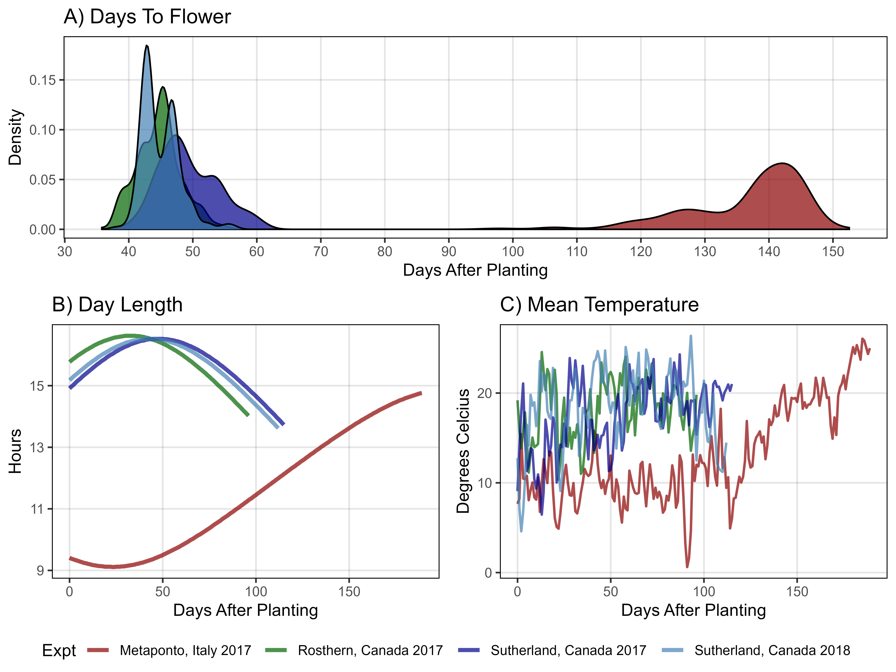
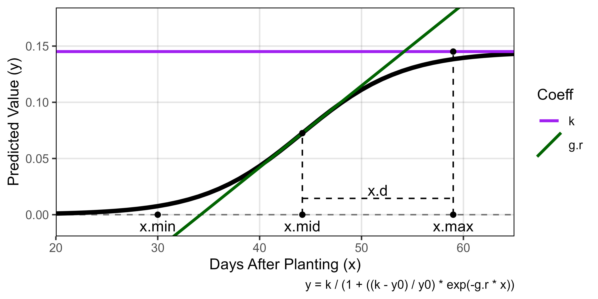
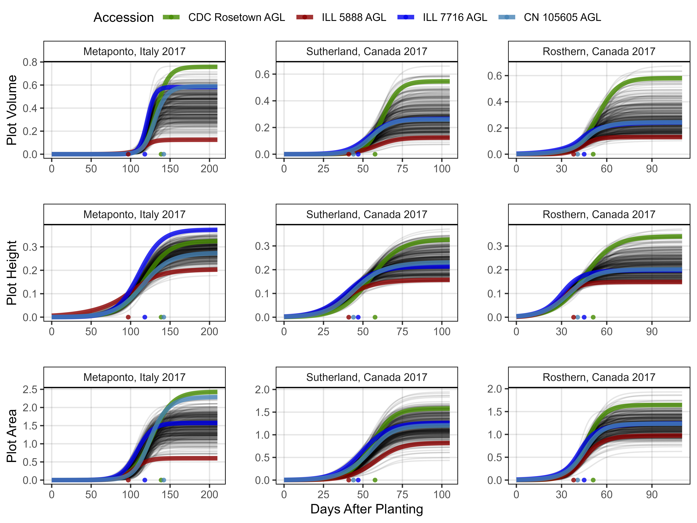
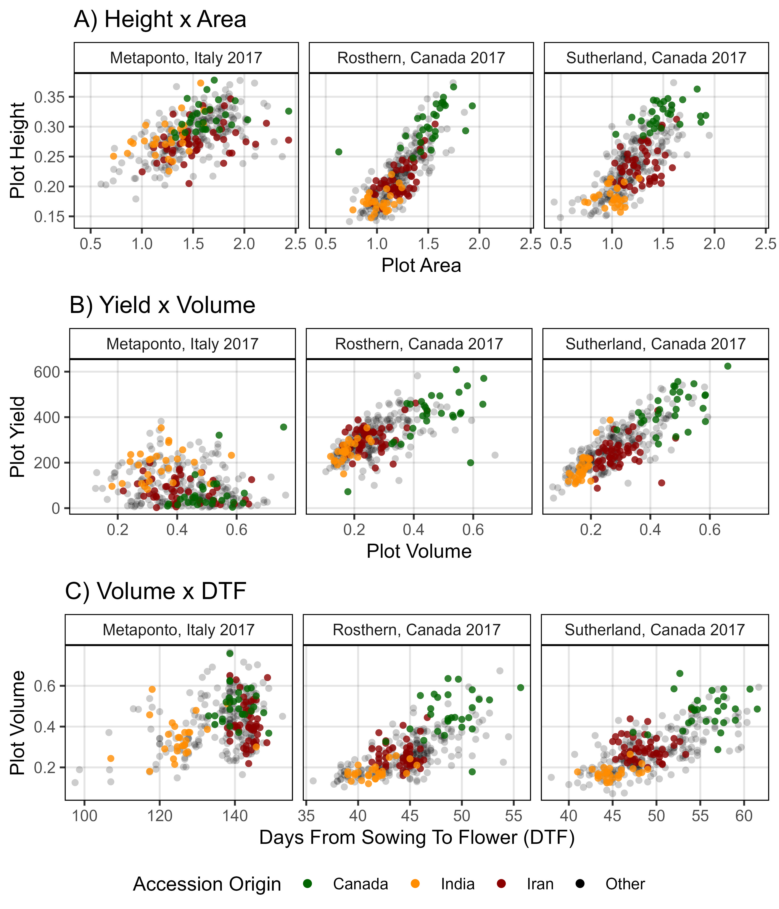
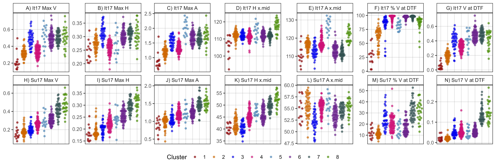
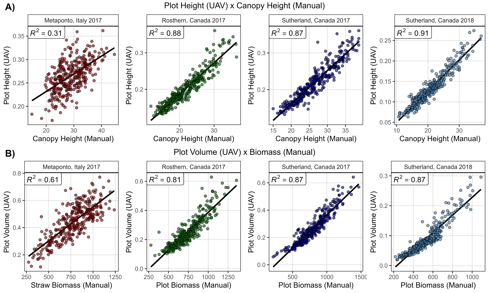
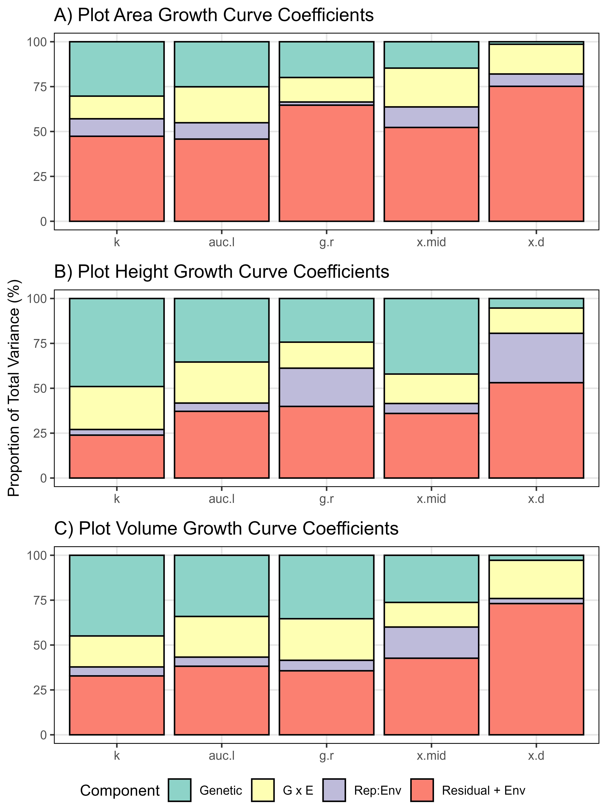
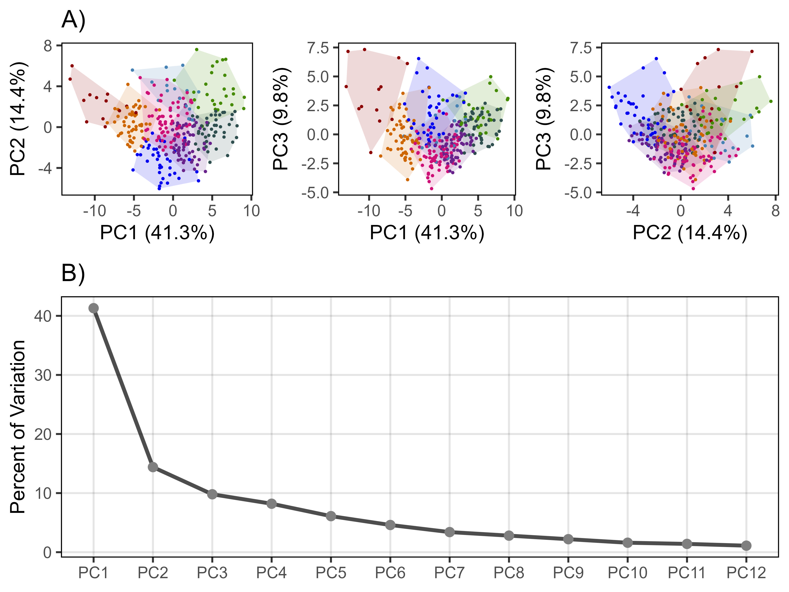

```{r setup, include=FALSE}
knitr::opts_chunk$set(echo = TRUE, message = F, warning = F, comment = NA, out.width = "100%")
```

\pagebreak

---

[Sandesh Neupane, Derek Wright, Raul Martinez, Jakob Butler, Jim Weller, Kirstin Bett (2022) **Focusing the GWAS *Lens* on days to flower using latent variable phenotypes derived from global multi-environment trials**. *The Plant Genome*. e20269.](https://doi.org/10.1002/tpg2.20269) 

which is follow-up to:

[Sandesh Neupane, Derek Wright, Raul Martinez, Jakob Butler, Jim Weller, Kirstin Bett (2022) **Focusing the GWAS *Lens* on days to flower using latent variable phenotypes derived from global multi-environment trials**. *The Plant Genome*. e20269.](https://doi.org/10.1002/tpg2.20269) 

[Derek Wright, Sandesh Neupane, Taryn Heidecker, Teketel Haile, Clarice Coyne, Rebecca McGee, Sripada Udupa, Fatima Henkrar, Eleonora Barilli, Diego Rubiales, Tania Gioia, Giuseppina Logozzo, Stefania Marzario, Reena Mehra, Ashutosh Sarker, Rajeev Dhakal, Babul Anwar, Debashish Sarker, Albert Vandenberg, and Kirstin Bett. (2020) **Understanding photothermal interactions can help expand production range and increase genetic diversity of lentil (*Lens culinaris* Medik.)**. *Plants, People, Planet*. 00:1-11.](https://doi.org/10.1002/ppp3.10158)

---

https://github.com/derekmichaelwright/AGILE_LDP_GWAS_Phenology

[View as pdf](https://github.com/derekmichaelwright/AGILE_LDP_GWAS_Phenology/raw/master/README.pdf)

[View as HTML](https://derekmichaelwright.github.io/AGILE_LDP_GWAS_Phenology/README.html)

[Source Code Vignette (GWAS_Phenology_Vignette.html)](https://derekmichaelwright.github.io/AGILE_LDP_GWAS_Phenology/GWAS_Phenology_Vignette.html)

# Contents

- [Figures](#figures)
- [Supplemental Tables](#supplemental-tables)
- [Supplemental Figures](#supplemental-figures)
- [Additional Figures](#additional-figures)

# AGILE & P2IRC Projects


\pagebreak

## Collaborators

- Department of Plant Sciences and Crop Development Centre, University of Saskatchewan, Saskatoon, Saskatchewan, Canada
- 

---

# Figures

## Figure 1



*Figure 1: *

---

## Figure 2

[Additional/Figure_02_plotly.html](https://derekmichaelwright.github.io/AGILE_LDP_GWAS_Phenology/Additional/Figure_02_plotly.html)



*Figure 2: *

---

## Figure 3



*Figure 3: *

---

## Figure 4



*Figure 4: *

---

## Figure 5

[Additional/Figure_05_a_plotly.html](https://derekmichaelwright.github.io/AGILE_LDP_GWAS_Phenology/Additional/Figure_05_a_plotly.html)



*Figure 5: *

---

# Supplemental Tables

## Supplemental Table 1

[Supplemental_Table_01.csv](https://github.com/derekmichaelwright/AGILE_LDP_GWAS_Phenology/blob/master/Supplemental_Table_01.csv)

```{r echo = F, eval = T}
DT::datatable(read.csv("Supplemental_Table_01.csv"))
```

*Supplemental Table 1: *

---

# Supplemental Figures

## Supplemental Figure 1


*Supplemental Figure 1: *

---

## Supplemental Figure 2



*Supplemental Figure 2: *

---

## Supplemental Figure 3

{width=70%}

*Supplemental Figure 3: *

---

## Supplemental Figure 4



*Supplemental Figure 4: *

---

## Supplemental Figure 5


*Supplemental Figure 5: *

---

## Supplemental Figure 6


*Supplemental Figure 6: *

---

# Additional Figures

## Additional Figure 1


## Additional Figure 2


## Grouped Manhattan Plots

[Additional/Man_Grouped/](https://github.com/derekmichaelwright/AGILE_LDP_GWAS_Phenology/tree/master/Additional/Man_Grouped)


## Marker Plots

[Additional/Markers/Markers_Chr_1.pdf](https://github.com/derekmichaelwright/AGILE_LDP_GWAS_Phenology/raw/master/Additional/Markers/Markers_Chr_1.pdf)


---

## Flowering Time Genes

[Additional/LcFTa1.pdf](https://github.com/derekmichaelwright/AGILE_LDP_GWAS_Phenology/raw/master/Additional/LcFTa1.pdf)

---

&copy; Derek Michael Wright
