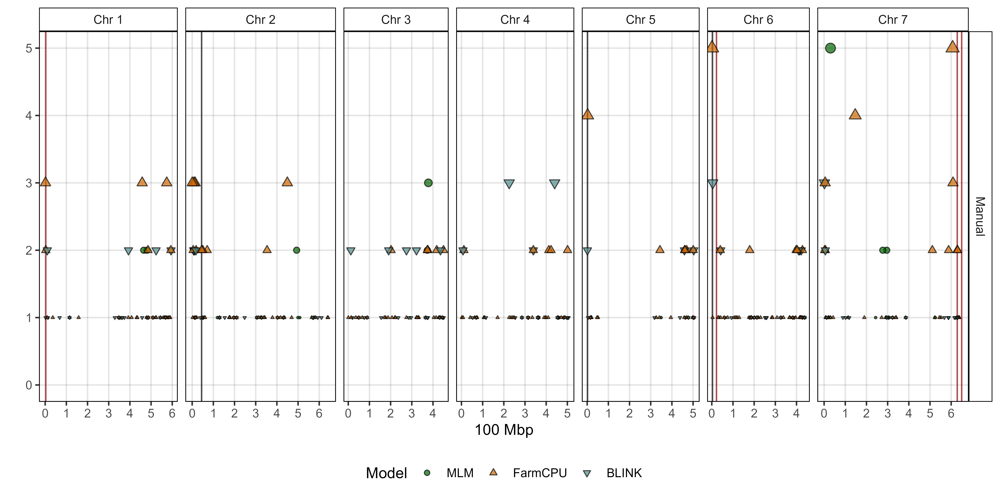
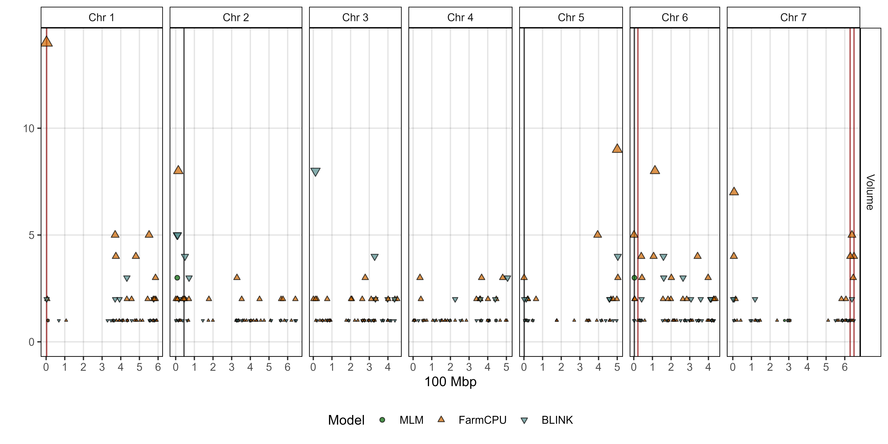
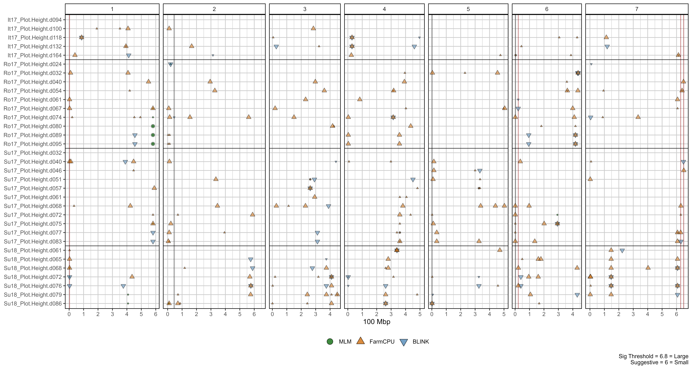
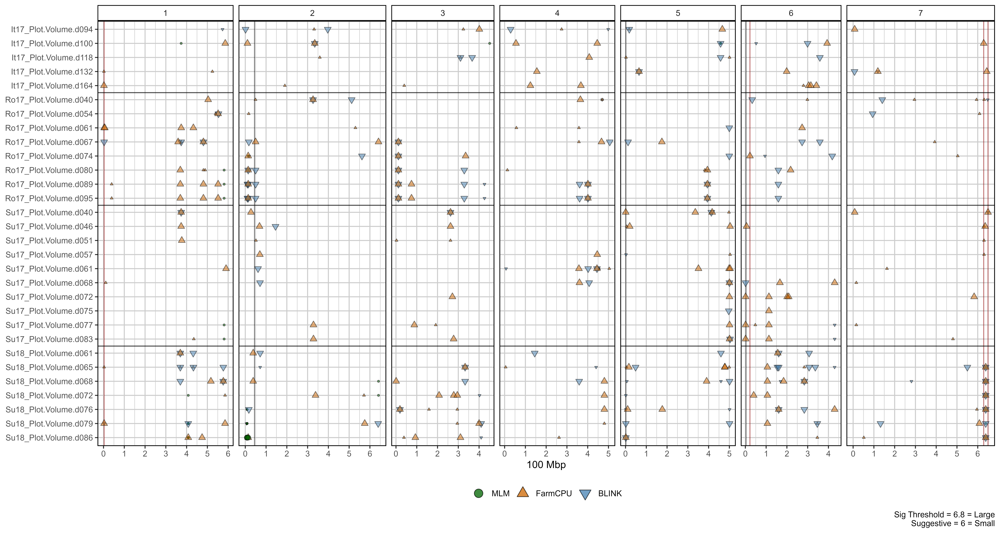
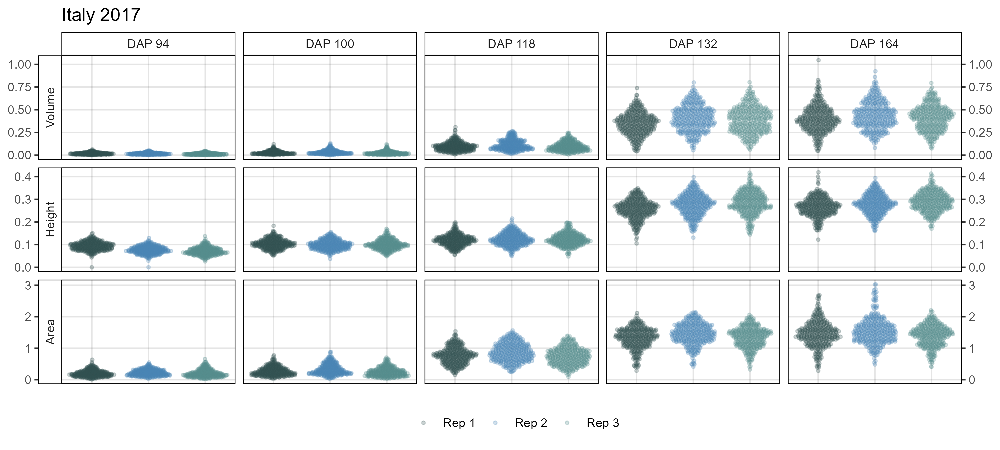
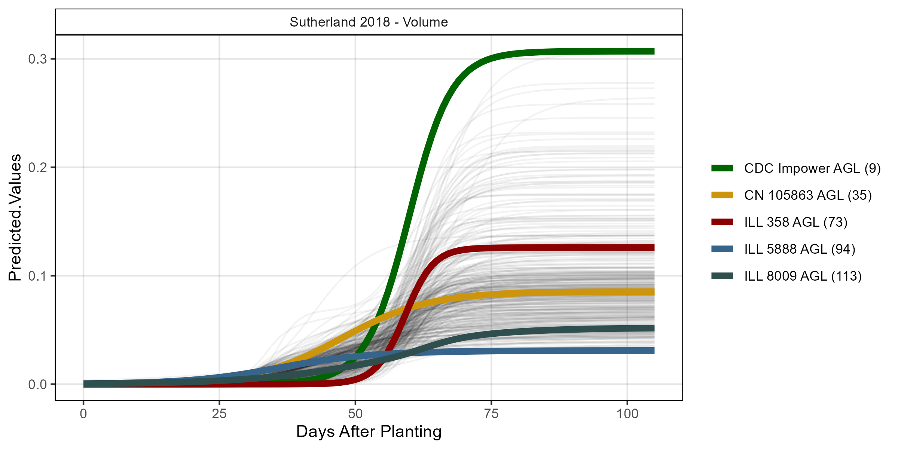
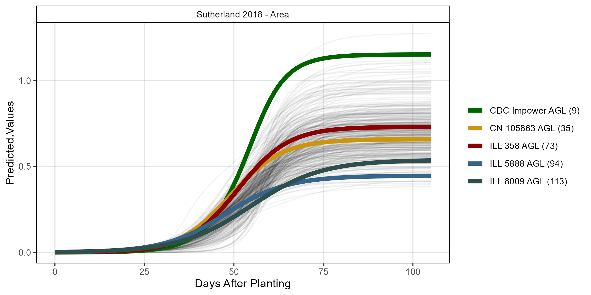

```{r setup, include=FALSE}
knitr::opts_chunk$set(echo = TRUE, message = F, warning = F, comment = NA, out.width = "100%")
```

---

> [Derek Wright, Sandesh Neupane, Karsten Neilson, Tania Gioia & Kirstin E Bett. **Dissecting lentil crop growth in contrasting environments using digital imaging and and genome-wide association studies**. *unpublished*. (**2024**) 00: 1-10](https://github.com/derekmichaelwright/AGILE_LDP_UAV)

which is follow-up to:

> - [Sandesh Neupane, Derek Wright, Raul Martinez, Jakob Butler, Jim Weller, Kirstin Bett.**Focusing the GWAS *Lens* on days to flower using latent variable phenotypes derived from global multi-environment trials**. *The Plant Genome*. (**2022**) 16(1): e20269. doi.org/10.1002/tpg2.20269](https://doi.org/10.1002/tpg2.20269) 
> - https://github.com/derekmichaelwright/AGILE_LDP_GWAS_Phenology

> - [Derek M Wright, Sandesh Neupane, Taryn Heidecker, Teketel A Haile, Clarice J Coyne, Rebecca J McGee, Sripada Udupa, Fatima Henkrar, Eleonora Barilli, Diego Rubiales, Tania Gioia, Giuseppina Logozzo, Stefania Marzario, Reena Mehra, Ashutosh Sarker, Rajeev Dhakal, Babul Anwar, Debashish Sarker, Albert Vandenberg, and Kirstin E. Bett. **Understanding photothermal interactions can help expand production range and increase genetic diversity of lentil (*Lens culinaris* Medik.)**. *Plants, People, Planet*. (**2021**) 3(2): 171-181.](https://doi.org/10.1002/ppp3.10158)
> -  https://github.com/derekmichaelwright/AGILE_LDP_Phenology

---

> - https://github.com/derekmichaelwright/AGILE_LDP_GWAS_Phenology 
> - [View as pdf](https://github.com/derekmichaelwright/AGILE_LDP_UAV/raw/master/README.pdf)
> - [View as HTML](https://derekmichaelwright.github.io/AGILE_LDP_UAV/README.html)
> - [Source Code Vignette (Growth_Rates_Vignette.html)](https://derekmichaelwright.github.io/AGILE_LDP_UAV/Growth_Rates_Vignette.html)

# Contents

- [Raw Data & Growth Curve Modeling](#raw-data-&-growth-curve-modeling)
- [Figures](#figures)
- [Supplemental Tables](#supplemental-tables)
- [Supplemental Figures](#supplemental-figures)
- [Additional Figures](#additional-figures)

# AGILE & P^2^IRC Projects

{width=50%}

{width=50%}

## Collaborators

- Department of Plant Sciences and Crop Development Centre, University of Saskatchewan, Saskatoon, Saskatchewan, Canada
- School of Agriculture, Forestry, Food and Environmental Sciences, University of Basilicata, Potenza, Italy

---

# Raw Data & Growth Curve Modeling

> - [Additional/ggDroneCheck_It17.pdf](https://github.com/derekmichaelwright/AGILE_LDP_UAV/Additional/ggDroneCheck_It17.pdf)
> - [Additional/ggDroneCheck_Ro17.pdf](https://github.com/derekmichaelwright/AGILE_LDP_UAV/Additional/ggDroneCheck_Ro17.pdf)
> - [Additional/ggDroneCheck_Su17.pdf](https://github.com/derekmichaelwright/AGILE_LDP_UAV/Additional/ggDroneCheck_Su17.pdf)
> - [Additional/ggDroneCheck_Su18.pdf](https://github.com/derekmichaelwright/AGILE_LDP_UAV/Additional/ggDroneCheck_Su18.pdf)

---

## Metaponto, Italy 2017
> - [Additional/ggpGrowthCurves_It17_volume.html](https://derekmichaelwright.github.io/AGILE_LDP_UAV/Additional/ggpGrowthCurves_It17_volume.html)


> - [Additional/ggpGrowthCurves_It17_area.html](https://derekmichaelwright.github.io/AGILE_LDP_UAV/Additional/ggpGrowthCurves_It17_area.html)


> - [Additional/ggpGrowthCurves_It17_height.html](https://derekmichaelwright.github.io/AGILE_LDP_UAV/Additional/ggpGrowthCurves_It17_height.html)


---

## Rosthern, Canada 2017

> - [Additional/ggpGrowthCurves_Ro17_volume.html](https://derekmichaelwright.github.io/AGILE_LDP_UAV/Additional/ggpGrowthCurves_Ro17_volume.html)


> - [Additional/ggpGrowthCurves_Ro17_area.html](https://derekmichaelwright.github.io/AGILE_LDP_UAV/Additional/ggpGrowthCurves_Ro17_area.html)


> - [Additional/ggpGrowthCurves_Ro17_height.html](https://derekmichaelwright.github.io/AGILE_LDP_UAV/Additional/ggpGrowthCurves_Ro17_height.html)


---

## Sutherland, Canada 2017

[Additional/ggpGrowthCurves_Su17_volume.html](https://derekmichaelwright.github.io/AGILE_LDP_UAV/Additional/ggpGrowthCurves_Su17_volume.html)


[Additional/ggpGrowthCurves_Su17_area.html](https://derekmichaelwright.github.io/AGILE_LDP_UAV/Additional/ggpGrowthCurves_Su17_area.html)


[Additional/ggpGrowthCurves_Su17_height.html](https://derekmichaelwright.github.io/AGILE_LDP_UAV/Additional/ggpGrowthCurves_Su17_height.html)


---

## Sutherland, Canada 2018


---

# Figures

## Figure 1


---

## Figure 2


---

## Figure 3


---

\pagebreak

## Figure 4

> - [Additional/Figure_04_A.html](https://derekmichaelwright.github.io/AGILE_LDP_UAV/Additional/Figure_04_A.html)
> - [Additional/Figure_04_B.html](https://derekmichaelwright.github.io/AGILE_LDP_UAV/Additional/Figure_04_B.html)
> - [Additional/Figure_04_C.html](https://derekmichaelwright.github.io/AGILE_LDP_UAV/Additional/Figure_04_C.html)


---

## Figure 5


---

## Figure 6


---

## Figure 7


---

## Figure 8


---

# Supplemental Tables

## Supplemental Table 1

> - [Supplemental_Table_01.csv](https://github.com/derekmichaelwright/AGILE_LDP_UAV/blob/master/Supplemental_Table_01.csv)

```{r echo = F, eval = F}
DT::datatable(read.csv("Supplemental_Table_01.csv"))
```

---

# Supplemental Figures

## Supplemental Figure 1

{width=80%}

---

## Supplemental Figure 2


---

## Supplemental Figure 3


---

## Supplemental Figure 4


---

## Supplemental Figure 5


---

## Supplemental Figure 6


---

## Supplemental Figure 7


---

## Supplemental Figure 8


---

# Additional Figures

## Additional Figures 1

{width=80%}

{width=80%}

{width=80%}

---

\pagebreak

## Additional Figures 2


---

## Additional Figures 3

> - [Additional/Additional_Figure_03.pdf](Additional/Additional_Figure_03.pdf)


---

## Additional Figures 4


---

## Additional Figures 5


---

## Additional Figures 6


---

## Additional Figures 7


\pagebreak


---

## Additional Figures 8


---

## Additional Figures 9


---

## Additional Figures 10


---

## Additional Figures 11


---

\pagebreak

## Additional Figures 12

> - [Additional/Additional_Figure_12_1.html](https://derekmichaelwright.github.io/AGILE_LDP_UAV/Additional/Additional_Figure_12_1.html)



> - [Additional/Additional_Figure_12_2.html](https://derekmichaelwright.github.io/AGILE_LDP_UAV/Additional/Additional_Figure_12_2.html)


\pagebreak

> - [Additional/Additional_Figure_12_3.html](https://derekmichaelwright.github.io/AGILE_LDP_UAV/Additional/Additional_Figure_12_3.html)


> - [Additional/Additional_Figure_12_4.html](https://derekmichaelwright.github.io/AGILE_LDP_UAV/Additional/Additional_Figure_12_4.html)


\pagebreak

> - [Additional/Additional_Figure_12_5.html](https://derekmichaelwright.github.io/AGILE_LDP_UAV/Additional/Additional_Figure_12_5.html)


> - [Additional/Additional_Figure_12_6.html](https://derekmichaelwright.github.io/AGILE_LDP_UAV/Additional/Additional_Figure_12_6.html)



\pagebreak

> - [Additional/Additional_Figure_12_7.html](https://derekmichaelwright.github.io/AGILE_LDP_UAV/Additional/Additional_Figure_12_7.html)


---

\pagebreak

## Additional Figures 13

> - [Additional/Additional_Figure_13_1.html](https://derekmichaelwright.github.io/AGILE_LDP_UAV/Additional/Additional_Figure_13_1.html)



> - [Additional/Additional_Figure_13_2.html](https://derekmichaelwright.github.io/AGILE_LDP_UAV/Additional/Additional_Figure_13_2.html)


\pagebreak

> - [Additional/Additional_Figure_13_3.html](https://derekmichaelwright.github.io/AGILE_LDP_UAV/Additional/Additional_Figure_13_3.html)



> - [Additional/Additional_Figure_13_4.html](https://derekmichaelwright.github.io/AGILE_LDP_UAV/Additional/Additional_Figure_13_4.html)


\pagebreak

> - [Additional/Additional_Figure_13_5.html](https://derekmichaelwright.github.io/AGILE_LDP_UAV/Additional/Additional_Figure_13_5.html)


> - [Additional/Additional_Figure_13_6.html](https://derekmichaelwright.github.io/AGILE_LDP_UAV/Additional/Additional_Figure_13_6.html)


\pagebreak

> - [Additional/Additional_Figure_13_7.html](https://derekmichaelwright.github.io/AGILE_LDP_UAV/Additional/Additional_Figure_13_7.html)


> - [Additional/Additional_Figure_13_8.html](https://derekmichaelwright.github.io/AGILE_LDP_UAV/Additional/Additional_Figure_13_8.html)


\pagebreak

> - [Additional/Additional_Figure_13_9.html](https://derekmichaelwright.github.io/AGILE_LDP_UAV/Additional/Additional_Figure_13_9.html)


---

## ggDroneCheck

> - [Additional/ggDroneCheck_It17.pdf](https://github.com/derekmichaelwright/AGILE_LDP_UAV/Additional/ggDroneCheck_It17.pdf)
> - [Additional/ggDroneCheck_Ro17.pdf](https://github.com/derekmichaelwright/AGILE_LDP_UAV/Additional/ggDroneCheck_Ro17.pdf)
> - [Additional/ggDroneCheck_Su17.pdf](https://github.com/derekmichaelwright/AGILE_LDP_UAV/Additional/ggDroneCheck_Su17.pdf)
> - [Additional/ggDroneCheck_Su18.pdf](https://github.com/derekmichaelwright/AGILE_LDP_UAV/Additional/ggDroneCheck_Su18.pdf)

---

## ggDroneTrait




---

## ggGrowthCurves

### Italy 2017

> - [Additional/ggpGrowthCurves_It17_volume.html](https://derekmichaelwright.github.io/AGILE_LDP_UAV/Additional/ggpGrowthCurves_It17_volume.html)


> - [Additional/ggpGrowthCurves_It17_area.html](https://derekmichaelwright.github.io/AGILE_LDP_UAV/Additional/ggpGrowthCurves_It17_area.html)


> - [Additional/ggpGrowthCurves_It17_height.html](https://derekmichaelwright.github.io/AGILE_LDP_UAV/Additional/ggpGrowthCurves_It17_height.html)


### Rosthern 2017

> - [Additional/ggpGrowthCurves_Ro17_volume.html](https://derekmichaelwright.github.io/AGILE_LDP_UAV/Additional/ggpGrowthCurves_Ro17_volume.html)


> - [Additional/ggpGrowthCurves_Ro17_area.html](https://derekmichaelwright.github.io/AGILE_LDP_UAV/Additional/ggpGrowthCurves_Ro17_area.html)


> - [Additional/ggpGrowthCurves_Ro17_height.html](https://derekmichaelwright.github.io/AGILE_LDP_UAV/Additional/ggpGrowthCurves_Ro17_height.html)


### Sutherland 2017

> - [Additional/ggpGrowthCurves_Su17_volume.html](https://derekmichaelwright.github.io/AGILE_LDP_UAV/Additional/ggpGrowthCurves_Su17_volume.html)


> - [Additional/ggpGrowthCurves_Su17_area.html](https://derekmichaelwright.github.io/AGILE_LDP_UAV/Additional/ggpGrowthCurves_Su17_area.html)


> - [Additional/ggpGrowthCurves_Su17_height.html](https://derekmichaelwright.github.io/AGILE_LDP_UAV/Additional/ggpGrowthCurves_Su17_height.html)


### Sutherland 2018

> - [Additional/ggpGrowthCurves_Su18_volume.html](https://derekmichaelwright.github.io/AGILE_LDP_UAV/Additional/ggpGrowthCurves_Su18_volume.html)



> - [Additional/ggpGrowthCurves_Su18_area.html](https://derekmichaelwright.github.io/AGILE_LDP_UAV/Additional/ggpGrowthCurves_Su18_area.html)



> - [Additional/ggpGrowthCurves_Su18_height.html](https://derekmichaelwright.github.io/AGILE_LDP_UAV/Additional/ggpGrowthCurves_Su18_height.html)


---

## Manhattan Plots

> - [Additional/Manhattan/](https://github.com/derekmichaelwright/AGILE_LDP_UAV/Additional/Manhattan/)

---

## Markers

> - [Additional/Markers/](https://github.com/derekmichaelwright/AGILE_LDP_UAV/tree/main/Additional/Markers/)
ers/Chr7/)

---

&copy; Derek Michael Wright
