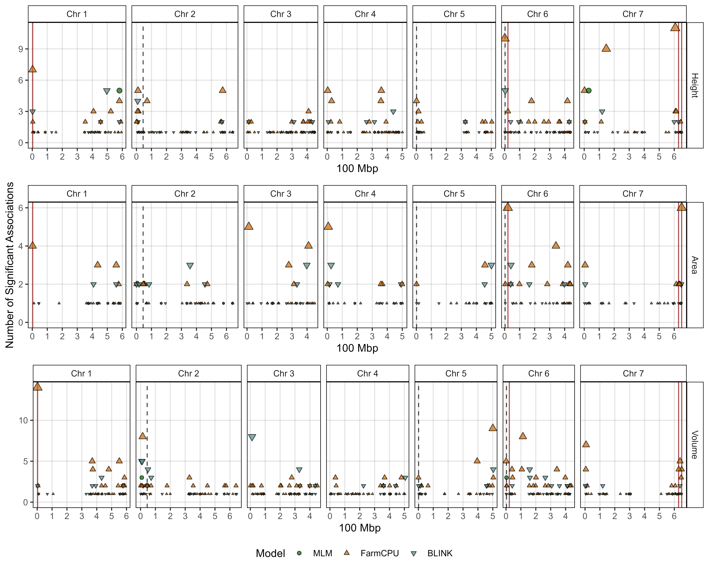
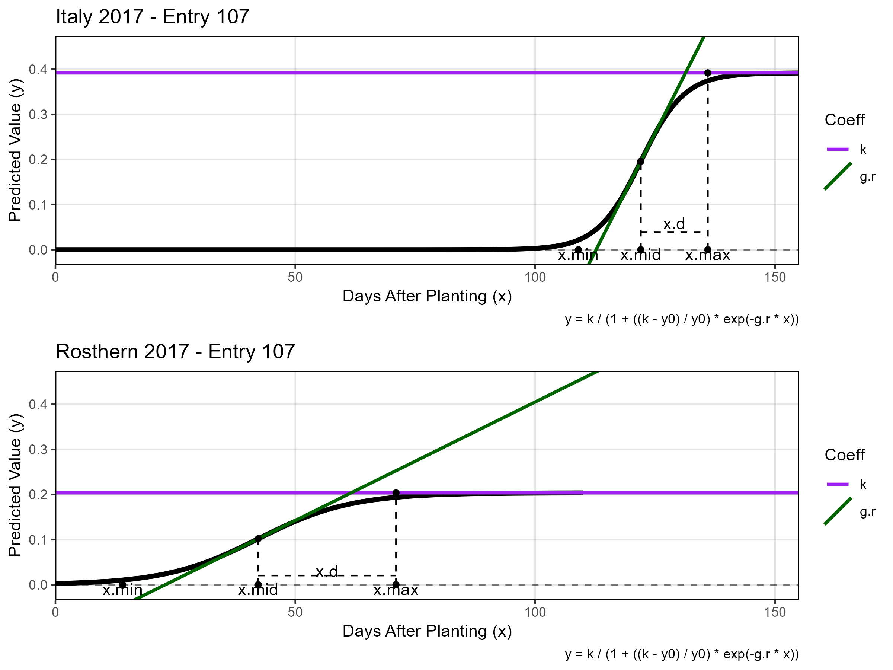
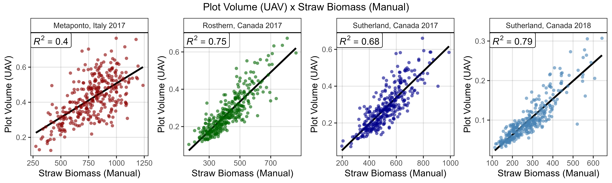
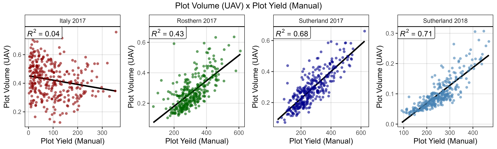
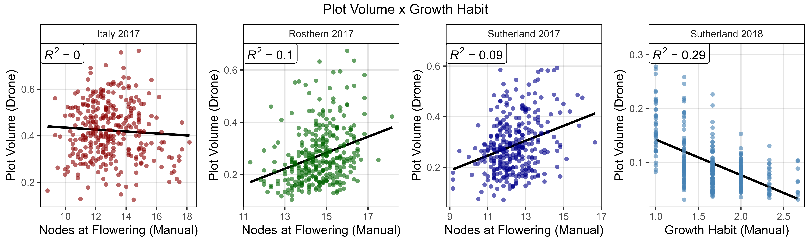
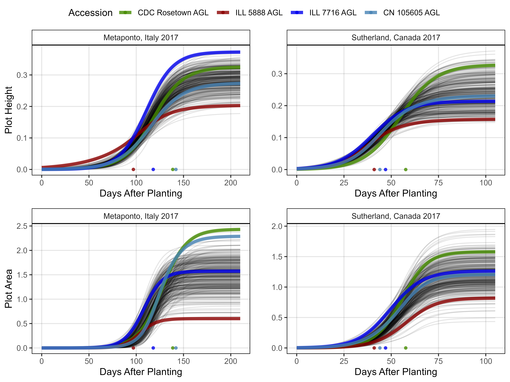
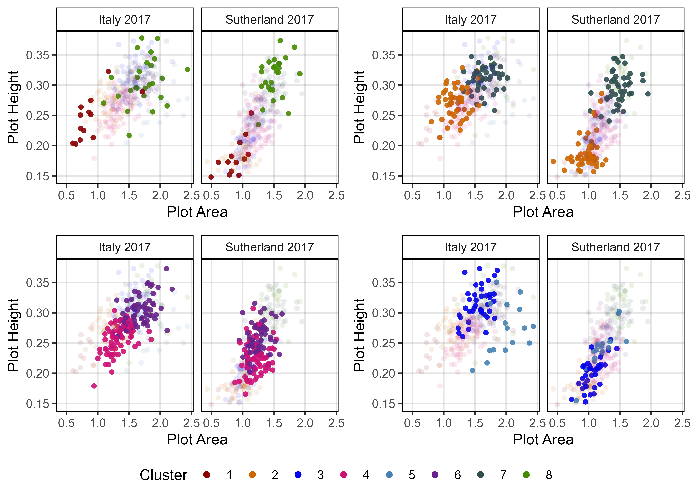
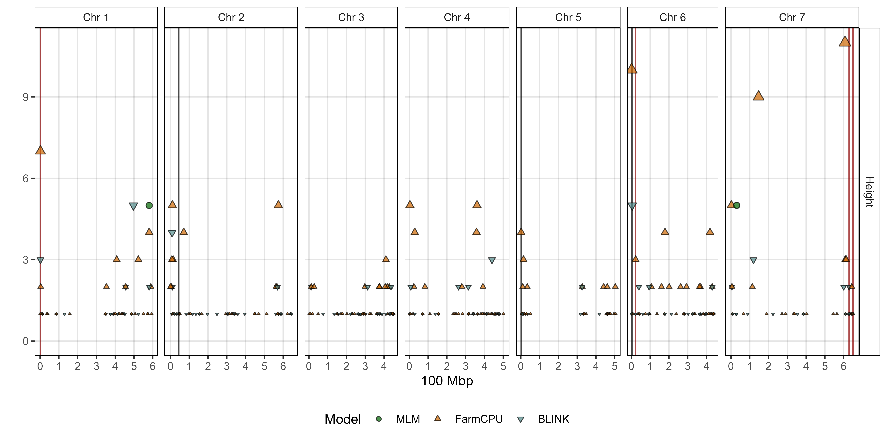
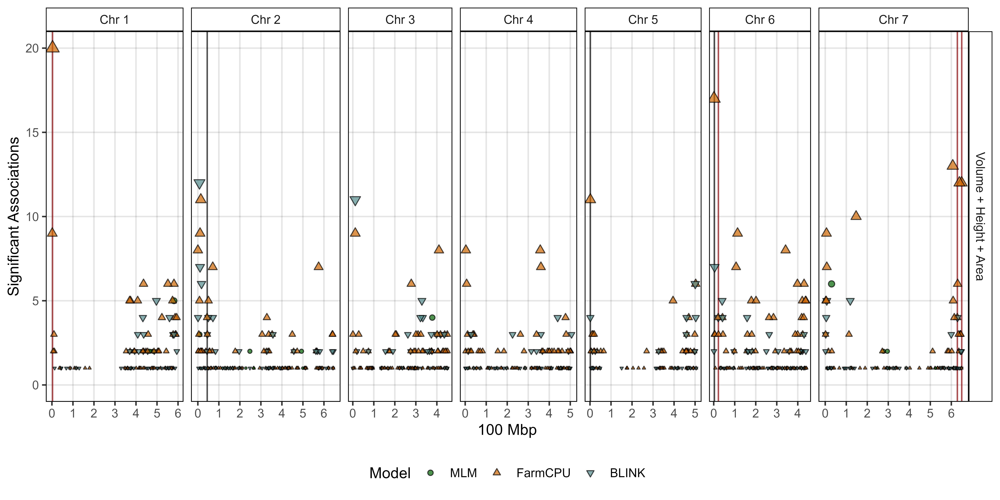

Disecting lentil crop growth across multi-environment trials using
unoccupied aerial vehicles
================
Derek Michael Wright <derek.wright@usask.ca>
01-11-2023

------------------------------------------------------------------------

> Derek Wright, Sandesh Neupane, Karsten Neilson, Tania Gioia & Kirstin
> E Bett. **Disecting lentil crop growth across multi-environment trials
> using unoccupied aerial vehicles**. unpublished. (**2023**) 00: 1-10

which is follow-up to:

> - [Sandesh Neupane, Derek Wright, Raul Martinez, Jakob Butler, Jim
>   Weller, Kirstin Bett.**Focusing the GWAS *Lens* on days to flower
>   using latent variable phenotypes derived from global
>   multi-environment trials**. *The Plant Genome*. (**2022**) 16(1):
>   e20269.](https://doi.org/10.1002/tpg2.20269)
> - <https://github.com/derekmichaelwright/AGILE_LDP_GWAS_Phenology>

> - [Derek M Wright, Sandesh Neupane, Taryn Heidecker, Teketel A Haile,
>   Clarice J Coyne, Rebecca J McGee, Sripada Udupa, Fatima Henkrar,
>   Eleonora Barilli, Diego Rubiales, Tania Gioia, Giuseppina Logozzo,
>   Stefania Marzario, Reena Mehra, Ashutosh Sarker, Rajeev Dhakal,
>   Babul Anwar, Debashish Sarker, Albert Vandenberg, and Kirstin E.
>   Bett. **Understanding photothermal interactions can help expand
>   production range and increase genetic diversity of lentil (*Lens
>   culinaris* Medik.)**. *Plants, People, Planet*. (**2021**) 3(2):
>   171-181.](https://doi.org/10.1002/ppp3.10158)
> - <https://github.com/derekmichaelwright/AGILE_LDP_Phenology>

------------------------------------------------------------------------

> - <https://github.com/derekmichaelwright/AGILE_LDP_GWAS_Phenology>
> - [View as
>   pdf](https://github.com/derekmichaelwright/AGILE_LDP_UAV/raw/master/README.pdf)
> - [View as
>   HTML](https://derekmichaelwright.github.io/AGILE_LDP_UAV/README.html)
> - [Source Code Vignette
>   (Growth_Rates_Vignette.html)](https://derekmichaelwright.github.io/AGILE_LDP_UAV/Growth_Rates_Vignette.html)

# Contents

- [Figures](#figures)
- [Supplemental Tables](#supplemental-tables)
- [Supplemental Figures](#supplemental-figures)
- [Additional Figures](#additional-figures)

# AGILE & P2IRC Projects

## Collaborators

- Department of Plant Sciences and Crop Development Centre, University
  of Saskatchewan, Saskatoon, Saskatchewan, Canada
- School of Agriculture, Forestry, Food and Environmental Sciences,
  University of Basilicata, Potenza, Italy

------------------------------------------------------------------------

# Figures

## Figure 1

------------------------------------------------------------------------

## Figure 2

------------------------------------------------------------------------

## Figure 3

------------------------------------------------------------------------

## Figure 4

> - [Additional/Figure_04_A.html](https://derekmichaelwright.github.io/AGILE_LDP_UAV/Additional/Figure_04_A.html)
> - [Additional/Figure_04_B.html](https://derekmichaelwright.github.io/AGILE_LDP_UAV/Additional/Figure_04_B.html)
> - [Additional/Figure_04_C.html](https://derekmichaelwright.github.io/AGILE_LDP_UAV/Additional/Figure_04_C.html)

------------------------------------------------------------------------

## Figure 5

------------------------------------------------------------------------

## Figure 6

------------------------------------------------------------------------

## Figure 7

------------------------------------------------------------------------

## Figure 8

------------------------------------------------------------------------

# Supplemental Tables

## Supplemental Table 1

> - [Supplemental_Table_01.csv](https://github.com/derekmichaelwright/AGILE_LDP_UAV/blob/master/Supplemental_Table_01.csv)

------------------------------------------------------------------------

# Supplemental Figures

## Supplemental Figure 1

------------------------------------------------------------------------

## Supplemental Figure 2

------------------------------------------------------------------------

## Supplemental Figure 3

------------------------------------------------------------------------

## Supplemental Figure 4

------------------------------------------------------------------------

## Supplemental Figure 5

------------------------------------------------------------------------

## Supplemental Figure 6

------------------------------------------------------------------------

## Supplemental Figure 7

------------------------------------------------------------------------

# Additional Figures

## Additional Figures 1

------------------------------------------------------------------------

## Additional Figures 2

------------------------------------------------------------------------

## Additional Figures 3

------------------------------------------------------------------------

## Additional Figure 4

------------------------------------------------------------------------

## Additional Figure 5

------------------------------------------------------------------------

## Additional Figures 6

------------------------------------------------------------------------

## Additional Figure 7

------------------------------------------------------------------------

## Additional Figures 8

------------------------------------------------------------------------

## Additional Figure 9

------------------------------------------------------------------------

## Additional Figure 10

------------------------------------------------------------------------

## Additional Figures 11

> - [Additional/Additional_Figure_11_1.html](https://derekmichaelwright.github.io/AGILE_LDP_UAV/Additional/Additional_Figure_11_1.html)

> - [Additional/Additional_Figure_11_2.html](https://derekmichaelwright.github.io/AGILE_LDP_UAV/Additional/Additional_Figure_11_2.html)

> - [Additional/Additional_Figure_11_3.html](https://derekmichaelwright.github.io/AGILE_LDP_UAV/Additional/Additional_Figure_11_3.html)

> - [Additional/Additional_Figure_11_4.html](https://derekmichaelwright.github.io/AGILE_LDP_UAV/Additional/Additional_Figure_11_4.html)

> - [Additional/Additional_Figure_11_5.html](https://derekmichaelwright.github.io/AGILE_LDP_UAV/Additional/Additional_Figure_11_5.html)

> - [Additional/Additional_Figure_11_6.html](https://derekmichaelwright.github.io/AGILE_LDP_UAV/Additional/Additional_Figure_11_6.html)

> - [Additional/Additional_Figure_11_7.html](https://derekmichaelwright.github.io/AGILE_LDP_UAV/Additional/Additional_Figure_11_7.html)

------------------------------------------------------------------------

## Additional Figures 12

> - [Additional/Additional_Figure_12_1.html](https://derekmichaelwright.github.io/AGILE_LDP_UAV/Additional/Additional_Figure_12_1.html)

> - [Additional/Additional_Figure_12_2.html](https://derekmichaelwright.github.io/AGILE_LDP_UAV/Additional/Additional_Figure_12_2.html)

> - [Additional/Additional_Figure_12_3.html](https://derekmichaelwright.github.io/AGILE_LDP_UAV/Additional/Additional_Figure_12_3.html)

> - [Additional/Additional_Figure_12_4.html](https://derekmichaelwright.github.io/AGILE_LDP_UAV/Additional/Additional_Figure_12_4.html)

> - [Additional/Additional_Figure_12_5.html](https://derekmichaelwright.github.io/AGILE_LDP_UAV/Additional/Additional_Figure_12_5.html)

> - [Additional/Additional_Figure_12_6.html](https://derekmichaelwright.github.io/AGILE_LDP_UAV/Additional/Additional_Figure_12_6.html)

> - [Additional/Additional_Figure_12_7.html](https://derekmichaelwright.github.io/AGILE_LDP_UAV/Additional/Additional_Figure_12_7.html)

> - [Additional/Additional_Figure_12_8.html](https://derekmichaelwright.github.io/AGILE_LDP_UAV/Additional/Additional_Figure_12_8.html)

> - [Additional/Additional_Figure_12_9.html](https://derekmichaelwright.github.io/AGILE_LDP_UAV/Additional/Additional_Figure_12_9.html)

------------------------------------------------------------------------

## Manhattan Plots

> - [Additional/ManH/](https://github.com/derekmichaelwright/AGILE_LDP_UAV/Additional/ManH/)

------------------------------------------------------------------------

## Markers

> - [Additional/Markers/Top](https://github.com/derekmichaelwright/AGILE_LDP_UAV/tree/main/Additional/Markers/Top/)

> - [Additional/Markers/Chr1](https://github.com/derekmichaelwright/AGILE_LDP_UAV/tree/main/Additional/Markers/Chr1/)
> - [Additional/Markers/Chr2](https://github.com/derekmichaelwright/AGILE_LDP_UAV/tree/main/Additional/Markers/Chr2/)
> - [Additional/Markers/Chr3](https://github.com/derekmichaelwright/AGILE_LDP_UAV/tree/main/Additional/Markers/Chr3/)
> - [Additional/Markers/Chr4](https://github.com/derekmichaelwright/AGILE_LDP_UAV/tree/main/Additional/Markers/Chr4/)
> - [Additional/Markers/Chr5](https://github.com/derekmichaelwright/AGILE_LDP_UAV/tree/main/Additional/Markers/Chr5/)
> - [Additional/Markers/Chr6](https://github.com/derekmichaelwright/AGILE_LDP_UAV/tree/main/Additional/Markers/Chr6/)
> - [Additional/Markers/Chr7](https://github.com/derekmichaelwright/AGILE_LDP_UAV/tree/main/Additional/Markers/Chr7/)

------------------------------------------------------------------------

© Derek Michael Wright
