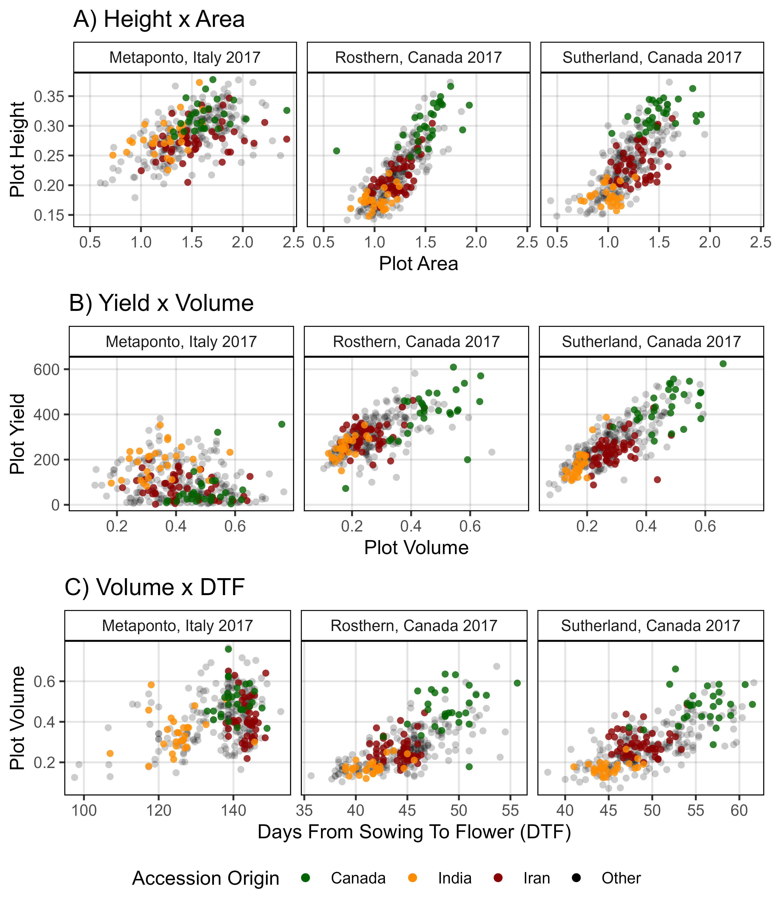
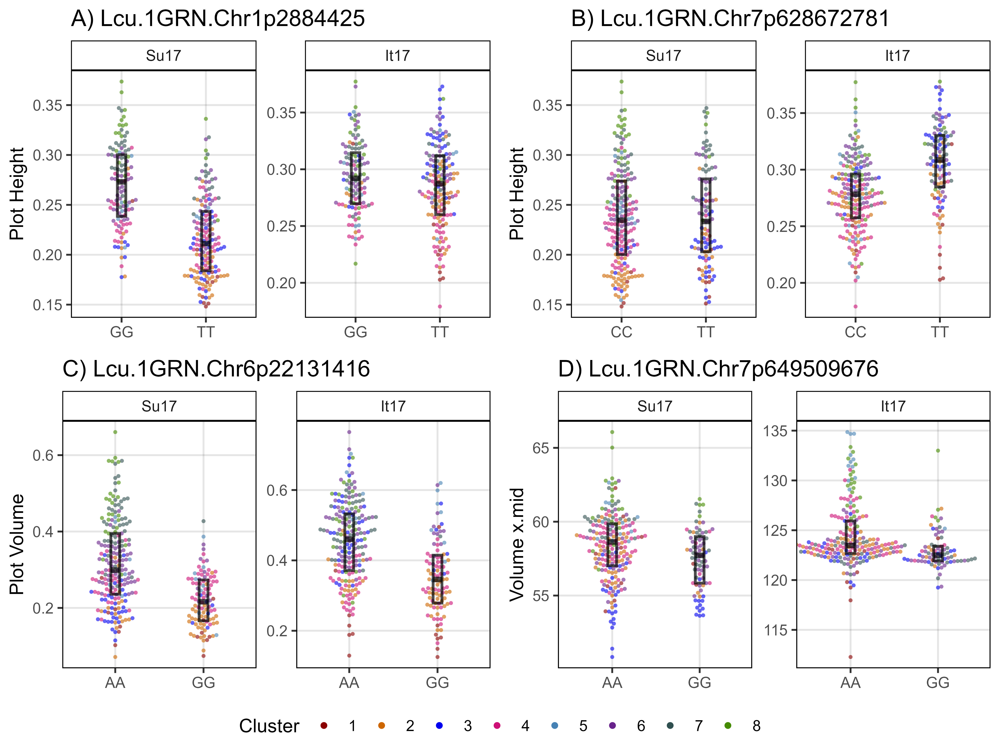

Dissecting lentil crop growth in contrasting environments using digital
imaging and genome-wide association studies
================
Derek Michael Wright <derek.wright@usask.ca>
01-08-2025

------------------------------------------------------------------------

> <a href="https://doi.org/10.1002/ppj2.70040" target="_blank">Derek
> Wright, Sandesh Neupane, Karsten Neilson, Tania Gioia &amp; Kirstin E
> Bett. <strong>Dissecting lentil crop growth in contrasting environments
> using digital imaging and genome-wide association studies</strong>.
> <em>The Plant Phenome Journal</em>. (<strong>2025</strong>) 8(1):
> e70040. doi.org/10.1002/ppj2.70040</a>

which is follow-up to:

> - <a href="https://doi.org/10.1002/tpg2.20269" target="_blank">Sandesh
>   Neupane, Derek Wright, Raul Martinez, Jakob Butler, Jim Weller, Kirstin
>   Bett.<strong>Focusing the GWAS <em>Lens</em> on days to flower using
>   latent variable phenotypes derived from global multi-environment
>   trials</strong>. <em>The Plant Genome</em>. (<strong>2022</strong>)
>   16(1): e20269. doi.org/10.1002/tpg2.20269</a>
> - <a href="https://github.com/derekmichaelwright/AGILE_LDP_GWAS_Phenology"
>   target="_blank">https://github.com/derekmichaelwright/AGILE_LDP_GWAS_Phenology</a>

> - <a href="https://doi.org/10.1002/ppp3.10158" target="_blank">Derek M
>   Wright, Sandesh Neupane, Taryn Heidecker, Teketel A Haile, Clarice J
>   Coyne, Rebecca J McGee, Sripada Udupa, Fatima Henkrar, Eleonora Barilli,
>   Diego Rubiales, Tania Gioia, Giuseppina Logozzo, Stefania Marzario,
>   Reena Mehra, Ashutosh Sarker, Rajeev Dhakal, Babul Anwar, Debashish
>   Sarker, Albert Vandenberg, and Kirstin E. Bett. <strong>Understanding
>   photothermal interactions can help expand production range and increase
>   genetic diversity of lentil (<em>Lens culinaris</em> Medik.)</strong>.
>   <em>Plants, People, Planet</em>. (<strong>2021</strong>) 3(2):
>   171-181.</a>
> - <a href="https://github.com/derekmichaelwright/AGILE_LDP_Phenology"
>   target="_blank">https://github.com/derekmichaelwright/AGILE_LDP_Phenology</a>

------------------------------------------------------------------------

Contents

> - <a href="https://github.com/derekmichaelwright/AGILE_LDP_GWAS_Phenology"
>   target="_blank">https://github.com/derekmichaelwright/AGILE_LDP_GWAS_Phenology</a>
> - <a href="README.pdf" target="_blank">View as pdf</a>
> - <a href="https://derekmichaelwright.github.io/AGILE_LDP_UAV/README.html"
>   target="_blank">View as HTML</a>
> - <a
>   href="https://derekmichaelwright.github.io/AGILE_LDP_UAV/Growth_Rates_Vignette.html"
>   target="_blank">Source Code Vignette (Growth_Rates_Vignette.html)</a>

- [Raw Data & Growth Curve Modeling](#raw-data-&-growth-curve-modeling)
- [Figures](#figures)
- [Supplemental Tables](#supplemental-tables)
- [Supplemental Figures](#supplemental-figures)
- [Additional Figures](#additional-figures)

## Collaborators

- Department of Plant Sciences and Crop Development Centre, University
  of Saskatchewan, Saskatoon, Saskatchewan, Canada
- School of Agriculture, Forestry, Food and Environmental Sciences,
  University of Basilicata, Potenza, Italy

------------------------------------------------------------------------

# Raw Data & Growth Curve Modeling

> - <a href="Additional/ggDroneCheck_It17.pdf"
>   target="_blank">Additional/ggDroneCheck_It17.pdf</a>
> - <a href="Additional/ggDroneCheck_Ro17.pdf"
>   target="_blank">Additional/ggDroneCheck_Ro17.pdf</a>
> - <a href="Additional/ggDroneCheck_Su17.pdf"
>   target="_blank">Additional/ggDroneCheck_Su17.pdf</a>
> - <a href="Additional/ggDroneCheck_Su18.pdf"
>   target="_blank">Additional/ggDroneCheck_Su18.pdf</a>

------------------------------------------------------------------------

## Metaponto, Italy 2017

> - <a
>   href="https://derekmichaelwright.github.io/AGILE_LDP_UAV/Additional/ggpGrowthCurves_It17_volume.html"
>   target="_blank">Additional/ggpGrowthCurves_It17_volume.html</a>

> - <a
>   href="https://derekmichaelwright.github.io/AGILE_LDP_UAV/Additional/ggpGrowthCurves_It17_area.html"
>   target="_blank">Additional/ggpGrowthCurves_It17_area.html</a>

> - <a
>   href="https://derekmichaelwright.github.io/AGILE_LDP_UAV/Additional/ggpGrowthCurves_It17_height.html"
>   target="_blank">Additional/ggpGrowthCurves_It17_height.html</a>

------------------------------------------------------------------------

## Rosthern, Canada 2017

> - <a
>   href="https://derekmichaelwright.github.io/AGILE_LDP_UAV/Additional/ggpGrowthCurves_Ro17_volume.html"
>   target="_blank">Additional/ggpGrowthCurves_Ro17_volume.html</a>

> - <a
>   href="https://derekmichaelwright.github.io/AGILE_LDP_UAV/Additional/ggpGrowthCurves_Ro17_area.html"
>   target="_blank">Additional/ggpGrowthCurves_Ro17_area.html</a>

> - <a
>   href="https://derekmichaelwright.github.io/AGILE_LDP_UAV/Additional/ggpGrowthCurves_Ro17_height.html"
>   target="_blank">Additional/ggpGrowthCurves_Ro17_height.html</a>

------------------------------------------------------------------------

## Sutherland, Canada 2017

<a
href="https://derekmichaelwright.github.io/AGILE_LDP_UAV/Additional/ggpGrowthCurves_Su17_volume.html"
target="_blank">Additional/ggpGrowthCurves_Su17_volume.html</a>

<a
href="https://derekmichaelwright.github.io/AGILE_LDP_UAV/Additional/ggpGrowthCurves_Su17_area.html"
target="_blank">Additional/ggpGrowthCurves_Su17_area.html</a>

<a
href="https://derekmichaelwright.github.io/AGILE_LDP_UAV/Additional/ggpGrowthCurves_Su17_height.html"
target="_blank">Additional/ggpGrowthCurves_Su17_height.html</a>

------------------------------------------------------------------------

## Sutherland, Canada 2018

<a
href="https://derekmichaelwright.github.io/AGILE_LDP_UAV/Additional/ggpGrowthCurves_Su18_volume.html"
target="_blank">Additional/ggpGrowthCurves_Su18_volume.html</a>

<a
href="https://derekmichaelwright.github.io/AGILE_LDP_UAV/Additional/ggpGrowthCurves_Su18_area.html"
target="_blank">Additional/ggpGrowthCurves_Su18_area.html</a>

<a
href="https://derekmichaelwright.github.io/AGILE_LDP_UAV/Additional/ggpGrowthCurves_Su18_height.html"
target="_blank">Additional/ggpGrowthCurves_Su18_height.html</a>

------------------------------------------------------------------------

# Figures

## Figure 1

------------------------------------------------------------------------

## Figure 2

------------------------------------------------------------------------

## Figure 3

------------------------------------------------------------------------

## Figure 4

> - <a
>   href="https://derekmichaelwright.github.io/AGILE_LDP_UAV/Additional/Figure_04_A.html"
>   target="_blank">Additional/Figure_04_A.html</a>
> - <a
>   href="https://derekmichaelwright.github.io/AGILE_LDP_UAV/Additional/Figure_04_B.html"
>   target="_blank">Additional/Figure_04_B.html</a>
> - <a
>   href="https://derekmichaelwright.github.io/AGILE_LDP_UAV/Additional/Figure_04_C.html"
>   target="_blank">Additional/Figure_04_C.html</a>

------------------------------------------------------------------------

## Figure 5

------------------------------------------------------------------------

## Figure 6

------------------------------------------------------------------------

## Figure 7

------------------------------------------------------------------------

## Figure 8

------------------------------------------------------------------------

# Supplemental Tables

## Supplemental Table 1

> - [Supplemental_Table_01.csv](Supplemental_Table_01.csv)

------------------------------------------------------------------------

# Supplemental Figures

## Supplemental Figure 1

------------------------------------------------------------------------

## Supplemental Figure 2

------------------------------------------------------------------------

## Supplemental Figure 3

------------------------------------------------------------------------

## Supplemental Figure 4

------------------------------------------------------------------------

## Supplemental Figure 5

------------------------------------------------------------------------

## Supplemental Figure 6

------------------------------------------------------------------------

## Supplemental Figure 7

------------------------------------------------------------------------

## Supplemental Figure 8

------------------------------------------------------------------------

© Derek Michael Wright
